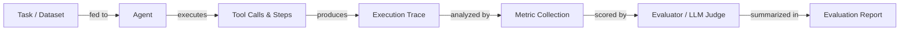

# Avaliação e testes de agentes

## Definição

A avaliação de agentes é a prática de medir o quão bem um agente de IA conclui tarefas, usa ferramentas corretamente, permanece dentro dos orçamentos de custo e latência e produz saídas precisas. Ao contrário da avaliação estática de modelos — onde você compara uma saída fixa com uma referência — a avaliação de agentes deve levar em conta trajetórias de múltiplas etapas, caminhos não-determinísticos, chamadas intermediárias de ferramentas e o efeito composto de erros ao longo das etapas. Uma única tarefa pode ser concluída com sucesso por muitos caminhos de execução diferentes, tornando as pontuações de acurácia tradicionais insuficientes por si só.

A avaliação rigorosa é o que separa uma demo de um sistema de produção. Sem ela, você não pode saber se uma mudança de prompt melhorou ou regrediu o comportamento, se uma nova definição de ferramenta está sendo usada corretamente ou se a latência é aceitável sob carga real. A avaliação deve acontecer em múltiplos níveis: testes em nível unitário de ferramentas individuais, testes em nível de integração de execuções completas de agentes e testes de regressão contra um dataset dourado de tarefas representativas.

Uma estratégia de avaliação madura combina métricas automatizadas (taxa de conclusão de tarefas, acurácia, latência, custo, eficiência de uso de ferramentas) com revisão humana para casos extremos e qualidade subjetiva. Benchmarks como AgentBench e SWE-bench fornecem conjuntos de tarefas padronizados para comparação entre modelos e frameworks, enquanto frameworks como LangSmith, Ragas e DeepEval fornecem infraestrutura para executar avaliações em escala e rastrear resultados ao longo do tempo.

## Como funciona



### Preparação de tarefas e datasets

Um bom dataset de avaliação contém tarefas representativas extraídas de requisições reais ou realistas de usuários, cada uma com resultados esperados ou respostas de referência. As tarefas devem cobrir caminhos felizes, casos extremos, entradas adversariais e fluxos de trabalho de múltiplas etapas. Para avaliação de agentes especificamente, cada tarefa deve especificar a resposta final esperada e, opcionalmente, a sequência esperada de chamadas de ferramentas. A qualidade do dataset é o maior fator na qualidade da avaliação — lixo entra, lixo sai.

### Execução e coleta de traces

O agente executa cada tarefa no dataset, e cada etapa — chamadas de LLM, invocações de ferramentas, leituras de memória e saídas — é capturada como um trace estruturado. Os traces registram entradas, saídas, timestamps, contagens de tokens e erros para cada span. Este é o material bruto para todas as métricas downstream e também é inestimável para depurar falhas. O determinismo pode ser melhorado fixando seeds aleatórias e temperatura, mas alguma variabilidade deve ser esperada e contabilizada executando múltiplos testes por tarefa.

### Coleta de métricas

As métricas principais para avaliação de agentes incluem: **taxa de conclusão de tarefas** (o agente concluiu a tarefa com sucesso?), **acurácia** (a resposta final está correta?), **latência** (tempo de relógio de ponta a ponta), **custo** (total de tokens × preço) e **eficiência de uso de ferramentas** (as ferramentas foram chamadas o número correto de vezes com argumentos corretos?). Métricas secundárias incluem contagem de etapas, taxa de repetição, taxa de alucinação e fidelidade ao contexto recuperado. As métricas são calculadas por tarefa e agregadas no dataset.

### Avaliação e pontuação

Muitas métricas — especialmente corretude para saídas abertas — requerem um juiz. Um juiz LLM (por exemplo, GPT-4 ou Claude) recebe a tarefa, a resposta do agente e opcionalmente uma resposta de referência, e pontua a qualidade em uma rubrica. Isso às vezes é chamado de "LLM-como-juiz" e é a espinha dorsal de frameworks como Ragas e DeepEval. Para tarefas determinísticas (execução de código, consultas SQL, extração estruturada), verificações baseadas em regras são mais confiáveis e baratas. A revisão humana deve ser usada para calibrar juízes LLM e detectar vieses sistemáticos.

### Relatórios e rastreamento de regressão

Os resultados da avaliação são agregados em um relatório e armazenados junto com a versão do agente, versão do prompt e versão do modelo. Isso habilita o rastreamento de regressão: você pode comparar o agente atual com uma linha de base e detectar regressões antes de implantar. Painéis em ferramentas como LangSmith mostram tendências de métricas ao longo do tempo, ajudando as equipes a detectar degradações sutis que execuções de teste individuais perderiam.

## Quando usar / Quando NÃO usar

| Usar quando | Evitar quando |
|---|---|
| Comparar duas versões de agente ou prompts antes de implantar | Pular a avaliação porque a tarefa "parece certa" em uma demo |
| Construir uma suíte de regressão para detectar mudanças que quebram prompts | Executar avaliação apenas uma vez no início do projeto e nunca mais |
| Medir custo e latência para atender SLAs | Usar uma única métrica (por exemplo, apenas acurácia) para julgar a qualidade geral |
| Validar o comportamento de chamadas de ferramentas e a corretude de argumentos | Usar um dataset de apenas tarefas fáceis e limpas sem casos extremos |
| Integrar um novo modelo para verificar transferência de capacidade | Tratar pontuações de juízes LLM como verdade absoluta sem calibração humana |

## Comparações

| Critério | LangSmith | DeepEval | Ragas |
|---|---|---|---|
| **Facilidade de uso** | Integração estreita com LangChain, configuração rápida para usuários LangChain; mais difícil para outros | API Python limpa, boilerplate mínimo, fácil de adicionar a qualquer pipeline | Otimizado para pipelines RAG; simples para tarefas de recuperação |
| **Cobertura de métricas** | Rastreamento, avaliadores personalizados, gerenciamento de datasets; menos métricas LLM embutidas | 20+ métricas embutidas (alucinação, fidelidade, corretude de ferramentas, toxicidade) | Métricas focadas em RAG (fidelidade, relevância da resposta, recall de contexto, precisão) |
| **Integração de rastreamento** | Primeira classe: captura completa de trace, visualização de span, comparação de execuções | Captura de trace via decoradores; menos visualização nativa | Sem rastreamento embutido; integra via LangSmith ou W&B |
| **Preços** | Nível gratuito + planos pagos hospedados; auto-hospedável | Código aberto; painel em nuvem disponível | Código aberto; sem painel hospedado |
| **Personalização** | Avaliadores personalizados via Python ou templates de prompt | Extensível subclassificando classes de métricas | Métricas personalizadas via Python; forte suporte a biblioteca de métricas NLP |

## Prós e contras

| Prós | Contras |
|---|---|
| Detecta regressões antes que cheguem aos usuários | Construir um bom dataset consome tempo |
| Fornece evidências objetivas para decisões de prompt/modelo | Juízes LLM podem ser tendenciosos ou inconsistentes |
| Habilita orçamentação de custo e latência | O não-determinismo requer múltiplos testes, aumentando o custo |
| Escala para grandes datasets com automação | Traces de agentes podem ser grandes e caros de armazenar |
| Integra-se ao CI/CD para portais de qualidade contínuos | A escolha de métricas é difícil e específica do domínio |

## Exemplos de código

```python
# Agent evaluation with DeepEval
# pip install deepeval langchain-openai

from deepeval import evaluate
from deepeval.metrics import (
    TaskCompletionMetric,
    ToolCorrectnessMetric,
    HallucinationMetric,
)
from deepeval.test_case import LLMTestCase, ToolCall
from langchain_openai import ChatOpenAI
from langchain.agents import AgentExecutor, create_openai_tools_agent
from langchain_core.prompts import ChatPromptTemplate
from langchain_core.tools import tool


# --- Define a simple tool for the agent ---
@tool
def get_weather(city: str) -> str:
    """Return the current weather for a city."""
    # In production this would call a real API
    return f"The weather in {city} is sunny and 22°C."


# --- Build a minimal agent ---
llm = ChatOpenAI(model="gpt-4o-mini", temperature=0)
prompt = ChatPromptTemplate.from_messages([
    ("system", "You are a helpful assistant. Use tools when needed."),
    ("human", "{input}"),
    ("placeholder", "{agent_scratchpad}"),
])
agent = create_openai_tools_agent(llm, [get_weather], prompt)
agent_executor = AgentExecutor(agent=agent, tools=[get_weather], verbose=False)


def run_agent(user_input: str) -> tuple[str, list[ToolCall]]:
    """Run the agent and return (final_answer, tool_calls)."""
    result = agent_executor.invoke({"input": user_input})
    # In a real setup, parse the intermediate steps for tool call records
    actual_output = result["output"]
    tool_calls_used = [
        ToolCall(name="get_weather", input_parameters={"city": "Paris"})
    ]  # Extracted from result["intermediate_steps"] in production
    return actual_output, tool_calls_used


# --- Build DeepEval test cases from an evaluation dataset ---
dataset = [
    {
        "input": "What is the weather in Paris?",
        "expected_output": "The weather in Paris is sunny and 22°C.",
        "expected_tools": [
            ToolCall(name="get_weather", input_parameters={"city": "Paris"})
        ],
        "context": ["get_weather tool returns current conditions"],
    },
    {
        "input": "Tell me the weather in London.",
        "expected_output": "The weather in London is sunny and 22°C.",
        "expected_tools": [
            ToolCall(name="get_weather", input_parameters={"city": "London"})
        ],
        "context": ["get_weather tool returns current conditions"],
    },
]

test_cases = []
for item in dataset:
    actual_output, tool_calls_used = run_agent(item["input"])

    test_case = LLMTestCase(
        input=item["input"],
        actual_output=actual_output,
        expected_output=item["expected_output"],
        tools_called=tool_calls_used,
        expected_tools=item["expected_tools"],
        context=item["context"],
    )
    test_cases.append(test_case)

# --- Define metrics ---
task_completion = TaskCompletionMetric(
    threshold=0.7,
    model="gpt-4o-mini",
    include_reason=True,
)
tool_correctness = ToolCorrectnessMetric()  # Checks tool name + args match
hallucination = HallucinationMetric(
    threshold=0.3,
    model="gpt-4o-mini",
)

# --- Run evaluation ---
results = evaluate(
    test_cases=test_cases,
    metrics=[task_completion, tool_correctness, hallucination],
)

# --- Print summary ---
for tc, result in zip(test_cases, results.test_results):
    print(f"Input: {tc.input}")
    for metric_result in result.metrics_data:
        status = "PASS" if metric_result.success else "FAIL"
        print(f"  [{status}] {metric_result.name}: {metric_result.score:.2f}")
        if metric_result.reason:
            print(f"         Reason: {metric_result.reason}")
    print()
```

## Recursos práticos

- [Documentação do DeepEval](https://docs.confident-ai.com/) — Guia abrangente para métricas DeepEval, casos de teste e integração CI/CD para avaliação de LLM e agentes.
- [Documentação do Ragas](https://docs.ragas.io/) — Framework Ragas para avaliar pipelines RAG e fidelidade de agentes, com métricas como relevância de resposta e recall de contexto.
- [Documentação do LangSmith](https://docs.smith.langchain.com/) — Recursos de avaliação, rastreamento e gerenciamento de datasets do LangSmith para agentes baseados em LangChain.
- [Artigo e leaderboard do AgentBench](https://github.com/THUDM/AgentBench) — Benchmark para avaliar agentes LLM em diversas tarefas do mundo real incluindo web, codificação e ambientes de OS.
- [SWE-bench](https://www.swebench.com/) — Benchmark medindo a capacidade dos agentes de resolver issues reais do GitHub em repositórios de engenharia de software.

## Veja também

- [Agentes](/docs/agents)
- [Depuração e observabilidade de agentes](/docs/agents/debugging)
- [Métricas de avaliação](/docs/evaluation-metrics)
- [Benchmarks](/docs/benchmarks)
