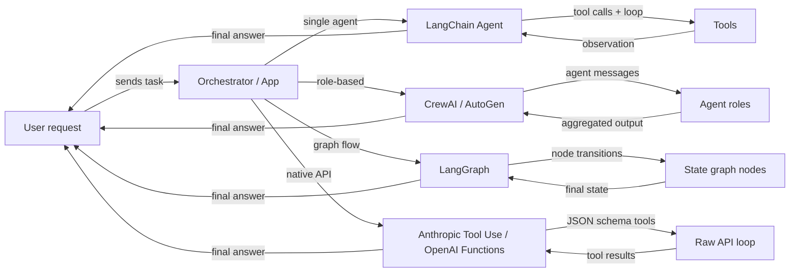

# Visão geral dos frameworks de agentes

## Definição

Um **framework de agentes** é uma biblioteca ou SDK que lida com as preocupações de infraestrutura para construir agentes de IA: registro de ferramentas, passagem de mensagens, gerenciamento de estado, orquestração e integração com provedores de LLM. Sem um framework, você escreve essas camadas de encanamento por conta própria; com um framework, você descreve o *que* seu agente deve fazer e ele cuida do *como* o loop é executado.

O ecossistema de frameworks de agentes cresceu rapidamente e agora abrange várias categorias distintas. Alguns frameworks focam em um único agente com ferramentas (agentes LangChain), outros priorizam a colaboração baseada em papéis entre muitos agentes (CrewAI, AutoGen), outros modelam o comportamento do agente como grafos com estado explícito (LangGraph) e alguns ignoram completamente o framework e dependem das capacidades nativas do provedor de modelos (Anthropic Tool Use, OpenAI Function Calling). Cada categoria reflete uma filosofia diferente sobre onde o controle e a complexidade devem residir.

Escolher o framework certo não é apenas uma decisão técnica — molda como você raciocina sobre seu sistema, depura falhas e escala para produção. Um iniciante construindo um assistente de pesquisa simples tem necessidades muito diferentes de uma equipe de plataforma conectando uma dúzia de agentes especializados em um pipeline de produção.

## Como funciona

### Frameworks de agente único (agentes LangChain)

Frameworks de agente único dão a um LLM acesso a um conjunto de ferramentas e executam um loop: o modelo decide qual ferramenta chamar, o framework a executa, a observação é adicionada à conversa e o loop continua até que o modelo emita uma resposta final. LangChain é o exemplo canônico, expondo `create_react_agent` e `AgentExecutor` para agentes simples no estilo ReAct. O desenvolvedor registra ferramentas (funções Python com docstrings ou schemas Pydantic) e o framework cuida da construção do prompt e da análise do resultado. Agente único é o ponto de partida correto: menor latência, mais fácil de depurar e mais simples de testar. A complexidade cresce quando você precisa de múltiplos papéis especializados trabalhando em paralelo ou quando o estado fica muito grande para uma janela de contexto.

### Frameworks multi-agente (CrewAI, AutoGen)

Frameworks multi-agente coordenam vários agentes apoiados por LLM, cada um com seu próprio papel, instruções e ferramentas, em direção a um objetivo compartilhado. CrewAI usa uma metáfora de tripulação com papéis, objetivos e backstories; AutoGen usa uma metáfora de conversa onde os agentes trocam mensagens. Ambos suportam padrões de execução sequencial e paralela. O framework gerencia o roteamento de mensagens, a passagem de saída entre agentes e opcionalmente pontos de verificação human-in-the-loop. Abordagens multi-agente se destacam quando o problema se decompõe naturalmente em especializações distintas (pesquisador, escritor, crítico) ou quando você precisa de redundância e debate para melhorar a qualidade da saída.

### Frameworks baseados em grafos (LangGraph)

Frameworks baseados em grafos representam o comportamento do agente como um grafo dirigido explícito: os nós são funções Python (cada uma pode chamar um LLM ou uma ferramenta), as arestas são transições entre nós e o estado compartilhado é um dicionário tipado. LangGraph, construído sobre LangChain, popularizou essa abordagem. Ciclos no grafo permitem que o agente faça loop até que uma condição de encerramento seja atendida; arestas condicionais permitem roteamento dinâmico baseado em resultados intermediários. A explicitidade de um grafo torna fluxos complexos mais fáceis de raciocinar, testar em isolamento e persistir entre interrupções. Esse é o padrão preferido quando você precisa de controle detalhado sobre o fluxo de execução, checkpointing ou aprovações human-in-the-loop em etapas específicas.

### Uso nativo de ferramentas (Anthropic Tool Use, OpenAI Function Calling)

O uso nativo de ferramentas ignora completamente a camada do framework e usa o mecanismo embutido do provedor de modelos para chamada de funções estruturadas. A API da Anthropic aceita um parâmetro `tools` com definições de schema JSON; o modelo retorna blocos `tool_use` que seu código executa e depois você alimenta de volta blocos `tool_result`. O equivalente da OpenAI é `functions` / `tools` com respostas `function_call`. Essa abordagem tem sobrecarga de abstração mínima, controle total sobre o loop e a integração mais estreita com recursos específicos do modelo como streaming e chamadas paralelas de ferramentas. O trade-off é que você escreve a lógica de orquestração por conta própria, o que é adequado para casos de uso simples, mas cresce em complexidade em escala.



## Quando usar / Quando NÃO usar

| Usar quando | Evitar quando |
|---|---|
| Você precisa de comportamento de LLM aumentado por ferramentas além de um único prompt | Sua tarefa é um prompt de turno único sem necessidade de dados externos |
| Seu problema se decompõe em múltiplos papéis especializados (multi-agente) | Você precisa de latência ultrabaixa e não pode pagar por loops de múltiplas etapas |
| Você quer fluxos de agentes reproduzíveis e inspecionáveis (baseado em grafos) | Sua equipe não tem expertise para depurar loops de agentes não-determinísticos |
| Você quer ficar perto da API do provedor com abstração mínima (nativo) | Você precisa de prototipagem rápida e não quer escrever boilerplate de orquestração |
| Você está construindo um sistema de produção que precisa de checkpointing e persistência | A tarefa pode ser resolvida com um pipeline RAG simples ou uma única cadeia de prompt |

## Comparações

| Critério | CrewAI | AutoGen | LangGraph | Anthropic Tool Use |
|---|---|---|---|---|
| **Arquitetura** | Crew baseada em papéis com tarefas e processos | Pares de agentes orientados a conversas e group chats | Grafo de estado explícito com nós e arestas | API bruta com definições de ferramentas em JSON schema |
| **Suporte multi-agente** | Primeira classe: agentes são membros da crew com papéis e objetivos | Primeira classe: agentes conversam via um barramento de mensagens | Possível via subgrafos, mas principalmente grafos de agente único | Manual: você implementa a coordenação multi-agente por conta própria |
| **Gerenciamento de estado** | Implícito: passado entre tarefas via contexto da crew | Implícito: histórico de mensagens na conversa | Explícito: estado TypedDict compartilhado entre todos os nós | Manual: você mantém seu próprio dicionário de estado |
| **Curva de aprendizado** | Baixa: API declarativa estilo YAML | Média: requer compreensão dos papéis dos agentes e group chat | Média-Alta: requer intuição de teoria dos grafos | Baixa: apenas Python + JSON schema, mas mais boilerplate |
| **Comunidade e ecossistema** | Crescendo rapidamente, tutoriais fortes | Grande (apoiado pela Microsoft), forte comunidade de pesquisa | Crescendo rapidamente, integração estreita com LangChain | SDK oficial Anthropic, bem documentado |
| **Melhor para** | Pipelines baseados em papéis estruturados, fluxos de trabalho de conteúdo | Pesquisa, geração de código, experimentação human-in-the-loop | Fluxos de ramificação complexos, pipelines de produção | Ferramentas simples a médias, integração estreita com o modelo |
| **Suporte a streaming** | Limitado | Limitado | Suportado via streaming do LangChain | Streaming completo via SDK Anthropic |

## Exemplos de código

```python
# --- LangChain agent (single-agent, ReAct) ---
from langchain_anthropic import ChatAnthropic
from langchain.agents import create_react_agent, AgentExecutor
from langchain_core.tools import tool

@tool
def search(query: str) -> str:
    """Search the web for information."""
    return f"Results for: {query}"

llm = ChatAnthropic(model="claude-3-5-sonnet-20241022")
agent = create_react_agent(llm, tools=[search])
executor = AgentExecutor(agent=agent, tools=[search])
result = executor.invoke({"input": "What is LangGraph?"})


# --- CrewAI minimal setup ---
from crewai import Agent, Task, Crew

researcher = Agent(role="Researcher", goal="Find accurate information", backstory="Expert researcher")
task = Task(description="Research LangGraph", agent=researcher)
crew = Crew(agents=[researcher], tasks=[task])
result = crew.kickoff()


# --- AutoGen minimal setup ---
import autogen

assistant = autogen.AssistantAgent(name="assistant", llm_config={"model": "gpt-4o"})
user = autogen.UserProxyAgent(name="user", human_input_mode="NEVER")
user.initiate_chat(assistant, message="Explain LangGraph in one paragraph.")


# --- LangGraph minimal setup ---
from langgraph.graph import StateGraph, END
from typing import TypedDict

class State(TypedDict):
    message: str

def process(state: State) -> State:
    return {"message": f"Processed: {state['message']}"}

graph = StateGraph(State)
graph.add_node("process", process)
graph.set_entry_point("process")
graph.add_edge("process", END)
app = graph.compile()
result = app.invoke({"message": "hello"})


# --- Anthropic Tool Use minimal setup ---
import anthropic

client = anthropic.Anthropic()
tools = [{"name": "search", "description": "Search the web", "input_schema": {"type": "object", "properties": {"query": {"type": "string"}}, "required": ["query"]}}]
response = client.messages.create(
    model="claude-opus-4-5",
    max_tokens=1024,
    tools=tools,
    messages=[{"role": "user", "content": "Search for LangGraph documentation."}]
)
```

## Recursos práticos

- [Documentação de Agentes do LangChain](https://python.langchain.com/docs/concepts/agents/) — Guia abrangente para construir agentes com LangChain, incluindo ReAct, uso de ferramentas e memória.
- [Documentação oficial do CrewAI](https://docs.crewai.com/) — Referência completa para papéis, tarefas, crews e processos no CrewAI.
- [Documentação do AutoGen (Microsoft)](https://microsoft.github.io/autogen/) — Cobre ConversableAgent, group chats, execução de código e padrões human-in-the-loop.
- [Documentação do LangGraph](https://langchain-ai.github.io/langgraph/) — Máquinas de estado de agentes baseadas em grafos, persistência e checkpoints human-in-the-loop.
- [Guia Anthropic Tool Use](https://docs.anthropic.com/en/docs/build-with-claude/tool-use) — Guia oficial para definir ferramentas com JSON schema e lidar com tipos de mensagem tool_use / tool_result.
- [AgentsKit](https://emersonbraun.github.io/agentskit/) — Framework pronto para produção para construir agentes de IA com memória, ferramentas e orquestração multi-agente

## Veja também

- [CrewAI](/docs/agents/crewai)
- [AutoGen](/docs/agents/autogen)
- [LangGraph](/docs/agents/langgraph)
- [Anthropic Tool Use](/docs/agents/anthropic-tool-use)
- [Sistemas multi-agente](/docs/agents/multi-agent-systems)
- [Agentes de IA](/docs/agents)
