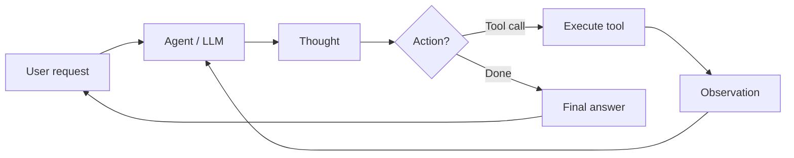

# Agentes de IA

## Definição

An **AI agent** é um sistema que percebe seu ambiente (por ex. user input, tool outputs), reasons (possibly with an LLM), and takes actions (por ex. calling APIs, writing code) to achieve goals. Agents often use tools and loops of thought–action–observation.

Mais formalmente: **um agente é um programa autônomo que se comunica com um modelo de IA para realizar operações baseadas em objetivos usando as ferramentas e o contexto que possui, e is capable of autonomous decisão-making grounded in truth.** Agents bridge the gap between a one-off prototype (por ex. in AI Studio) and a scalable application: you define tools, give the agent access to them, and it decides when to call which tool and how to combine results to satisfy the user's goal.

## Como funciona

Loop típico: receber tarefa → planejar ou raciocinar → escolher ação (por ex. chamada de ferramenta) → observar resultado → repetir até concluir ou atingir o limite. The **user** sends a request; the **agent** (backed by an LLM) produces a **thought** (raciocínio) and a **decisão**: either call a **tool** (por ex. search, API, code runner) and get an **observation**, or return a **final answer**. The observation is fed back into the agent for the next step. LLMs provide raciocínio and tool selection; frameworks (LangChain, LlamaIndex, Google ADK) handle orchestration, tool registration, and message passing. [Multi-agent](/docs/agents/multi-agent-systems) and [subagent](/docs/subagents) setups extend this with multiple agents or a parent delegating to children.



```python
# Conceptual agent loop (pseudocode)
def agent_loop(task):
    state = {"messages": [user_message(task)]}
    while not done(state):
        response = llm.invoke(state["messages"])
        if response.tool_calls:
            for call in response.tool_calls:
                result = tools.execute(call)
                state["messages"].append(tool_result(result))
        else:
            return response.content
    return state
```

## Casos de uso

Agentes são adequados quando a tarefa requer múltiplos passos, uso de ferramentas ou decisões que vão além de uma única chamada ao LLM.

- Automação de tarefas (agendamento, pipelines de dados, preenchimento de formulários)
- Geração e edição de código com acesso a arquivos e APIs
- Assistentes de pesquisa que buscam, resumem e citam
- Multi-step workflows that combine tools and human-in-the-loop

## Vantagens e desvantagens

| Pros | Cons |
|------|------|
| Flexible, can use many tools | Unpredictable, can loop or fail |
| Handles multi-step tasks | Latency and cost from many LLM calls |
| Enables automation | Needs good tool projeto and safety |
| Scale from prototype to production | Requires monitoring and guardrails |

## Documentação externa

- [From Prototypes to Agents with ADK – Google Codelabs](https://codelabs.developers.google.com/your-first-agent-with-adk#0) — Build your first agent with Google's Agent Development Kit (ADK)
- [LangChain – Agents](https://python.langchain.com/docs/concepts/agents/) — Agent concepts and tool use
- [LlamaIndex – Agents](https://docs.llamaindex.ai/en/stable/module_guides/deploying/agents/) — Agent and query engine guides
- [OpenAI Assistants API](https://platform.openai.com/docs/assistants/overview) — Managed agents with tools

## Veja também

- [Multi-agent systems](/docs/agents/multi-agent-systems)
- [Subagents](/docs/subagents)
- [ReAct](/docs/reasoning-patterns/react)
- [RDD](/docs/reasoning-patterns/rdd)
