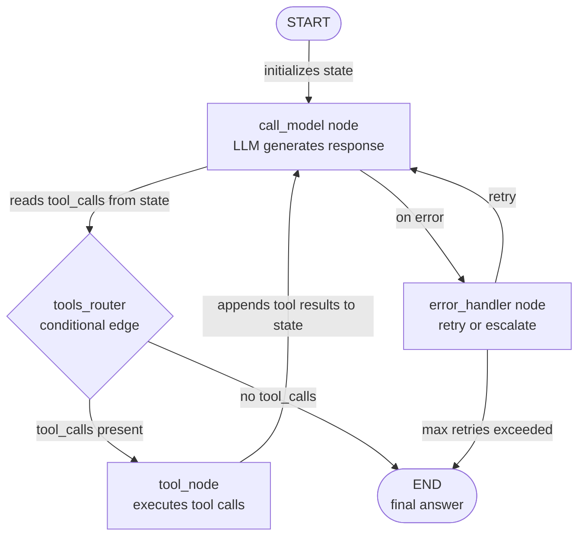

# LangGraph

## Definição

LangGraph é uma biblioteca Python de código aberto, construída sobre LangChain, para construir **fluxos de trabalho de agentes com estado como grafos dirigidos explícitos**. Onde a maioria dos frameworks de agentes oculta o loop de execução atrás de uma chamada opaca `run()`, o LangGraph o expõe como um objeto de grafo de primeira classe que você pode inspecionar, testar e modificar. Os nós são funções Python comuns (cada uma pode chamar um LLM, uma ferramenta ou lógica arbitrária); as arestas são transições entre nós; e todo o fluxo de trabalho compartilha um único objeto de **estado** — um dicionário tipado que cada nó pode ler e escrever.

O insight chave no LangGraph é que muitos comportamentos de agentes que parecem complexos — fazer loop até que uma condição seja atendida, ramificar com base no conteúdo de uma resposta de LLM, pausar para aprovação humana, retomar a partir de um checkpoint salvo — se mapeiam limpos para primitivos de grafo: ciclos, arestas condicionais, interrupções e estado persistente. Essa explicitidade tem um custo (mais boilerplate do que CrewAI ou AutoGen), mas compensa em produção: você pode testar unitariamente cada nó em isolamento, rastrear exatamente qual caminho uma execução tomou e reproduzir um fluxo de trabalho a partir de qualquer checkpoint.

O LangGraph suporta tanto padrões de **agente único** (um grafo com alguns nós que chama ferramentas em um loop) quanto padrões de **multi-agente** (múltiplos subgrafos compostos juntos, com compartilhamento de estado entre grafos). Ele se integra nativamente com o ecossistema de ferramentas do LangChain, modelos de chat e LangSmith para observabilidade. O framework é a base da arquitetura de agentes de produção recomendada pelo LangChain a partir de 2024-2025.

## Como funciona

### Nós: funções Python como unidades de execução

Um nó no LangGraph é qualquer callable Python que aceita o estado atual e retorna um estado (parcial) atualizado. Os nós são adicionados ao grafo com `graph.add_node("nome", função)`. A assinatura da função é sempre `(state: State) -> dict` — ela lê o que precisa do estado, faz seu trabalho (chamada de LLM, execução de ferramenta, transformação de dados) e retorna apenas as chaves que quer atualizar. Isso torna os nós fáceis de testar independentemente: passe um estado mock, verifique o dict retornado. O `ToolNode` do LangChain é um nó pré-construído que executa chamadas de ferramentas da resposta de um LLM, cobrindo o padrão de agente mais comum desde o início.

### Arestas: roteamento e ramificação condicional

As arestas conectam nós e determinam a ordem de execução. Uma aresta simples (`graph.add_edge("a", "b")`) sempre transita do nó `a` para o nó `b`. Uma aresta condicional (`graph.add_conditional_edges`) chama uma função de roteamento com o estado atual e usa a string retornada para decidir o próximo nó. Esse é o mecanismo para fluxo de controle dinâmico: após um LLM gerar uma resposta, um roteador verifica se ela contém chamadas de ferramentas (roteia para `tools`) ou uma resposta final (roteia para `END`). Arestas condicionais tornam o LangGraph significativamente mais poderoso do que um pipeline sequencial — você pode expressar árvores de decisão complexas, lógica de retry e caminhos de escalada como estrutura de grafo legível.

### Estado: TypedDict compartilhado entre todos os nós

O estado é a espinha dorsal de uma aplicação LangGraph. Você define um `TypedDict` (ou um modelo Pydantic) com todos os campos que seu fluxo de trabalho precisa: mensagens, resultados intermediários, flags, contadores. Cada nó recebe o estado completo e retorna apenas os campos que modifica. O LangGraph mescla atualizações parciais com o estado atual usando **reducers** — por padrão, as atribuições sobrescrevem; com o reducer `add_messages`, a lista de mensagens é adicionada em vez de substituída. A tipagem explícita do estado significa que os verificadores de tipo podem capturar erros antes do tempo de execução, e o snapshot de estado em qualquer checkpoint é um registro completo e inspecionável do que aconteceu.

### Ciclos, persistência e human-in-the-loop

O LangGraph lida com ciclos nativamente: um nó pode ter uma aresta de volta para um nó anterior (ou para si mesmo) com base em uma condição, habilitando loops de retry de agentes, padrões de autocorreção e uso de ferramentas em múltiplos turnos sem nenhum tratamento especial. A persistência é fornecida por **checkpointers** (SQLite, Postgres, Redis ou em memória): o grafo salva o estado completo após cada execução de nó, para que você possa retomar a partir de qualquer ponto após uma falha ou interrupção. O human-in-the-loop é implementado via `interrupt_before` e `interrupt_after` — o grafo pausa no nó especificado, expõe o estado atual ao chamador, aceita entrada humana e retoma. Isso torna o LangGraph a escolha mais forte quando você precisa de pipelines de agentes auditáveis, interruptíveis e de nível de produção.



## Quando usar / Quando NÃO usar

| Usar quando | Evitar quando |
|---|---|
| Você precisa de controle detalhado sobre cada etapa da execução do agente | Você quer uma API declarativa e de alto nível e não precisa de controle em nível de etapa |
| Você requer persistência e a capacidade de retomar fluxos de trabalho no meio da execução | Seu fluxo de trabalho é simples e linear — uma cadeia ou loop de agente único é suficiente |
| Aprovações human-in-the-loop em etapas específicas são necessárias | A equipe não está familiarizada com teoria dos grafos e prefere um modelo mental mais simples |
| Você está construindo sistemas de produção que precisam de observabilidade completa e reprodução | Seus agentes são protótipos de pesquisa que não precisam de confiabilidade de nível de produção |
| Seu fluxo de trabalho tem ramificação condicional complexa ou ciclos difíceis de expressar linearmente | A coordenação de papéis multi-agente é sua necessidade principal — CrewAI ou AutoGen são mais simples |

## Comparações

| Critério | LangGraph | CrewAI | AutoGen |
|---|---|---|---|
| **Nível de abstração** | Baixo: grafo explícito, nós, arestas e estado | Alto: papéis declarativos, objetivos, tarefas | Médio: agentes conversacionais com histórico de mensagens |
| **Fluxo de controle** | Arestas condicionais explícitas e ciclos | Processo sequencial ou hierárquico (opaco) | Orientado a mensagens, baseado em turnos (opaco) |
| **Persistência** | Primeira classe: checkpointers para SQLite, Postgres, Redis | Não embutida | Não embutida |
| **Human-in-the-loop** | Primeira classe: `interrupt_before` / `interrupt_after` | Apenas manual | Primeira classe: `human_input_mode` por agente |
| **Testabilidade** | Alta: nós são funções puras, fáceis de testar unitariamente | Média: tarefas podem ser testadas mas a execução da crew é opaca | Baixa: fluxos de conversa são difíceis de testar unitariamente de forma determinística |

## Exemplos de código

```python
import os
from typing import Annotated, TypedDict, Literal
from langchain_anthropic import ChatAnthropic
from langchain_core.tools import tool
from langchain_core.messages import HumanMessage, AIMessage, BaseMessage
from langgraph.graph import StateGraph, END
from langgraph.graph.message import add_messages
from langgraph.prebuilt import ToolNode

# --- State definition ---
# add_messages is a reducer: it appends to the messages list instead of replacing it.
class AgentState(TypedDict):
    messages: Annotated[list[BaseMessage], add_messages]
    step_count: int  # track how many steps we have taken

# --- Tool definitions ---
# Tools are standard LangChain tools decorated with @tool.
# The docstring becomes the tool description sent to the LLM.

@tool
def search_web(query: str) -> str:
    """Search the web for current information on a topic."""
    # In production, replace with a real search API (Serper, Tavily, etc.)
    return f"Search results for '{query}': LangGraph is a stateful agent framework by LangChain."

@tool
def add_numbers(a: float, b: float) -> str:
    """Add two numbers together and return the result."""
    return f"Result: {a + b}"

tools = [search_web, add_numbers]

# --- LLM setup ---
# Bind tools to the model so it knows what functions are available.
llm = ChatAnthropic(model="claude-opus-4-5")
llm_with_tools = llm.bind_tools(tools)

# --- Node definitions ---
# Each node is a plain Python function: (state) -> partial state update.

def call_model(state: AgentState) -> dict:
    """Primary agent node: calls the LLM and returns its response."""
    response = llm_with_tools.invoke(state["messages"])
    return {
        "messages": [response],  # add_messages reducer will append this
        "step_count": state["step_count"] + 1,
    }

def handle_error(state: AgentState) -> dict:
    """Error handling node: appends a fallback message if something went wrong."""
    fallback = AIMessage(content="I encountered an error. Let me try a different approach.")
    return {"messages": [fallback]}

# --- Routing function (conditional edge) ---
# Returns the name of the next node based on the current state.

def should_continue(state: AgentState) -> Literal["tools", "end"]:
    """Route to tools if the LLM made tool calls, otherwise end."""
    last_message = state["messages"][-1]
    # Safety limit: stop after 10 steps to prevent infinite loops
    if state["step_count"] >= 10:
        return "end"
    if hasattr(last_message, "tool_calls") and last_message.tool_calls:
        return "tools"
    return "end"

# --- Graph construction ---
tool_node = ToolNode(tools)  # prebuilt node that executes tool calls

graph = StateGraph(AgentState)

# Add nodes
graph.add_node("agent", call_model)
graph.add_node("tools", tool_node)
graph.add_node("error_handler", handle_error)

# Set entry point
graph.set_entry_point("agent")

# Add conditional edge from agent: either call tools or end
graph.add_conditional_edges(
    "agent",
    should_continue,
    {
        "tools": "tools",  # route to tool execution
        "end": END,        # route to terminal node
    },
)

# After tool execution, always return to the agent (creates a cycle)
graph.add_edge("tools", "agent")

# Error handler routes back to agent for a retry
graph.add_edge("error_handler", "agent")

# Compile the graph into a runnable application
app = graph.compile()

# --- Optional: add persistence with a checkpointer ---
# from langgraph.checkpoint.sqlite import SqliteSaver
# memory = SqliteSaver.from_conn_string(":memory:")
# app = graph.compile(checkpointer=memory)
# Use config={"configurable": {"thread_id": "session-1"}} to resume sessions.

# --- Run the agent ---
initial_state = {
    "messages": [HumanMessage(content="What is LangGraph and what is 42 plus 17?")],
    "step_count": 0,
}

result = app.invoke(initial_state)
print("Final answer:", result["messages"][-1].content)
print("Total steps:", result["step_count"])

# --- Inspect the graph structure ---
# app.get_graph().print_ascii()  # print ASCII diagram of the graph
```

## Recursos práticos

- [Documentação oficial do LangGraph](https://langchain-ai.github.io/langgraph/) — Referência completa para construção de grafos, gerenciamento de estado, checkpointers e padrões human-in-the-loop.
- [Repositório GitHub do LangGraph](https://github.com/langchain-ai/langgraph) — Código-fonte, rastreador de issues e notebooks de exemplos cobrindo padrões comuns.
- [Guias "How-to" do LangGraph](https://langchain-ai.github.io/langgraph/how-tos/) — Receitas práticas para persistência, streaming, subgrafos, coordenação multi-agente e mais.
- [Rastreamento LangSmith para LangGraph](https://docs.smith.langchain.com/) — Plataforma de observabilidade para rastrear execuções do LangGraph, inspecionar estado em cada nó e depurar falhas.

## Veja também

- [Visão geral dos frameworks de agentes](/docs/agents/frameworks-overview)
- [CrewAI](/docs/agents/crewai)
- [AutoGen](/docs/agents/autogen)
- [LangChain](/docs/tools/langchain)
- [Sistemas multi-agente](/docs/agents/multi-agent-systems)
- [ReAct](/docs/reasoning-patterns/react)
