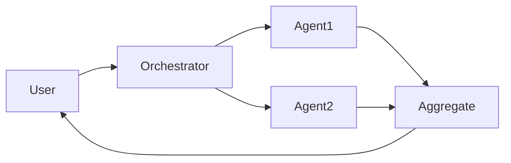

# Sistemas multi-agente

## Definição

Sistemas multi-agente envolvem múltiplos agentes de IA que interagem para resolver tarefas: collaboration (divide work, share state), debate (argue and refine answers), or specialized roles (planner, executor, critic).

They extend single [agents](/docs/agents) when one model or one loop is insufficient: por ex. one agent for [RAG](/docs/rag) recuperação, another for generation, another for critique. [Subagents](/docs/subagents) are a hierarchical form where a root agent delegates to children; here we focus on flat or peer-to-peer multi-agent patterns.

## Como funciona

O **usuário** envia uma tarefa a um **orquestrador** (que pode ser um LLM ou um fluxo de trabalho fixo). O orquestrador atribui trabalho ao **Agente1**, **Agente2**, etc., each with its own role, tools, and optionally model. Agents may share a common state, pass messages, or be invoked in sequence/parallel. Their outputs are **aggregated** (por ex. combined, voted, or summarized) and returned to the user. Design choices include role assignment, communication protocol, and conflict resolution. MAS are useful when you want **modularity** (each agent has a clear responsibility), **specialization** (different models or tools per role), **reusability** (same agent in different workflows), and **structured control flow**.

## Casos de uso

Sistemas multi-agente ajudam quando um único agente não é suficiente: você precisa de papéis distintos, debate ou pipelines modulares.

- Orchestrating planner, executor, and critic agents for complex tasks
- Debate or review flows where multiple agents refine an answer
- Specialized pipelines (por ex. one agent for recuperação, one for generation)

## Documentação externa

- [From Prototypes to Agents with ADK – Google Codelabs](https://codelabs.developers.google.com/your-first-agent-with-adk#0) — ADK supports composing multiple agents into a multi-agent system
- [LangChain – Multi-agent](https://python.langchain.com/docs/concepts/multi_agent/) — Multi-agent orchestration patterns

## Veja também

- [Agents](/docs/agents)
- [Subagents](/docs/subagents)
- [Autonomous agents](/docs/autonomous-agents)
