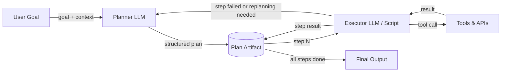

# Arquitetura Planner-Executor

## Definição

Die Planner-Executor-Architektur trennt die Entscheidung darüber, *was zu tun ist*, von der *Ausführung*. Ein **Planner**-LLM empfängt ein übergeordnetes Ziel und erzeugt einen strukturierten, schrittweisen Plan – eine Sequenz von Teilaufgaben, die zusammen das Ziel erreichen. Ein **Executor**-LLM (oder ein deterministisches Programm) arbeitet dann den Plan Schritt für Schritt ab, ruft Werkzeuge auf und erzeugt Ergebnisse. Die beiden Komponenten kommunizieren über ein gemeinsames Plan-Artefakt statt über einen einzigen monolithischen Prompt.

Diese Trennung der Zuständigkeiten behebt eine fundamentale Einschränkung von Single-Agent-ReAct-Schleifen: Wenn eine Aufgabe komplex ist, führt das gleichzeitige Nachdenken über Strategie, Auswahl der nächsten Aktion und Umgang mit Low-Level-Werkzeugdetails zu Fehlern und Halluzinationen. Durch die Delegation der übergeordneten Zerlegung an den Planner und der Low-Level-Ausführung an den Executor kann jede Komponente unabhängig optimiert, mit Prompts versehen und überwacht werden. Der Planner kann ein fähigeres Modell verwenden; der Executor kann ein schnelleres, günstigeres Modell oder sogar ein Nicht-LLM-Programm sein.

Plan-Verfeinerung und Replanning sind kritische Erweiterungen der grundlegenden Architektur. Aufgaben aus der realen Welt verlaufen selten wie erwartet: Ein Werkzeugaufruf kann fehlschlagen, eine Webseite kann unerwartete Daten zurückgeben, oder ein Zwischenergebnis kann zeigen, dass der ursprüngliche Plan falsch war. Ein robustes Planner-Executor-System überwacht Ausführungsergebnisse und ruft den Planner erneut auf, wenn Replanning benötigt wird. Diese Feedback-Schleife verwandelt eine brüchige Pipeline in einen adaptiven Agenten.

## Como funciona

### Planner

Der Planner empfängt das Ziel des Benutzers zusammen mit verfügbaren Werkzeugen und relevantem Kontext. Er gibt einen strukturierten Plan aus – typischerweise eine JSON-Liste von Schrittobjekten, jedes beschreibt eine Teilaufgabe, die erwartete Ein-/Ausgabe und optional welches Werkzeug verwendet werden soll. Ein guter Planungs-Prompt enthält die Werkzeug-Schemas, damit der Planner diese genau referenzieren kann. Der Planner ruft selbst keine Werkzeuge auf; er denkt nur über die Sequenz der benötigten Operationen nach. Die Temperatur sollte im Allgemeinen niedrig sein, um deterministische, gut strukturierte Pläne zu erzeugen.

### Plan-Artefakt

Der Plan ist der Vertrag zwischen Planner und Executor. Es ist ein maschinenlesbares Dokument (JSON oder strukturierter Text), das die Sequenz der Schritte, ihre Abhängigkeiten und ihre erwarteten Ergebnisse kodiert. Das Speichern des Plans als explizites Artefakt – anstatt ihn implizit in der Chain-of-Thought des Modells zu halten – macht das System auditierbar, pausierbar und fortsetzbar. Ein Human-in-the-Loop-Genehmigungsschritt kann hier eingefügt werden, damit Benutzer den Plan vor Beginn der Ausführung überprüfen und bearbeiten können.

### Executor

Der Executor liest den Plan Schritt für Schritt, löst alle Eingabereferenzen zu früheren Schrittausgaben auf, ruft die entsprechenden Werkzeuge auf und zeichnet das Ergebnis auf. Der Executor kann ein zweites LLM sein (nützlich wenn Schritte natürlichsprachliches Reasoning erfordern), ein deterministisches Skript (nützlich für strukturierte Schritte wie API-Aufrufe) oder ein Hybrid. Nach jedem Schritt wird das Ergebnis zurück in das Plan-Artefakt geschrieben, sodass nachfolgende Schritte darauf referenzieren können. Wenn ein Schritt fehlschlägt, markiert der Executor ihn und löst optional Replanning aus.

### Replanning-Schleife

Wenn die Ausführung vom Plan abweicht – aufgrund von Werkzeugfehlern, unerwarteten Ausgaben oder geänderten Bedingungen – kehrt die Kontrolle zum Planner mit dem partiellen Ausführungsprotokoll zurück. Der Planner überarbeitet die verbleibenden Schritte angesichts der neuen Informationen. Replanning kann automatisch ausgelöst werden (z. B. bei jedem Schrittfehler) oder nach jedem Schritt für maximale Anpassungsfähigkeit. Das Begrenzen von Replanning-Iterationen verhindert Endlosschleifen.



## Quando usar / Quando NÃO usar

| Usar quando | Evitar quando |
|---|---|
| Die Aufgabe mehrere sequentielle Schritte erfordert, die schwer im Voraus aufzuzählen sind | Die Aufgabe einfach genug für einen einzigen LLM-Aufruf oder eine ReAct-Schleife ist |
| Menschliche Überprüfung oder Genehmigung vor der Ausführung gewünscht wird | Latenz kritisch ist und der zusätzliche Planner-Aufruf nicht akzeptabel ist |
| Ausführungsschritte klare Abhängigkeiten haben und einzeln validiert werden können | Die Plan-Struktur trivial wäre und unnötige Komplexität hinzufügt |
| Auditiert werden muss, was der Agent getan hat und warum jeder Schritt unternommen wurde | Die Aufgabe explorativ ist und überhaupt nicht im Voraus geplant werden kann |
| Replanning bei Fehler für Zuverlässigkeit wichtig ist | Werkzeug-APIs so unzuverlässig sind, dass kein Plan den ersten Kontakt überlebt |

## Comparações

| Kriterium | Planner-Executor | Single ReAct agent | DAG-basierte Agenten |
|---|---|---|---|
| Trennung der Zuständigkeiten | Hoch — Planung und Ausführung sind getrennt | Keine — ein Agent macht beides | Hoch — jeder Knoten ist eine separate Einheit |
| Anpassungsfähigkeit / Replanning | Mittel — Replanning fügt einen Roundtrip hinzu | Hoch — Agent passt sich bei jedem Schritt an | Niedrig — DAG-Struktur ist typischerweise fest |
| Nachvollziehbarkeit | Hoch — Plan-Artefakt ist explizit | Niedrig — Reasoning ist nur im Kontext | Hoch — Graphstruktur ist explizit |
| Parallelismus | Standardmäßig keiner | Keiner | Nativ — unabhängige Zweige laufen parallel |
| Implementierungskomplexität | Mittel | Niedrig | Hoch |
| Melhor para | Mehrstufige Aufgaben mit sequentiellen Abhängigkeiten | Explorative, dynamische Aufgaben | Aufgaben mit bekannten parallelisierbaren Teilaufgaben |

## Exemplos de código

```python
"""
Planner-Executor implementation using the OpenAI API.

The Planner produces a JSON plan; the Executor steps through it,
calling mock tools and writing results back. Replanning is triggered
on step failure.
"""
from __future__ import annotations

import json
import os
from typing import Any

from openai import OpenAI  # pip install openai

client = OpenAI(api_key=os.environ.get("OPENAI_API_KEY", "sk-placeholder"))

# ---------------------------------------------------------------------------
# Mock tools
# ---------------------------------------------------------------------------

def web_search(query: str) -> str:
    """Mock web search tool."""
    return f"[Search result for '{query}': Found 5 relevant pages about {query}.]"

def summarize_text(text: str) -> str:
    """Mock summarizer tool."""
    return f"[Summary of: {text[:40]}...]"

def write_report(sections: list[str]) -> str:
    """Mock report writer tool."""
    return f"[Report written with {len(sections)} sections.]"

TOOLS: dict[str, Any] = {
    "web_search": web_search,
    "summarize_text": summarize_text,
    "write_report": write_report,
}

# ---------------------------------------------------------------------------
# Planner
# ---------------------------------------------------------------------------

PLANNER_SYSTEM = """
You are a planning assistant. Given a goal and available tools, produce a JSON plan.
The plan is a list of steps. Each step has:
  - "id": int (1-indexed)
  - "description": str (what this step does)
  - "tool": str (tool name from the available list, or "none")
  - "input": str (what to pass to the tool, may reference prior steps as {step_N_result})
  - "depends_on": list[int] (ids of steps that must complete first)

Return ONLY valid JSON — no markdown, no prose.
Available tools: web_search, summarize_text, write_report
"""

def create_plan(goal: str, context: str = "") -> list[dict]:
    """Call the Planner LLM to create a structured plan for the given goal."""
    user_msg = f"Goal: {goal}\n\nAdditional context: {context}" if context else f"Goal: {goal}"
    response = client.chat.completions.create(
        model="gpt-4o-mini",
        temperature=0,
        response_format={"type": "json_object"},
        messages=[
            {"role": "system", "content": PLANNER_SYSTEM},
            {"role": "user", "content": user_msg},
        ],
    )
    raw = response.choices[0].message.content
    parsed = json.loads(raw)
    # Handle both {"steps": [...]} and bare [...]
    return parsed.get("steps", parsed) if isinstance(parsed, dict) else parsed


# ---------------------------------------------------------------------------
# Executor
# ---------------------------------------------------------------------------

def resolve_input(template: str, results: dict[int, str]) -> str:
    """Replace {step_N_result} placeholders with actual results."""
    for step_id, result in results.items():
        template = template.replace(f"{{step_{step_id}_result}}", result)
    return template

def execute_plan(plan: list[dict]) -> dict[int, str]:
    """
    Execute each step sequentially, respecting dependencies.
    Returns a mapping of step_id -> result string.
    """
    results: dict[int, str] = {}

    for step in plan:
        step_id = step["id"]
        tool_name = step.get("tool", "none")
        raw_input = step.get("input", "")
        resolved_input = resolve_input(raw_input, results)

        print(f"  Step {step_id}: {step['description']}")

        if tool_name != "none" and tool_name in TOOLS:
            try:
                result = TOOLS[tool_name](resolved_input)
            except Exception as exc:
                # Signal failure for potential replanning
                result = f"ERROR: {exc}"
                print(f"    [FAILED] {result}")
        else:
            result = f"[No tool — step noted: {resolved_input}]"

        results[step_id] = result
        print(f"    Result: {result}\n")

    return results


# ---------------------------------------------------------------------------
# Planner-Executor orchestration with simple replanning
# ---------------------------------------------------------------------------

def run_planner_executor(goal: str, max_replan_attempts: int = 2) -> str:
    """
    Full Planner-Executor loop with replanning on failure.
    Returns the result of the last step as the final output.
    """
    attempt = 0
    context = ""

    while attempt <= max_replan_attempts:
        print(f"\n--- Planning (attempt {attempt + 1}) ---")
        plan = create_plan(goal, context=context)
        print(f"Plan has {len(plan)} steps.")

        print("\n--- Executing ---")
        results = execute_plan(plan)

        # Check for failures
        failures = {sid: r for sid, r in results.items() if r.startswith("ERROR")}
        if not failures:
            # Return the result of the last step
            last_id = max(results.keys())
            return results[last_id]

        # Build replanning context
        context = (
            f"Previous plan failed at steps: {list(failures.keys())}. "
            f"Errors: {failures}. Please revise the plan to avoid these failures."
        )
        attempt += 1

    return "Max replanning attempts reached. Could not complete goal."


if __name__ == "__main__":
    goal = "Research the latest trends in renewable energy and write a brief report."
    final = run_planner_executor(goal)
    print(f"\nFinal output:\n{final}")
```

## Recursos práticos

- [Plan-and-Solve Prompting (Wang et al., 2023)](https://arxiv.org/abs/2305.04091) — Paper, das zeigt, dass die Trennung von Planung und Lösung die Reasoning-Genauigkeit gegenüber Standard-Chain-of-Thought verbessert.
- [LangGraph — Plan-and-Execute Agent](https://langchain-ai.github.io/langgraph/tutorials/plan-and-execute/plan-and-execute/) — Offizielles LangGraph-Tutorial, das eine Planner-Executor-Schleife mit Replanning implementiert.
- [LLM Compiler (Kim et al., 2023)](https://arxiv.org/abs/2312.04511) — Erweitert Planner-Executor um parallele Ausführung unabhängiger Planschritte.
- [Anthropic — Building Effective Agents](https://www.anthropic.com/research/building-effective-agents) — Praktische Anleitungen zu Agenten-Architekturen einschließlich Orchestrator-Subagenten-Muster.

## Veja também

- [AI agents](/docs/agents)
- [DAG-based agents](/docs/agents/dag-agents)
- [Chain-of-thought reasoning](/docs/reasoning-patterns/cot)
