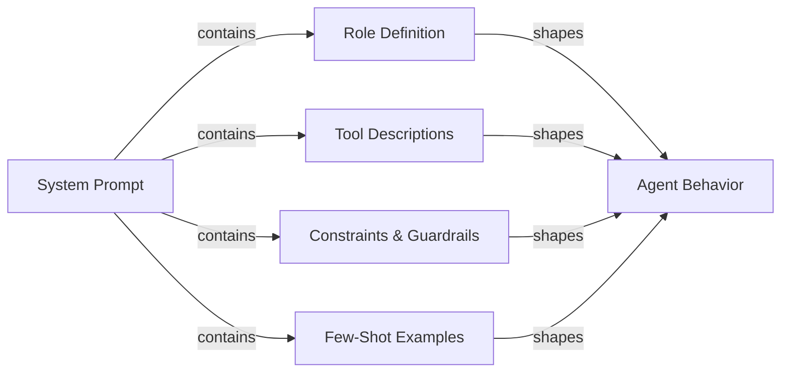

# Prompt engineering para agentes

## Definição

Prompt engineering para agentes é a arte de escrever prompts de sistema e definições de ferramentas que produzam de forma confiável o comportamento que você deseja de um agente de IA. Ao contrário do prompt engineering para um chatbot de turno único — onde você se preocupa principalmente com formato e tom — os prompts de agentes devem governar o raciocínio em múltiplas etapas, a disciplina de seleção de ferramentas, a adesão a restrições, a recuperação de erros e as condições de encerramento em uma sequência ilimitada de etapas. Um prompt de agente mal escrito produz agentes que fazem loop infinitamente, chamam ferramentas com argumentos errados, ignoram restrições do usuário ou confabulam resultados quando as ferramentas falham.

O prompt de sistema é a constituição do agente. Ele define o que o agente é, o que ele pode fazer, o que nunca deve fazer, como deve raciocinar e como deve ser sua saída. Como os LLMs são altamente sensíveis a fraseologia, estrutura e ordenação, pequenas mudanças no prompt de sistema podem ter grandes efeitos comportamentais. O prompt engineering para agentes é, portanto, uma disciplina iterativa e empírica: você escreve um prompt, o avalia contra um dataset de tarefas, identifica modos de falha e refina. Ferramentas como LangSmith e DeepEval (ver [avaliação](/docs/agents/evaluation)) tornam esse loop de feedback mais rápido.

Bons prompts de agentes são modulares e explícitos. Eles separam a definição de papel, a declaração de capacidades, a especificação de restrições, as regras de formato de saída e os exemplos few-shot em seções claramente delimitadas. Essa estrutura torna os prompts mais fáceis de manter, auditar e estender à medida que as capacidades do agente evoluem. Também ajuda o LLM a ativar o "modo" certo para cada seção em vez de misturar preocupações.

## Como funciona



### Definição de papel

A definição de papel diz ao agente quem ele é, qual é seu objetivo principal e qual persona adotar. Uma boa definição de papel é específica: "Você é um engenheiro de software sênior especializado em Python e PostgreSQL, ajudando desenvolvedores a depurar problemas de produção" é mais útil do que "Você é um assistente útil." A especificidade ativa o conhecimento relevante e estabelece o tom de resposta apropriado. O papel também deve estabelecer o relacionamento do agente com o usuário (par, assistente, especialista), o que influencia como o agente lida com incerteza e discordância. Mantenha a definição de papel concisa (3-5 frases) e coloque-a primeiro no prompt de sistema para que enquadre todas as instruções subsequentes.

### Descrições de ferramentas e seleção de ferramentas

Cada ferramenta à qual o agente tem acesso deve ser descrita com precisão. O nome da ferramenta, a descrição, os nomes dos parâmetros, os tipos de parâmetros e o formato de retorno devem ser todos explicitados. Descrições de ferramentas ambíguas são uma das causas mais comuns de seleção incorreta de ferramentas e argumentos malformados. Inclua: o que a ferramenta faz, quando usá-la (e criticamente, quando não usá-la), quais entradas ela espera e qual formato de saída esperar. Para ferramentas com propósitos semelhantes, adicione desambiguação explícita: "Use `search_web` para eventos atuais e notícias; use `search_documents` para consultas à base de conhecimento interna da empresa." Exemplos few-shot de invocações corretas de ferramentas (dentro do prompt de sistema ou como histórico de conversas) reduzem significativamente os erros de seleção de ferramentas.

### Chain-of-thought para agentes

O prompting chain-of-thought (CoT) pede ao agente que raciocine explicitamente antes de agir. Para agentes, isso significa pensar: o que o usuário está pedindo, quais informações tenho, quais informações preciso, qual ferramenta devo chamar em seguida e como espero que o resultado seja. Instruir o agente a raciocinar antes de agir ("Antes de chamar qualquer ferramenta, declare brevemente seu plano") melhora a acurácia em tarefas complexas de múltiplas etapas e torna os traces mais interpretáveis. Alguns frameworks (ReAct, ver [ReAct](/docs/reasoning-patterns/react)) formalizam isso como ciclos Pensamento / Ação / Observação. Seja explícito no prompt sobre se o raciocínio deve estar na saída ou apenas no scratchpad.

### Restrições e guardrails em prompts

As restrições definem o que o agente não deve fazer. Devem ser declaradas positivamente onde possível ("sempre peça confirmação antes de deletar dados") em vez de apenas negativamente ("nunca delete dados sem perguntar"). Inclua: restrições de escopo (apenas responda perguntas sobre X), restrições de saída (sempre responda em inglês, sempre use JSON válido), restrições de comportamento (nunca invente URLs ou caminhos de arquivo) e restrições de segurança (nunca gere conteúdo prejudicial). Guardrails em prompts são uma primeira linha de defesa, não um substituto para controles técnicos (ver [segurança](/docs/agents/security)); são mais eficazes quando especificam o comportamento exato esperado em casos limítrofes.

### Especificação do formato de saída

Agentes que produzem saída estruturada (JSON, markdown, chamadas de funções) precisam de instruções explícitas de formato. Especifique o schema exato, nomes de campos, tipos e campos obrigatórios vs. opcionais. Inclua um exemplo válido no prompt. Para agentes que chamam ferramentas, esclareça quando retornar uma resposta final versus continuar chamando ferramentas, e como é a condição de encerramento. Se o agente interage com sistemas downstream, o formato de saída é um contrato; a ambiguidade aqui se propaga em integrações quebradas.

## Quando usar / Quando NÃO usar

| Usar quando | Evitar quando |
|---|---|
| O agente está chamando múltiplas ferramentas e a seleção de ferramentas é inconsistente | Tratar o prompt de sistema como uma configuração única que nunca será revisada |
| O agente faz loop ou encerra prematuramente sem concluir a tarefa | Escrever um prompt enorme de parede de texto sem estrutura ou seções |
| O agente ignora restrições do usuário ou viola políticas de segurança | Confiar apenas nos padrões do modelo sem nenhuma especificação de papel ou restrição |
| Integrar um novo LLM e precisar transferir comportamento do modelo anterior | Adicionar novas instruções de forma ad hoc sem avaliar regressões |
| Construir um fluxo de trabalho de múltiplas etapas com requisitos de formato de saída determinísticos | Esperar que o prompt sozinho cuide de ameaças de segurança (use também controles técnicos) |

## Comparações

| Elemento do prompt | Propósito | Erros comuns |
|---|---|---|
| Definição de papel | Define persona, expertise e tom | Muito vaga ("assistente útil") ou muito longa; colocada após outras seções |
| Descrições de ferramentas | Orienta a seleção correta de ferramentas e a formação de argumentos | Falta orientação sobre quando/quando não usar; sem invocações de exemplo |
| Restrições | Impõe limites de escopo, segurança e formato | Apenas restrições negativas ("nunca faça X") sem especificar a alternativa correta |
| Instrução chain-of-thought | Melhora a acurácia do raciocínio em tarefas complexas | Misturar raciocínio na saída da chamada de ferramenta quando deveria permanecer no scratchpad |
| Exemplos few-shot | Demonstra o comportamento esperado para uso de ferramentas e formato de saída | Exemplos muito simples para representar casos extremos reais |

## Prós e contras

| Prós | Contras |
|---|---|
| Efeito imediato: não é necessário fine-tuning ou retreinamento | A sensibilidade ao prompt significa que pequenas mudanças de formulação podem quebrar o comportamento |
| A estrutura modular torna a manutenção e auditoria diretas | Prompts longos consomem tokens em cada chamada, aumentando o custo |
| Exemplos few-shot reduzem significativamente os erros de seleção de ferramentas | As instruções podem conflitar; os LLMs podem priorizar instruções posteriores |
| As restrições fornecem uma primeira linha de defesa contra uso indevido | Os prompts são visíveis para o modelo, mas não são protegidos criptograficamente |
| O chain-of-thought melhora a acurácia e a interpretabilidade do trace | A supersspecificação do comportamento pode tornar o agente frágil em casos extremos |

## Exemplos de código

```python
# Well-structured agent system prompt with tool definitions
# pip install anthropic

import os
import json
import anthropic

# ---------------------------------------------------------------------------
# Tool definitions with precise descriptions
# ---------------------------------------------------------------------------

TOOLS = [
    {
        "name": "search_documents",
        "description": (
            "Search the internal company knowledge base for documents, policies, and procedures. "
            "Use this tool when the user asks about internal processes, company policies, or "
            "historical project information. Do NOT use this for current news or external information."
        ),
        "input_schema": {
            "type": "object",
            "properties": {
                "query": {
                    "type": "string",
                    "description": "The search query. Use specific keywords; avoid vague terms.",
                },
                "max_results": {
                    "type": "integer",
                    "description": "Maximum number of results to return. Default 5. Max 20.",
                    "default": 5,
                },
            },
            "required": ["query"],
        },
    },
    {
        "name": "create_ticket",
        "description": (
            "Create a support ticket in the project management system. "
            "Use this ONLY after confirming the details with the user. "
            "Never call this tool without explicit user confirmation of the ticket content."
        ),
        "input_schema": {
            "type": "object",
            "properties": {
                "title": {
                    "type": "string",
                    "description": "Short, descriptive title (under 80 characters).",
                },
                "description": {
                    "type": "string",
                    "description": "Full description of the issue or request.",
                },
                "priority": {
                    "type": "string",
                    "enum": ["low", "medium", "high", "critical"],
                    "description": "Ticket priority. Ask the user if unclear.",
                },
                "assignee": {
                    "type": "string",
                    "description": "Email address of the assignee. Optional.",
                },
            },
            "required": ["title", "description", "priority"],
        },
    },
]

# ---------------------------------------------------------------------------
# System prompt with all sections
# ---------------------------------------------------------------------------

SYSTEM_PROMPT = """
## Role
You are a senior IT support specialist for Acme Corp, helping internal employees resolve
technical issues and navigate company processes. You are thorough, patient, and always
confirm destructive actions before proceeding. You do not have access to external systems
or the public internet.

## Capabilities
You have access to two tools:
- `search_documents`: Search the internal knowledge base. Use this to find policies,
  procedures, troubleshooting guides, and historical decisions.
- `create_ticket`: Create a support ticket. ALWAYS confirm ticket details with the user
  before calling this tool.

## Reasoning approach
Before calling any tool, briefly state your plan in one sentence (e.g., "I'll search for
the VPN setup guide first."). After receiving tool results, summarize what you found and
what you'll do next. If a tool returns no results, say so and ask the user for more
details rather than guessing.

## Constraints
- Only answer questions about Acme Corp's internal systems and processes.
- If asked about external topics (competitor products, news, general knowledge),
  politely decline and redirect to your area of expertise.
- Never make up document names, ticket IDs, or employee contact information.
- If you do not know the answer and cannot find it in the knowledge base, say so clearly.
- Never create a ticket without explicit user confirmation of the title, description,
  and priority.
- Always respond in clear, professional English, regardless of the user's language.

## Output format
- For search results: summarize the key points in 2-4 bullet points, then offer to help
  with a follow-up action.
- For ticket creation: confirm the ticket details in a structured block before calling
  the tool, wait for user approval, then report the created ticket ID.
- Keep responses concise: under 300 words unless the user asks for more detail.

## Examples of correct tool use

Example 1 — searching the knowledge base:
User: "How do I request VPN access?"
Plan: I'll search the knowledge base for VPN access request procedures.
[call search_documents with query="VPN access request procedure"]
Response: summarize results in bullet points.

Example 2 — creating a ticket with confirmation:
User: "Can you create a ticket to fix my broken monitor?"
Response: "I'll create a ticket with these details — please confirm:
- Title: Broken monitor replacement request
- Description: User's monitor is not functioning; replacement needed.
- Priority: medium
Shall I proceed?"
[wait for user confirmation before calling create_ticket]
"""

# ---------------------------------------------------------------------------
# Simulated tool implementations
# ---------------------------------------------------------------------------

def search_documents(query: str, max_results: int = 5) -> list[dict]:
    """Simulated knowledge base search."""
    # In production, this calls a vector database or search API
    return [
        {
            "title": "VPN Access Request Process",
            "summary": "Submit an IT request form via the portal. Approval takes 1-2 business days.",
            "url": "internal://kb/vpn-access",
        }
    ][:max_results]


def create_ticket(title: str, description: str, priority: str, assignee: str = "") -> dict:
    """Simulated ticket creation."""
    return {
        "ticket_id": "TICK-4821",
        "title": title,
        "priority": priority,
        "status": "open",
        "assignee": assignee or "unassigned",
    }


def dispatch_tool(tool_name: str, tool_input: dict) -> str:
    """Route tool calls to their implementations."""
    if tool_name == "search_documents":
        results = search_documents(**tool_input)
        return json.dumps(results, indent=2)
    elif tool_name == "create_ticket":
        result = create_ticket(**tool_input)
        return json.dumps(result, indent=2)
    else:
        return json.dumps({"error": f"Unknown tool: {tool_name}"})


# ---------------------------------------------------------------------------
# Agent loop
# ---------------------------------------------------------------------------

def run_support_agent(user_message: str) -> str:
    """Run the support agent with the structured system prompt."""
    client = anthropic.Anthropic(api_key=os.environ["ANTHROPIC_API_KEY"])
    messages = [{"role": "user", "content": user_message}]

    while True:
        response = client.messages.create(
            model="claude-opus-4-5",
            max_tokens=1024,
            system=SYSTEM_PROMPT,
            tools=TOOLS,
            messages=messages,
        )

        # Append assistant response to conversation history
        messages.append({"role": "assistant", "content": response.content})

        if response.stop_reason == "end_turn":
            # Extract text response
            for block in response.content:
                if hasattr(block, "text"):
                    return block.text
            return ""

        elif response.stop_reason == "tool_use":
            # Process all tool calls in this response
            tool_results = []
            for block in response.content:
                if block.type == "tool_use":
                    print(f"  [Tool call] {block.name}({json.dumps(block.input)})")
                    result = dispatch_tool(block.name, block.input)
                    tool_results.append({
                        "type": "tool_result",
                        "tool_use_id": block.id,
                        "content": result,
                    })

            messages.append({"role": "user", "content": tool_results})

        else:
            # Unexpected stop reason
            return f"Agent stopped unexpectedly: {response.stop_reason}"


# ---------------------------------------------------------------------------
# Example run
# ---------------------------------------------------------------------------
if __name__ == "__main__":
    queries = [
        "How do I request VPN access for a new employee?",
        "What's the weather like in São Paulo today?",  # Out of scope — should be declined
    ]
    for query in queries:
        print(f"\nUser: {query}")
        answer = run_support_agent(query)
        print(f"Agent: {answer}")
```

## Recursos práticos

- [Anthropic - Visão geral de prompt engineering](https://docs.anthropic.com/en/docs/build-with-claude/prompt-engineering/overview) — Orientação oficial da Anthropic sobre estrutura de prompt de sistema, definição de papel e chain-of-thought para modelos Claude.
- [Anthropic - Documentação de uso de ferramentas](https://docs.anthropic.com/en/docs/build-with-claude/tool-use) — Referência completa para escrever definições de ferramentas, lidar com chamadas de ferramentas e estruturar conversas de uso de ferramentas com Claude.
- [OpenAI - Guia de prompt engineering](https://platform.openai.com/docs/guides/prompt-engineering) — Técnicas fundamentais para prompting estruturado, incluindo exemplos few-shot, instruções explícitas de formato e especificação de restrições.
- [ReAct: Synergizing Reasoning and Acting in Language Models](https://arxiv.org/abs/2210.03629) — Artigo original descrevendo o padrão de prompting Pensamento/Ação/Observação fundamental para a maioria dos frameworks de agentes.

## Veja também

- [Agentes](/docs/agents)
- [Prompt engineering](/docs/prompt-engineering)
- [Ferramentas e ações de agentes](/docs/agents/tools-actions)
- [Anthropic tool use](/docs/agents/anthropic-tool-use)
