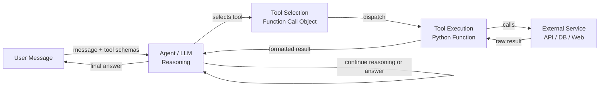

# Ferramentas e ações de agentes

## Definição

Ferramentas e ações são as mãos de um agente de IA. Enquanto o LLM fornece raciocínio e compreensão de linguagem, as ferramentas dão ao agente a capacidade de afetar o mundo: pesquisar na web, executar código, consultar um banco de dados, enviar mensagens ou chamar qualquer API externa. Sem ferramentas, um agente está limitado ao que sabe a partir de seus dados de treinamento; com ferramentas, ele pode acessar informações em tempo real, realizar cálculos e tomar ações com efeitos colaterais.

Nos ecossistemas OpenAI e Anthropic, o mecanismo para uso de ferramentas é chamado de **function calling** (OpenAI) ou **tool use** (Anthropic). O desenvolvedor define um conjunto de schemas de ferramentas — descrições JSON estruturadas do nome, propósito e parâmetros de cada ferramenta — e os inclui na requisição da API. Quando o LLM decide que uma ferramenta é necessária, ele retorna um objeto de chamada de ferramenta estruturado em vez de texto simples. O código chamador executa a ferramenta e alimenta o resultado de volta na conversa. Esse loop se repete até que o agente produza uma resposta final.

A amplitude das ferramentas disponíveis é essencialmente ilimitada: se algo pode ser expresso como uma função Python, pode ser uma ferramenta. As categorias comuns incluem pesquisa na web, sandboxes de execução de código, consultas a bancos de dados SQL ou NoSQL, acesso ao sistema de arquivos, chamadas de API REST, integrações de e-mail e mensagens e ferramentas de uso de computador que interagem com GUIs. Projetar boas ferramentas — com schemas claros, comportamento previsível e mensagens de erro úteis — é uma das coisas mais impactantes que um desenvolvedor pode fazer para melhorar a confiabilidade do agente.

## Como funciona

### Definição de schema de ferramenta

Cada ferramenta é descrita por um schema que o LLM usa para entender quando e como chamá-la. Um schema inclui: um nome (identificador curto em snake_case), uma descrição (explicação clara em linguagem natural do que a ferramenta faz e quando usá-la) e um objeto de parâmetros (JSON Schema descrevendo cada argumento: nome, tipo, descrição e se é obrigatório). A qualidade da descrição afeta diretamente o quão confiável o agente seleciona e invoca a ferramenta corretamente. Descrições vagas levam ao uso indevido; descrições precisas com exemplos levam a chamadas de ferramentas precisas.

### Seleção de ferramentas

Quando o LLM recebe uma mensagem do usuário junto com um conjunto de schemas de ferramentas, ele decide em cada etapa se responde diretamente ou invoca uma ferramenta. Essa decisão é implicitamente aprendida durante o fine-tuning em dados de function-calling. Na prática, a seleção de ferramentas é influenciada pelo prompt do sistema (que pode instruir o agente sobre quando preferir certas ferramentas), a especificidade das descrições das ferramentas e a confiança do modelo de que pode responder a partir dos dados de treinamento. Fornecer um parâmetro `tool_choice` pode forçar ou restringir a seleção de ferramentas de forma programática.

### Execução de ferramentas e injeção de resultados

Quando o LLM produz uma chamada de ferramenta, o código chamador a intercepta, valida os argumentos em relação ao schema, executa a função correspondente e recebe um resultado. Esse resultado — seja uma string, objeto JSON ou mensagem de erro — é formatado como uma mensagem com papel `tool` e adicionado ao histórico da conversa. O LLM então gera a próxima etapa com total consciência da saída da ferramenta. As mensagens de erro de chamadas de ferramentas com falha são importantes: o agente deve saber que uma ferramenta falhou para que possa tentar novamente, tentar uma alternativa ou pedir ao usuário esclarecimentos.

### Chamadas de múltiplas ferramentas e paralelas

As APIs de LLM modernas suportam chamadas paralelas de ferramentas: o modelo pode solicitar múltiplas invocações de ferramentas em uma única resposta quando identifica que são independentes. Por exemplo, um agente pode chamar web_search para três consultas diferentes simultaneamente em vez de sequencialmente, reduzindo a latência em dois terços. O código chamador executa todas as ferramentas em paralelo, coleta os resultados e os alimenta juntos no próximo turno. Projetar ferramentas para serem sem estado e idempotentes onde possível maximiza o benefício da execução paralela.



## Quando usar / Quando NÃO usar

| Usar quando | Evitar quando |
|---|---|
| O agente precisa de informações em tempo real ou externas que não estão nos dados de treinamento | A tarefa pode ser respondida completamente a partir do conhecimento do modelo |
| Ações com efeitos colaterais são necessárias (enviar e-mail, escrever arquivo, atualizar BD) | As ferramentas introduzem riscos de segurança sem sandboxing ou limitação de taxa adequados |
| É necessária computação além das capacidades do LLM (aritmética, execução de código) | Cada chamada de ferramenta adiciona latência e a tarefa é sensível ao tempo |
| A recuperação de dados estruturados (consultas SQL, respostas de API) é essencial | O schema da ferramenta é tão complexo que o modelo frequentemente o usa de forma incorreta |
| Múltiplas ferramentas especializadas podem ser compostas para resolver tarefas complexas | Os modos de falha da ferramenta são irrecuperáveis e podem causar danos |

## Prós e contras

| Prós | Contras |
|---|---|
| Estende o agente além dos dados de treinamento estáticos | Cada chamada de ferramenta adiciona latência e custo de API |
| Habilita efeitos colaterais no mundo real e automação | O uso indevido de ferramentas pode causar ações irreversíveis |
| Suporta E/S estruturada e validada via JSON Schema | Projetar schemas claros requer prompt engineering cuidadoso |
| Chamadas paralelas de ferramentas reduzem o tempo de resposta geral | Mais ferramentas aumentam a carga cognitiva no modelo para seleção |
| Totalmente extensível — qualquer função Python pode se tornar uma ferramenta | O tratamento de erros e as repetições devem ser implementados explicitamente |

## Exemplos de código

```python
"""
OpenAI function calling example with multiple tools:
- web_search: retrieve current information from the web
- safe_math: evaluate arithmetic using operator-based parsing (no eval)
- get_weather: fetch weather data for a city

The agent loop continues until the LLM produces a final text response
with no tool calls.
"""
from __future__ import annotations

import json
import math
import operator
import os
from typing import Any

from openai import OpenAI  # pip install openai

client = OpenAI(api_key=os.environ.get("OPENAI_API_KEY", "sk-placeholder"))
MODEL = "gpt-4o-mini"

# ---------------------------------------------------------------------------
# Tool implementations
# ---------------------------------------------------------------------------

def web_search(query: str, num_results: int = 3) -> str:
    """
    Mock web search. Replace with a real search API such as
    Tavily (https://tavily.com) or Serper (https://serper.dev).
    """
    return json.dumps({
        "query": query,
        "results": [
            {
                "title": f"Result {i + 1} for '{query}'",
                "snippet": f"Relevant information about {query}.",
            }
            for i in range(min(num_results, 10))
        ],
    })


def safe_math(operation: str, a: float, b: float) -> str:
    """
    Perform basic arithmetic safely using an explicit operator table.
    Supports: add, subtract, multiply, divide, power, sqrt (b unused), log.
    This avoids arbitrary code execution entirely.
    """
    ops: dict[str, Any] = {
        "add": operator.add,
        "subtract": operator.sub,
        "multiply": operator.mul,
        "divide": operator.truediv,
        "power": operator.pow,
        "sqrt": lambda x, _: math.sqrt(x),
        "log": lambda x, base: math.log(x, base) if base else math.log(x),
    }
    if operation not in ops:
        return f"Unknown operation '{operation}'. Supported: {', '.join(ops)}"
    try:
        result = ops[operation](a, b)
        return json.dumps({"operation": operation, "a": a, "b": b, "result": result})
    except (ValueError, ZeroDivisionError, OverflowError) as exc:
        return json.dumps({"error": str(exc)})


def get_weather(city: str, units: str = "celsius") -> str:
    """
    Mock weather API. Replace with OpenWeatherMap or similar.
    """
    mock_data = {
        "city": city,
        "temperature": 22,
        "units": units,
        "condition": "Partly cloudy",
        "humidity_percent": 65,
    }
    return json.dumps(mock_data)


# Map tool names to Python functions
TOOL_FUNCTIONS: dict[str, Any] = {
    "web_search": web_search,
    "safe_math": safe_math,
    "get_weather": get_weather,
}

# ---------------------------------------------------------------------------
# Tool schemas (sent to the LLM with every request)
# ---------------------------------------------------------------------------

TOOLS = [
    {
        "type": "function",
        "function": {
            "name": "web_search",
            "description": (
                "Search the web for current information. Use this tool when the user asks "
                "about recent events, facts that may have changed, or anything that requires "
                "up-to-date information."
            ),
            "parameters": {
                "type": "object",
                "properties": {
                    "query": {
                        "type": "string",
                        "description": "The search query to execute.",
                    },
                    "num_results": {
                        "type": "integer",
                        "description": "Number of results to return (default 3, max 10).",
                        "default": 3,
                    },
                },
                "required": ["query"],
            },
        },
    },
    {
        "type": "function",
        "function": {
            "name": "safe_math",
            "description": (
                "Perform a mathematical operation on two numbers. "
                "Supported operations: add, subtract, multiply, divide, power, sqrt, log. "
                "Use this instead of trying to compute arithmetic mentally."
            ),
            "parameters": {
                "type": "object",
                "properties": {
                    "operation": {
                        "type": "string",
                        "enum": ["add", "subtract", "multiply", "divide", "power", "sqrt", "log"],
                        "description": "The arithmetic operation to perform.",
                    },
                    "a": {
                        "type": "number",
                        "description": "The first operand (or the only operand for sqrt).",
                    },
                    "b": {
                        "type": "number",
                        "description": "The second operand (base for log, ignored for sqrt).",
                    },
                },
                "required": ["operation", "a", "b"],
            },
        },
    },
    {
        "type": "function",
        "function": {
            "name": "get_weather",
            "description": (
                "Get the current weather for a city. Use this tool when the user asks "
                "about weather conditions, temperature, or humidity in a specific location."
            ),
            "parameters": {
                "type": "object",
                "properties": {
                    "city": {
                        "type": "string",
                        "description": "The city name, e.g. 'Tokyo' or 'New York'.",
                    },
                    "units": {
                        "type": "string",
                        "enum": ["celsius", "fahrenheit"],
                        "description": "Temperature units (default: celsius).",
                        "default": "celsius",
                    },
                },
                "required": ["city"],
            },
        },
    },
]

# ---------------------------------------------------------------------------
# Agent loop
# ---------------------------------------------------------------------------

def dispatch_tool_call(tool_call) -> str:
    """Execute a single tool call and return the result as a string."""
    name = tool_call.function.name
    args = json.loads(tool_call.function.arguments)
    print(f"  [Tool call] {name}({args})")

    if name not in TOOL_FUNCTIONS:
        return f"Error: unknown tool '{name}'"

    result = TOOL_FUNCTIONS[name](**args)
    preview = result[:120] + ("..." if len(result) > 120 else "")
    print(f"  [Tool result] {preview}")
    return result


def run_agent(user_message: str, system_prompt: str = "You are a helpful assistant.") -> str:
    """
    Agent loop: send message, handle tool calls, repeat until a final answer is produced.
    """
    messages = [
        {"role": "system", "content": system_prompt},
        {"role": "user", "content": user_message},
    ]

    print(f"User: {user_message}\n")

    max_turns = 10  # Safety limit to prevent infinite loops
    for _ in range(max_turns):
        response = client.chat.completions.create(
            model=MODEL,
            messages=messages,
            tools=TOOLS,
            tool_choice="auto",  # Let the model decide; "none" disables tools
        )
        msg = response.choices[0].message

        # If no tool calls, we have the final answer
        if not msg.tool_calls:
            print(f"\nAssistant: {msg.content}")
            return msg.content

        # Append the assistant message with tool calls to history
        messages.append(msg)

        # Execute all tool calls (for parallel execution use asyncio + concurrent.futures)
        for tool_call in msg.tool_calls:
            result = dispatch_tool_call(tool_call)
            messages.append({
                "role": "tool",
                "tool_call_id": tool_call.id,
                "content": result,
            })

    return "Max turns reached without a final answer."


if __name__ == "__main__":
    # Example 1: requires web search
    run_agent("What are the main differences between GPT-4 and Claude 3?")

    print("\n" + "=" * 60 + "\n")

    # Example 2: requires safe_math tool
    run_agent("What is 2 raised to the power of 16, and what is the square root of that?")

    print("\n" + "=" * 60 + "\n")

    # Example 3: requires weather tool
    run_agent("What's the weather like in London right now?")
```

## Recursos práticos

- [Guia de Function Calling da OpenAI](https://platform.openai.com/docs/guides/function-calling) — Documentação oficial cobrindo schemas de ferramentas, chamadas paralelas e melhores práticas para definições de funções.
- [Documentação de Tool Use da Anthropic](https://docs.anthropic.com/en/docs/tool-use) — Guia da Anthropic para uso de ferramentas com Claude, incluindo streaming, uso de computador e padrões de múltiplas ferramentas.
- [Tavily AI Search API](https://tavily.com/) — API de pesquisa projetada especificamente para agentes LLM, fornecendo resultados estruturados limpos ideais para uso de ferramentas.
- [Conceitos de Ferramentas do LangChain](https://python.langchain.com/docs/concepts/tools/) — Visão geral de alto nível dos padrões de design de ferramentas no LangChain, incluindo ferramentas personalizadas e integrações embutidas.
- [Gorilla: Large Language Model Connected with Massive APIs (Patil et al., 2023)](https://arxiv.org/abs/2305.15334) — Pesquisa sobre fine-tuning de LLMs para seleção precisa de API/ferramenta em milhares de ferramentas.

## Veja também

- [Agentes de IA](/docs/agents)
- [Anthropic tool use](/docs/agents/anthropic-tool-use)
- [Visão geral dos frameworks de agentes](/docs/agents/frameworks-overview)
