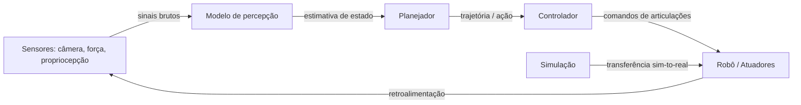

# IA e robótica

## Definição

A IA em robótica é o campo que aplica aprendizado de máquina e técnicas de IA a agentes físicos que atuam no mundo real. Abrange três problemas fundamentais: percepção (compreender o estado do mundo a partir de dados de sensores), planejamento (decidir o que fazer a seguir) e controle (executar ações por meio de atuadores). Ao contrário de aplicações de IA puramente digitais, os sistemas robóticos devem lidar com incerteza física, latência e restrições de segurança em tempo real.

A robótica de IA moderna usa [aprendizado por reforço](/docs/rl), aprendizado por imitação e [visão computacional](/docs/cv) para treinar políticas que mapeiam diretamente entradas de sensores para ações. Um paradigma importante é o sim-to-real: treinar políticas em simulação (onde os dados são baratos e as falhas são seguras), depois transferi-las para hardware real. Isso requer randomização de domínio, identificação de sistemas e às vezes adaptação online para fechar a lacuna entre a dinâmica simulada e real.

Na prática, a robótica se conecta ao [aprendizado por reforço profundo](/docs/drl) para controle baseado em políticas, à [IA multimodal](/docs/multimodal-ai) para percepção sensorial rica e à [inferência na borda](/docs/local-inference) para processamento a bordo em tempo real. O espectro vai desde manipulação industrial e armazenamento até robôs cirúrgicos e navegação autônoma — cada caso de uso traz diferentes compromissos entre velocidade, precisão e restrições de segurança.

## Como funciona

### Pipeline percepção-planejamento-controle

Sensores (câmeras, força/torque, propriocepção) alimentam modelos de **percepção** que estimam o estado (por ex. poses de objetos, layout da cena). **Planejadores** (clássicos ou aprendidos) produzem trajetórias ou ações de alto nível (por ex. "pegar bloco A"). **Controladores** (por ex. PID, política aprendida) executam comandos de baixo nível (torques de articulações, velocidades) para seguir o plano.

O aprendizado **end-to-end** mapeia entradas brutas de sensores para ações em uma única rede; pipelines **modulares** separam percepção, planejamento e controle para interpretabilidade e reutilização. O treinamento é frequentemente em simulação ([DRL](/docs/drl)); sim-to-real (randomização de domínio, identificação de sistemas) e restrições de segurança são críticos para o implantação.



### Transferência sim-to-real

A simulação permite dados de treinamento ilimitados e exploração segura. As técnicas sim-to-real fecham a lacuna: a randomização de domínio varia parâmetros físicos e texturas visuais para que as políticas generalizem para variações reais. A identificação de sistemas calibra parâmetros de simulação em relação ao hardware real. As políticas residuais aprendem pequenas correções além da simulação.

## Quando usar / Quando NÃO usar

| Usar quando | Evitar quando |
|-------------|--------------|
| A tarefa requer interação física com ambientes não estruturados | A tarefa é totalmente baseada em regras e determinista (robótica clássica suficiente) |
| A transferência sim-to-real é viável e as restrições de segurança são gerenciáveis | Aplicações críticas de segurança sem tolerância a falhas e testes suficientes |
| Dados de demonstração ou simulação suficientes estão disponíveis | A latência de hardware em tempo real não é compatível com os requisitos de inferência |
| São necessárias políticas adaptativas em tempo real para ambientes em mudança | Os dados de rotulagem ou demonstração são muito escassos ou caros |

## Comparações

| Abordagem | Fonte de treinamento | Pontos fortes | Limitações |
|-----------|---------------------|--------------|------------|
| Aprendizado por reforço | Rollouts de simulação | Explora estratégias novas | Requer muitas amostras, lacuna de simulação |
| Aprendizado por imitação | Demonstrações humanas | Aprende rapidamente de demonstrações | Não generaliza bem além das demos |
| Controle clássico | Modelo + regras | Interpretável, determinista | Não escala para percepção complexa |
| Aprendizado end-to-end | Sensores → ações | Treinamento unificado | Mais difícil de depurar e implantar |

## Prós e contras

| Prós | Contras |
|------|---------|
| Adaptável a ambientes não estruturados | A lacuna sim-to-real pode exigir calibração custosa |
| Aprende políticas a partir de dados, sem programação explícita | Restrições de segurança são difíceis de codificar em políticas aprendidas |
| A simulação permite treinamento de baixo custo | Requer integração cuidadosa de sensores e hardware |
| Os modelos podem ser transferidos em cenários multitarefa | Os requisitos de inferência em tempo real limitam o tamanho do modelo |

## Exemplos de código

### Loop de política simples (Python / estilo OpenAI Gym)

```python
import gymnasium as gym

env = gym.make("FetchReach-v2", render_mode="human")
obs, info = env.reset()

for step in range(200):
    # Substituir por política aprendida; aqui ação aleatória
    action = env.action_space.sample()
    obs, reward, terminated, truncated, info = env.step(action)
    if terminated or truncated:
        obs, info = env.reset()

env.close()
```

### Randomização de domínio (conceitual)

```python
import numpy as np

def randomize_env_params(base_mass: float, base_friction: float) -> dict:
    """Randomizar propriedades físicas para melhorar o sim-to-real."""
    return {
        "mass": base_mass * np.random.uniform(0.8, 1.2),
        "friction": base_friction * np.random.uniform(0.5, 1.5),
        "joint_damping": np.random.uniform(0.01, 0.1),
    }

# Durante o treinamento: re-amostrar parâmetros do ambiente a cada reset
params = randomize_env_params(base_mass=1.0, base_friction=0.5)
```

## Recursos práticos

- [Spinning Up in Deep RL (OpenAI)](https://spinningup.openai.com/) — Fundamentos de RL para controle robótico
- [Google Robotics Research](https://research.google/pubs/robotics/) — Visão geral de pesquisa em robótica de aprendizado
- [Gymnasium Robotics](https://robotics.farama.org/) — Ambientes padrão para pesquisa de RL em robótica de aprendizado
- [Isaac Gym / Isaac Lab (NVIDIA)](https://developer.nvidia.com/isaac-gym) — Framework de simulação física acelerado por GPU para RL de robôs

## Veja também

- [Aprendizado por reforço](/docs/rl)
- [Aprendizado por reforço profundo](/docs/drl)
- [Visão computacional](/docs/cv)
- [IA multimodal](/docs/multimodal-ai)
- [Inferência na borda](/docs/local-inference)
