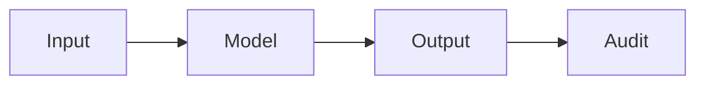

# Segurança em IA

## Definição

A segurança de IA aborda riscos da IA avançada: mau uso, comportamento não intencional e alinhamento (systems doing what we intend). It includes robustness, interpretability, and value alignment.

Ele se sobrepõe com [AI ethics](/docs/ai-ethics) (governance, fairness) and [bias in AI](/docs/bias-in-ai) (unfair outcomes). For [LLMs](/docs/llms) and [agents](/docs/agents), alignment (por ex. RLHF, constitutional AI) and guardrails are the main levers; [explainable AI](/docs/xai) supports auditing and debugging.

## Como funciona

**Entrada** é processada pelo **modelo** para produzir **saída**. **Auditoria** (testes, monitoramento, red-teaming) verifica que as saídas são seguras, alinhadas e robust. Research and practice focus on: **alignment** (RLHF, constitutional AI, scalable oversight) so models follow intent; **robustness** (adversarial testing, distribution shift) so they behave under edge cases; **monitoring** in production to detect misuse or drift. Safety is considered across the lifecycle from projeto and data to training, evaluation, and deployment. Formal methods and interpretability ([XAI](/docs/xai)) support the audit step.

## Casos de uso

A segurança em IA é relevante para qualquer sistema de alto risco ou voltado ao público: alinhamento, robustez e monitoramento do projeto à implantação.

- Auditing and red-teaming high-stakes or public-facing models
- Alignment and guardrails for LLMs and agents (por ex. RLHF, constitutional AI)
- Robustness testing and monitoring in production

## Documentação externa

- [Anthropic – Safety](https://www.anthropic.com/research) — Research on AI safety and alignment
- [OpenAI – Safety and responsibility](https://openai.com/safety)

## Veja também

- [AI ethics](/docs/ai-ethics)
- [Explainable AI](/docs/xai)
- [Bias in AI](/docs/bias-in-ai)
