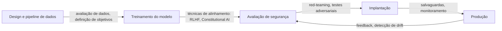

# Segurança em IA

## Definição

A segurança em IA é o campo de pesquisa e engenharia que se preocupa em garantir que os sistemas de IA façam o que pretendemos e permaneçam seguros em uma ampla gama de condições. Abrange três problemas fundamentais: alinhamento (sistemas que representam e perseguem corretamente os valores e intenções humanas), robustez (comportamento consistente sob mudança de distribuição, entradas adversariais e casos extremos) e interpretabilidade (compreender por que um sistema produziu uma saída particular). Esses problemas se reforçam mutuamente: a robustez é mais difícil de alcançar sem interpretabilidade, e a interpretabilidade apoia a verificação de garantias de alinhamento.

A segurança em IA se sobrepõe à [ética em IA](/docs/ai-ethics) — a ética fornece o quadro normativo (quais valores os sistemas devem perseguir), enquanto a segurança aborda o problema técnico (como garantir que eles o façam). O [viés em IA](/docs/bias-in-ai) é um ponto de interseção: saídas tendenciosas podem ser tanto um problema de alinhamento quanto de equidade. Para [LLMs](/docs/llms) e [agentes](/docs/agents), RLHF (aprendizado por reforço com feedback humano), constitutional AI e supervisão escalável oferecem as principais ferramentas; a [IA explicável](/docs/xai) apoia auditorias e depuração.

Na prática, a segurança se estende por todo o ciclo de vida do modelo. Durante o treinamento, isso inclui qualidade de dados, objetivos e regularização. Durante a avaliação, inclui red-teaming, entradas adversariais e avaliação do comportamento nos limites. Na implantação, inclui salvaguardas, monitoramento e mecanismos para intervir. Para sistemas de agentes, a maior autonomia adiciona camadas adicionais de segurança: se o agente entende corretamente suas próprias limitações, se permanece corrigível e se evita o acúmulo de poder ou ações irreversíveis.

## Como funciona

### Componentes centrais de segurança

**O alinhamento** garante que um modelo persiga o objetivo pretendido — não um erro de proxy ou uma otimização incorreta. RLHF treina modelos para preferir preferências humanas; Constitutional AI usa princípios explícitos; a supervisão escalável propõe usar assistentes de IA confiáveis para escalar os revisores humanos.

**A robustez** testa o comportamento do sistema em condições alteradas. Os testes adversariais buscam entradas que forçam falhas. Os testes de envenenamento verificam se os dados de treinamento foram comprometidos. As avaliações de mudança de distribuição medem a degradação quando as entradas divergem dos dados de treinamento.



### Red-teaming e monitoramento

O red-teaming simula o uso adversarial tentando ativamente fazer o modelo falhar. O red-teaming automatizado usa outros modelos como adversários para escalar a cobertura. O monitoramento de produção detecta comportamentos inesperados, padrões de saída incomuns e abuso.

## Quando usar / Quando NÃO usar

| Usar quando | Evitar quando |
|-------------|--------------|
| A IA é implantada em domínios de decisão de alto risco (crédito, saúde, justiça) | O sistema produz apenas recomendações internas sem ação direta |
| Modelos ou agentes interagem com entradas não confiáveis ou usuários públicos | Uma revisão humana completa de todas as saídas é garantida |
| Sistemas executam ações irreversíveis ou controlam infraestrutura crítica | O aplicativo é um protótipo de baixo risco com implantação limitada |
| Conformidade regulatória ou auditorias externas são necessárias | O perfil de risco é muito baixo e totalmente coberto pelos testes existentes |

## Comparações

| Técnica | Alvo | Resultados típicos |
|---------|------|-------------------|
| RLHF | Alinhamento | Modelos que seguem preferências humanas |
| Constitutional AI | Alinhamento | Modelos que seguem princípios |
| Testes adversariais | Robustez | Casos extremos e modos de falha identificados |
| Red-teaming | Revisão de segurança | Cenários de abuso e salvaguardas |
| Monitoramento | Segurança em tempo de execução | Alertas para drift e abuso |

## Prós e contras

| Prós | Contras |
|------|---------|
| Reduz o risco de uso catastrófico ou malicioso | A engenharia de segurança adiciona tempo e custo de desenvolvimento |
| Cria garantias demonstráveis para reguladores e auditores | Garantias formais de alinhamento continuam sendo um problema de pesquisa aberto |
| Salvaguardas melhoram a experiência do usuário ao rejeitar abusos | Filtros excessivamente rígidos podem rejeitar saídas úteis |
| O monitoramento detecta problemas cedo antes de escalar | Sistemas distribuídos ou baseados em agentes são mais difíceis de monitorar |

## Exemplos de código

### Verificação de saída simples com salvaguarda baseada em regras (Python)

```python
import re

BLOCKED_PATTERNS = [
    r"\b(ssn|social security)\b",
    r"\b\d{3}-\d{2}-\d{4}\b",  # SSN format
    r"\bcredit.?card\b",
]

def check_output_safety(text: str) -> tuple[bool, str]:
    """Retorna (is_safe, reason)."""
    lower = text.lower()
    for pattern in BLOCKED_PATTERNS:
        if re.search(pattern, lower):
            return False, f"Padrão bloqueado detectado: {pattern}"
    return True, "OK"

response = "Seu CPF é 123-45-6789."
safe, reason = check_output_safety(response)
print(f"Seguro: {safe}, Motivo: {reason}")
# Seguro: False, Motivo: Padrão bloqueado detectado: \b\d{3}-\d{2}-\d{4}\b
```

### Wrapper simples de moderação de prompt

```python
from anthropic import Anthropic

client = Anthropic()

SYSTEM_PROMPT = """Você é um assistente útil. Você deve:
- Não gerar conteúdo prejudicial, ilegal ou enganoso
- Esclarecer quando uma solicitação está fora de suas capacidades
- Nunca fingir ser humano quando perguntado diretamente
"""

def safe_chat(user_message: str) -> str:
    response = client.messages.create(
        model="claude-opus-4-5",
        max_tokens=1024,
        system=SYSTEM_PROMPT,
        messages=[{"role": "user", "content": user_message}],
    )
    return response.content[0].text

print(safe_chat("Ajude-me a entender esse erro."))
```

## Recursos práticos

- [Anthropic – Pesquisa em segurança de IA](https://www.anthropic.com/research) — Pesquisa sobre alinhamento, constitutional AI e supervisão escalável
- [OpenAI – Segurança e responsabilidade](https://openai.com/safety) — Práticas de segurança e compromissos
- [NIST AI Risk Management Framework](https://www.nist.gov/system/files/documents/2023/01/26/AI%20RMF%201.0.pdf) — Estrutura governamental para gerenciamento de riscos de IA
- [Alignment Forum](https://www.alignmentforum.org/) — Comunidade para pesquisa técnica de alinhamento

## Veja também

- [Ética em IA](/docs/ai-ethics)
- [IA explicável](/docs/xai)
- [Viés em IA](/docs/bias-in-ai)
- [Agentes autônomos](/docs/autonomous-agents)
