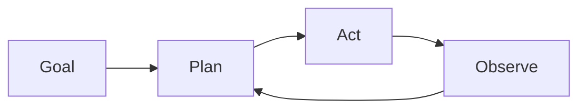

# Agentes autônomos

## Definição

Agentes autônomos perseguem objetivos por longos horizontes com intervenção humana limitada. They plan, use tools, and adapt when the environment or task changes (por ex. coding agents, research assistants).

They sit at the “high autonomy” end of the [agents](/docs/agents) spectrum: em vez de um turno do usuário e uma resposta, executam loops longos (plan → act → observe → replan) until the goal is met or a limit is hit. [Subagents](/docs/subagents) and [raciocínio patterns](/docs/reasoning-patterns) (por ex. ReAct, ToT) are often used inside autonomous agents to structure planning and action.

## Como funciona

The agent starts from a **goal** (por ex. “implement feature X”). It **plans** (possibly breaking into steps or sub-tasks), then **acts** (chamadas de ferramentas, code edits, search). The **observe** step captures results (tool outputs, errors, state) and feeds back into **plan** for the next iteration. The loop combines planning, memory (what was tried, what worked), tool use, and often reflection (por ex. self-critique). It runs until a stopping condition: task done, step/budget limit, or human-in-the-loop check. Safety and oversight (por ex. approval gates, rollback) are important when autonomy is high.

## Casos de uso

Agentes autônomos são adequados para trabalho de longo prazo e múltiplos passos onde o sistema deve planejar, agir e se adaptar sem input humano passo a passo.

- Long-horizon coding agents that plan, edit, and test
- Research assistants that gather sources, summarize, and iterate
- Data pipelines that adapt when inputs or schemas change

## Documentação externa

- [From Prototypes to Agents with ADK – Google Codelabs](https://codelabs.developers.google.com/your-first-agent-with-adk#0)
- [LangChain – Autonomous agents](https://python.langchain.com/docs/concepts/agents/)

## Veja também

- [Agents](/docs/agents)
- [Subagents](/docs/subagents)
- [Reasoning patterns](/docs/reasoning-patterns)
