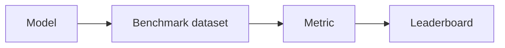

# Benchmarks

## Definição

Benchmarks são conjuntos de dados padronizados e protocolos de avaliação (por ex. GLUE, SuperGLUE for NLP; MMLU for broad knowledge; HumanEval for code). They enable comparison across models and over time.

They dependem de [evaluation metrics](/docs/evaluation-metrics) e divisões fixas para que os resultados sejam comparáveis. O sobreajuste a benchmarks é um problema conhecido; supplement with out-of-distribution and human eval when deploying [LLMs](/docs/llms) or production systems.

## Como funciona

Um **modelo** é executado em um **conjunto de dados benchmark** (prompts ou entradas fixas, divisão padrão). **Métricas** (por ex. accuracy, pass@k) são calculadas por tarefa and often averaged; results are reported on a **leaderboard** or in papers. Protocols define what inputs to use, how to parse outputs, and which [metrics](/docs/evaluation-metrics) to report. Reusing the same benchmark across time lets the community track progress. Care is needed: models can overfit to benchmark quirks, and benchmarks may not reflect real-world quality—use them as one signal among others.

## Casos de uso

Benchmarks give a common yardstick to compare models and methods; use them together with task-specific and human evaluation.

- Comparing NLP models (por ex. GLUE, SuperGLUE, MMLU)
- Evaluating code generation (por ex. HumanEval) or raciocínio
- Tracking model and method progress over time

## Documentação externa

- [Papers with Code – Leaderboards](https://paperswithcode.com/)
- [MMLU (Hendrycks et al.)](https://arxiv.org/abs/2009.03300) — Broad knowledge benchmark
- [HumanEval](https://github.com/openai/human-eval) — Code generation benchmark

## Veja também

- [Evaluation metrics](/docs/evaluation-metrics)
- [LLMs](/docs/llms)
