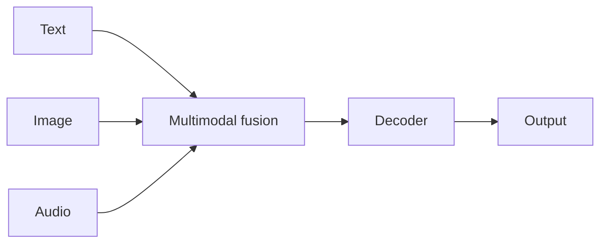

# Case study: Gemini

## Definição

Gemini é a família de [LLMs](/docs/llms) do Google com suporte **multimodal nativo**: texto, imagem, áudio e vídeo em um único modelo. Sucede modelos anteriores do Google (p. ex., [BART](/docs/case-studies/bart) na linha codificador-decodificador) e é oferecido em múltiplos níveis de escala (Nano, Pro, Ultra) para diferentes compensações de latência e capacidade.

Gemini é treinado e implantado nos produtos do Google (Search, Workspace, Vertex AI, Android). Caso de uso: chat, compreensão e geração [multimodal](/docs/multimodal-ai), programação e uso de ferramentas no estilo [agente](/docs/agents).

## Como funciona

As **entradas multimodais** (texto, imagem, áudio, vídeo) são codificadas e fundidas em uma pilha [transformer](/docs/transformers) unificada. O **decodificador** gera texto (ou saída estruturada) condicionado em todas as modalidades. **Níveis de escala**: modelos menores (p. ex., Nano) para [edge](/docs/edge-reasoning) e no dispositivo; maiores (Pro, Ultra) para máxima capacidade na nuvem. **Integração**: os mesmos modelos alimentam Gemini no Search, Workspace e nas APIs do Vertex AI. [Engenharia de prompts](/docs/prompt-engineering) e [RAG](/docs/rag) ou ferramentas estendem o uso em aplicações.

## Casos de uso

Gemini é adequado quando se precisa de compreensão ou geração multimodal e integração opcional com a pilha do Google.

- Chat e assistentes com compreensão de imagens, documentos ou vídeos
- Pesquisa multimodal, resumo e geração de conteúdo
- Programação e raciocínio via API ou produtos do Google

## Documentação externa

- [Google AI – Gemini](https://ai.google.dev/gemini-api) — API e visão geral
- [Google – Gemini models](https://deepmind.google/technologies/gemini/) — Níveis do modelo e capacidades

## Veja também

- [LLMs](/docs/llms)
- [IA multimodal](/docs/multimodal-ai)
- [BART](/docs/case-studies/bart) — Predecessor na linha codificador-decodificador
