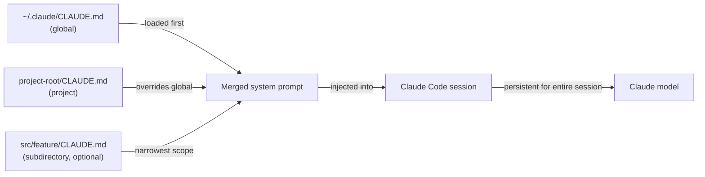

# Configuração CLAUDE.md

## Definição

`CLAUDE.md` é um arquivo Markdown que o Claude Code lê automaticamente no início de cada sessão. Seu conteúdo é injetado no prompt de sistema, fornecendo ao modelo instruções persistentes e cientes do projeto sem que o desenvolvedor precise repeti-las em cada conversa. Pense nele como o "documento de onboarding" que cada sessão recebe: ele diz ao Claude o que é o projeto, como está estruturado, quais convenções seguir e quais comportamentos evitar.

O arquivo é intencionalmente escrito em Markdown simples em vez de um formato proprietário, o que significa que é legível por humanos, versionável e editável por qualquer desenvolvedor da equipe. Por ficar no repositório ao lado do código, ele evolui com o projeto: quando a stack tecnológica muda, quando novas convenções são adotadas ou quando um novo desenvolvedor entra e precisa de onboarding, o `CLAUDE.md` é a única fonte de verdade sobre como o Claude deve se comportar naquela base de código.

Existem dois escopos distintos para arquivos `CLAUDE.md`. Um arquivo de **nível de projeto** fica na raiz do repositório (ou em qualquer subdiretório) e se aplica somente a esse projeto. Um arquivo **global** fica em `~/.claude/CLAUDE.md` e se aplica a cada sessão do Claude Code, independentemente do projeto. Os dois escopos são aditivos: ambos são carregados simultaneamente, com as instruções de nível de projeto tendo precedência quando conflitam com as globais.

## Como funciona

### Descoberta de arquivos e ordem de carregamento

Quando o Claude Code inicia uma sessão, ele percorre a árvore de diretórios para cima a partir do diretório de trabalho atual procurando arquivos `CLAUDE.md`. Arquivos encontrados em diretórios pai são carregados primeiro (escopo mais amplo), depois arquivos encontrados no diretório atual e em seus subdiretórios (escopo mais estreito). O arquivo global em `~/.claude/CLAUDE.md` é sempre carregado primeiro, fornecendo uma base que os arquivos do projeto podem substituir. Esse carregamento hierárquico significa que um monorepo pode ter um `CLAUDE.md` na raiz para convenções compartilhadas e arquivos `CLAUDE.md` por pacote para regras específicas do pacote — ambos se aplicam simultaneamente durante uma sessão.

### Injeção no prompt de sistema

O conteúdo de todos os arquivos `CLAUDE.md` descobertos é concatenado e prefixado ao prompt de sistema antes de qualquer turno de conversa. Isso significa que o Claude tem acesso às instruções em cada requisição individual, não apenas na primeira. Como as instruções fazem parte do prompt de sistema em vez da mensagem do usuário, elas não consomem contexto conversacional que de outra forma seria usado para código e resultados de ferramentas. As instruções persistem por toda a sessão e não são resumidas ou comprimidas pelo sistema de gerenciamento de contexto.

### O que pertence ao CLAUDE.md

Um `CLAUDE.md` bem escrito responde às perguntas que um novo membro da equipe faria antes de tocar na base de código: O que é esse projeto? Qual linguagem e framework são usados? Como o código está organizado? Quais são as convenções de teste e formatação? Existem padrões a seguir ou antipadrões a evitar? Existem comandos que o Claude deve ou não deve executar? O arquivo deve ser específico o suficiente para ser acionável, mas conciso o suficiente para que o modelo possa internalizar tudo. Evite preenchê-lo com informações que o Claude já sabe (por exemplo, explicar o que é TypeScript) e foque em fatos específicos do projeto.

### Mantendo o CLAUDE.md atualizado

Como o `CLAUDE.md` é injetado em cada requisição, instruções desatualizadas prejudicam ativamente o desempenho — o Claude pode seguir convenções obsoletas ou usar padrões deprecados. A prática recomendada é tratar atualizações no `CLAUDE.md` como parte do desenvolvimento normal: quando uma grande refatoração muda a estrutura do projeto, atualize o arquivo no mesmo commit. A revisão de código deve incluir mudanças no `CLAUDE.md` assim como qualquer outra mudança de configuração. Equipes com pipelines de CI podem fazer lint do arquivo (por exemplo, verificar se caminhos referenciados ainda existem) para detectar entradas obsoletas cedo.



## Quando usar / Quando NÃO usar

| Use quando | Evite quando |
|---|---|
| Você quer que o Claude sempre siga padrões específicos de codificação (por exemplo, use `const` em vez de `let`, prefira componentes funcionais) | As instruções mudam frequentemente por tarefa — use prompts dentro da sessão para requisições únicas |
| Você precisa fornecer contexto da stack tecnológica que de outra forma precisaria ser re-explicado (por exemplo, "usamos Zod para validação de schema, não Yup") | O arquivo conteria segredos ou credenciais — use variáveis de ambiente para isso |
| Você quer impedir que o Claude execute comandos perigosos (por exemplo, "nunca execute `DROP TABLE` ou `rm -rf`") | As instruções são boas práticas genéricas que o Claude já segue por padrão |
| Seu projeto tem decisões de arquitetura não óbvias que afetam como o código deve ser escrito | O projeto é um script único sem convenções compartilhadas que valem a pena documentar |
| Você trabalha em múltiplos projetos e quer um estilo base pessoal no seu `~/.claude/CLAUDE.md` global | Diferentes membros da equipe têm preferências conflitantes — resolva isso em revisão de código primeiro |

## Exemplos de código

```markdown
# CLAUDE.md — my-app project instructions

## Project overview
This is a full-stack web app: React + TypeScript frontend, Node.js + Express backend,
PostgreSQL database managed with Prisma ORM. The monorepo is structured as:

- `packages/web/` — React frontend (Vite, React Router v6, Tailwind CSS)
- `packages/api/` — Express REST API (TypeScript, Zod for request validation)
- `packages/shared/` — Shared TypeScript types used by both packages

## Tech stack conventions

### Frontend (packages/web)
- Use functional components with hooks only — no class components
- Prefer named exports over default exports for components
- State management: Zustand for global state, React Query for server state
- Styling: Tailwind utility classes; no inline styles or CSS modules
- Use `zod` schemas imported from `packages/shared` to validate API responses

### Backend (packages/api)
- All route handlers live in `src/routes/`; use Express Router, one file per resource
- Validate all request bodies and query params with Zod before accessing them
- Use Prisma's generated client — never write raw SQL unless Prisma cannot express the query
- Return errors as `{ error: string, code: string }` JSON objects, never as HTML

## Code style
- TypeScript strict mode is enabled — never use `any` or `// @ts-ignore`
- Use `const` by default; only use `let` when reassignment is required
- Prefer early returns over nested conditionals
- All async functions must handle errors with try/catch or `.catch()`
- Do not import from `../../..` more than two levels deep — use path aliases (`@web/`, `@api/`, `@shared/`)

## Testing
- Tests live alongside source files as `*.test.ts` — not in a separate `tests/` directory
- Use Vitest for all tests (not Jest)
- Write unit tests for all utility functions; integration tests for all API routes
- Run tests with: `pnpm test` (runs all packages) or `pnpm --filter @app/api test` (single package)

## Git conventions
- Use conventional commits: `feat:`, `fix:`, `chore:`, `docs:`, `refactor:`, `test:`
- One logical change per commit — do not bundle unrelated changes
- Branch names: `feat/description`, `fix/description`, `chore/description`

## Commands you may run freely
- `pnpm install`, `pnpm build`, `pnpm test`, `pnpm lint`, `pnpm format`
- `prisma generate`, `prisma migrate dev`, `prisma studio`
- `git status`, `git diff`, `git log`

## Commands to NEVER run without explicit user confirmation
- Any `prisma migrate reset` or `prisma db push --force-reset` — these destroy data
- Any `DROP TABLE`, `DELETE FROM` without a WHERE clause
- `rm -rf` on any directory other than `node_modules` or build artifacts
```

```bash
# Global CLAUDE.md at ~/.claude/CLAUDE.md (applies to all projects)
# Good for personal style preferences and safety rules that span every project

# Example global instructions:
cat ~/.claude/CLAUDE.md
```

```markdown
# Global Claude Code instructions (all projects)

## My personal defaults
- I prefer TypeScript over JavaScript in all new files
- Use single quotes for strings in JavaScript/TypeScript
- Explain what you are going to do before making large changes (more than 3 files)
- When writing commit messages, always use conventional commits format

## Safety rules (all projects)
- Never commit directly to `main` or `master` — always create a feature branch first
- Never run database migration commands without showing me the migration file first
- Ask before installing new dependencies — I want to review package size and license
```

## Recursos práticos

- [Documentação do Claude Code — CLAUDE.md](https://docs.anthropic.com/en/docs/claude-code/memory) — Guia oficial para localizações de arquivos CLAUDE.md, ordem de carregamento e boas práticas.
- [Referência de configurações do Claude Code](https://docs.anthropic.com/en/docs/claude-code/settings) — Referência completa de configurações incluindo todas as opções de configuração ao lado do CLAUDE.md.
- [Guia de início rápido do Claude Code](https://docs.anthropic.com/en/docs/claude-code/quickstart) — Guia de início que cobre a configuração inicial do CLAUDE.md.

## Veja também

- [Visão geral do Claude Code](/docs/claude-code)
- [Skills do Claude Code](/docs/claude-code/skills)
- [Gerenciamento de contexto](/docs/claude-code/context-management)
