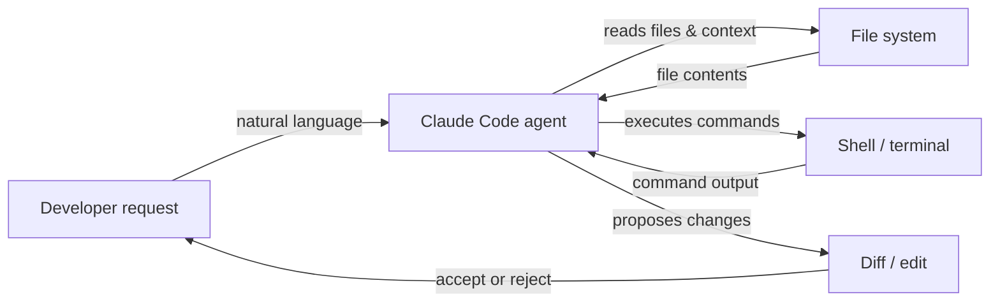

# Claude Code

## Definição

Claude Code é o agente de codificação com IA da Anthropic — uma ferramenta criada especificamente para trazer as capacidades de raciocínio do Claude diretamente para o fluxo de trabalho do desenvolvedor. Diferentemente de ferramentas de IA orientadas a chat, o Claude Code é projetado para **operação agêntica**: ele pode planejar e executar tarefas em múltiplas etapas de forma autônoma, navegar em grandes bases de código, executar comandos shell, editar arquivos, gerenciar operações git e iterar em sua própria saída sem orientação humana constante a cada etapa.

Está disponível em múltiplos ambientes: como uma **interface de linha de comando (CLI)** que funciona em qualquer terminal, como uma extensão para IDEs **VS Code** e **JetBrains** com edição inline e diffs visuais, e via **aplicativo web** em claude.ai/code para sessões no navegador. Essa presença em múltiplos ambientes significa que desenvolvedores podem usar o Claude Code onde já trabalham, em vez de mudar para um editor específico da ferramenta.

O conjunto de capacidades principais abrange o ciclo completo de codificação: **geração de código** (criação de novos arquivos, escrita de funções, geração de testes), **refatoração** (reestruturação do código existente preservando o comportamento), **depuração** (diagnóstico de erros com contexto completo), **operações git** (staging, commits, leitura de diffs, interpretação de histórico) e **gerenciamento de arquivos** (leitura, escrita, busca e organização de arquivos do projeto). Como o Claude Code opera com acesso a toda a árvore do projeto e a um terminal, ele lida naturalmente com tarefas que exigem compreensão entre arquivos e uso sequencial de ferramentas.

## Como funciona

### Instalação e autenticação

O Claude Code é instalado como um pacote npm (`npm install -g @anthropic-ai/claude-code`) e requer uma assinatura Claude (Pro, Teams ou Enterprise) ou acesso via API pelo Amazon Bedrock ou Google Vertex AI. Após executar `claude` em um terminal, a autenticação é feita via OAuth ou uma chave de API armazenada na configuração local. A CLI lê o diretório do projeto, localiza quaisquer arquivos de instrução `CLAUDE.md` e entra em uma sessão interativa onde o usuário digita requisições em linguagem natural.

### Loop de execução de tarefas agênticas

Quando recebe uma tarefa, o Claude Code segue um loop interno de planejar-agir-observar. Primeiro lê arquivos relevantes para construir contexto, depois emite chamadas de ferramentas (leituras de arquivo, comandos shell, edições de código) em sequência, observa cada resultado e ajusta seu plano adequadamente. Esse loop continua de forma autônoma até que a tarefa esteja completa ou o Claude determine que precisa de esclarecimentos. O agente mantém o histórico completo da conversa entre os turnos, podendo se referir a descobertas anteriores e evitar operações redundantes.

### Integrações com IDEs

No VS Code e JetBrains, o Claude Code aparece como um painel integrado com interface de chat e visualizações de diffs inline. Quando o Claude propõe mudanças de código, elas aparecem como diffs lado a lado que o desenvolvedor pode aceitar, rejeitar ou aplicar parcialmente. A extensão tem acesso ao mesmo sistema de arquivos e terminal que a CLI, portanto as capacidades são equivalentes — a diferença é ergonômica, não funcional. Atalhos de edição inline (ativados por atalho de teclado) permitem que desenvolvedores solicitem edições direcionadas sem mudar para um painel de chat.

### Contexto e uso de ferramentas

O Claude Code usa um conjunto de ferramentas integradas: `Read`, `Edit`, `Write`, `Bash`, `Glob` e `Grep`. Estas mapeiam diretamente para as ações que um desenvolvedor tomaria ao investigar e modificar uma base de código. Cada chamada de ferramenta é visível ao usuário na sessão, tornando o raciocínio do agente rastreável. O contexto de arquivo é carregado sob demanda em vez de pré-carregado, o que ajuda a gerenciar a janela de contexto eficientemente. Instruções no nível do projeto em arquivos `CLAUDE.md` são automaticamente injetadas no prompt de sistema para guiar o comportamento.



## Quando usar / Quando NÃO usar

| Use quando | Evite quando |
|---|---|
| Você precisa de um agente para executar tarefas em múltiplas etapas de forma autônoma (por exemplo, "adicionar paginação a todos os endpoints de lista") | Você só precisa de uma sugestão de autocompletar — uma ferramenta inline mais simples é mais rápida |
| Você quer explorar uma base de código desconhecida com perguntas em linguagem natural | A base de código contém segredos sensíveis que nunca deveriam ser lidos por uma IA externa |
| Você precisa de operações com consciência de git: resumir diffs, escrever mensagens de commit, revisar PRs | Seu projeto requer desenvolvimento offline ou em ambiente isolado sem acesso à API |
| Você quer integração com IDE com diffs visuais e edições inline | Você prefere IA totalmente local/open-source sem dependência de nuvem |
| Você está executando tarefas no terminal e quer assistência de IA nativa para CLI | Você precisa de rastreamento de custo por token em granularidade fina no nível gratuito |

## Comparações

| Critério | Claude Code | Cursor | GitHub Copilot |
|---|---|---|---|
| **Nível de autonomia** | Alto — loop agêntico completo com planejamento e execução em múltiplas etapas | Médio — editor com IA e modo agente, mas principalmente centrado no editor | Baixo a médio — completações inline e chat; Copilot Workspace adiciona planejamento |
| **Suporte a IDEs** | VS Code, JetBrains, mais CLI standalone e web | Fork proprietário do VS Code apenas | VS Code, Visual Studio, JetBrains, Neovim e mais |
| **Modelo de preços** | Incluído na assinatura Claude Pro/Teams ou por token via API | Assinatura ($20/mês hobby, $40/mês pro); sem nível gratuito além do trial | Gratuito para indivíduos; $10/mês Pro; níveis Teams e Enterprise |
| **Capacidades agênticas** | Nativo: executa comandos shell, edita arquivos, usa git, faz loops de forma autônoma | Em crescimento: modo agente disponível, executa comandos de terminal | Limitado: Copilot Workspace para planejamento; modo padrão é reativo |
| **Tratamento de contexto** | Carregamento de arquivos baseado em ferramentas explícitas; suporta `CLAUDE.md` para instruções persistentes | Cursor Rules (`.cursorrules`) + indexação de base de código com embeddings | O contexto do Copilot vem de arquivos abertos e código selecionado; sem regras persistentes de projeto |

Veja também os artigos dedicados: [Cursor](/docs/tools/cursor) e [GitHub Copilot](/docs/tools/github-copilot).

## Exemplos de código

```bash
# Install Claude Code globally
npm install -g @anthropic-ai/claude-code

# Start an interactive session in your project directory
cd ~/projects/my-app
claude

# --- Inside the Claude Code CLI session ---

# Ask a question about the codebase
> How is authentication handled in this project?

# Ask Claude to make a targeted change
> Add input validation to the POST /users endpoint in src/routes/users.ts

# Ask Claude to fix a bug with context
> The test in tests/auth.test.ts is failing with "Cannot read property 'id' of undefined". Fix it.

# Ask Claude to perform a cross-file refactor
> Rename the UserProfile component to ProfileCard across all files that import it

# Use git-aware operations
> Write a conventional commit message for the changes currently staged in git

# Run a slash command to clear conversation context
> /clear

# Run a multi-step agentic task
> Create a new Express route for GET /health that returns server uptime and version from package.json, add a unit test for it, and stage both files

# Exit the session
> /exit
```

## Recursos práticos

- [Documentação do Claude Code — Anthropic](https://docs.anthropic.com/en/docs/claude-code) — Documentação oficial cobrindo instalação, uso da CLI, integrações com IDEs e configuração.
- [Guia de início rápido do Claude Code](https://docs.anthropic.com/en/docs/claude-code/quickstart) — Guia passo a passo para instalar, autenticar e executar sua primeira sessão.
- [Repositório GitHub do Claude Code](https://github.com/anthropics/claude-code) — Código-fonte, rastreador de issues e notas de versão para a CLI e extensões.
- [Página do produto Claude Code da Anthropic](https://www.anthropic.com/claude-code) — Visão geral de alto nível e exemplos de casos de uso da Anthropic.
- [Repositório de skills](https://github.com/EmersonBraun/skills) — Coleção curada de skills reutilizáveis de IA para Claude Code e outros assistentes de codificação por IA

## Veja também

- [Configuração CLAUDE.md](/docs/claude-code/claude-md)
- [Skills do Claude Code](/docs/claude-code/skills)
- [Cursor](/docs/tools/cursor)
- [GitHub Copilot](/docs/tools/github-copilot)
