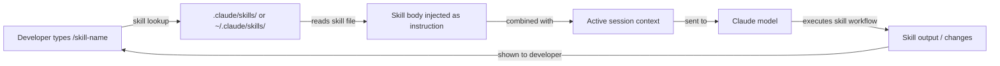

# Skills do Claude Code

## Definição

Skills são arquivos de prompt reutilizáveis e invocáveis que estendem o comportamento do Claude Code além dos seus padrões. Uma skill é um arquivo Markdown com frontmatter YAML que define um comando nomeado: quando um desenvolvedor digita `/nome-da-skill` dentro de uma sessão do Claude Code, o conteúdo da skill é injetado como uma instrução — efetivamente transformando um fluxo de trabalho comum, complexo ou específico da equipe em um único comando slash.

O modelo mental é similar a aliases de shell ou targets do Makefile, mas para fluxos de trabalho assistidos por IA. Em vez de repetir um prompt longo e cuidadosamente elaborado cada vez que você quer que o Claude siga um processo específico (checklist de revisão de código, geração de notas de versão, documentação de arquitetura, auditoria de segurança), você o escreve uma vez como skill, faz commit no repositório e o invoca com um comando curto. As skills são versionadas, compartilháveis e combináveis com instruções do CLAUDE.md.

As skills diferem das instruções do CLAUDE.md de uma forma importante: o CLAUDE.md está sempre ativo e se aplica a cada interação, enquanto as skills são opt-in e invocadas explicitamente. Isso torna as skills adequadas para fluxos de trabalho pesados ou específicos de contexto que não devem ser executados em cada requisição, enquanto o CLAUDE.md é melhor para convenções e restrições leves que devem estar sempre em vigor.

## Como funciona

### Formato do arquivo de skill

Um arquivo de skill é um arquivo `.md` com frontmatter YAML. O frontmatter deve incluir no mínimo um campo `description` que diz ao Claude o que a skill faz. O corpo do arquivo é o prompt que será injetado quando a skill for invocada. O nome do arquivo (sem `.md`) se torna o nome do comando slash: um arquivo chamado `code-review.md` é invocado como `/code-review`. Os nomes de skills podem conter hífens, mas não espaços.

### Diretórios de skills

O Claude Code procura skills em dois locais. **Skills do projeto** ficam em `.claude/skills/` relativo à raiz do projeto e estão disponíveis somente ao trabalhar naquele projeto. **Skills globais** ficam em `~/.claude/skills/` e estão disponíveis em cada sessão do Claude Code. Skills do projeto têm precedência sobre skills globais com o mesmo nome, permitindo que equipes substituam skills pessoais com versões específicas do projeto. Você também pode apontar o Claude Code para um diretório de skills personalizado via configuração.

### Invocação de skills

Dentro de uma sessão do Claude Code, digitar `/nome-da-skill` aciona a skill. O Claude Code encontra o arquivo de skill correspondente, lê seu corpo e injeta o conteúdo como uma instrução do usuário naquele ponto da conversa. A skill pode referenciar contexto que já existe na sessão (arquivos lidos anteriormente, saídas de ferramentas anteriores) e pode emitir suas próprias chamadas de ferramentas (ler arquivos, executar comandos) para coletar informações adicionais antes de produzir saída. As skills podem aceitar argumentos inline após o nome do comando: `/generate-test src/utils/format.ts` passa o caminho do arquivo como contexto.

### Combinando skills com CLAUDE.md

Skills e CLAUDE.md trabalham juntos. O CLAUDE.md estabelece a base do projeto (convenções, padrões proibidos, stack tecnológica), e as skills fornecem fluxos de trabalho invocáveis em cima dessa base. Uma skill `code-review`, por exemplo, pode instruir o Claude a "verificar se todas as mudanças estão em conformidade com as convenções do CLAUDE.md" — ela não precisa repetir essas convenções porque elas já estão no prompt de sistema. Essa separação de responsabilidades mantém cada arquivo focado e evita duplicação.



## Quando usar / Quando NÃO usar

| Use quando | Evite quando |
|---|---|
| Você tem um fluxo de trabalho em múltiplas etapas que repete regularmente (por exemplo, escrever changelogs, executar um checklist de revisão) | A tarefa é verdadeiramente única e não será repetida — apenas digite o prompt diretamente |
| Você quer padronizar um processo complexo em uma equipe (por exemplo, revisão de segurança, formato de resumo de PR) | As instruções pertencem ao CLAUDE.md porque se aplicam a cada sessão, não apenas sob demanda |
| O fluxo de trabalho é dependente de contexto e se beneficia de aceitar argumentos (por exemplo, `/document src/api/users.ts`) | A skill duplicaria documentação que já existe no CLAUDE.md |
| Você quer compartilhar melhores práticas de prompting entre projetos via seu diretório global de skills | O fluxo de trabalho requer integrações de ferramentas externas além do que as ferramentas integradas do Claude suportam |
| Você está construindo uma biblioteca de skills para sua equipe e quer arquivos de prompt versionáveis e revisáveis | Você precisa acionar skills automaticamente — as skills são invocadas manualmente, não orientadas a eventos |

## Exemplos de código

```markdown
<!-- File: .claude/skills/code-review.md -->
---
description: Perform a thorough code review on staged or recently changed files. Checks correctness, security, performance, test coverage, and project conventions.
---

You are conducting a code review. Follow these steps:

1. **Identify changed files**: Run `git diff --name-only HEAD` to list recently changed files.
   If there are staged changes, also run `git diff --cached --name-only`.

2. **Read each changed file** and the corresponding test file if it exists.

3. **Review for the following categories** (report findings under each heading):

   ### Correctness
   - Are there logic errors, off-by-one errors, or unhandled edge cases?
   - Does the code handle null/undefined inputs safely?

   ### Security
   - Is any user input used in SQL queries without parameterization? Flag immediately.
   - Are secrets or credentials hardcoded? Flag immediately.
   - Is authentication/authorization enforced on all new API routes?

   ### Performance
   - Are there N+1 query patterns in database access code?
   - Are expensive operations inside loops that could be moved outside?

   ### Test coverage
   - Do the tests cover the happy path, error paths, and edge cases?
   - Are there any new code paths with zero test coverage?

   ### Conventions
   - Does the code follow the project conventions in CLAUDE.md?
   - Are imports organized correctly? Are there unused imports?

4. **Summarize**: Provide an overall verdict (Approve / Request Changes / Needs Discussion)
   and a prioritized list of action items.
```

```markdown
<!-- File: .claude/skills/generate-changelog.md -->
---
description: Generate a changelog entry for changes since the last git tag. Follows Keep a Changelog format.
---

Generate a changelog entry for inclusion in CHANGELOG.md.

1. Run `git describe --tags --abbrev=0` to find the most recent tag.
2. Run `git log <tag>..HEAD --oneline` to list all commits since that tag.
3. Read the commit messages and group them into these categories:
   - **Added** — new features
   - **Changed** — changes to existing functionality
   - **Deprecated** — features that will be removed in a future release
   - **Removed** — features that were removed
   - **Fixed** — bug fixes
   - **Security** — security-related changes

4. Write the changelog entry in Keep a Changelog format:

   ## [Unreleased] - YYYY-MM-DD

   ### Added
   - ...

   ### Fixed
   - ...

Use concise, user-facing language. Omit chore/refactor/docs commits that don't affect users.
Output only the Markdown text — I will paste it into CHANGELOG.md manually.
```

```bash
# Invoke skills inside a Claude Code session

# Start a session
claude

# Trigger the code review skill (no arguments)
> /code-review

# Trigger the changelog skill
> /generate-changelog

# A skill that accepts an argument — document a specific file
> /document src/services/payment.ts

# List available skills (Claude will search .claude/skills/ and ~/.claude/skills/)
> /help

# Skills can be combined with regular instructions in the same turn
> /code-review and also check that the PR title follows conventional commits format
```

```markdown
<!-- File: ~/.claude/skills/explain-error.md (global skill, available in all projects) -->
---
description: Explain a compiler or runtime error in plain language and suggest fixes. Paste the error message after the command.
---

The user has provided an error message. Analyze it and respond with:

1. **Plain language explanation**: What does this error mean? Why does it occur?
2. **Most likely cause**: Given the error message and any stack trace, what is the most probable root cause?
3. **Suggested fixes**: Provide 2-3 concrete fixes, ranked by likelihood. Show code snippets where relevant.
4. **How to verify**: How can the developer confirm the fix worked?

If the error references a file path, read that file to provide more specific advice.
```

## Recursos práticos

- [Documentação de memória e skills do Claude Code](https://docs.anthropic.com/en/docs/claude-code/memory) — Referência oficial para formato de arquivo de skill, diretórios e invocação.
- [Configurações do Claude Code](https://docs.anthropic.com/en/docs/claude-code/settings) — Opções de configuração incluindo caminhos de diretório de skills personalizados.
- [GitHub do Anthropic Claude Code](https://github.com/anthropics/claude-code) — Código-fonte e exemplos contribuídos pela comunidade.
- [Referência de comandos slash do Claude Code](https://docs.anthropic.com/en/docs/claude-code/cli-reference) — Lista completa de comandos slash integrados ao lado do sistema de skills personalizadas.
- [Repositório de skills](https://github.com/EmersonBraun/skills) — Coleção curada de skills reutilizáveis de IA para Claude Code e outros assistentes de codificação por IA

## Veja também

- [Visão geral do Claude Code](/docs/claude-code)
- [Configuração CLAUDE.md](/docs/claude-code/claude-md)
- [Plugins e integrações MCP](/docs/claude-code/mcp-plugins)
