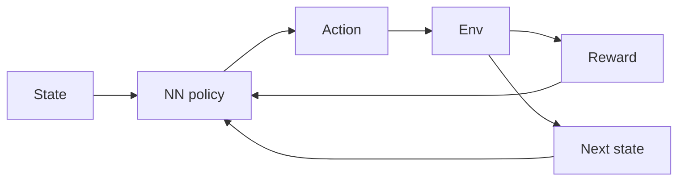

# Aprendizado por reforço profundo (DRL)

## Definição

Deep RL combines reinforcement learning with deep neural networks to handle high-dimensional state and action spaces. Examples: DQN, A3C, PPO, SAC.

[Neural networks](/docs/neural-networks) aproximam a função de valor e/ou a política para que [RL](/docs/rl) possa escalar para pixels brutos, controles de alta dimensão e ações discretas grandes. O treinamento é instável sem técnicas (experience replay, target networks, advantage estimation); modern algorithms (PPO, SAC) are widely used in robotics and [LLM](/docs/llms) alignment (RLHF, DPO).

## Como funciona

O **estado** (por ex. imagem, vetor) é alimentado em uma **política de rede neural** (ou rede de valor) que produz uma **açãon**. O **ambiente** retorna **recompensa** e **próximo estado**; o agente usa isso experience to update the policy (por ex. policy gradient or Q-learning with function approximation). **Experience replay** (store transitions, sample batches) and **target networks** (slow-moving copy of the network) stabilize training. **Advantage estimation** (por ex. GAE) reduces variance in policy gradients. PPO and SAC are common for continuous control; DQN and variants for discrete actions.

## Casos de uso

Deep RL é usado quando o problema de decisão é complexo e se pode aprender por tentativa e erro (simulation or real environment).

- High-dimensional control (por ex. robotics, autonomous driving)
- Game AI and simulation (por ex. DQN, PPO in complex environments)
- LLM alignment via policy optimization (por ex. RLHF, DPO)

## Documentação externa

- [Spinning Up in Deep RL (OpenAI)](https://spinningup.openai.com/)
- [Stable-Baselines3 – DRL algorithms](https://stable-baselines3.readthedocs.io/)

## Veja também

- [RL](/docs/rl)
- [Neural networks](/docs/neural-networks)
