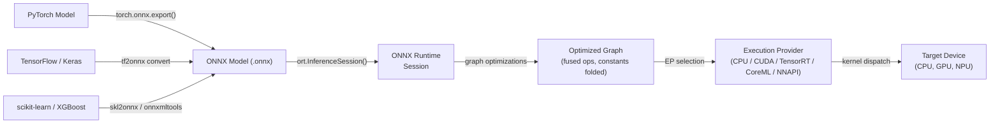

# ONNX Runtime

## Definição

ONNX Runtime (ORT) é uma biblioteca de aceleração de inferência e treinamento de código aberto e multiplataforma desenvolvida pela Microsoft. Seu objetivo principal é executar modelos no formato **Open Neural Network Exchange (ONNX)** — uma representação intermediária agnóstica ao framework para modelos de machine learning — com alto desempenho em uma ampla gama de alvos de hardware e sistemas operacionais. O ORT não está vinculado a nenhum framework de treinamento específico: modelos do PyTorch, TensorFlow, scikit-learn, LightGBM, XGBoost e outros podem ser exportados para ONNX e executados pela mesma API de runtime, tornando-o uma das soluções de inferência mais interoperáveis disponíveis.

Em seu núcleo, o ORT carrega um grafo ONNX, aplica uma extensa série de otimizações no nível do grafo (constant folding, fusão de nós, transformação de layout) e despacha operações para o melhor provedor de execução disponível para o hardware atual. A abstração de **Execution Provider (EP)** permite que o ORT roteie subgrafos para CPUs, GPUs NVIDIA via CUDA ou TensorRT, GPUs AMD via ROCm, hardware Intel via OpenVINO, Apple Silicon via CoreML, Android via NNAPI e Windows via DirectML — tudo por meio de uma superfície de API unificada. Isso torna o ORT adequado para um espectro de deployment que vai de servidores em nuvem a laptops Windows a dispositivos móveis.

O ONNX Runtime é particularmente valioso em ambientes empresariais e de produção onde um único pipeline de deployment deve servir modelos treinados em diferentes frameworks. É o backend de inferência que alimenta endpoints do Azure ML, a biblioteca Optimum do Hugging Face, Windows ML e muitos sistemas de recomendação e ranqueamento em produção. Sua extensão de treinamento (ORT Training) também habilita fine-tuning acelerado de grandes modelos transformer, mas a inferência é seu principal caso de uso.

## Como funciona



### Formato ONNX e Interoperabilidade de Modelos

O ONNX representa um modelo como um grafo de computação acíclico direcionado onde os nós são operadores padronizados (por exemplo, `Conv`, `MatMul`, `LayerNormalization`) definidos na especificação de operadores ONNX, e as arestas carregam tensores tipados. O formato é versionado: cada versão do opset ONNX (atualmente 21) define o conjunto completo de operadores suportados e suas semânticas. Os exportadores de cada framework mapeiam ops específicos do framework para seus equivalentes ONNX; quando um mapeamento direto não existe, extensões `custom_op` podem ser registradas. O arquivo `.onnx` serializado em protobuf inclui a topologia do grafo, nomes de operadores, formas de tensor e valores de pesos constantes, tornando o formato autocontido e portável.

### Otimizações de Grafo

Quando uma `InferenceSession` é criada, o ORT aplica três níveis de otimização de grafo controlados pela configuração `GraphOptimizationLevel`. O Nível 1 (básico) realiza reescritas seguras: constant folding, eliminação de nós redundantes, inferência de forma e remoção de identidades. O Nível 2 (estendido) adiciona fusão de operações: `Conv + BatchNorm`, `Conv + Relu`, `Transpose + MatMul` e padrões similares são fundidos em kernels únicos para eliminar alocações de memória intermediárias e overhead de lançamento de kernels. O Nível 3 (otimização de layout) reestrutura layouts de memória de tensores para corresponder ao que os provedores de execução preferem (por exemplo, NHWC para convoluções em GPU). Grafos otimizados podem ser serializados de volta para `.onnx` para inspeção ou para evitar re-otimização em cargas subsequentes.

### Provedores de Execução

O mecanismo de Execution Provider é a principal alavanca de extensibilidade e desempenho do ORT. Quando uma sessão é criada com um EP específico, o ORT consulta quais nós o EP pode lidar, particiona o grafo e substitui os subgrafos reivindicados por implementações de `ComputeKernel` específicas do EP. O **CPU EP** usa MLAS (Microsoft Linear Algebra Subprograms), uma implementação BLAS vetorizada manualmente com suporte a AVX-512 e NEON. O **CUDA EP** descarrega convoluções e GEMMs para cuDNN e cuBLAS. O **TensorRT EP** aplica fusão de camadas e calibração de precisão do TensorRT para FP16 e INT8, obtendo o maior throughput em GPUs NVIDIA. O **CoreML EP** delega para o Neural Engine da Apple no macOS e iOS. O **DirectML EP** suporta inferência acelerada por hardware em qualquer GPU compatível com DirectX 12 no Windows, incluindo gráficos integrados AMD e Intel.

### Quantização no ONNX Runtime

O ORT suporta inferência INT8 por meio do padrão de nó **QDQ (Quantize-Dequantize)**: o grafo ONNX contém nós explícitos `QuantizeLinear` e `DequantizeLinear` que representam os limites de precisão. A quantização estática requer um conjunto de dados de calibração para calcular escalas de entrada/saída; o pacote Python `onnxruntime.quantization` fornece as funções `quantize_static` e `quantize_dynamic`. O ORT também aceita modelos exportados com QAT onde nós Q/DQ foram inseridos durante o treinamento. A aceleração de hardware INT8 é ativada apenas quando o provedor de execução a suporta (o CUDA EP requer CUDA 11+, o TensorRT EP lida com INT8 nativamente via tabelas de calibração). O `ORTQuantizer` no Hugging Face Optimum fornece uma interface de alto nível para quantizar modelos transformer de ponta a ponta.

### Deployment em Mobile e Edge

ORT Mobile é uma build reduzida do ONNX Runtime para Android e iOS que remove operadores não utilizados e bibliotecas de EP, reduzindo o tamanho do binário para ~1-3 MB comprimidos. O pacote Python `onnxruntime-mobile` prepara modelos para mobile pré-empacotando pesos e removendo metadados de tempo de treinamento. No Android, o NNAPI EP delega para o acelerador de hardware. No iOS e macOS, o CoreML EP usa o Apple Neural Engine. O ORT também é executado no Raspberry Pi (ARM Linux) via CPU EP, e existe suporte experimental para alvos WebAssembly. O pacote npm `ort` habilita o ORT em contextos Node.js e no navegador via WASM.

## Quando usar / Quando NÃO usar

| Use quando | Evite quando |
|---|---|
| Você precisa de inferência agnóstica ao framework — servindo modelos do PyTorch, TF e scikit-learn por meio de um único runtime | Seu alvo de deployment é um microcontrolador com \<256 KB de RAM (TFLM cobre isso melhor) |
| Você está construindo pipelines de ML empresariais no Windows/Azure onde o tooling da Microsoft já está em uso | Você precisa de delegação de hardware Android profunda com tooling maduro hoje (TFLite é mais battle-tested para Android) |
| Você precisa de aceleração NVIDIA TensorRT sem gerenciar diretamente a API TensorRT | Seu modelo usa ops personalizados que não têm equivalente ONNX e são impraticáveis de registrar |
| Você quer inferência em navegador/WASM para o mesmo modelo que é executado no servidor | Sua equipe é nativa do PyTorch e quer o loop mais rígido possível do treinamento ao mobile (PyTorch Mobile / ExecuTorch pode ser mais simples) |
| A portabilidade multiplataforma é uma preocupação de primeira classe (mesmo modelo no Windows, Linux, macOS, Android, iOS) | Você precisa de treinamento em tempo real ou aprendizado online na borda (ORT Training existe, mas adiciona complexidade significativa) |

## Comparações

Comparação do ONNX Runtime com TFLite e PyTorch Mobile para deployment em edge e multiplataforma.

| Critério | ONNX Runtime | TensorFlow Lite | PyTorch Mobile |
|---|---|---|---|
| Suporte de plataforma | Windows, Linux, macOS, Android, iOS, WASM, nuvem — cobertura mais ampla | Android, iOS, Linux embarcado, microcontroladores (TFLM) | Android, iOS; ExecuTorch adiciona embarcado e bare-metal |
| Conversão de modelo | Qualquer framework → exportação ONNX (caminho mais interoperável, múltiplos conversores) | TF/Keras → TFLite Converter (maduro, apenas ecossistema TF) | PyTorch → TorchScript ou ExecuTorch (nativo do PyTorch, menor fricção para usuários PT) |
| Desempenho no dispositivo | CPU EP com MLAS é competitivo; EPs TensorRT/CUDA lideram para GPU; EPs CoreML/NNAPI para mobile | Excelente no Android via NNAPI/delegado GPU; melhor da categoria para microcontroladores | XNNPACK em CPUs ARM; GPU Vulkan; delegação NPU ExecuTorch |
| Ecossistema | Agnóstico ao framework; Hugging Face Optimum; Windows ML; Azure ML; forte adoção empresarial | Maduro: MediaPipe, TF Hub, Model Garden; maior comunidade de ML mobile | Forte em pesquisa; Hugging Face; comunidade ExecuTorch crescente |
| Suporte à quantização | INT8 via nós QDQ; PTQ dinâmico e estático; QAT; INT8 de hardware via EP | Abrangente: faixa dinâmica, INT8, FP16, QAT com caminhos INT8 completos | PTQ (INT8 dinâmico + estático) e QAT via torch.ao.quantization |

## Prós e contras

| Prós | Contras |
|------|------|
| Agnóstico ao framework: qualquer modelo exportável para ONNX funciona com o mesmo runtime | A exportação ONNX pode falhar para modelos com ops não suportados ou personalizados |
| Maior cobertura de provedores de execução: CPU, CUDA, TensorRT, DirectML, CoreML, NNAPI, OpenVINO | Depurar grafos ONNX é mais difícil do que depuração nativa no framework |
| Forte integração com Windows e Azure; cidadão de primeira classe na pilha de ML da Microsoft | Mais complexidade operacional do que TFLite para cenários exclusivos de Android/iOS |
| Hugging Face Optimum fornece quantização e otimização de alto nível para transformers | O versionamento de opset ONNX pode criar fricção de compatibilidade entre exportadores e versões do ORT |
| Desempenho competitivo de CPU via MLAS com vetorização AVX-512 e NEON | O tamanho do binário mobile é maior que o TFLite quando todos os EPs estão incluídos |

## Exemplos de código

```python
import numpy as np
import torch
import torch.nn as nn
import onnxruntime as ort

# ── 1. Define a simple model in PyTorch ───────────────────────────────────────
class SimpleClassifier(nn.Module):
    """Minimal classifier for demonstration."""

    def __init__(self, input_dim: int = 784, num_classes: int = 10):
        super().__init__()
        self.net = nn.Sequential(
            nn.Linear(input_dim, 128),
            nn.ReLU(),
            nn.Linear(128, 64),
            nn.ReLU(),
            nn.Linear(64, num_classes),
        )

    def forward(self, x: torch.Tensor) -> torch.Tensor:
        return self.net(x)


model = SimpleClassifier()
# Switch to inference mode: disables dropout, BatchNorm uses running statistics
model.train(False)

# ── 2. Export PyTorch model to ONNX ──────────────────────────────────────────
dummy_input = torch.randn(1, 784)  # batch=1, flattened 28x28 image

torch.onnx.export(
    model,
    dummy_input,
    "model.onnx",
    opset_version=17,                         # target ONNX opset
    input_names=["input"],
    output_names=["logits"],
    dynamic_axes={
        "input":  {0: "batch_size"},          # allow variable batch size
        "logits": {0: "batch_size"},
    },
    do_constant_folding=True,                 # fold constant sub-expressions during export
)
print("Exported model.onnx")

# ── 3. Apply INT8 post-training dynamic quantization ─────────────────────────
from onnxruntime.quantization import quantize_dynamic, QuantType

quantize_dynamic(
    "model.onnx",
    "model_int8.onnx",
    weight_type=QuantType.QInt8,              # quantize weights to INT8
)
print("Quantized model saved as model_int8.onnx")

# ── 4. Run inference with ONNX Runtime ───────────────────────────────────────
# SessionOptions allow controlling graph optimization level and thread counts
sess_options = ort.SessionOptions()
sess_options.graph_optimization_level = ort.GraphOptimizationLevel.ORT_ENABLE_ALL

# Providers list is checked in order; falls back to CPU if GPU is unavailable
providers = ["CUDAExecutionProvider", "CPUExecutionProvider"]
session = ort.InferenceSession("model_int8.onnx", sess_options, providers=providers)

print(f"Active execution provider: {session.get_providers()[0]}")

# Prepare a batch of random inputs as float32 numpy arrays
batch = np.random.randn(4, 784).astype(np.float32)
input_name = session.get_inputs()[0].name
output_name = session.get_outputs()[0].name

outputs = session.run([output_name], {input_name: batch})
logits = outputs[0]                          # shape (4, 10)
predicted_classes = np.argmax(logits, axis=1)
print(f"Batch predictions: {predicted_classes}")
```

## Recursos práticos

- [Documentação do ONNX Runtime](https://onnxruntime.ai/docs/) — referência oficial cobrindo instalação, provedores de execução, otimização de grafo, quantização e deployment mobile para todas as plataformas suportadas.
- [Referência da API Python do ONNX Runtime](https://onnxruntime.ai/docs/api/python/api_summary.html) — documentação detalhada da API para `InferenceSession`, `SessionOptions`, provedores de execução e o subpacote de quantização.
- [Hugging Face Optimum](https://huggingface.co/docs/optimum/onnxruntime/overview) — biblioteca de alto nível que envolve o ORT para otimização de modelos transformer, fornecendo classes `ORTModelForXxx` e `ORTQuantizer` para exportação e quantização INT8 em uma etapa.
- [ONNX Model Zoo](https://github.com/onnx/models) — repositório curado de modelos ONNX pré-treinados cobrindo visão computacional, NLP, fala e ML clássico; útil para benchmark de desempenho do ORT e como templates de deployment.
- [Guia de deployment mobile do ONNX Runtime](https://onnxruntime.ai/docs/tutorials/mobile/) — tutorial passo a passo para construir um aplicativo Android ou iOS mínimo com ORT, incluindo preparação de modelo e configuração do EP NNAPI/CoreML.

## Veja também

- [TensorFlow Lite](/docs/edge-ai/tflite)
- [PyTorch Mobile](/docs/edge-ai/pytorch-mobile)
- [PyTorch](/docs/frameworks/pytorch)
- [TensorFlow](/docs/frameworks/tensorflow)
