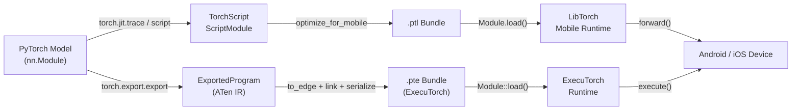

# PyTorch Mobile

## Definição

PyTorch Mobile é a família de ferramentas e runtimes que leva modelos treinados em PyTorch para dispositivos Android e iOS sem necessitar de um servidor ou conexão com a nuvem. Ele preserva a experiência de desenvolvimento do PyTorch — pesquisadores e engenheiros treinam na familiar API Python em modo eager, depois exportam seus modelos pelo caminho **TorchScript** ou pelo mais recente **ExecuTorch** para deployment no dispositivo. Essa forte ligação entre os ambientes de treinamento e deployment reduz a superfície de bugs de discrepância numérica que frequentemente surgem ao trocar de frameworks.

O caminho histórico de deployment é centrado no TorchScript, um subconjunto de Python com tipagem estática que pode ser compilado e serializado para um formato independente de plataforma (`.ptl` para mobile). O TorchScript suporta dois modos de compilação: **tracing**, onde um input de exemplo é passado pelo modelo e o caminho executado é registrado, e **scripting**, onde o fluxo de controle Python é analisado estaticamente. Ambos produzem um `ScriptModule` que pode ser carregado pelo runtime C++ LibTorch incorporado no SDK mobile.

O Google e a Meta desenvolveram conjuntamente o **ExecuTorch** como o framework de próxima geração para executar modelos PyTorch na borda. O ExecuTorch introduz um formato de execução portável (`.pte`), um runtime C++ mínimo (menos de 50 KB para modelos simples) e suporte de primeira classe para delegação a backends de hardware incluindo Qualcomm AI Engine, Apple Neural Engine, NPUs Arm Ethos e DSPs Cadence. O ExecuTorch é projetado para uso em produção e substitui o runtime original do PyTorch Mobile para novos projetos que exigem ampla portabilidade de hardware e tamanho mínimo do binário.

## Como funciona



### Tracing e Scripting com TorchScript

O tracing (`torch.jit.trace`) executa um input de exemplo pelo modelo e registra a sequência de operações de tensor, produzindo um grafo de computação estático. O tracing é simples e cobre a maioria das arquiteturas padrão, mas captura apenas o caminho de execução para o input fornecido — o fluxo de controle dependente de dados (instruções if, loops que variam com valores de input) será silenciosamente embutido. O scripting (`torch.jit.script`) analisa o código-fonte Python com um verificador de tipos TorchScript e preserva o fluxo de controle, tornando-o correto para modelos com lógica de ramificação. Na prática, abordagens híbridas são comuns: fazer script do módulo de nível superior enquanto se faz tracing de submódulos internos que não têm fluxo de controle dinâmico.

### Pipeline de Exportação ExecuTorch

O ExecuTorch usa `torch.export.export` para capturar uma representação estrita e sem efeitos colaterais do modelo em ATen IR — um conjunto canônico de operadores PyTorch com semânticas bem definidas garantidas. O programa exportado é então reduzido para o **Edge IR** via `to_edge`, que realiza passes de grafo específicos do backend (decomposição de operadores, propagação de layout). Os backends (alvos de delegação) podem reivindicar subgrafos durante o passo `to_backend`, substituindo-os por implementações específicas de hardware. O artefato final é serializado para um flatbuffer `.pte` que é carregado pelo runtime C++ do ExecuTorch, que não requer alocação dinâmica de memória durante a inferência.

### Otimização: Quantização e Pruning

O PyTorch oferece quantização pós-treinamento estática e dinâmica por meio do namespace `torch.quantization` (legado) e do mais novo `torch.ao.quantization`. A quantização INT8 estática requer um conjunto de dados de calibração representativo e reduz o tamanho do modelo em ~4x com melhoria de latência de 2-3x em CPUs ARM. O treinamento com consciência de quantização (QAT) insere nós `FakeQuantize` no grafo de forward durante o fine-tuning, permitindo que o modelo adapte seus pesos para precisão INT8. O pruning (`torch.nn.utils.prune`) remove pesos individuais ou canais inteiros com base em critérios de magnitude ou estruturados, reduzindo a carga de computação efetiva antes da quantização. Ambas as técnicas podem ser combinadas: fazer pruning primeiro para reduzir canais, depois quantizar para reduzir precisão.

### Runtime Mobile e Integração de Plataforma

O bundle `.ptl` produzido por `optimize_for_mobile` inclui otimizações de fusão de operadores e remove operadores não utilizados do registro de operadores, reduzindo a pegada do binário. O SDK Android (`pytorch_android`) é publicado no Maven Central e expõe uma API Kotlin/Java. O SDK iOS é distribuído como CocoaPod ou Swift Package e fornece bindings Objective-C e Swift. Ambos os SDKs envolvem o mesmo núcleo C++ LibTorch. O ExecuTorch visa as mesmas plataformas, mas expõe uma API C mais enxuta e também suporta alvos embarcados bare-metal. A classe `torch::executor::Module` fornece uma API mínima `execute()` que opera diretamente em tensores `EValue` pré-alocados, evitando overhead estilo JNI.

### Aceleração GPU e NPU

O delegado GPU do PyTorch Mobile para Android funciona pelo backend Vulkan (`torch.backends.vulkan`), que descarrega convoluções e multiplicações de matrizes para a GPU. O backend XNNPACK do ExecuTorch acelera operações de ponto flutuante e INT8 em CPUs ARM via instruções SIMD NEON e é o padrão recomendado para aceleração de CPU. O backend Qualcomm AI Engine Direct e o backend Apple Core ML fornecem aceleração em nível de NPU por meio da API de delegação do ExecuTorch, tipicamente obtendo speedups de 5-15x em relação aos caminhos de referência de CPU para modelos padrão de visão e NLP.

## Quando usar / Quando NÃO usar

| Use quando | Evite quando |
|---|---|
| Sua base de código de treinamento é PyTorch e você quer fricção mínima de conversão | Seus modelos se originam no TensorFlow/Keras e o overhead de conversão é uma preocupação |
| Você precisa fazer deployment no Android ou iOS com um fluxo de trabalho familiar para Python | Você precisa de alvos de microcontrolador com menos de 256 KB de RAM (TFLM é mais adequado) |
| Você quer ExecuTorch para delegação de NPU de hardware de próxima geração (Qualcomm, Apple ANE) | Seu modelo usa fluxo de controle dinâmico de nível Python que o TorchScript não pode capturar via tracing |
| Iteração rápida: reutilize a mesma classe de modelo para treinamento e inferência mobile | Você precisa de tooling de produção maduro com ampla cobertura de delegados de hardware hoje (TFLite é mais maduro) |
| Você está construindo em cima do ecossistema Hugging Face (muitos modelos exportam via TorchScript) | O tamanho do binário é extremamente limitado e a pegada do runtime LibTorch (~3-8 MB comprimidos) é muito grande |

## Comparações

Comparação do PyTorch Mobile com TFLite e ONNX Runtime para cenários de deployment em borda.

| Critério | PyTorch Mobile | TensorFlow Lite | ONNX Runtime |
|---|---|---|---|
| Suporte de plataforma | Android, iOS; ExecuTorch se estende para embarcado e bare-metal | Android, iOS, Linux embarcado, microcontroladores (TFLM) | Windows, Linux, macOS, Android, iOS, WebAssembly |
| Conversão de modelo | torch.jit.trace / script (nativo do PyTorch) ou torch.export (ExecuTorch) | TFLite Converter do TF/Keras SavedModel | Qualquer framework → exportação ONNX (caminho mais interoperável) |
| Desempenho no dispositivo | XNNPACK em CPUs ARM; GPU Vulkan; delegação NPU ExecuTorch | Excelente no Android via NNAPI/delegado GPU; melhor da categoria para microcontroladores | EP CPU competitivo; EPs CUDA/TensorRT brilham em dispositivos de borda com GPU |
| Ecossistema | Forte em pesquisa; integração Hugging Face; comunidade ExecuTorch crescente | Maduro: MediaPipe, TF Hub, Model Garden; maior comunidade de ML mobile | Amplo suporte empresarial; agnóstico ao framework; forte integração Microsoft/Azure |
| Suporte à quantização | PTQ (INT8 dinâmico + estático) e QAT via torch.ao.quantization; quantização específica de backend ExecuTorch | Abrangente: faixa dinâmica, INT8, FP16, QAT com caminhos INT8 completos | INT8 via nós QDQ; INT8 de hardware depende do provedor de execução |

## Prós e contras

| Prós | Contras |
|------|------|
| Fluxo de trabalho contínuo para usuários PyTorch — a mesma classe de modelo treina e faz deployment | O binário mobile LibTorch adiciona ~3-8 MB ao tamanho do app comprimido |
| ExecuTorch fornece uma arquitetura moderna e extensível para delegação NPU | O tracing TorchScript silenciosamente perde fluxo de controle dependente de dados |
| Forte integração com o ecossistema Hugging Face | Menos maduro que TFLite para deployments de produção em Android/iOS |
| QAT está bem integrado com o loop de treinamento padrão | A cobertura do delegado GPU Vulkan é mais estreita que a do delegado GPU do TFLite |
| Desenvolvimento ativo com forte suporte da Meta e da comunidade | A interoperabilidade ONNX requer uma etapa extra de conversão pelo exportador ONNX |

## Exemplos de código

```python
import torch
import torch.nn as nn

# ── 1. Define a simple convolutional model ────────────────────────────────────
class SmallCNN(nn.Module):
    """Minimal CNN for demonstration. Replace with your real model."""

    def __init__(self, num_classes: int = 10):
        super().__init__()
        self.features = nn.Sequential(
            nn.Conv2d(1, 16, kernel_size=3, padding=1),
            nn.ReLU(inplace=True),
            nn.MaxPool2d(2),
            nn.Conv2d(16, 32, kernel_size=3, padding=1),
            nn.ReLU(inplace=True),
            nn.AdaptiveAvgPool2d(1),
        )
        self.classifier = nn.Linear(32, num_classes)

    def forward(self, x: torch.Tensor) -> torch.Tensor:
        x = self.features(x)
        x = x.flatten(1)
        return self.classifier(x)


model = SmallCNN(num_classes=10)
model.eval()  # set model to inference mode

# ── 2. Export with TorchScript tracing ───────────────────────────────────────
example_input = torch.rand(1, 1, 28, 28)
scripted_model = torch.jit.trace(model, example_input)

from torch.utils.mobile_optimizer import optimize_for_mobile

optimized_model = optimize_for_mobile(scripted_model)
optimized_model._save_for_lite_interpreter("model.ptl")
print("Saved model.ptl")

# ── 3. Apply post-training dynamic quantization ───────────────────────────────
quantized_model = torch.quantization.quantize_dynamic(
    model,
    qconfig_spec={nn.Linear, nn.Conv2d},
    dtype=torch.qint8,
)
quantized_model.eval()

with torch.no_grad():
    output = quantized_model(example_input)
print(f"Output shape: {output.shape}, predicted class: {output.argmax(dim=1).item()}")

# ── 4. Load .ptl on Python ────────────────────────────────────────────────────
loaded = torch.jit.load("model.ptl")
loaded.eval()
with torch.no_grad():
    result = loaded(example_input)
print(f"Loaded mobile model predicted class: {result.argmax(dim=1).item()}")
```

## Recursos práticos

- [Documentação do PyTorch Mobile](https://pytorch.org/mobile/home/) — guia oficial cobrindo exportação TorchScript, SDKs Android e iOS, otimização de modelos e profiling de desempenho no dispositivo.
- [Documentação do ExecuTorch](https://pytorch.org/executorch/) — documentação do runtime de borda de próxima geração, cobrindo o pipeline de exportação, delegação de backend e guias de integração de hardware para alvos Qualcomm, Apple e ARM.
- [Guia torch.ao.quantization](https://pytorch.org/docs/stable/quantization.html) — referência abrangente para a API de quantização do PyTorch, cobrindo PTQ, QAT e o novo namespace `torch.ao` usado em fluxos de trabalho ExecuTorch.
- [Apps de demonstração Android PyTorch](https://github.com/pytorch/android-demo-app) — apps Android de código aberto demonstrando classificação de imagens, detecção de objetos, reconhecimento de fala e NLP com PyTorch Mobile.
- [Tutoriais ExecuTorch](https://pytorch.org/executorch/stable/tutorials/export-to-executorch-tutorial.html) — tutoriais passo a passo para exportar modelos pelo pipeline ExecuTorch e executá-los com o runtime C++.

## Veja também

- [TensorFlow Lite](/docs/edge-ai/tflite)
- [ONNX Runtime](/docs/edge-ai/onnx)
- [PyTorch](/docs/frameworks/pytorch)
- [Quantização](/docs/quantization)
