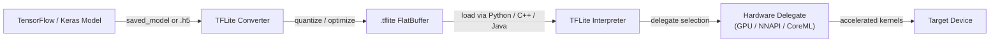

# TensorFlow Lite

## Definição

TensorFlow Lite (TFLite) é o framework de código aberto do Google para executar modelos de machine learning em dispositivos com recursos limitados — telefones celulares, tablets, sistemas embarcados e microcontroladores. Em vez de um framework de treinamento, o TFLite é um **runtime de inferência** de propósito específico: os modelos são treinados com o TensorFlow completo, convertidos para o formato compacto `.tflite` e então executados no dispositivo sem necessitar de conexão com um servidor. Esse design permite que aplicações realizem tarefas de ML — classificação de imagens, detecção de objetos, reconhecimento de fala, compreensão de linguagem natural — completamente offline e com baixa latência.

O núcleo do TFLite é um formato de modelo em flat-buffer que minimiza o overhead de alocação de memória e evita a necessidade de um interpretador de grafo de runtime complexo. O formato remove construções de tempo de treinamento (gradientes, estado do otimizador) e retém apenas as operações necessárias para inferência do forward pass. Isso resulta em arquivos de modelo que são frequentemente uma ordem de magnitude menores que seus equivalentes TensorFlow completos, tornando a distribuição via app stores prática mesmo para usuários em conexões medidas.

O TFLite visa uma faixa de hardware incomumente ampla. No topo, é executado em dispositivos Android e iOS e aproveita aceleradores de hardware por meio de sua API de **delegados**. Na base, a variante TensorFlow Lite for Microcontrollers (TFLM) remove a alocação dinâmica de memória completamente e pode caber em dezenas de kilobytes de flash, habilitando deployment em chips Cortex-M bare-metal e alvos similares ultra-restritos.

## Como funciona



### Conversão de Modelos

O TFLite Converter (`tf.lite.TFLiteConverter`) aceita diretórios SavedModel, arquivos Keras `.h5` ou funções TensorFlow concretas e emite um flatbuffer `.tflite`. Durante a conversão, o grafo é congelado (variáveis se tornam constantes), operações não utilizadas são podadas e a fusão de operadores (por exemplo, Conv + ReLU → ConvReLU fundido) reduz o overhead de despacho de kernels. O conversor suporta um conjunto crescente de ops TensorFlow pelo mecanismo **select TF ops**, recorrendo a um conjunto restrito de ops integrados do TFLite que são garantidos para ser executados em qualquer alvo. A quantização pós-treinamento pode ser aplicada nesta etapa, reduzindo o modelo e desbloqueando caminhos de inferência apenas com inteiros.

### Quantização

O TFLite suporta quatro modos de quantização: quantização de faixa dinâmica (apenas pesos, ativações quantizadas em tempo de execução), quantização de inteiro completo (pesos e ativações, requer um conjunto de dados representativo para calibração), quantização float16 (bom para delegados GPU) e treinamento com consciência de quantização (QAT, onde nós de fake-quantization são inseridos durante o treinamento para que o modelo aprenda a ser robusto à redução de precisão). A quantização INT8 completa normalmente reduz o tamanho do modelo em 4x e a latência em 2-3x em CPUs com suporte SIMD. A quantização é particularmente impactante em chipsets mobile que não têm caminhos de execução FP32 rápidos.

### Interpretador e Kernels de Ops

O Interpretador TFLite carrega um arquivo `.tflite`, aloca memória de tensor (toda em uma única arena para evitar fragmentação) e executa operações em ordem topológica. Cada operação é implementada por um kernel registrado no resolvedor de ops; o MutableOpResolver permite que aplicações incluam apenas os ops de que precisam, reduzindo significativamente o tamanho do binário. O interpretador expõe uma API C++ mínima (`AllocateTensors`, `Invoke`, `typed_input_tensor`, `typed_output_tensor`) e wrappers de nível mais alto existem para Java/Kotlin (Android), Swift/ObjC (iOS) e Python. O interpretador Python é usado principalmente para validação e benchmark antes de implantar binários nativos.

### Delegados

Os delegados são a interface de plugin de aceleração de hardware do TFLite. Quando um delegado é aplicado ao interpretador, ele inspeciona o grafo do modelo e reivindica os subgrafos que pode acelerar, substituindo os kernels de CPU de referência do TFLite por implementações otimizadas. O **delegado GPU** descarrega convoluções e multiplicações de matrizes para OpenGL ES ou Metal, obtendo speedups de 2-7x em modelos de visão típicos. O **delegado NNAPI** roteia operações pela Neural Networks API do Android para qualquer acelerador fornecido pelo vendedor (DSP, NPU). O **delegado CoreML** usa o CoreML da Apple no iOS. O **delegado Hexagon** visa DSPs Qualcomm diretamente. Os delegados degradam graciosamente: ops não suportados recorrem automaticamente à CPU.

### TFLite para Microcontroladores

O fork TFLM remove o alocador C++ padrão, I/O de arquivo e dispatch dinâmico. Os modelos são compilados no firmware como arrays de bytes C e a inferência é executada a partir da SRAM com um buffer de scratch de tamanho fixo. Os alvos suportados incluem STM32, Arduino Nano 33 BLE Sense, SparkFun Edge e Sony Spresense. O TFLM suporta um subconjunto de operações suficiente para detecção de palavras-chave, reconhecimento de gestos e tarefas de visão simples em orçamentos de energia sub-miliWatt.

## Quando usar / Quando NÃO usar

| Use quando | Evite quando |
|---|---|
| Fazendo deployment no Android ou iOS sem dependência de nuvem | Seu modelo usa ops ainda não suportados pelo conjunto de ops TFLite |
| Você precisa de latência sub-100ms para inferência em tempo real no mobile | Você requer formas dinâmicas ou fluxo de controle não expressável em grafos TFLite estáticos |
| Executando em placas Linux embarcadas (Raspberry Pi, Coral Edge TPU) | Sua equipe trabalha principalmente em PyTorch e a fricção de conversão de modelo é um bloqueador |
| O tamanho do binário importa e você quer um runtime de inferência mínimo | Você precisa de recursos avançados de serving: batching, versionamento de modelos, roteamento A/B |
| Você quer ampla aceleração de hardware pela API de delegados | Sua arquitetura de modelo muda frequentemente durante a experimentação |

## Comparações

Comparação do TFLite com PyTorch Mobile e ONNX Runtime para cenários de deployment em borda.

| Critério | TensorFlow Lite | PyTorch Mobile | ONNX Runtime |
|---|---|---|---|
| Suporte de plataforma | Android, iOS, Linux embarcado, microcontroladores | Android, iOS (embarcado limitado) | Windows, Linux, macOS, Android, iOS, WebAssembly |
| Conversão de modelo | TF/Keras → TFLite Converter (maduro, bem documentado) | PyTorch → TorchScript ou ExecuTorch (pythônico, menor fricção para usuários PyTorch) | Qualquer framework → exportação ONNX → ORT (mais interoperável) |
| Desempenho no dispositivo | Excelente no Android via NNAPI/delegado GPU; melhor da categoria para microcontroladores | Bom no mobile; ExecuTorch traz desempenho e portabilidade melhorados | Competitivo com EP CPU; EPs CUDA/TensorRT se destacam em cenários de GPU em nuvem/borda |
| Ecossistema | Grande: modelos TensorFlow Hub, Model Garden, integração MediaPipe | Crescente: forte em pesquisa, modelos torchvision, integração Hugging Face | Amplo: qualquer framework compatível com ONNX; forte em empresas e pilha Microsoft |
| Suporte à quantização | Abrangente: faixa dinâmica, INT8, FP16, QAT | PTQ e QAT via torch.quantization; ExecuTorch adiciona mais backends | Suporta INT8 via nós QDQ; depende do provedor de execução para INT8 de hardware |

## Prós e contras

| Prós | Contras |
|------|------|
| Ecossistema maduro com extensivo tooling mobile e documentação | Requer etapa de conversão; nem todos os ops TensorFlow são suportados |
| Excelente suporte a microcontroladores via TFLM | Depurar modelos convertidos é mais difícil do que no TensorFlow em modo eager |
| A API de delegados de hardware cobre os principais aceleradores mobile | A interoperabilidade ONNX requer conversão intermediária |
| O formato flat-buffer carrega instantaneamente sem overhead de análise | Menos flexível que o TF completo para arquiteturas de modelos dinâmicos |
| Forte comunidade, suporte do Google e integração MediaPipe | Usuários PyTorch enfrentam mais fricção do que fluxos de trabalho nativos TFLite-TF |

## Exemplos de código

```python
import numpy as np
import tensorflow as tf

# ── 1. Build and train a simple Keras model ──────────────────────────────────
model = tf.keras.Sequential([
    tf.keras.layers.InputLayer(input_shape=(28, 28, 1)),
    tf.keras.layers.Conv2D(8, (3, 3), activation="relu"),
    tf.keras.layers.MaxPooling2D(),
    tf.keras.layers.Flatten(),
    tf.keras.layers.Dense(10, activation="softmax"),
])
model.compile(optimizer="adam", loss="sparse_categorical_crossentropy", metrics=["accuracy"])

# Dummy training data — replace with real dataset (e.g. MNIST)
x_train = np.random.rand(128, 28, 28, 1).astype(np.float32)
y_train = np.random.randint(0, 10, 128).astype(np.int32)
model.fit(x_train, y_train, epochs=1, verbose=0)

# ── 2. Convert to TFLite with full INT8 quantization ─────────────────────────
def representative_dataset():
    """Yields small batches from training data for calibration."""
    for i in range(0, len(x_train), 8):
        yield [x_train[i : i + 8]]

converter = tf.lite.TFLiteConverter.from_keras_model(model)
converter.optimizations = [tf.lite.Optimize.DEFAULT]
converter.representative_dataset = representative_dataset
converter.target_spec.supported_ops = [tf.lite.OpsSet.TFLITE_BUILTINS_INT8]
converter.inference_input_type = tf.int8
converter.inference_output_type = tf.int8

tflite_model = converter.convert()

# Persist the .tflite file
with open("model.tflite", "wb") as f:
    f.write(tflite_model)
print(f"Model size: {len(tflite_model) / 1024:.1f} KB")

# ── 3. Run inference with the TFLite Interpreter ─────────────────────────────
interpreter = tf.lite.Interpreter(model_content=tflite_model)
interpreter.allocate_tensors()

input_details = interpreter.get_input_details()
output_details = interpreter.get_output_details()

# Quantize a float32 input to INT8 using the input tensor's scale and zero-point
scale, zero_point = input_details[0]["quantization"]
sample = x_train[:1]  # shape (1, 28, 28, 1)
sample_int8 = (sample / scale + zero_point).astype(np.int8)

interpreter.set_tensor(input_details[0]["index"], sample_int8)
interpreter.invoke()

output = interpreter.get_tensor(output_details[0]["index"])
# Dequantize output
out_scale, out_zero = output_details[0]["quantization"]
probabilities = (output.astype(np.float32) - out_zero) * out_scale
predicted_class = np.argmax(probabilities)
print(f"Predicted class: {predicted_class}")
```

## Recursos práticos

- [Guia oficial TensorFlow Lite](https://www.tensorflow.org/lite/guide) — documentação abrangente cobrindo conversão de modelos, otimização, delegados e guias de deployment específicos de plataforma para Android, iOS e Linux embarcado.
- [TFLite Model Maker](https://www.tensorflow.org/lite/models/modify/model_maker) — API de alto nível para transfer learning que produz diretamente modelos `.tflite`, útil para prototipagem rápida com conjuntos de dados personalizados.
- [TFLite para Microcontroladores](https://www.tensorflow.org/lite/microcontrollers) — o guia TFLM explicando como fazer deployment em placas Cortex-M sem dependência de SO; inclui exemplos de detecção de palavras-chave e reconhecimento de gestos.
- [MediaPipe Solutions](https://developers.google.com/mediapipe/solutions) — pipelines prontos para produção do Google (detecção de rosto, rastreamento de mãos, estimativa de pose) construídos sobre TFLite; útil como referência para integrar TFLite em aplicações reais.
- [Benchmarks de desempenho TFLite](https://www.tensorflow.org/lite/performance/benchmarks) — benchmarks oficiais de latência e precisão em chipsets mobile para modelos de visão comuns, úteis para decisões de seleção de hardware.

## Veja também

- [PyTorch Mobile](/docs/edge-ai/pytorch-mobile)
- [ONNX Runtime](/docs/edge-ai/onnx)
- [Infraestrutura](/docs/infrastructure)
- [Compressão de modelos](/docs/model-compression)
