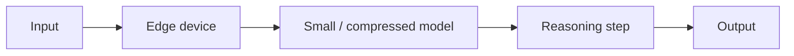

# Raciocínio na edge

## Definição

Edge raciocínio executa **raciocínio ou inferência leves** em dispositivos de borda—phones, IoT gateways, cameras, vehicles—em vez da nuvem. O objetivo é **low latency**, **offline capability**, **privacy** (data stays on device), and **reduced bandwidth** by doing as much work locally as possible.

Combina modelos pequenos ou destilados [LLMs](/docs/llms), [model compression](/docs/model-compression) ([quantization](/docs/quantization), [pruning](/docs/pruning)), and hardware-friendly runtimes (TFLite, ONNX Runtime, Core ML). Techniques like **speculative decoding**, **early exit**, and **mixture-of-experts** (with small experts) can reduce compute per token so [raciocínio patterns](/docs/reasoning-patterns) (por ex. [chain-of-thought](/docs/reasoning-patterns/cot)) remain viable at the edge.

## Como funciona

**Dispositivo de borda** (celular, gateway, sistema embarcado) contém um **modelo pequeno ou comprimido** (por ex. [transformer](/docs/transformers) destilado, quantizd [LLM](/docs/llms)). **Input** (sensor data, text, or a prompt) is fed to the model; **raciocínio** may be a short [chain-of-thought](/docs/reasoning-patterns/cot) or a single forward pass. **Early exit** skips later layers when the model is confident; **speculative decoding** uses a small draft model locally and optionally verifies with a larger model when online. Output is returned without a round-trip to the cloud (or with optional cloud fallback).

## Casos de uso

Edge raciocínio applies when you need low-latency or offline raciocínio on devices with limited compute and memory.

- Smart assistants and wearables that answer or act without a constant cloud connection
- Vehicles and robotics where latency and offline operation are critical
- Privacy-first apps (health, home) that keep sensitive data on-device
- Cost and bandwidth reduction by moving simple raciocínio from cloud to edge

## Vantagens e desvantagens

| Pros | Cons |
|------|------|
| Low latency, no round-trip to cloud | Smaller models; less capable than large cloud LLMs |
| Works offline and in poor connectivity | Hardware constraints (memory, power, thermal) |
| Data stays on device for privacy | Trade-off between model size and raciocínio quality |
| Lower bandwidth and cloud cost | Requires [quantization](/docs/quantization) and [compression](/docs/model-compression) |

## Documentação externa

- [TensorFlow Lite – On-device inference](https://www.tensorflow.org/lite/guide)
- [ONNX Runtime – Mobile and edge](https://onnxruntime.ai/docs/tutorials/mobile/)
- [Apple – Core ML and MLX](https://developer.apple.com/machine-learning/) — On-device ML on Apple Silicon
- [Google – Edge ML](https://developers.google.com/ml-kit) — ML Kit for mobile and edge

## Veja também

- [Local inference](/docs/local-inference)
- [Model compression](/docs/model-compression)
- [Quantization](/docs/quantization)
- [Reasoning patterns](/docs/reasoning-patterns)
