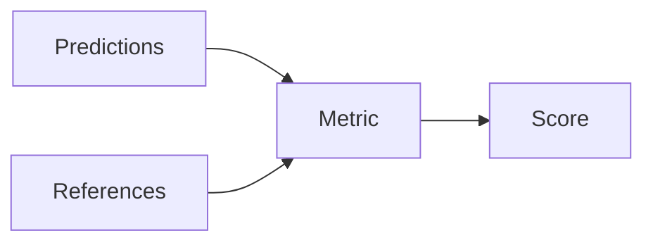

# Métricas de avaliação

## Definição

As métricas de avaliação quantificam o quão bem os modelos funcionam: accuracy, F1, BLEU, ROUGE, perplexity, human preference, etc. Choice depends on task (classification, generation, recuperação) and goals (fairness, robustness).

Eles são used in [benchmarks](/docs/benchmarks), development, and production (A/B tests, monitoring). No single metric captures everything; combine automated metrics with human evaluation for [LLMs](/docs/llms) and subjective tasks. See [bias in AI](/docs/bias-in-ai) for fairness-related metrics.

## Como funciona

**Predições** (saídas do modelo) e **referências** (verdade de base ou respostas humanas) são alimentadas em uma **métrica** que calculaes a **score**. Classification: accuracy, F1, AUC. Generation: BLEU, ROUGE, BERTScore, or learned metrics. Retrieval: recall@k, MRR. For LLMs, [benchmarks](/docs/benchmarks) (MMLU, HumanEval) run fixed prompts and aggregate metrics; human eval (preference, correctness) is often needed for open-ended quality. Metrics should align with the product goal and be reported on held-out or standard splits.

## Casos de uso

Evaluation metrics are needed whenever you train or ship a model: to compare runs, track quality, and audit fairness or safety.

- Comparing models on classification (accuracy, F1), generation (BLEU, ROUGE), or recuperação
- Tracking progress in development and A/B tests
- Auditing for fairness, robustness, or safety

## Documentação externa

- [Hugging Face – Evaluate](https://huggingface.co/docs/evaluate/)
- [Papers with Code – Metrics](https://paperswithcode.com/task/image-classification)

## Veja também

- [Benchmarks](/docs/benchmarks)
- [Bias in AI](/docs/bias-in-ai)
