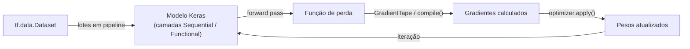

# TensorFlow

## Definição

TensorFlow é um framework de deep learning de código aberto desenvolvido pelo Google Brain. Ele fornece um ecossistema abrangente para construir, treinar e implantar modelos de aprendizado de máquina em escala — desde experimentos de pesquisa até servidores de produção de alto throughput, dispositivos móveis e hardware de edge.

A API de alto nível **Keras** (integrada como `tf.keras`) é o ponto de entrada recomendado: ela fornece camadas composáveis, compilação de modelo e loops de treinamento com uma interface semelhante a scikit-learn. A API de baixo nível dá acesso a operações de tensores, grafos de computação personalizados e execução distribuída. O `tf.function` compila funções Python para grafos TensorFlow estáticos para melhor desempenho de produção.

O ecossistema TensorFlow inclui: **TF Serving** para implantação de modelos em produção, **TFLite** para inferência em dispositivos móveis/edge, **TFX** para pipelines de ML de produção de ponta a ponta, e **TF Hub** para compartilhamento e reutilização de módulos de modelos.

## Funcionamento



### Keras como API de alto nível

**`tf.keras.Sequential`** encadeia camadas linearmente. A API **Functional** suporta topologias mais complexas (múltiplas entradas/saídas, conexões de atalho). A API **Subclassing** permite total personalização via `call()`. Use `model.compile()` para especificar otimizador, perda e métricas, depois `model.fit()` para treinar.

### tf.data para pipelines eficientes

**`tf.data.Dataset`** fornece um pipeline de pré-processamento eficiente e preguiçoso: transformações como `map`, `filter`, `batch` e `prefetch` são encadeadas e executadas em paralelo. `prefetch` sobrepõe o pré-processamento de CPU com o treinamento de GPU para utilização máxima.

### tf.function e grafos

Decore uma função Python com `@tf.function` e o TensorFlow traça a execução para construir um grafo estático. Isso melhora significativamente o throughput para inferência de produção e treinamento distribuído.

## Quando usar / Quando NÃO usar

| Cenário | Usar TensorFlow | NÃO usar TensorFlow |
|---------|----------------|---------------------|
| Implantação de produção em larga escala com TF Serving | Sim — ecossistema TFX maduro | |
| Implantação mobile / edge com TFLite | Sim — suporte TFLite de primeira classe | |
| Integração com o ecossistema do Google Cloud | Sim — integração nativa com Vertex AI | |
| Pesquisa de ML de última geração com modelos personalizados | | PyTorch tem ecossistema de pesquisa mais rico |
| Fine-tuning de LLMs baseados em HuggingFace | | A maioria dos modelos HF é baseada em PyTorch |
| Iniciantes que preferem debuggability | | PyTorch geralmente mais fácil de depurar |

## Comparações

| Funcionalidade | TensorFlow / Keras | PyTorch |
|---------|-------------------|---------|
| Grafo de computação | Estático (via tf.function) + eager mode | Dinâmico (define-by-run) |
| API de alto nível | Keras (integrada) | torch.nn (mais explícito) |
| Implantação mobile | TFLite (maduro) | ExecuTorch (mais recente) |
| Implantação de produção | TF Serving, TFX | TorchServe, ONNX |
| Ecossistema de pesquisa | Menor em papers recentes | Dominante |
| Curva de aprendizado | Moderada com Keras | Baixa a moderada |

## Vantagens e desvantagens

| Vantagens | Desvantagens |
|---------|------------|
| Ecossistema de produção maduro (TFServing, TFLite, TFX) | Menor adoção em pesquisa vs PyTorch |
| Excelente suporte a mobile/edge via TFLite | API histórica pode ser confusa (TF1 vs TF2) |
| Integração forte com serviços do Google Cloud | tf.function pode dificultar depuração de erros em grafo |
| Keras fornece API clara de alto nível | Menos modelos pré-treinados acessíveis vs HuggingFace |

## Exemplos de código

```python
import tensorflow as tf
from tensorflow import keras

# Build and train a simple neural network with Keras
model = keras.Sequential([
    keras.layers.Dense(64, activation="relu", input_shape=(10,)),
    keras.layers.Dense(32, activation="relu"),
    keras.layers.Dense(1,  activation="sigmoid"),
])

model.compile(
    optimizer="adam",
    loss="binary_crossentropy",
    metrics=["accuracy"],
)

# Synthetic data
import numpy as np
X_train = np.random.randn(500, 10).astype("float32")
y_train = (X_train[:, 0] > 0).astype("float32")

history = model.fit(X_train, y_train, epochs=5, batch_size=32, validation_split=0.2)
print("Acurácia final de validação:", history.history["val_accuracy"][-1])
```

## Recursos práticos

- [Documentação do TensorFlow](https://www.tensorflow.org/api_docs) — Referência de API completa para todas as versões do TF
- [Guias do Keras](https://keras.io/guides/) — Exemplos aprofundados de treinamento, implantação e personalização
- [TensorFlow Lite](https://www.tensorflow.org/lite) — Inferência em mobile, microcontroladores e edge
- [TFX (TensorFlow Extended)](https://www.tensorflow.org/tfx) — Pipelines de ML de produção de ponta a ponta

## Veja também

- [PyTorch](/docs/frameworks/pytorch)
- [Redes Neurais](/docs/neural-networks)
- [Deep Learning](/docs/fundamentals/deep-learning)
