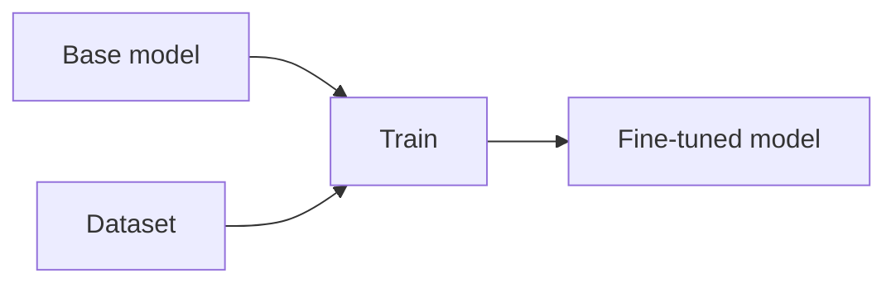

# Fine-tuning

## Definição

O ajuste fino continua o treinamento de um modelo pré-treinado com dados específicos de tarefa ou domínio. Full fine-tuning updates all parameters; parameter-efficient methods (por ex. LoRA, adapters) update a small subset to reduce cost.

Use quando you need stable, task-specific behavior or style (por ex. domain language, output format) and have enough labeled data. For frequently updated knowledge or one-off questions, [RAG](/docs/rag) or [prompt engineering](/docs/llms/prompt-engineering) are often better. See [LLMs](/docs/llms) for the full training pipeline.

## Como funciona

Você parte de um **modelo base** (por ex. um [LLM](/docs/llms) pré-treinado) e um **conjunto de dados** de exemplos de tarefa. Você define a **loss** (por ex. cross-entropy for classification, next-token for generation) and run optimization (por ex. Adam) on your data. O resultado é um **fine-tuned model** whose weights are updated (fully or only adapters/LoRA). **Instruction tuning** uses (instruction, response) pairs so the model learns to follow prompts; **domain fine-tuning** uses in-domain text or labeled tasks. Validation and early stopping prevent overfitting; often only 1–5% of parameters are updated with LoRA to save compute.

## Casos de uso

Fine-tuning is the right tool when you need a model to follow a specific style, domain, or task better than prompting alone.

- Adapting a base model to a specific domain (por ex. legal, medical)
- Teaching a consistent output format or style (por ex. JSON, tone)
- Improving performance on a narrow task with limited labeled data

## Documentação externa

- [Hugging Face – Fine-tune a pretrained model](https://huggingface.co/docs/transformers/training)
- [OpenAI – Fine-tuning](https://platform.openai.com/docs/guides/fine-tuning)

## Veja também

- [LLMs](/docs/llms)
- [Prompt engineering](/docs/llms/prompt-engineering)
