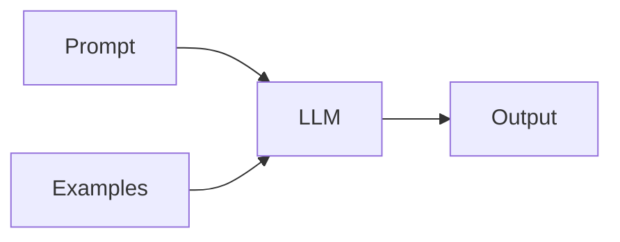

# Engenharia de prompts

## Definição

Prompt engineering é a prática de elaborar texto de entrada (prompts) para obter o comportamento desejado dos LLMs: task format, few-shot examples, chain-of-thought, role-playing, and constraints.

É the primary way to steer [LLMs](/docs/llms) without [fine-tuning](/docs/llms/fine-tuning): you control context, format, and examples in the prompt. Combined with [RAG](/docs/rag), prompts often include retrieved passages; with [agents](/docs/agents), they define tool use and raciocínio style.

## Como funciona

Você compõe um **prompt** (mensagem de sistema, descrição da tarefa, restrições) e opcionalmente **exemplos** (few-shot). O **LLM** takes this as input and produces an **output**. **Zero-shot** uses only instructions; **few-shot** adds example input-output pairs so the model infers the task. **Chain-of-thought** (see [CoT](/docs/reasoning-patterns/cot)) asks the model to “think passo a passo” to improve raciocínio. **Structured output** (por ex. “respond in JSON”) can be enforced via parsing or API options. Iterate on prompt wording and examples, and evaluate on a dev set to improve reliability.

## Casos de uso

Prompt engineering matters whenever you call an LLM: it shapes behavior, format, and raciocínio without changing weights.

- Steering chat and task completion (role, format, examples)
- Eliciting raciocínio (chain-of-thought) for math or logic
- Constraining outputs (JSON, length, tone) for APIs or UX

## Documentação externa

- [OpenAI – Prompt engineering guide](https://platform.openai.com/docs/guides/prompt-engineering)
- [Anthropic – Prompt projeto](https://docs.anthropic.com/en/docs/build-with-claude/prompt-engineering/overview)

## Veja também

- [LLMs](/docs/llms)
- [Chain-of-thought](/docs/reasoning-patterns/cot)
- [RAG](/docs/rag)
