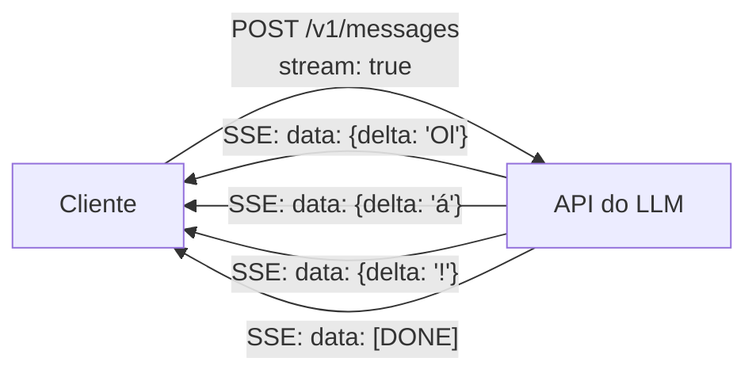

# Streaming (LLMs)

## Definição

Streaming é a técnica de enviar tokens de LLM ao cliente **à medida que são gerados** em vez de esperar que toda a resposta seja concluída. Como os LLMs geram texto um token por vez de forma autorregressiva, o streaming reduz o tempo percebido até o primeiro byte (TTFB) — o usuário vê o texto aparecer imediatamente em vez de aguardar em uma tela em branco por vários segundos.

Sem streaming, um prompt de saída de 500 tokens pode demorar 10+ segundos para aparecer de uma vez. Com streaming, o usuário vê o primeiro token em \<1 segundo e o texto continua sendo exibido enquanto é gerado — criando a experiência familiar de "digitação" de produtos como ChatGPT e Claude. Para casos de uso de produção, o streaming também possibilita que clientes comecem o processamento mais cedo (por ex. começar a sintetizar fala enquanto o texto ainda chega).

As APIs de LLM implementam o streaming via **Server-Sent Events (SSE)** ou resposta HTTP com corpo fragmentado. O cliente itera sobre os eventos de stream, cada um contendo um delta (novo conteúdo de token). O stream termina com um evento `[DONE]` ou sinal de término similar.

## Funcionamento



### Server-Sent Events (SSE)

SSE é um protocolo HTTP simples de sentido único onde o servidor empurra eventos para o cliente através de uma conexão HTTP de longa duração. Cada evento é uma linha `data: {json}` separada por `\n\n`. O cliente usa a API `EventSource` do browser ou iteração manual de stream em bibliotecas como `httpx` ou `fetch`.

### Ciclo de vida do stream

1. Cliente envia requisição com `"stream": true` (OpenAI/Anthropic) ou equivalente.
2. O servidor responde com `Content-Type: text/event-stream`.
3. Cada token ou grupo de tokens é enviado como um evento SSE com um campo delta.
4. Após a conclusão, um evento terminal (`[DONE]` ou `message_stop`) sinaliza o fim.
5. O cliente fecha a conexão.

### Tratamento de erros em streams

Erros durante um stream podem ocorrer no meio do processamento. Os clientes devem lidar com exceções de conexão, detectar eventos de erro SSE e implementar lógica de reconexão para sessões críticas.

## Quando usar / Quando NÃO usar

| Cenário | Usar Streaming | NÃO usar Streaming |
|---------|---------------|-------------------|
| UI de chat voltada ao usuário | Sim — experiência de digitação reduz latência percebida | |
| Respostas longas (\>100 tokens) | Sim — o streaming oferece benefício perceptível | |
| Síntese de texto para fala em tempo real | Sim — começa a sintetizar antes da conclusão | |
| Processamento em lote offline | | O streaming adiciona complexidade sem benefício de UX |
| Respostas curtas (\<20 tokens) | | O overhead de streaming pode ser maior que o ganho |
| Quando você precisa processar a resposta completa antes de agir | | Complete antes de processar |

## Exemplos de código

```python
import anthropic

client = anthropic.Anthropic()

# Stream a response from Claude
with client.messages.stream(
    model="claude-opus-4-5",
    max_tokens=1024,
    messages=[{"role": "user", "content": "Write a short poem about streaming data."}],
) as stream:
    for text in stream.text_stream:
        print(text, end="", flush=True)

print()  # newline after stream ends

# --- OpenAI equivalent ---
from openai import OpenAI

oai = OpenAI()
stream = oai.chat.completions.create(
    model="gpt-4o-mini",
    messages=[{"role": "user", "content": "Write a haiku about tokens."}],
    stream=True,
)
for chunk in stream:
    delta = chunk.choices[0].delta
    if delta.content:
        print(delta.content, end="", flush=True)
print()
```

## Recursos práticos

- [Documentação de Streaming da Anthropic](https://docs.anthropic.com/claude/reference/messages-streaming) — Especificação do protocolo SSE e tipos de eventos para Claude
- [Documentação de Streaming da OpenAI](https://platform.openai.com/docs/api-reference/streaming) — Guia de referência para streaming de completações de chat
- [MDN – Server-Sent Events](https://developer.mozilla.org/en-US/docs/Web/API/Server-sent_events) — Especificação do protocolo SSE para implementações do lado do cliente

## Veja também

- [LLMs](/docs/llms)
- [Engenharia de Prompts](/docs/prompt-engineering)
