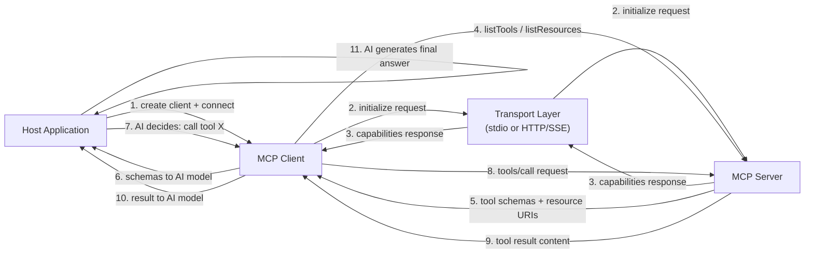

# Construindo clientes MCP

## Definição

Um **cliente MCP** é o componente dentro de uma aplicação host que gerencia a conexão com um único servidor MCP e traduz a intenção do modelo de IA em requisições de nível de protocolo. A aplicação host — uma interface de chat, um assistente de codificação, um agente autônomo — cria um cliente por servidor ao qual deseja se conectar. O cliente gerencia todo o ciclo de vida do protocolo: estabelecer a conexão de transporte, completar o handshake de inicialização, descobrir capacidades do servidor, invocar ferramentas em nome da IA, ler recursos e buscar prompts. Da perspectiva da aplicação host, o cliente é a superfície de API para o mundo do servidor.

O papel do cliente na aplicação host é de intermediário inteligente. Ele não decide quais ferramentas chamar — essa é responsabilidade do modelo de IA. Em vez disso, o cliente fornece à IA descrições estruturadas de capacidades (schemas de ferramentas, URIs de recursos, definições de prompts), e então executa fielmente qualquer coisa que a IA solicitar, retornando resultados em um formato sobre o qual a IA pode raciocinar. Um cliente bem construído isola toda a complexidade do protocolo da aplicação host: o host simplesmente pergunta "o que esse servidor pode fazer?" e "chame essa ferramenta com esses argumentos", e o cliente cuida de todo o resto.

A descoberta de capacidades é uma das responsabilidades mais importantes do cliente. Após o handshake de inicialização, o cliente consulta o servidor para seu manifesto completo de capacidades chamando `tools/list`, `resources/list` e `prompts/list`. Essas respostas incluem nomes, descrições, schemas de entrada e templates de URI — tudo que o modelo de IA precisa para entender como e quando usar cada capacidade. Em ambientes dinâmicos (servidores que mudam seu conjunto de ferramentas em tempo de execução), os clientes podem ouvir eventos `notifications/tools/list_changed` e reconsultar o manifesto sob demanda, garantindo que a IA sempre opere com uma visão atualizada das capacidades disponíveis.

## Como funciona

### Inicialização do cliente e o handshake

Criar um cliente MCP requer duas coisas: uma identidade do cliente (nome e versão) e uma declaração de capacidades. A declaração de capacidades diz ao servidor quais extensões do protocolo o cliente suporta — por exemplo, se ele pode lidar com assinaturas de recursos ou validação de argumentos de prompt. Após a instanciação, o cliente é conectado a um transporte, o que aciona a requisição `initialize`. O servidor responde com sua própria identidade, versão do protocolo e capacidades. O cliente então envia uma notificação `initialized` para confirmar que o handshake está completo. Somente após essa sequência o cliente pode fazer requisições de capacidade ou invocação. O SDK gerencia tudo isso automaticamente quando você chama `client.connect(transport)`.

### Descoberta de capacidades

Uma vez conectado, o cliente descobre o que o servidor oferece. `client.listTools()` retorna todas as definições de ferramentas incluindo seus nomes, descrições e especificações de entrada em JSON Schema. `client.listResources()` retorna URIs de recursos estáticos e metadados. `client.listResourceTemplates()` retorna templates de URI para recursos dinâmicos. `client.listPrompts()` retorna nomes de prompts e suas definições de argumentos. Em uma aplicação de IA típica, a descoberta acontece uma vez no início da sessão e os resultados são fornecidos ao modelo de IA como contexto — seja injetado no prompt de sistema ou passado como dados estruturados para uma API de function calling. Os schemas de ferramentas retornados por `listTools()` mapeiam diretamente para o formato JSON Schema usado pela maioria das APIs de function calling de LLM, o que facilita a conversão de ferramentas MCP descobertas em definições de ferramentas para LLM.

### Invocação de ferramentas

Invocar uma ferramenta requer um nome de ferramenta e um objeto de argumentos que satisfaça o schema de entrada da ferramenta. `client.callTool({ name, arguments })` envia uma requisição `tools/call` ao servidor e retorna uma resposta contendo um array `content` de blocos de conteúdo. Cada bloco tem um campo `type` (`text`, `image` ou `resource`) e os dados correspondentes. Blocos de texto contêm resultados de string; blocos de imagem contêm dados de imagem codificados em base64 com um tipo MIME; blocos de recurso incorporam um recurso inline. O trabalho do cliente é passar esses blocos de conteúdo de volta ao modelo de IA — tipicamente como mensagens de resultado de ferramenta em um turno de conversa. Se a resposta tiver `isError: true`, o cliente deve apresentar isso claramente para que a IA possa lidar com o erro (tentar novamente, recuar ou relatar ao usuário).

### Leitura de recursos

Os recursos são lidos via `client.readResource({ uri })`, que retorna um array `contents` de itens de conteúdo de recurso. Cada item tem um URI, um tipo MIME e um campo `text` (para recursos baseados em texto) ou `blob` (para recursos binários). Os recursos são usados para fornecer à IA contexto grande e estruturado — conteúdo de arquivos, registros de banco de dados, respostas de API — sem passar pelo round-trip de invocação de ferramenta. O cliente pode se inscrever em atualizações de recursos (`client.subscribeResource({ uri })`) e receber eventos `notifications/resources/updated` quando o servidor determina que o conteúdo do recurso mudou, habilitando atualização de contexto em tempo real.

### Seleção de transporte

A escolha do transporte depende de onde o servidor está sendo executado. O **transporte stdio** (`StdioClientTransport`) é usado quando o servidor é executado como um processo filho local — o cliente cria o processo do servidor diretamente e se comunica por meio de seu stdin/stdout. Isso é zero-configuração e ideal para ferramentas de desenvolvimento, servidores de sistema de arquivos locais e qualquer servidor que deva ser escopo de uma única sessão de usuário. O **transporte SSE** (`SSEServerTransport` no lado do cliente) é usado para servidores remotos — o cliente se conecta a um endpoint HTTP e usa Server-Sent Events para respostas em streaming. Isso se adequa a servidores organizacionais compartilhados, capacidades hospedadas na nuvem e deployments em produção onde múltiplas instâncias de cliente precisam compartilhar o mesmo servidor. A escolha do transporte é completamente transparente para as APIs de descoberta de capacidades e invocação; você pode trocar transportes sem mudar nenhum outro código do cliente.



## Quando usar / Quando NÃO usar

| Cenário | Construa um cliente MCP | Considere alternativas |
|---|---|---|
| Conectando uma aplicação de IA a um ou mais servidores MCP | Obrigatório — este é o caso de uso pretendido | Chamadas diretas de API se o servidor não usa MCP |
| Construindo um assistente de IA de propósito geral que deve suportar servidores MCP da comunidade | Melhor opção — qualquer servidor MCP funciona automaticamente | Integrações de ferramentas personalizadas se o conjunto de ferramentas for fixo e pequeno |
| Integrando IA em uma aplicação que já tem dependências de serviço | Um cliente MCP por serviço fornece acesso uniforme a ferramentas | Function calling específico do provedor se bloqueado em um provedor de LLM |
| Desenvolvendo tooling que é executado localmente na máquina do usuário | O transporte stdio requer um cliente MCP | Scripts shell ou chamadas diretas de biblioteca se IA não estiver envolvida |
| Agregando capacidades de múltiplos servidores especializados | Um cliente por servidor, host gerencia todos os clientes | Lista de ferramentas monolítica única se todas as ferramentas ficam em um lugar |
| Consumindo um servidor que usa HTTP/SSE para acesso remoto | O cliente de transporte SSE lida com isso nativamente | Cliente WebSocket ou REST se o servidor usa um protocolo não-MCP |

## Exemplos de código

### Cliente MCP completo — conectar, descobrir, invocar, ler

```typescript
import { Client } from "@modelcontextprotocol/sdk/client/index.js";
import { StdioClientTransport } from "@modelcontextprotocol/sdk/client/stdio.js";

async function main() {
  // -----------------------------------------------------------------------
  // 1. Create transport — spawns the server as a child process
  // -----------------------------------------------------------------------
  const transport = new StdioClientTransport({
    command: "node",
    args: ["./file-and-weather-server.js"], // Path to your MCP server
  });

  // -----------------------------------------------------------------------
  // 2. Create client and connect (triggers the initialize handshake)
  // -----------------------------------------------------------------------
  const client = new Client(
    { name: "demo-client", version: "1.0.0" },
    {
      capabilities: {
        // Declare which protocol extensions this client supports
        roots: { listChanged: true },
      },
    }
  );

  await client.connect(transport);
  console.log("Connected to MCP server");

  // -----------------------------------------------------------------------
  // 3. Discover capabilities
  // -----------------------------------------------------------------------
  const { tools } = await client.listTools();
  console.log(
    "\nAvailable tools:",
    tools.map((t) => `${t.name}: ${t.description}`)
  );

  const { resources } = await client.listResources();
  console.log(
    "\nAvailable resources:",
    resources.map((r) => r.uri)
  );

  const { prompts } = await client.listPrompts();
  console.log(
    "\nAvailable prompts:",
    prompts.map((p) => p.name)
  );

  // -----------------------------------------------------------------------
  // 4. Invoke a tool
  // -----------------------------------------------------------------------
  console.log("\n--- Calling get_weather tool ---");
  const weatherResult = await client.callTool({
    name: "get_weather",
    arguments: { city: "Tokyo", units: "celsius" },
  });

  // weatherResult.content is an array of content blocks
  if (!weatherResult.isError) {
    for (const block of weatherResult.content) {
      if (block.type === "text") {
        console.log("Weather result:", block.text);
      }
    }
  } else {
    console.error("Tool returned an error:", weatherResult.content);
  }

  // -----------------------------------------------------------------------
  // 5. Invoke another tool
  // -----------------------------------------------------------------------
  console.log("\n--- Calling list_directory tool ---");
  const dirResult = await client.callTool({
    name: "list_directory",
    arguments: { dir_path: "/tmp" },
  });

  if (!dirResult.isError) {
    const textBlock = dirResult.content.find((b) => b.type === "text");
    if (textBlock && textBlock.type === "text") {
      console.log("Directory listing:", textBlock.text);
    }
  }

  // -----------------------------------------------------------------------
  // 6. Read a resource
  // -----------------------------------------------------------------------
  console.log("\n--- Reading a resource ---");
  try {
    const resourceResult = await client.readResource({
      uri: "file:///etc/hostname",
    });

    for (const item of resourceResult.contents) {
      console.log(`Resource [${item.uri}]:`, "text" in item ? item.text : "(binary)");
    }
  } catch (err) {
    console.error("Resource read failed:", (err as Error).message);
  }

  // -----------------------------------------------------------------------
  // 7. Fetch a prompt
  // -----------------------------------------------------------------------
  console.log("\n--- Fetching a prompt ---");
  try {
    const promptResult = await client.getPrompt({
      name: "analyze_file",
      arguments: {
        file_path: "/tmp/example.txt",
        focus: "structure and formatting",
      },
    });

    console.log("Prompt messages:");
    for (const msg of promptResult.messages) {
      console.log(`  [${msg.role}]:`, JSON.stringify(msg.content).slice(0, 120) + "...");
    }
  } catch (err) {
    console.error("Prompt fetch failed:", (err as Error).message);
  }

  // -----------------------------------------------------------------------
  // 8. Clean up
  // -----------------------------------------------------------------------
  await client.close();
  console.log("\nClient disconnected.");
}

main().catch((err) => {
  console.error("Client error:", err);
  process.exit(1);
});
```

### Conectando a um servidor remoto via transporte SSE

```typescript
import { Client } from "@modelcontextprotocol/sdk/client/index.js";
import { SSEClientTransport } from "@modelcontextprotocol/sdk/client/sse.js";

async function connectRemote() {
  // Point to the SSE endpoint of your remote MCP server
  const transport = new SSEClientTransport(
    new URL("http://localhost:3000/sse")
  );

  const client = new Client(
    { name: "remote-client", version: "1.0.0" },
    { capabilities: {} }
  );

  await client.connect(transport);

  // From here, the API is identical to the stdio client example
  const { tools } = await client.listTools();
  console.log("Remote tools:", tools.map((t) => t.name));

  // Call a tool on the remote server
  const result = await client.callTool({
    name: "get_weather",
    arguments: { city: "Berlin" },
  });
  console.log(result.content);

  await client.close();
}

connectRemote().catch(console.error);
```

### Convertendo ferramentas MCP descobertas para schemas de function calling de LLM

```typescript
import { Client } from "@modelcontextprotocol/sdk/client/index.js";
import { StdioClientTransport } from "@modelcontextprotocol/sdk/client/stdio.js";
import type { Tool } from "@modelcontextprotocol/sdk/types.js";

// Convert an MCP tool definition to OpenAI function-calling format
function mcpToolToOpenAIFunction(tool: Tool) {
  return {
    type: "function" as const,
    function: {
      name: tool.name,
      description: tool.description ?? "",
      parameters: tool.inputSchema,
    },
  };
}

async function getToolsForLLM(serverCommand: string, serverArgs: string[]) {
  const transport = new StdioClientTransport({
    command: serverCommand,
    args: serverArgs,
  });

  const client = new Client(
    { name: "llm-bridge", version: "1.0.0" },
    { capabilities: {} }
  );

  await client.connect(transport);

  const { tools } = await client.listTools();

  // Convert to OpenAI format — these can be passed directly to the Chat Completions API
  const openAITools = tools.map(mcpToolToOpenAIFunction);

  return { client, openAITools };
}

// Usage:
// const { client, openAITools } = await getToolsForLLM("node", ["./my-server.js"]);
// Pass openAITools to openai.chat.completions.create({ tools: openAITools, ... })
// When the LLM returns a tool call, use: client.callTool({ name, arguments })
```

## Recursos práticos

- [MCP TypeScript SDK — referência da API do cliente](https://github.com/modelcontextprotocol/typescript-sdk/tree/main/src/client) — Código-fonte e documentação inline para `Client`, todas as classes de transporte e tipos do lado do cliente.
- [Exemplos e integrações de clientes MCP](https://modelcontextprotocol.io/clients) — Uma lista curada de integrações de clientes MCP existentes em editores, plataformas de IA e ferramentas de desenvolvimento.
- [Especificação do protocolo MCP — comportamento do cliente](https://spec.modelcontextprotocol.io/specification/client/) — Referência autoritativa para responsabilidades do cliente incluindo inicialização, negociação de capacidades e ciclo de vida de requisições.
- [Guia de integração MCP](https://modelcontextprotocol.io/docs/concepts/architecture) — Visão geral conceitual de como clientes, servidores e aplicações host se relacionam, com diagramas e orientação para decisões.

## Veja também

- [Visão geral do Model Context Protocol](/docs/mcp)
- [Construindo servidores MCP](/docs/mcp/building-servers)
- [Agentes de IA](/docs/agents)
