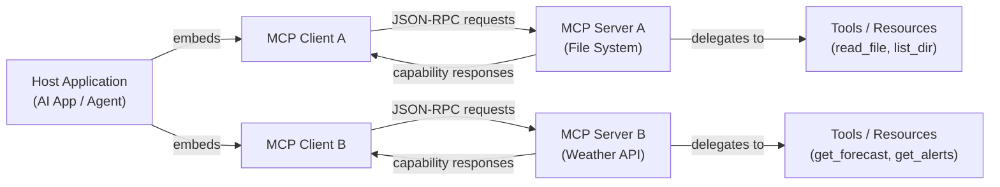

# Model Context Protocol (MCP)

## Definição

O **Model Context Protocol (MCP)** é um padrão aberto que define uma maneira uniforme para aplicações de IA se conectarem a ferramentas externas, fontes de dados e serviços. Em vez de construir integrações pontuais para cada combinação de modelo de IA e sistema externo, o MCP fornece uma linguagem compartilhada: uma aplicação host se comunica com um servidor MCP por meio de um protocolo bem definido, e o servidor expõe capacidades (ferramentas, recursos, prompts) que qualquer cliente de IA compatível pode descobrir e usar. O MCP foi introduzido pela Anthropic no final de 2024 e imediatamente lançado como padrão aberto, convidando o ecossistema mais amplo a adotá-lo e estendê-lo.

Antes do MCP, a integração de ferramentas para aplicações de IA era fragmentada. Cada provedor tinha seu próprio formato de function calling; cada integração tinha que ser reimplementada para cada novo backend de IA. Uma ferramenta de execução de código escrita para um modelo precisava ser reescrita ao trocar de provedor, e uma nova fonte de dados exigia tubulação personalizada para cada aplicação de IA que quisesse acessá-la. O MCP resolve isso separando a preocupação de "como uma IA fala com uma ferramenta" (o protocolo) de "qual IA" e "qual ferramenta", para que qualquer cliente compatível com MCP possa usar qualquer servidor compatível com MCP sem código de ligação adicional.

O impacto prático é significativo: desenvolvedores podem construir um servidor MCP uma vez — para um banco de dados, um sistema de arquivos, uma API REST, um executor de código — e toda aplicação de IA habilitada para MCP ganha acesso a ele. O protocolo é agnóstico ao transporte (executando sobre stdio para processos locais ou HTTP/SSE para serviços remotos), suporta comunicação bidirecional e inclui um handshake de negociação de capacidades para que clientes e servidores possam anunciar exatamente o que suportam.

## Como funciona

### Arquitetura cliente-servidor

O MCP segue um modelo estrito de cliente-servidor com três papéis distintos. A **aplicação host** é a aplicação voltada para IA (uma UI de chat, um assistente de codificação, um agente autônomo) que incorpora um ou mais clientes MCP. Cada **cliente MCP** mantém uma conexão 1:1 com um único **servidor MCP** e atua como intermediário entre o host e as capacidades daquele servidor. O **servidor MCP** é o processo que possui e expõe as capacidades reais — ele sabe como chamar uma API de clima, ler um arquivo ou consultar um banco de dados. Essa separação significa que uma única aplicação host pode se conectar a muitos servidores simultaneamente, cada um fornecendo um conjunto diferente de ferramentas.



### Camada de transporte

O MCP é agnóstico ao transporte: o mesmo formato de mensagem JSON-RPC 2.0 é executado sobre dois transportes integrados. O **transporte stdio** é usado para servidores locais — o host cria o servidor como um processo filho e se comunica por meio de seus fluxos de entrada e saída padrão. Este é o deployment mais simples: sem rede, sem portas, sem overhead de autenticação. O **HTTP com transporte SSE (Server-Sent Events)** é usado para servidores remotos ou compartilhados: o cliente envia requisições como chamadas HTTP POST e recebe respostas em streaming via um endpoint SSE. Isso habilita servidores hospedados centralmente que múltiplos clientes podem compartilhar, e suporta deployment em ambientes de nuvem ou contêiner. Um terceiro tipo de transporte, **HTTP Streamable**, foi introduzido na especificação do protocolo como um sucessor mais capaz do HTTP/SSE para streaming bidirecional.

### Capacidades: ferramentas, recursos e prompts

Um servidor MCP expõe até três tipos de capacidades. **Ferramentas** são funções chamáveis — análogas ao function calling em APIs de LLM — que a IA pode invocar para realizar ações ou recuperar informações. Cada ferramenta tem um nome, uma descrição e um JSON Schema definindo seus parâmetros de entrada. **Recursos** são fontes de dados somente leitura, semelhantes a arquivos, que a IA pode acessar — um arquivo local, um registro de banco de dados, um snapshot de API ao vivo — identificados por um URI. Os recursos são o equivalente MCP de injeção de contexto: eles permitem que o servidor forneça dados estruturados à IA sem exigir uma chamada de ferramenta. **Prompts** são templates de prompt reutilizáveis armazenados no servidor; eles permitem que os autores do servidor definam padrões comuns de interação (por exemplo, "resumir este arquivo") que os clientes podem apresentar diretamente aos usuários.

### Negociação de capacidades e ciclo de vida da sessão

Quando um cliente se conecta a um servidor, o protocolo começa com um handshake `initialize`. O cliente envia sua versão do protocolo e as capacidades que suporta; o servidor responde com sua versão do protocolo e as capacidades que oferece. Essa negociação garante que clientes e servidores com diferentes conjuntos de funcionalidades possam interoperar graciosamente — um cliente que não suporta prompts simplesmente não os usará, mesmo que o servidor os ofereça. Após a inicialização, o cliente chama `tools/list`, `resources/list` e `prompts/list` para descobrir o que o servidor expõe. As respostas de descoberta incluem schemas completos, descrições e metadados. A partir desse ponto, o cliente pode invocar capacidades em nome do modelo de IA conforme necessário ao longo da sessão.

## Quando usar / Quando NÃO usar

| Cenário | MCP | Integração REST/API Personalizada | Function Calling Nativo |
|---|---|---|---|
| Construindo ferramentas que devem funcionar em múltiplos provedores de IA | Melhor opção — escreva uma vez, use com qualquer cliente MCP | Cada provedor precisa de sua própria integração | Bloqueado no formato de API de um único provedor |
| Compartilhando ferramentas em múltiplas aplicações de IA em sua organização | Melhor opção — um servidor, muitos clientes | Requer duplicar código de integração em cada app | Não projetado para compartilhamento entre aplicações |
| Ferramenta única e simples em uma aplicação de um único provedor | Excessivo — adiciona overhead de protocolo | Bom para casos simples | Opção mais fácil |
| Expondo fontes de dados existentes (arquivos, BDs) como contexto de IA | A capacidade Resources é feita especificamente para isso | Requer lógica de recuperação personalizada | Sem conceito equivalente |
| Resultados em streaming em tempo real de operações de longa duração | Suportado via transporte SSE | Requer lógica de streaming personalizada | Suporte limitado |
| Ambientes isolados ou altamente restritos | Transporte stdio funciona sem rede | Controle total | Controle total |

## Comparações

### MCP vs function calling da OpenAI

O function calling da OpenAI e o MCP permitem que modelos de IA invoquem ferramentas estruturadas, mas operam em níveis diferentes. O function calling é um **recurso de nível de API**: os schemas de ferramentas são passados no payload da requisição, as implementações de ferramentas ficam no código da sua aplicação, e o padrão é específico para o formato de API da OpenAI. O MCP é um **padrão de nível de protocolo**: as ferramentas ficam em processos de servidor separados, o protocolo gerencia descoberta e invocação, e qualquer cliente compatível pode usar qualquer servidor compatível independentemente de qual provedor de IA potencializa o cliente. O function calling é a escolha certa para ferramentas simples em processo em uma aplicação de um único provedor; o MCP é a escolha certa quando você quer servidores de ferramentas portáveis e reutilizáveis que funcionem entre provedores e aplicações.

### MCP vs ferramentas LangChain

As ferramentas LangChain são uma **abstração de framework**: elas envolvem callables Python em uma interface padronizada que o runtime de agente LangChain entende. Elas são poderosas dentro do ecossistema LangChain, mas não definem um protocolo de comunicação entre processos — uma ferramenta LangChain não pode ser chamada por uma aplicação não-LangChain sem tubulação adicional. O MCP é um **protocolo de fio**: ele define exatamente como as mensagens são serializadas e transportadas entre processos. Um servidor MCP escrito em TypeScript pode ser chamado por um cliente MCP Python sem dependência de framework compartilhado. Os dois não são mutuamente exclusivos — LangChain e outros frameworks podem implementar clientes MCP para usar servidores MCP.

### MCP vs chamadas REST API diretas

Chamadas REST API diretas oferecem máxima flexibilidade e sem overhead de protocolo, mas cada nova aplicação de IA deve reimplementar a mesma autenticação, tratamento de erros e formatação de resultados para cada API que chama. O MCP fornece um envelope uniforme que abstrai sobre essas diferenças: a aplicação de IA sempre faz a mesma requisição `tools/call` independentemente de o servidor estar acessando uma API de clima, um banco de dados SQL ou um repositório GitHub. O trade-off é que o MCP requer infraestrutura de servidor (um processo de servidor em execução), enquanto uma chamada REST direta é apenas uma requisição HTTP.

## Exemplos de código

### Servidor MCP mínimo

```typescript
import { McpServer } from "@modelcontextprotocol/sdk/server/mcp.js";
import { StdioServerTransport } from "@modelcontextprotocol/sdk/server/stdio.js";
import { z } from "zod";

// Create the server instance with a name and version
const server = new McpServer({
  name: "demo-server",
  version: "1.0.0",
});

// Register a tool — the AI can call this to get the current time
server.tool(
  "get_current_time",
  "Returns the current UTC time in ISO 8601 format.",
  {}, // No input parameters required
  async () => ({
    content: [
      {
        type: "text",
        text: new Date().toISOString(),
      },
    ],
  })
);

// Register a tool with input parameters
server.tool(
  "add_numbers",
  "Adds two numbers together and returns the result.",
  {
    a: z.number().describe("The first number"),
    b: z.number().describe("The second number"),
  },
  async ({ a, b }) => ({
    content: [
      {
        type: "text",
        text: String(a + b),
      },
    ],
  })
);

// Start the server using stdio transport (runs as a child process)
const transport = new StdioServerTransport();
await server.connect(transport);
console.error("Demo MCP server running on stdio");
```

### Cliente MCP mínimo

```typescript
import { Client } from "@modelcontextprotocol/sdk/client/index.js";
import { StdioClientTransport } from "@modelcontextprotocol/sdk/client/stdio.js";

// Create a transport that spawns the server as a child process
const transport = new StdioClientTransport({
  command: "node",
  args: ["./demo-server.js"],
});

// Create and connect the client
const client = new Client(
  { name: "demo-client", version: "1.0.0" },
  { capabilities: {} }
);

await client.connect(transport);

// Discover available tools
const { tools } = await client.listTools();
console.log("Available tools:", tools.map((t) => t.name));

// Call a tool
const result = await client.callTool({
  name: "add_numbers",
  arguments: { a: 21, b: 21 },
});

console.log("Result:", result.content);
// Output: [{ type: 'text', text: '42' }]

await client.close();
```

## Recursos práticos

- [Especificação do Model Context Protocol](https://spec.modelcontextprotocol.io) — A especificação autoritativa do protocolo cobrindo todos os tipos de mensagens, transportes e definições de capacidades.
- [MCP TypeScript SDK](https://github.com/modelcontextprotocol/typescript-sdk) — O SDK oficial TypeScript/JavaScript para construir servidores e clientes MCP, mantido pela Anthropic.
- [modelcontextprotocol.io](https://modelcontextprotocol.io) — O site oficial do MCP com guias de início rápido, documentação conceitual e um registro de servidores construídos pela comunidade.
- [Repositório de exemplos de servidores MCP](https://github.com/modelcontextprotocol/servers) — Uma coleção curada de implementações de referência de servidores MCP cobrindo bancos de dados, sistemas de arquivos, busca na web e mais.

## Veja também

- [Construindo servidores MCP](/docs/mcp/building-servers)
- [Construindo clientes MCP](/docs/mcp/building-clients)
- [Agentes de IA](/docs/agents)
- [Saídas estruturadas](/docs/prompt-engineering/structured-outputs)
