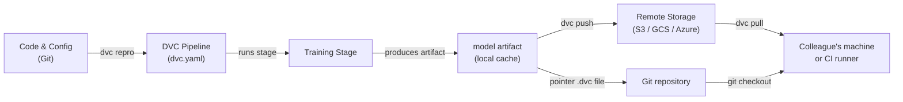

# Data Version Control (DVC)

## Definição

Data Version Control (DVC) é uma ferramenta open-source que estende o Git para rastrear arquivos grandes, datasets e artefatos de modelos que não podem ser armazenados eficientemente em um repositório Git. Enquanto o Git registra cada mudança no código fonte, o DVC armazena um pequeno arquivo ponteiro (`.dvc`) no repositório e envia os bytes reais dos dados para um backend de armazenamento remoto configurável — S3, GCS, Azure Blob, SSH ou até mesmo um diretório local. Isso mantém o repositório leve enquanto preserva total reprodutibilidade.

O DVC vai além do simples versionamento de arquivos. Ele introduz o conceito de **pipelines** — um DAG (Directed Acyclic Graph) de estágios definidos em um arquivo `dvc.yaml`. Cada estágio especifica seu comando, suas entradas (dependências) e suas saídas, para que o DVC possa determinar quais estágios precisam ser re-executados quando as entradas mudam. O resultado é um sistema de build para ML: reprodutível, incremental e versionado junto ao código que o produziu.

O DVC se integra estreitamente com os fluxos de trabalho do Git. Um arquivo `dvc.lock`, commitado no Git, captura o hash de conteúdo exato de cada entrada e saída no momento em que um pipeline foi executado, de forma que ao fazer checkout de um commit Git histórico e executar `dvc pull` restaura exatamente o dataset e os artefatos de modelo que existiam naquele ponto na história.

## Como funciona



### Inicializando um repositório DVC

Executar `dvc init` dentro de um repositório Git cria um diretório `.dvc/` que contém a configuração e o cache local do DVC. O DVC registra uma entrada `.gitignore` para a pasta de cache e adiciona alguns pequenos arquivos de rastreamento que devem ser commitados no Git. A partir deste ponto, `dvc add <arquivo>` cria um arquivo ponteiro `.dvc` para qualquer arquivo grande — os bytes reais vão para o cache local e nunca são commitados no Git. Essa abordagem em duas camadas significa que o repositório permanece rápido para clonar enquanto o DVC gerencia os assets pesados separadamente.

### Definindo e executando pipelines

Um arquivo `dvc.yaml` declara cada estágio do pipeline com seu comando, dependências de entrada e artefatos de saída. Quando você executa `dvc repro`, o DVC inspeciona o gráfico de dependências, compara os hashes de conteúdo de todas as entradas com o snapshot `dvc.lock` e re-executa apenas os estágios cujas entradas mudaram. Isso é análogo ao `make`, mas baseado em conteúdo em vez de timestamps, portanto é determinístico mesmo entre máquinas e runners de CI. Os pipelines podem ser parametrizados via um arquivo `params.yaml`, e o DVC registra quais valores de parâmetros foram usados em cada execução.

### Armazenamento remoto e colaboração

Um remote DVC é um local de armazenamento configurado com `dvc remote add`. As equipes tipicamente configuram um bucket em nuvem compartilhado para que todos os membros façam pull dos mesmos dados. `dvc push` faz upload de artefatos novos ou modificados para o remote, e `dvc pull` baixa exatamente as versões referenciadas pelo `dvc.lock` do commit Git atual. Esse fluxo de trabalho significa que integrar um novo membro da equipe a um projeto é `git clone` seguido de `dvc pull` — um único comando que materializa o dataset correto e os artefatos de modelo para aquele branch.

### Experimentos

`dvc exp run` e `dvc exp show` fornecem uma camada leve de rastreamento de experimentos sobre os pipelines. Cada experimento é um stash Git temporário de mudanças de parâmetros e métricas de resultados, que podem ser comparados em uma tabela e promovidos a um branch completo se prometedores. Isso é menos rico em recursos do que ferramentas dedicadas como MLflow ou W&B, mas tem a vantagem de não requerer infraestrutura adicional — tudo fica no repositório Git.

## Quando usar / Quando NÃO usar

| Usar quando | Evitar quando |
|---|---|
| Seus datasets ou arquivos de modelo são muito grandes para o Git (>100 MB) | Todos os dados cabem confortavelmente no Git LFS e não há necessidade de pipelines |
| Você precisa de pipelines de ML reprodutíveis vinculados a versões de código | Seus requisitos de rastreamento de experimentos excedem a abordagem leve do DVC |
| Sua equipe usa Git e quer um fluxo de trabalho unificado de controle de versão | Você precisa de uma interface completa para gerenciamento de experimentos (prefira MLflow ou W&B) |
| Pipelines de CI/CD precisam fazer pull de artefatos de dados exatos por branch | Os dados são extremamente sensíveis e não podem sair do armazenamento on-premises |
| Você quer comparar resultados de experimentos sem um servidor separado | O projeto não tem remote compartilhado e a colaboração não é uma preocupação |

## Comparações

| Critério | DVC | Git LFS | MLflow Tracking |
|---|---|---|---|
| Propósito principal | Versionamento de dados + pipeline | Versionamento de arquivos grandes | Rastreamento de experimentos + registro de modelos |
| Suporte a pipeline | Sim (DAG dvc.yaml) | Não | Não (apenas registra execuções) |
| Comparação de experimentos | Básica (dvc exp show) | Não | Rica (interface + API) |
| Backends remotos | S3, GCS, Azure, SSH, local | Servidores LFS GitHub, GitLab | Local, S3, Azure, SFTP |
| Servidor necessário | Não | Não | Opcional (servidor MLflow) |
| Integração com Git | Princípio central de design | Princípio central de design | Opcional (via mlflow.log_param) |

## Prós e contras

| Prós | Contras |
|------|---------|
| Sem servidor extra necessário — tudo no Git + armazenamento de objetos | Curva de aprendizado para equipes não familiarizadas com pipelines baseados em DAG |
| Pipelines reprodutíveis com cache endereçado por conteúdo | Conflitos grandes em dvc.lock podem ser complicados em monorepos muito ativos |
| Funciona com qualquer armazenamento em nuvem ou até diretórios locais | A interface de experimentos é mínima comparada ao MLflow / W&B |
| Leve — DVC é apenas uma ferramenta CLI | Não lida com orquestração de treinamento distribuído |
| Integração de CI/CD de primeira classe via CML | Os custos de armazenamento remoto são de responsabilidade da equipe gerenciar |

## Exemplos de código

```bash
# --- DVC setup and basic data tracking ---

# 1. Initialize DVC inside an existing Git repository
git init my-ml-project && cd my-ml-project
dvc init
git add .dvc .dvcignore
git commit -m "Initialize DVC"

# 2. Configure a remote storage backend (AWS S3 example)
dvc remote add -d myremote s3://my-bucket/dvc-store
git add .dvc/config
git commit -m "Add DVC remote"

# 3. Track a large dataset — DVC creates data/train.csv.dvc
dvc add data/train.csv
git add data/train.csv.dvc data/.gitignore
git commit -m "Track training dataset with DVC"

# 4. Push data to the remote
dvc push

# --- Collaborator workflow ---

# 5. Clone the repo and pull the data artifacts
git clone https://github.com/org/my-ml-project
cd my-ml-project
dvc pull   # downloads data/train.csv from the configured remote
```

```yaml
# dvc.yaml — Define a two-stage pipeline: featurize -> train

stages:
  featurize:
    cmd: python src/featurize.py --input data/train.csv --output data/features.parquet
    deps:
      - src/featurize.py
      - data/train.csv
    outs:
      - data/features.parquet

  train:
    cmd: python src/train.py --features data/features.parquet --output models/
    deps:
      - src/train.py
      - data/features.parquet
      - params.yaml        # parameter file changes trigger re-run
    outs:
      - models/
    metrics:
      - reports/metrics.json:
          cache: false     # small metrics file — commit it to Git
```

```python
# src/train.py — DVC-compatible training script using joblib for model serialization

import json
import argparse
from pathlib import Path

import yaml
import joblib
import numpy as np
import pandas as pd
from sklearn.ensemble import GradientBoostingClassifier
from sklearn.model_selection import train_test_split
from sklearn.metrics import accuracy_score


def main(features_path: str, output_dir: str) -> None:
    # Load parameters tracked by DVC from params.yaml
    params = yaml.safe_load(Path("params.yaml").read_text())["train"]

    # Load feature-engineered data produced by the featurize stage
    df = pd.read_parquet(features_path)
    X = df.drop(columns=["label"])
    y = df["label"]

    X_train, X_test, y_train, y_test = train_test_split(
        X, y, test_size=0.2, random_state=42
    )

    # Train with parameters sourced from params.yaml — DVC tracks these
    model = GradientBoostingClassifier(
        n_estimators=params["n_estimators"],
        max_depth=params["max_depth"],
        random_state=42,
    )
    model.fit(X_train, y_train)

    # Save the model artifact — DVC will cache and hash the output directory
    out = Path(output_dir)
    out.mkdir(parents=True, exist_ok=True)
    joblib.dump(model, out / "model.joblib")

    # Write metrics.json so DVC can track and compare across experiments
    accuracy = float(accuracy_score(y_test, model.predict(X_test)))
    Path("reports").mkdir(exist_ok=True)
    Path("reports/metrics.json").write_text(
        json.dumps({"accuracy": accuracy}, indent=2)
    )
    print(f"Accuracy: {accuracy:.4f}")


if __name__ == "__main__":
    parser = argparse.ArgumentParser()
    parser.add_argument("--features", required=True)
    parser.add_argument("--output", required=True)
    args = parser.parse_args()
    main(args.features, args.output)
```

## Recursos práticos

- [DVC official documentation](https://dvc.org/doc) — Guia abrangente cobrindo instalação, pipelines, remotes e experimentos.
- [DVC Get Started tutorial](https://dvc.org/doc/start) — Guia prático para configurar um projeto DVC do zero.
- [Iterative blog: Git-based MLOps](https://iterative.ai/blog) — Artigos sobre fluxos de trabalho de MLOps combinando DVC, CML e MLEM.
- [DVC GitHub repository](https://github.com/iterative/dvc) — Código fonte e issues da comunidade.

## Veja também

- [CI/CD para ML](/docs/mlops/cicd)
- [Rastreamento de experimentos](/docs/mlops/experiment-tracking)
- [MLflow](/docs/mlops/mlflow)
