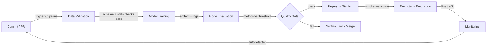

# CI/CD para ML

## Definição

Integração Contínua e Entrega Contínua (CI/CD) é uma prática de engenharia de software que automatiza a construção, teste e implantação de código em cada mudança. Quando aplicada ao aprendizado de máquina, o escopo se expande além do código: qualidade de dados, desempenho de modelos e versionamento de artefatos se tornam cidadãos de primeira classe do pipeline. Um pipeline de CI/CD de ML quebrado pode entregar um modelo que se degrada silenciosamente em produção sem que uma única linha de código da aplicação mude.

O CI/CD tradicional valida lógica e contratos de API. O CI/CD de ML deve adicionalmente validar propriedades estatísticas dos dados (esquema, distribuições, taxas de valores ausentes), limiares de qualidade do modelo (acurácia, latência, fairness) e reprodutibilidade — a capacidade de re-treinar exatamente o mesmo modelo a partir das mesmas entradas exatas. Ferramentas como [DVC](/docs/mlops/cicd/dvc) para versionamento de dados e CML (Continuous Machine Learning) para reportar métricas dentro de pull requests tornam isso prático.

O objetivo final é um caminho totalmente automatizado desde uma mudança de código ou dados até um modelo implantado com segurança, com gates humanos apenas onde realmente agregam valor — como revisar um model card antes de uma promoção para produção.

## Como funciona



### Validação de dados

Antes do início do treinamento, o pipeline verifica se os dados de entrada correspondem ao esquema esperado e ao perfil estatístico. Great Expectations ou TensorFlow Data Validation (TFDV) podem verificar se os tipos de coluna estão corretos, os intervalos de valores são sensatos e não há picos inesperados em valores ausentes. Falhar neste gate cedo evita desperdício de computação em batches corrompidos. Qualquer desvio de esquema é exibido como uma verificação com falha no pull request, que bloqueia o merge até que o problema seja entendido e seja corrigido ou explicitamente aceito. Esta etapa é o equivalente de ML de verificar tipos no código antes de executar os testes.

### Treinamento de modelos

O treinamento é executado como um job reprodutível e parametrizado — idealmente containerizado para que o ambiente exato (versão CUDA, pinning de bibliotecas) seja capturado. Um bom sistema de CI/CD passa hiperparâmetros por arquivos de configuração rastreados no controle de versão, não hard-coded em scripts. Ferramentas como [DVC](/docs/mlops/cicd/dvc) rastreiam qual versão do dataset e qual config produziu qual artefato de modelo, para que qualquer modelo treinado possa ser rastreado de volta às suas entradas. As execuções de treinamento são registradas em um rastreador de experimentos (MLflow, W&B) para que a comparação com o modelo campeão anterior seja automática.

### Avaliação de modelos

Após o treinamento, scripts de avaliação automatizados calculam as métricas alvo em um conjunto de teste retido e as comparam com um limiar definido ou com o modelo de produção atual. O CML (da Iterative.ai) pode postar um relatório Markdown com tabelas de métricas e gráficos diretamente no pull request do GitHub ou GitLab, para que os revisores vejam regressões de desempenho sem sair do fluxo de revisão de código. A avaliação também deve cobrir métricas de fairness baseadas em fatias para domínios regulados. O gate de qualidade passa apenas se o novo modelo atender ou exceder os limiares.

### Implantação e monitoramento

Ao passar o gate de qualidade, o artefato do modelo é registrado em um [registro de modelos](/docs/mlops/cicd/model-registry) e implantado em um ambiente de staging onde testes de smoke são executados no tráfego ao vivo (ou representativo). A promoção para produção pode ser manual (um clique na interface do registro) ou totalmente automatizada. Uma vez em produção, uma camada de [monitoramento](/docs/mlops/monitoring) rastreia desvio de dados, desvio de predições e KPIs de negócios, e pode acionar um pipeline de re-treinamento — completando o loop de feedback de volta à etapa de Commit.

## Quando usar / Quando NÃO usar

| Usar quando | Evitar quando |
|---|---|
| Múltiplos cientistas de dados fazem commits em código de modelo compartilhado | Trabalhando sozinho em um experimento de notebook pontual |
| Modelos são re-treinados regularmente com dados frescos | O modelo é estático e treinado uma vez, nunca atualizado |
| Falhas em produção são custosas (fraude, saúde, segurança) | Estágio de protótipo onde velocidade de iteração supera correção |
| A equipe precisa de reprodutibilidade e trilhas de auditoria | Maturidade de infraestrutura / DevOps é muito baixa |
| Conformidade regulatória requer versionamento documentado de modelos | O dataset é pequeno e cabe em um único notebook de ponta a ponta |

## Comparações

| Critério | CI/CD Tradicional | CI/CD de ML |
|---|---|---|
| Artefato primário | Binário / imagem Docker | Artefato de modelo + versão de dados |
| Tipos de teste | Unitário, integração, E2E | Unitário + qualidade de dados + qualidade de modelo + fairness |
| Gatilho | Push de código | Push de código OU novos dados OU re-treinamento agendado |
| Rollback | Reimplantar imagem anterior | Reimplantar versão anterior do modelo do registro |
| Observabilidade | Logs de aplicação, traces | Desvio de dados, desvio de predições, métricas de negócios |

## Prós e contras

| Prós | Contras |
|------|---------|
| Detecta regressões antes de chegarem à produção | Custo de configuração maior do que CI/CD tradicional |
| Trilha de auditoria completa de versões de dados + código + modelo | A validação de dados requer expertise de domínio para definir corretamente |
| Permite atualizações de modelos seguras e frequentes | Jobs de treinamento podem ser lentos, tornando os loops de feedback de CI mais longos |
| Reduz handoffs manuais entre ciência de dados e operações | Requer alinhamento entre equipes de dados, ML e plataforma |
| Métricas em PRs melhoram a qualidade da revisão de código | Limiares mal configurados podem bloquear melhorias válidas |

## Exemplos de código

```yaml
# .github/workflows/ml-pipeline.yml
# GitHub Actions workflow for a full ML CI/CD pipeline with CML reporting

name: ML Pipeline

on:
  push:
    branches: [main, "feat/**"]
  pull_request:
    branches: [main]

jobs:
  ml-pipeline:
    runs-on: ubuntu-latest

    steps:
      # 1. Check out the repository with full git history (needed for DVC)
      - name: Checkout code
        uses: actions/checkout@v4
        with:
          fetch-depth: 0

      # 2. Set up Python and install dependencies
      - name: Set up Python 3.11
        uses: actions/setup-python@v5
        with:
          python-version: "3.11"

      - name: Install dependencies
        run: pip install -r requirements.txt

      # 3. Pull data and model artifacts from DVC remote
      - name: Pull DVC artifacts
        env:
          AWS_ACCESS_KEY_ID: ${{ secrets.AWS_ACCESS_KEY_ID }}
          AWS_SECRET_ACCESS_KEY: ${{ secrets.AWS_SECRET_ACCESS_KEY }}
        run: dvc pull

      # 4. Validate data quality before training
      - name: Validate data
        run: python src/validate_data.py --data data/train.csv

      # 5. Train the model and save metrics to metrics.json
      - name: Train model
        run: python src/train.py --config configs/train.yaml

      # 6. Evaluate model and write report for CML
      - name: Evaluate model
        run: python src/evaluate.py --output reports/metrics.md

      # 7. Post CML report as a comment on the pull request
      - name: Post CML report
        uses: iterative/setup-cml@v2
        with:
          version: latest

      - name: Publish CML report
        env:
          REPO_TOKEN: ${{ secrets.GITHUB_TOKEN }}
        run: |
          # Append the confusion matrix image to the report
          echo "## Model evaluation report" >> reports/metrics.md
          cml comment create reports/metrics.md

      # 8. Push updated DVC artifacts (only on main)
      - name: Push DVC artifacts
        if: github.ref == 'refs/heads/main'
        env:
          AWS_ACCESS_KEY_ID: ${{ secrets.AWS_ACCESS_KEY_ID }}
          AWS_SECRET_ACCESS_KEY: ${{ secrets.AWS_SECRET_ACCESS_KEY }}
        run: dvc push
```

```python
# src/validate_data.py
# Simple data validation gate using pandas — replace with Great Expectations for production

import argparse
import sys
import pandas as pd

EXPECTED_COLUMNS = {"feature_a", "feature_b", "label"}
MAX_MISSING_RATE = 0.05  # 5% threshold


def validate(path: str) -> None:
    df = pd.read_csv(path)

    # Check that all required columns are present
    missing_cols = EXPECTED_COLUMNS - set(df.columns)
    if missing_cols:
        print(f"FAIL: Missing columns: {missing_cols}")
        sys.exit(1)

    # Check missing-value rates
    for col in EXPECTED_COLUMNS:
        rate = df[col].isna().mean()
        if rate > MAX_MISSING_RATE:
            print(f"FAIL: Column '{col}' has {rate:.1%} missing values (threshold: {MAX_MISSING_RATE:.0%})")
            sys.exit(1)

    print("Data validation passed.")


if __name__ == "__main__":
    parser = argparse.ArgumentParser()
    parser.add_argument("--data", required=True)
    args = parser.parse_args()
    validate(args.data)
```

## Recursos práticos

- [CML (Continuous Machine Learning) by Iterative](https://cml.dev/) — Documentação oficial para postar métricas e gráficos de ML diretamente em PRs do GitHub/GitLab.
- [GitHub Actions for ML — Iterative guide](https://iterative.ai/blog/github-actions-ml) — Guia de configuração de um pipeline de ML de ponta a ponta com GitHub Actions e DVC.
- [Google MLOps: Continuous delivery and automation pipelines in ML](https://cloud.google.com/architecture/mlops-continuous-delivery-and-automation-pipelines-in-machine-learning) — Arquitetura de referência do Google descrevendo três níveis de maturidade de automação de ML.
- [Great Expectations documentation](https://docs.greatexpectations.io/) — Framework para validação de dados e documentação em pipelines de ML.

## Veja também

- [Data Version Control (DVC)](/docs/mlops/cicd/dvc)
- [Registro de modelos](/docs/mlops/cicd/model-registry)
- [Visão geral de MLOps](/docs/mlops)
