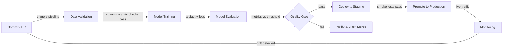

# CI/CD para ML

## Definição

Integração Contínua e Entrega Contínua (CI/CD) é uma prática de engenharia de software que automatiza a construção, os testes e a implantação de código a cada mudança. Quando aplicada ao aprendizado de máquina, o escopo se expande além do código: qualidade dos dados, desempenho do modelo e versionamento de artefatos tornam-se cidadãos de primeira classe da pipeline. Uma pipeline CI/CD de ML com falha pode entregar um modelo que se degrada silenciosamente em produção sem que uma única linha de código da aplicação mude.

O CI/CD tradicional valida lógica e contratos de API. O CI/CD de ML deve adicionalmente validar propriedades estatísticas dos dados (esquema, distribuições, taxas de valores ausentes), limites de qualidade do modelo (acurácia, latência, equidade) e reprodutibilidade — a capacidade de re-treinar exatamente o mesmo modelo a partir das mesmas entradas. Ferramentas como [DVC](/docs/mlops/cicd/dvc) para versionamento de dados e CML (Continuous Machine Learning) para reportar métricas em pull requests tornam isso prático.

O objetivo final é um caminho completamente automatizado de uma mudança de código ou dados para um modelo implantado com segurança, com portões humanos apenas onde realmente agregam valor — como revisar um cartão de modelo antes de uma promoção para produção.

## Como funciona



### Validação de dados

Antes do início do treinamento, a pipeline verifica se os dados recebidos correspondem ao esquema esperado e ao perfil estatístico. Great Expectations ou TensorFlow Data Validation (TFDV) podem confirmar que os tipos de colunas estão corretos, os intervalos de valores fazem sentido e não há picos inesperados em valores ausentes. Falhar neste portão cedo evita desperdício de computação em lotes corrompidos. Qualquer desvio de esquema é exibido como uma verificação com falha na pull request, o que bloqueia o merge até que o problema seja compreendido e corrigido ou explicitamente aceito. Esta etapa é o equivalente de ML à verificação de tipos do código antes de executar os testes.

### Treinamento do modelo

O treinamento é executado como um trabalho reproduzível e parametrizado — idealmente em contêiner para que o ambiente exato (versão do CUDA, fixação de bibliotecas) seja capturado. Um bom sistema CI/CD passa hiperparâmetros por meio de arquivos de configuração rastreados no controle de versão, não codificados nos scripts. Ferramentas como [DVC](/docs/mlops/cicd/dvc) rastreiam qual versão do conjunto de dados e qual configuração produziu qual artefato de modelo, para que qualquer modelo treinado possa ser rastreado até suas entradas. As execuções de treinamento são registradas em um rastreador de experimentos (MLflow, W&B) para que a comparação com o modelo campeão anterior seja automática.

### Avaliação do modelo

Após o treinamento, scripts de avaliação automatizados calculam as métricas alvo em um conjunto de teste reservado e as comparam com um limiar definido ou com o modelo de produção atual. CML (da Iterative.ai) pode publicar um relatório Markdown com tabelas de métricas e gráficos diretamente na pull request do GitHub ou GitLab, para que revisores vejam regressões de desempenho sem sair do fluxo de trabalho de revisão de código. A avaliação também deve cobrir métricas de equidade baseadas em fatias para domínios regulados. O portão de qualidade passa apenas se o novo modelo atingir ou superar os limiares.

### Implantação e monitoramento

Ao passar o portão de qualidade, o artefato do modelo é registrado em um [registro de modelos](/docs/mlops/cicd/model-registry) e implantado em um ambiente de staging onde testes de fumaça são executados contra tráfego real (ou representativo). A promoção para produção pode ser manual (um clique na UI do registro) ou totalmente automatizada. Uma vez em produção, uma camada de [monitoramento](/docs/mlops/monitoring) rastreia deriva de dados, deriva de previsões e KPIs de negócio, e pode disparar uma execução de re-treinamento — completando o ciclo de feedback de volta à etapa de Commit.

## Quando usar / Quando NÃO usar

| Usar quando | Evitar quando |
|---|---|
| Vários cientistas de dados fazem commits em código de modelo compartilhado | Trabalhando individualmente em um experimento de notebook pontual |
| Os modelos são re-treinados regularmente com dados frescos | O modelo é estático e treinado uma vez, nunca atualizado |
| Falhas em produção são custosas (fraude, saúde, segurança) | Fase de protótipo onde a velocidade de iteração supera a correção |
| A equipe precisa de reprodutibilidade e trilhas de auditoria | A maturidade de infraestrutura/DevOps é muito baixa |
| A conformidade regulatória exige versionamento documentado do modelo | O conjunto de dados é pequeno e cabe em um único notebook |

## Comparações

| Critério | CI/CD tradicional | CI/CD de ML |
|---|---|---|
| Artefato principal | Binário / imagem Docker | Artefato de modelo + versão dos dados |
| Tipos de teste | Unitário, integração, E2E | Unitário + qualidade dos dados + qualidade do modelo + equidade |
| Gatilho | Push de código | Push de código OU novos dados OU re-treinamento agendado |
| Rollback | Reimplantar imagem anterior | Reimplantar versão anterior do modelo do registro |
| Observabilidade | Logs de aplicação, traces | Deriva de dados, deriva de previsões, métricas de negócio |

## Prós e contras

| Prós | Contras |
|---|---|
| Detecta regressões antes que cheguem à produção | Custo de configuração maior que o CI/CD tradicional |
| Trilha de auditoria completa de dados + código + versões de modelo | A validação de dados requer expertise de domínio para ser definida corretamente |
| Permite atualizações frequentes e seguras de modelos | Jobs de treinamento podem ser lentos, alongando os ciclos de feedback CI |
| Reduz entregas manuais entre ciência de dados e operações | Requer alinhamento entre equipes de dados, ML e plataforma |
| Métricas em PRs melhoram a qualidade da revisão de código | Limiares mal configurados podem bloquear melhorias válidas |

## Exemplos de código

```yaml
# .github/workflows/ml-pipeline.yml
name: ML Pipeline
on:
  push:
    branches: [main, "feat/**"]
  pull_request:
    branches: [main]
jobs:
  ml-pipeline:
    runs-on: ubuntu-latest
    steps:
      - name: Checkout code
        uses: actions/checkout@v4
        with:
          fetch-depth: 0
      - name: Set up Python 3.11
        uses: actions/setup-python@v5
        with:
          python-version: "3.11"
      - name: Install dependencies
        run: pip install -r requirements.txt
      - name: Pull DVC artifacts
        env:
          AWS_ACCESS_KEY_ID: ${{ secrets.AWS_ACCESS_KEY_ID }}
          AWS_SECRET_ACCESS_KEY: ${{ secrets.AWS_SECRET_ACCESS_KEY }}
        run: dvc pull
      - name: Validate data
        run: python src/validate_data.py --data data/train.csv
      - name: Train model
        run: python src/train.py --config configs/train.yaml
      - name: Evaluate model
        run: python src/evaluate.py --output reports/metrics.md
      - name: Post CML report
        uses: iterative/setup-cml@v2
        with:
          version: latest
      - name: Publish CML report
        env:
          REPO_TOKEN: ${{ secrets.GITHUB_TOKEN }}
        run: |
          echo "## Model evaluation report" >> reports/metrics.md
          cml comment create reports/metrics.md
      - name: Push DVC artifacts
        if: github.ref == 'refs/heads/main'
        env:
          AWS_ACCESS_KEY_ID: ${{ secrets.AWS_ACCESS_KEY_ID }}
          AWS_SECRET_ACCESS_KEY: ${{ secrets.AWS_SECRET_ACCESS_KEY }}
        run: dvc push
```

```python
# src/validate_data.py
import argparse
import sys
import pandas as pd

EXPECTED_COLUMNS = {"feature_a", "feature_b", "label"}
MAX_MISSING_RATE = 0.05

def validate(path: str) -> None:
    df = pd.read_csv(path)
    missing_cols = EXPECTED_COLUMNS - set(df.columns)
    if missing_cols:
        print(f"FAIL: Missing columns: {missing_cols}")
        sys.exit(1)
    for col in EXPECTED_COLUMNS:
        rate = df[col].isna().mean()
        if rate > MAX_MISSING_RATE:
            print(f"FAIL: Column '{col}' has {rate:.1%} missing values (threshold: {MAX_MISSING_RATE:.0%})")
            sys.exit(1)
    print("Data validation passed.")

if __name__ == "__main__":
    parser = argparse.ArgumentParser()
    parser.add_argument("--data", required=True)
    args = parser.parse_args()
    validate(args.data)
```

## Recursos práticos

- [CML (Continuous Machine Learning) by Iterative](https://cml.dev/) — Documentação oficial para publicar métricas e gráficos de ML diretamente em PRs do GitHub/GitLab.
- [GitHub Actions for ML — Iterative guide](https://iterative.ai/blog/github-actions-ml) — Tutorial para configurar uma pipeline ML de ponta a ponta com GitHub Actions e DVC.
- [Google MLOps: Continuous delivery and automation pipelines in ML](https://cloud.google.com/architecture/mlops-continuous-delivery-and-automation-pipelines-in-machine-learning) — Arquitetura de referência do Google descrevendo três níveis de maturidade de automação ML.
- [Great Expectations documentation](https://docs.greatexpectations.io/) — Framework para validação e documentação de dados em pipelines de ML.

## Veja também

- [Data Version Control (DVC)](/docs/mlops/cicd/dvc)
- [Registro de modelos](/docs/mlops/cicd/model-registry)
- [Visão geral do MLOps](/docs/mlops)
