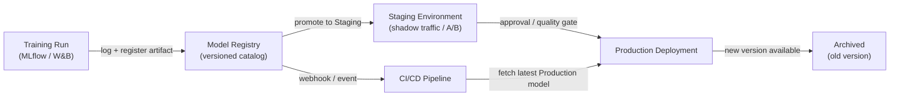

# Registro de modelos

## Definição

Um registro de modelos é um catálogo centralizado que armazena, versiona e governa artefatos de modelos de ML treinados ao longo de seu ciclo de vida — desde a experimentação inicial até o staging, implantação em produção e eventual aposentadoria. Pense nele como o equivalente de um repositório de artefatos de software (como Nexus ou Artifactory), mas criado especificamente para aprendizado de máquina, com metadados adicionais sobre dados de treinamento, métricas de avaliação e status de aprovação anexados a cada versão.

Sem um registro, as equipes frequentemente compartilham modelos por canais ad-hoc: mensagens no Slack com links do S3, diretórios compartilhados ou caminhos hard-coded em scripts de implantação. Isso torna impossível responder perguntas básicas de governança como "qual modelo está atualmente em produção?", "quem aprovou este modelo para implantação?" ou "qual dataset foi usado para treinar a versão que causou o incidente na semana passada?". Um registro torna essas perguntas trivialmente respondíveis.

Os registros de modelos se integram tanto ao lado do treinamento (rastreadores de experimentos registram uma execução, e o artefato da melhor execução é registrado) quanto ao lado da implantação (CI/CD ou infraestrutura de servição puxa o artefato no estágio `Production`). Eles tipicamente impõem um fluxo de promoção — `None → Staging → Production → Archived` — que pode exigir aprovação humana, gates de qualidade automatizados ou ambos antes que um modelo avance para o próximo estágio.

## Como funciona



### Registro de modelos

Após a conclusão de uma execução de treinamento e o registro das métricas em um rastreador de experimentos, o melhor artefato é registrado no registro com `mlflow.register_model()` ou a chamada SDK equivalente. Cada registro cria uma nova **versão** de um modelo nomeado (por exemplo, `fraud-detector`). As versões são imutáveis — você não pode sobrescrever uma versão registrada, apenas criar uma nova. Metadados como o ID da execução, hash do dataset, parâmetros de treinamento e métricas de avaliação são anexados à versão e são consultáveis pela API ou interface do registro.

### Fluxo de staging

Versões recém-registradas começam no estágio `None` (ou `Candidate`). Um cientista de dados ou gate automatizado promove uma versão para `Staging` para validação mais profunda — testes de integração, implantação shadow, divisão de tráfego canary ou comparação A/B com o modelo de produção atual. O staging é um ambiente seguro onde regressões são contidas; qualquer falha aqui impede que o modelo chegue à produção sem bloquear o sistema de servição.

### Promoção para produção e governança

A promoção para `Production` pode exigir uma etapa de aprovação humana, especialmente em indústrias reguladas. Muitas equipes implementam uma revisão no estilo pull request: o registro emite um webhook, um revisor examina o model card (que documenta dados de treinamento, métricas de fairness e limitações conhecidas) e a promoção é registrada em um log de auditoria com a identidade do aprovador e timestamp. A infraestrutura de servição se inscreve no estágio `Production` e carrega automaticamente a nova versão do modelo quando a promoção ocorre, permitindo atualizações de modelos sem downtime.

### Arquivamento e rollback

Quando uma nova versão chega à `Production`, a versão antiga é transitada para `Archived`. Arquivar não deleta o artefato — ele permanece totalmente recuperável para rollback ou análise forense. Se a nova versão em produção degradar (detectada pelo [monitoramento](/docs/mlops/monitoring)), a equipe de operações pode re-promover a versão arquivada para `Production` em segundos, fazendo rollback sem uma implantação de código.

## Quando usar / Quando NÃO usar

| Usar quando | Evitar quando |
|---|---|
| Múltiplos modelos ou versões de modelos são implantados simultaneamente | Você tem um único modelo treinado uma vez sem planos de atualização |
| Requisitos regulatórios ou de auditoria exigem proveniência do modelo | A equipe está em fase inicial de P&D sem implantação em produção ainda |
| Equipes diferentes são responsáveis pelo treinamento vs. implantação | Uma única pessoa treina e implanta em um único script |
| Você precisa de capacidade de rollback para modelos em produção | A sobrecarga do processo de governança não é justificada pelo nível de risco |
| Testes A/B ou implantação shadow requerem gerenciar múltiplas versões ao vivo | O rastreamento de experimentos por si só já satisfaz suas necessidades de governança |

## Comparações

| Critério | MLflow Model Registry | W&B Registry | AWS SageMaker Model Registry |
|---|---|---|---|
| Hospedagem | Self-hosted ou Databricks gerenciado | SaaS (W&B cloud) | Serviço AWS totalmente gerenciado |
| Integração | Servidor de rastreamento MLflow | Rastreamento de experimentos W&B | Treinamento SageMaker + endpoints |
| Fluxo de estágios | None → Staging → Production → Archived | Baseado em aliases (estágios personalizados) | Pending → Approved → Rejected |
| Processo de aprovação | Manual via interface/API | Manual via interface/API | Integração com AWS IAM / CodePipeline |
| Custo | Open source (self-hosted gratuito) | Nível gratuito + planos pagos | Preços AWS por uso |

## Prós e contras

| Prós | Contras |
|------|---------|
| Fonte única de verdade para todos os modelos em produção | Adiciona sobrecarga de processo — equipes devem lembrar de registrar artefatos |
| Permite rollback em segundos sem implantação de código | Registros self-hosted requerem manutenção de infraestrutura |
| Trilha de auditoria completa com identidade do aprovador e timestamps | Trabalho de integração necessário para conectar pipelines de treinamento ao registro |
| Desacopla a promoção de modelos dos ciclos de implantação de código | Processos de governança podem desacelerar equipes ágeis se super-engenhados |
| Permite testes A/B seguros servindo múltiplas versões registradas | Os custos de armazenamento de artefatos crescem ao longo do tempo à medida que versões se acumulam |

## Exemplos de código

```python
# model_registry_example.py
# Demonstrates registering, transitioning, and loading models with MLflow Model Registry

import mlflow
import mlflow.sklearn
from mlflow.tracking import MlflowClient
from sklearn.datasets import make_classification
from sklearn.ensemble import RandomForestClassifier
from sklearn.model_selection import train_test_split
from sklearn.metrics import accuracy_score

# --- 1. Train and log a model to MLflow tracking server ---

mlflow.set_tracking_uri("http://localhost:5000")  # or your MLflow server URI
mlflow.set_experiment("fraud-detection")

X, y = make_classification(n_samples=5000, n_features=20, random_state=42)
X_train, X_test, y_train, y_test = train_test_split(X, y, test_size=0.2, random_state=42)

with mlflow.start_run(run_name="rf-baseline") as run:
    model = RandomForestClassifier(n_estimators=100, random_state=42)
    model.fit(X_train, y_train)

    accuracy = accuracy_score(y_test, model.predict(X_test))

    # Log parameters and metrics — these attach to the registered version
    mlflow.log_param("n_estimators", 100)
    mlflow.log_metric("accuracy", accuracy)

    # Log the model artifact with a schema signature for validation at serving time
    signature = mlflow.models.infer_signature(X_train, model.predict(X_train))
    mlflow.sklearn.log_model(
        sk_model=model,
        artifact_path="model",
        signature=signature,
        registered_model_name="fraud-detector",  # registers on log if name provided
    )

    run_id = run.info.run_id
    print(f"Run ID: {run_id} | Accuracy: {accuracy:.4f}")

# --- 2. Transition the newly registered version to Staging ---

client = MlflowClient()

# Fetch the latest version of the model (just registered above)
latest_versions = client.get_latest_versions("fraud-detector", stages=["None"])
new_version = latest_versions[0].version

# Promote to Staging for integration testing
client.transition_model_version_stage(
    name="fraud-detector",
    version=new_version,
    stage="Staging",
    archive_existing_versions=False,  # keep other Staging versions for comparison
)
print(f"Version {new_version} promoted to Staging")

# --- 3. After validation, promote Staging model to Production ---

# Archive the current Production version and promote Staging to Production
client.transition_model_version_stage(
    name="fraud-detector",
    version=new_version,
    stage="Production",
    archive_existing_versions=True,  # automatically archive the old Production version
)
print(f"Version {new_version} is now Production")

# Add a description to document why this version was promoted
client.update_model_version(
    name="fraud-detector",
    version=new_version,
    description="Promoted after passing shadow traffic test with 0.1% error rate improvement.",
)

# --- 4. Load the Production model in a serving or batch scoring script ---

production_model = mlflow.sklearn.load_model("models:/fraud-detector/Production")
predictions = production_model.predict(X_test)
print(f"Loaded Production model accuracy: {accuracy_score(y_test, predictions):.4f}")
```

## Recursos práticos

- [MLflow Model Registry documentation](https://mlflow.org/docs/latest/model-registry.html) — Guia oficial com referência da API Python e guia da interface.
- [Weights & Biases Registry](https://docs.wandb.ai/guides/model_registry) — Registro de modelos do W&B com artefatos vinculados e gráficos de linhagem.
- [AWS SageMaker Model Registry](https://docs.aws.amazon.com/sagemaker/latest/dg/model-registry.html) — Registro gerenciado integrado com SageMaker Pipelines e CodePipeline.
- [Google Vertex AI Model Registry](https://cloud.google.com/vertex-ai/docs/model-registry/introduction) — Solução gerenciada do GCP para versionamento e implantação de modelos.

## Veja também

- [MLflow](/docs/mlops/mlflow)
- [Weights & Biases (W&B)](/docs/mlops/wandb)
- [Servição de modelos](/docs/mlops/deployment/model-serving)
