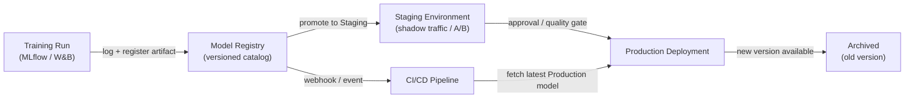

# Registro de modelos

## Definição

Um registro de modelos é um catálogo centralizado que armazena, versiona e governa artefatos de modelos ML treinados ao longo de seu ciclo de vida — desde a experimentação inicial, passando pelo staging, implantação em produção e eventual aposentadoria. Pense nele como o equivalente de um repositório de artefatos de software (como Nexus ou Artifactory), mas construído especificamente para machine learning, com metadados adicionais sobre dados de treinamento, métricas de avaliação e status de aprovação anexados a cada versão.

Sem um registro, as equipes geralmente compartilham modelos por canais ad hoc: mensagens do Slack com links S3, diretórios compartilhados ou caminhos codificados em scripts de implantação. Isso torna impossível responder perguntas básicas de governança como "qual modelo está atualmente em produção?", "quem aprovou este modelo para implantação?" ou "qual conjunto de dados foi usado para treinar a versão que causou o incidente na semana passada?". Um registro torna essas perguntas trivialmente respondíveis.

Os registros de modelos se integram tanto ao lado de treinamento (rastreadores de experimentos registram uma execução, e o artefato da melhor execução é registrado) quanto ao lado de implantação (CI/CD ou infraestrutura de serving busca o artefato no estágio `Production`). Eles normalmente aplicam um fluxo de trabalho de promoção — `None → Staging → Production → Archived` — que pode exigir aprovação humana, portões de qualidade automatizados, ou ambos antes que um modelo avance para o próximo estágio.

## Como funciona



### Registro do modelo

Após a conclusão de uma execução de treinamento e o registro das métricas em um rastreador de experimentos, o melhor artefato é registrado no registro com `mlflow.register_model()` ou a chamada SDK equivalente. Cada registro cria uma nova **versão** de um modelo nomeado (por exemplo, `fraud-detector`). As versões são imutáveis — você não pode sobrescrever uma versão registrada, apenas criar uma nova. Metadados como o ID de execução, o hash do conjunto de dados, os parâmetros de treinamento e as métricas de avaliação são anexados à versão e podem ser consultados por meio da API ou UI do registro.

### Fluxo de trabalho de staging

As versões recém-registradas começam no estágio `None` (ou `Candidate`). Um cientista de dados ou um portão automatizado promove uma versão para `Staging` para validação mais profunda — testes de integração, implantação shadow, divisão de tráfego canary ou comparação A/B com o modelo de produção atual. O staging é um ambiente seguro onde as regressões são contidas; qualquer falha aqui impede que o modelo chegue à produção sem bloquear o sistema de serving.

### Promoção para produção e governança

A promoção para `Production` pode exigir uma etapa de aprovação humana, especialmente em setores regulamentados. Muitas equipes implementam uma revisão no estilo pull-request: o registro emite um webhook, um revisor examina o cartão do modelo (que documenta os dados de treinamento, métricas de equidade e limitações conhecidas), e a promoção é registrada em um log de auditoria com a identidade do aprovador e o timestamp. A infraestrutura de serving se inscreve no estágio `Production` e carrega automaticamente a nova versão do modelo quando a promoção ocorre, permitindo atualizações de modelo com zero downtime.

### Arquivamento e rollback

Quando uma nova versão atinge `Production`, a versão antiga é transferida para `Archived`. O arquivamento não exclui o artefato — ele permanece totalmente recuperável para rollback ou análise forense. Se a nova versão em produção se degradar (detectado pelo [monitoramento](/docs/mlops/monitoring)), a equipe de operações pode re-promover a versão arquivada para `Production` em segundos, realizando rollback sem uma implantação de código.

## Quando usar / Quando NÃO usar

| Usar quando | Evitar quando |
|---|---|
| Vários modelos ou versões de modelos são implantados simultaneamente | Você tem um único modelo treinado uma vez sem planos de atualizá-lo |
| Requisitos regulatórios ou de auditoria exigem proveniência do modelo | A equipe está em fase inicial de P&D sem implantação em produção ainda |
| Equipes diferentes possuem treinamento vs. implantação | Uma única pessoa treina e implanta em um único script |
| Você precisa de capacidade de rollback para modelos de produção | O overhead do processo de governança não é justificado pelo nível de risco |
| Testes A/B ou implantação shadow exigem gerenciar múltiplas versões em produção | O rastreamento de experimentos por si só já satisfaz suas necessidades de governança |

## Comparações

| Critério | MLflow Model Registry | W&B Registry | AWS SageMaker Model Registry |
|---|---|---|---|
| Hospedagem | Self-hosted ou gerenciado pelo Databricks | SaaS (nuvem W&B) | Serviço AWS totalmente gerenciado |
| Integração | Servidor de rastreamento MLflow | Rastreamento de experimentos W&B | Treinamento SageMaker + endpoints |
| Fluxo de estágios | None → Staging → Production → Archived | Baseado em alias (estágios personalizados) | Pending → Approved → Rejected |
| Processo de aprovação | Manual via UI/API | Manual via UI/API | Integração com AWS IAM / CodePipeline |
| Custo | Open source (self-hosted gratuito) | Nível gratuito + planos pagos | Preços AWS pay-per-use |

## Prós e contras

| Prós | Contras |
|---|---|
| Fonte única de verdade para todos os modelos de produção | Adiciona overhead de processo — equipes precisam lembrar de registrar artefatos |
| Permite rollback em segundos sem implantação de código | Registros self-hosted requerem manutenção de infraestrutura |
| Trilha de auditoria completa com identidade do aprovador e timestamps | Trabalho de integração necessário para conectar pipelines de treinamento ao registro |
| Desacopla a promoção de modelos dos ciclos de implantação de código | Processos de governança podem desacelerar equipes ágeis se super-engenheirados |
| Permite testes A/B seguros servindo múltiplas versões registradas | Os custos de armazenamento de artefatos crescem com o tempo conforme as versões se acumulam |

## Exemplos de código

```python
# model_registry_example.py
import mlflow
import mlflow.sklearn
from mlflow.tracking import MlflowClient
from sklearn.datasets import make_classification
from sklearn.ensemble import RandomForestClassifier
from sklearn.model_selection import train_test_split
from sklearn.metrics import accuracy_score

mlflow.set_tracking_uri("http://localhost:5000")
mlflow.set_experiment("fraud-detection")

X, y = make_classification(n_samples=5000, n_features=20, random_state=42)
X_train, X_test, y_train, y_test = train_test_split(X, y, test_size=0.2, random_state=42)

with mlflow.start_run(run_name="rf-baseline") as run:
    model = RandomForestClassifier(n_estimators=100, random_state=42)
    model.fit(X_train, y_train)
    accuracy = accuracy_score(y_test, model.predict(X_test))
    mlflow.log_param("n_estimators", 100)
    mlflow.log_metric("accuracy", accuracy)
    signature = mlflow.models.infer_signature(X_train, model.predict(X_train))
    mlflow.sklearn.log_model(
        sk_model=model, artifact_path="model", signature=signature,
        registered_model_name="fraud-detector",
    )

client = MlflowClient()
latest_versions = client.get_latest_versions("fraud-detector", stages=["None"])
new_version = latest_versions[0].version
client.transition_model_version_stage(
    name="fraud-detector", version=new_version, stage="Staging", archive_existing_versions=False,
)
client.transition_model_version_stage(
    name="fraud-detector", version=new_version, stage="Production", archive_existing_versions=True,
)
client.update_model_version(
    name="fraud-detector", version=new_version,
    description="Promoted after passing shadow traffic test with 0.1% error rate improvement.",
)

production_model = mlflow.sklearn.load_model("models:/fraud-detector/Production")
predictions = production_model.predict(X_test)
print(f"Loaded Production model accuracy: {accuracy_score(y_test, predictions):.4f}")
```

## Recursos práticos

- [Documentação do MLflow Model Registry](https://mlflow.org/docs/latest/model-registry.html) — Guia oficial com referência da API Python e tutorial da UI.
- [Weights & Biases Registry](https://docs.wandb.ai/guides/model_registry) — Registro de modelos do W&B com artefatos vinculados e grafos de linhagem.
- [AWS SageMaker Model Registry](https://docs.aws.amazon.com/sagemaker/latest/dg/model-registry.html) — Registro gerenciado integrado com SageMaker Pipelines e CodePipeline.
- [Google Vertex AI Model Registry](https://cloud.google.com/vertex-ai/docs/model-registry/introduction) — Solução gerenciada do GCP para versionamento e implantação de modelos.

## Veja também

- [MLflow](/docs/mlops/mlflow)
- [Weights & Biases (W&B)](/docs/mlops/wandb)
- [Serving de modelos](/docs/mlops/deployment/model-serving)
