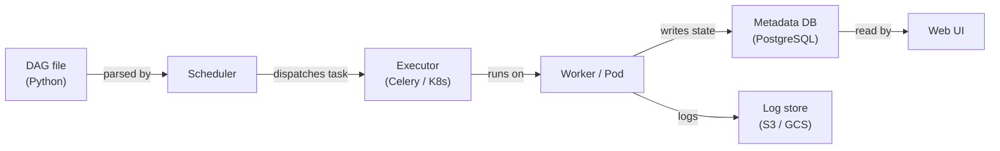

# Apache Airflow

## Definição

Apache Airflow é uma plataforma open-source para criar, agendar e monitorar workflows programaticamente. Os workflows são expressos como **Grafos Acíclicos Dirigidos (DAGs)** escritos em Python, o que dá aos engenheiros toda a expressividade de uma linguagem de programação para definir dependências complexas, lógica de ramificação, geração dinâmica de tarefas e políticas de retry. O Airflow foi originalmente criado no Airbnb em 2014 e posteriormente doado à Apache Software Foundation; ele se tornou o padrão de fato para orquestração de workflows em batch em engenharia de dados e MLOps.

No contexto de ML, o Airflow orquestra todo o ciclo de vida do modelo: ingestão de dados, pré-processamento, engenharia de features, treinamento de modelos, avaliação, registro de artefatos e implantação. Ele não executa a computação em si — ao invés disso, delega para sistemas especializados (Spark, dbt, SageMaker, Kubernetes) via seu rico ecossistema de operadores. Essa separação de orquestração da execução é uma força arquitetural fundamental: você pode trocar a camada de computação subjacente sem alterar a lógica do DAG.

O scheduler do Airflow analisa continuamente os arquivos DAG, avalia o estado de cada instância de tarefa e despacha tarefas prontas para um executor (LocalExecutor, CeleryExecutor ou KubernetesExecutor). A interface web fornece visibilidade em tempo real sobre as execuções de DAG, logs de tarefas e linhagem. O Airflow é projetado para cargas de trabalho em batch com cronogramas conhecidos — não é adequado para streaming sub-minutado ou pipelines orientados a eventos.

## Como funciona

### DAGs e dependências de tarefas

Um DAG é um arquivo Python que instancia um objeto `airflow.DAG` e define tarefas usando operadores. As dependências entre tarefas são declaradas com o operador bitshift `>>` ou chamadas `set_downstream`/`set_upstream`. O scheduler lê esses arquivos da pasta de DAGs, computa o gráfico de dependências e aciona instâncias de tarefas quando todas as dependências upstream estão no estado `success`. As execuções de DAG podem ser agendadas em uma expressão cron ou acionadas externamente via API REST ou o `TriggerDagRunOperator`.

### Operadores, sensores e hooks

**Operadores** são as unidades atômicas de trabalho no Airflow. O `PythonOperator` executa um callable Python; `BashOperator` executa um comando shell; `SparkSubmitOperator` submete um job Spark; `BigQueryOperator` executa uma consulta SQL. **Sensores** são uma classe especial de operador que bloqueia até que uma condição seja atendida — um arquivo aterra no S3, uma partição aparece em uma tabela Hive ou um DAG externo é concluído. **Hooks** fornecem conexões reutilizáveis para sistemas externos (bancos de dados, APIs em nuvem, filas de mensagens) e são usados internamente por operadores, mas também podem ser chamados diretamente. Essa abstração em camadas significa que a maioria das integrações já existe nos pacotes `apache-airflow-providers-*`.

### XComs e comunicação entre tarefas

**XComs** (cross-communications) permitem que tarefas empurrem e puxem pequenos valores — strings, números, blobs JSON — entre instâncias de tarefas dentro da mesma execução de DAG. Uma tarefa empurra um XCom retornando um valor de seu callable Python ou chamando `context['ti'].xcom_push(key, value)`. Tarefas downstream o puxam com `context['ti'].xcom_pull(task_ids='upstream_task', key='value')`. Os XComs são armazenados no banco de dados de metadados do Airflow, portanto não são adequados para grandes payloads (use armazenamento de objetos para isso). São ideais para passar métricas de avaliação de modelos, caminhos de artefatos ou flags de decisão entre etapas do pipeline.

### Arquitetura do scheduler

O scheduler do Airflow é um processo Python que analisa arquivos DAG em um intervalo configurável, computa quais instâncias de tarefas estão prontas para execução e as submete ao executor. Com `CeleryExecutor`, as tarefas são despachadas para um pool de processos workers via um message broker (Redis ou RabbitMQ). Com `KubernetesExecutor`, cada instância de tarefa recebe seu próprio pod Kubernetes isolado — eliminando a contenção de recursos de workers compartilhados e habilitando especificações de recursos por tarefa. O banco de dados de metadados (PostgreSQL ou MySQL em produção) armazena estado de execução de DAG, histórico de instâncias de tarefas, XComs, variáveis e conexões.



## Quando usar / Quando NÃO usar

| Usar quando | Evitar quando |
|-------------|---------------|
| Você precisa de orquestração de workflows em batch com dependências complexas | Sua carga de trabalho requer latência sub-minutada ou é orientada a eventos |
| Sua equipe está confortável escrevendo workflows em Python | Você quer um construtor de workflows low-code ou UI-first |
| Você precisa de rica integração com serviços em nuvem (AWS, GCP, Azure) | Seus DAGs são extremamente simples e um cron job seria suficiente |
| Você precisa de trilhas de auditoria detalhadas, retentativas e alertas | Você precisa de um serviço de orquestração totalmente gerenciado e zero-ops |
| Você quer KubernetesExecutor para ambientes de tarefas isolados e reprodutíveis | Sua organização não pode manter o scheduler e workers do Airflow |

## Comparações

| Critério | Apache Airflow | Prefect |
|----------|---------------|---------|
| Facilidade de uso | Moderada — requer entendimento do modelo DAG, configuração do scheduler e executors | Alta — flows Pythônicos com mínimo de boilerplate; execução local funciona imediatamente |
| Escalabilidade | Alta — KubernetesExecutor escala tarefas independentemente | Alta — Prefect Cloud ou servidor self-hosted com work pools |
| Qualidade da interface | Boa — gráfico DAG, Gantt, logs de tarefas; design um pouco desatualizado | Excelente — interface moderna com observabilidade de execução de flow e rastreamento de artefatos |
| Suporte Kubernetes | Primeira classe via KubernetesExecutor (um pod por tarefa) | Via Kubernetes work pools; mais fácil de configurar do que Airflow |
| Curva de aprendizado | Íngreme — semântica DAG, XComs, providers, configuração de executor | Suave — parece escrever Python regular; menos para aprender inicialmente |

## Prós e contras

| Prós | Contras |
|------|---------|
| Ecossistema maduro com centenas de integrações de providers | Sobrecarga operacional significativa (scheduler, workers, banco de metadados) |
| Expressividade Python completa para geração dinâmica de DAGs | Erros de análise de DAG podem quebrar silenciosamente o scheduler |
| Forte comunidade e suporte empresarial (MWAA, Cloud Composer, Astronomer) | Não adequado para streaming ou agendamento sub-minutado |
| KubernetesExecutor permite isolamento de recursos por tarefa | XComs são limitados em tamanho — não adequados para passar grandes artefatos |
| Interface rica com visualização de gráfico, gráfico de Gantt e logs em nível de tarefa | Espalhamento de config entre arquivos DAG, variáveis de ambiente e interface do Airflow |

## Exemplos de código

```python
"""
Airflow DAG for a complete ML pipeline:
  1. Extract training data from a source database
  2. Preprocess and validate the data
  3. Train a model and register it in a model registry

Requires: apache-airflow >= 2.7, apache-airflow-providers-postgres,
          scikit-learn, pandas, mlflow
"""

from __future__ import annotations

from datetime import datetime, timedelta

from airflow import DAG
from airflow.operators.python import PythonOperator

# --- Default arguments applied to every task ---
default_args = {
    "owner": "ml-team",
    "retries": 2,
    "retry_delay": timedelta(minutes=5),
    "email_on_failure": True,
    "email": ["ml-alerts@example.com"],
}

# ---------------------------------------------------------------------------
# Task callables
# ---------------------------------------------------------------------------

def extract_data(**context) -> None:
    import pandas as pd

    df = pd.DataFrame(
        {
            "feature_a": [1.0, 2.0, 3.0, 4.0, 5.0],
            "feature_b": [0.1, 0.4, 0.9, 1.6, 2.5],
            "label": [0, 0, 1, 1, 1],
        }
    )

    output_path = "/tmp/airflow/training_data.parquet"
    import pathlib
    pathlib.Path(output_path).parent.mkdir(parents=True, exist_ok=True)
    df.to_parquet(output_path, index=False)

    context["ti"].xcom_push(key="data_path", value=output_path)
    print(f"[extract] saved {len(df)} rows to {output_path}")


def preprocess_data(**context) -> None:
    import pandas as pd
    from sklearn.preprocessing import StandardScaler

    data_path = context["ti"].xcom_pull(task_ids="extract_data", key="data_path")
    df = pd.read_parquet(data_path)

    required = {"feature_a", "feature_b", "label"}
    missing = required - set(df.columns)
    if missing:
        raise ValueError(f"Missing columns: {missing}")

    scaler = StandardScaler()
    df[["feature_a", "feature_b"]] = scaler.fit_transform(
        df[["feature_a", "feature_b"]]
    )

    output_path = "/tmp/airflow/preprocessed_data.parquet"
    df.to_parquet(output_path, index=False)
    context["ti"].xcom_push(key="preprocessed_path", value=output_path)
    print(f"[preprocess] scaled and saved {len(df)} rows to {output_path}")


def train_model(**context) -> None:
    import pandas as pd
    import mlflow
    import mlflow.sklearn
    from sklearn.linear_model import LogisticRegression
    from sklearn.model_selection import train_test_split
    from sklearn.metrics import accuracy_score

    preprocessed_path = context["ti"].xcom_pull(
        task_ids="preprocess_data", key="preprocessed_path"
    )
    df = pd.read_parquet(preprocessed_path)

    X = df[["feature_a", "feature_b"]].values
    y = df["label"].values
    X_train, X_test, y_train, y_test = train_test_split(
        X, y, test_size=0.2, random_state=42
    )

    with mlflow.start_run(run_name="airflow-logistic-regression"):
        model = LogisticRegression()
        model.fit(X_train, y_train)

        accuracy = accuracy_score(y_test, model.predict(X_test))
        mlflow.log_metric("accuracy", accuracy)
        mlflow.sklearn.log_model(model, artifact_path="model")

        print(f"[train] accuracy={accuracy:.4f}")
        mlflow.register_model(
            f"runs:/{mlflow.active_run().info.run_id}/model",
            name="airflow-demo-model",
        )


# ---------------------------------------------------------------------------
# DAG definition
# ---------------------------------------------------------------------------

with DAG(
    dag_id="ml_training_pipeline",
    description="Extract → Preprocess → Train pipeline for nightly model refresh",
    default_args=default_args,
    start_date=datetime(2024, 1, 1),
    schedule="0 2 * * *",  # Run at 02:00 UTC daily
    catchup=False,
    tags=["ml", "training"],
) as dag:

    extract = PythonOperator(
        task_id="extract_data",
        python_callable=extract_data,
    )

    preprocess = PythonOperator(
        task_id="preprocess_data",
        python_callable=preprocess_data,
    )

    train = PythonOperator(
        task_id="train_model",
        python_callable=train_model,
    )

    # Define linear dependency: extract → preprocess → train
    extract >> preprocess >> train
```

## Recursos práticos

- [Apache Airflow documentation](https://airflow.apache.org/docs/) — Referência oficial para DAGs, operadores, executors e configuração
- [Astronomer — Airflow guides](https://www.astronomer.io/docs/learn/) — Tutoriais práticos sobre criação, teste e implantação de DAGs
- [Airflow provider packages index](https://airflow.apache.org/docs/#providers-packages-docs-apache-airflow-providers) — Navegue por todas as integrações oficiais (AWS, GCP, Spark, dbt, etc.)
- [Managed Airflow — Amazon MWAA](https://docs.aws.amazon.com/mwaa/latest/userguide/what-is-mwaa.html) — Referência do serviço Airflow gerenciado pela AWS

## Veja também

- [Pipelines de dados](/docs/mlops/data-engineering)
- [Apache Spark](/docs/mlops/data-engineering/spark)
- [CI/CD de MLOps](/docs/mlops/cicd)
