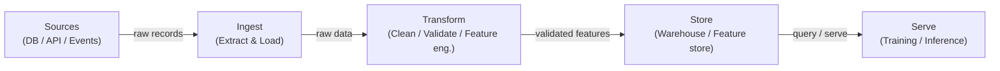

# Pipelines de dados

## Definição

Um pipeline de dados é uma sequência automatizada de etapas que move dados brutos de uma ou mais fontes para um destino onde podem ser consumidos — por analistas, dashboards ou modelos de aprendizado de máquina. No contexto de ML, os pipelines não se tratam apenas de mover dados: eles garantem que os dados cheguem na forma certa, no momento certo e com qualidade verificável para que os modelos treinem e sirvam de forma previsível. Sem pipelines confiáveis, cada artefato downstream — features, modelos treinados, predições — é suspeito.

Os pipelines de dados estão na base de todo sistema de MLOps. Eles abrangem ingestão de fontes heterogêneas (bancos de dados, APIs, fluxos de eventos, arquivos), transformação para produzir datasets limpos e estruturados ou vetores de features, armazenamento em data warehouses ou feature stores, e servição para jobs de treinamento ou endpoints de inferência online. As escolhas de design feitas na camada do pipeline — batch vs. streaming, push vs. pull, schema-on-read vs. schema-on-write — se propagam até a latência, atualização e confiabilidade do modelo.

A qualidade dos dados é o contrato oculto entre engenheiros de dados e equipes de modelos. Desvio de esquema, explosões de nulos, mudanças de distribuição e registros duplicados estão entre as causas mais comuns de degradação silenciosa de modelos. Os pipelines modernos incorporam checkpoints de validação (usando ferramentas como Great Expectations ou testes dbt) para detectar esses problemas antes que dados ruins cheguem ao treinamento ou à servição.

## Como funciona

### Batch vs. streaming

Pipelines batch processam dados em chunks delimitados em um cronograma — de hora em hora, diariamente ou acionados por chegada de arquivo. São mais simples de construir e raciocinar e são o padrão correto quando o consumidor downstream (um job de treinamento noturno, um dashboard de BI) não requer atualização sub-minutada. Pipelines de streaming processam registros à medida que chegam, habilitando features quase em tempo real para modelos online. A troca é a complexidade operacional: você deve lidar com chegadas tardias, eventos fora de ordem e semântica de exatamente-uma-vez. A maioria das plataformas de ML maduras executa ambos: batch para re-treinamento em larga escala e avaliação offline, streaming para computação de features online.

### ETL vs. ELT

Extract-Transform-Load (ETL) aplica transformações antes que os dados chegem ao armazenamento de destino. Esse era o padrão dominante quando o armazenamento era caro e os warehouses não tinham capacidade de computação. Extract-Load-Transform (ELT) carrega dados brutos primeiro, depois os transforma dentro de um warehouse ou lakehouse poderoso (por exemplo BigQuery, Snowflake, Databricks). O ELT preserva o histórico bruto e permite exploração ad-hoc sem re-ingestão — uma grande vantagem em cargas de trabalho de ML onde a engenharia de features evolui constantemente. A escolha é principalmente impulsionada por ferramentas, requisitos de governança e se o sistema de destino pode lidar com a computação de transformação eficientemente.

### Qualidade de dados e validação de esquema

As verificações de qualidade de dados devem ser incorporadas em cada estágio do pipeline, não adicionadas no final. Na ingestão, as verificações verificam se os dados de origem estão em conformidade com o esquema esperado (nomes de colunas, tipos, restrições de nulidade). Na transformação, verificações em nível de linha afirmam regras de negócios (preços não-negativos, intervalos de datas válidos, integridade referencial). Na camada de servição, verificações estatísticas detectam desvio de distribuição — o destruidor silencioso de modelos implantados. A validação de esquema pode ser feita com ferramentas como Pandera, Great Expectations ou testes dbt; o monitoramento de distribuição é tipicamente tratado por camadas de observabilidade dedicadas.



## Quando usar / Quando NÃO usar

| Usar quando | Evitar quando |
|-------------|---------------|
| Múltiplas fontes de dados precisam ser consolidadas para treinamento de ML | Os dados já residem em uma única tabela limpa pronta para uso direto |
| Os dados devem ser atualizados em um cronograma ou em tempo real | Sua análise é uma exploração pontual que não será repetida |
| Garantias de qualidade (esquema, completude, atualização) são necessárias pelos modelos downstream | A sobrecarga de um pipeline completo excede o valor para um protótipo rápido |
| As transformações precisam ser versionadas, testadas e reprodutíveis | O volume de dados é trivial e um script simples em um notebook é suficiente |
| Múltiplos consumidores (treinamento, dashboards, APIs) compartilham os mesmos dados processados | O sistema de origem já fornece uma API limpa e contratada |

## Comparações

| Critério | Pipeline batch | Pipeline streaming |
|----------|---------------|--------------------|
| Atualização de dados | Minutos a horas (orientado por cronograma) | Sub-segundo a segundos |
| Complexidade | Baixa — datasets delimitados, retentativas simples | Alta — dados tardios, janelamento, estado |
| Custo | Previsível, computação em rajadas | Computação contínua, linha de base frequentemente maior |
| Tolerância a falhas | Re-executar o batch com falha | Semântica de exatamente-uma-vez ou pelo-menos-uma-vez necessária |
| Caso de uso típico de ML | Treinamento offline, atualização noturna de features | Feature store online, pontuação em tempo real |

## Prós e contras

| Prós | Contras |
|------|---------|
| Centraliza e padroniza o acesso a dados entre equipes | Investimento inicial não trivial para construir e manter |
| Permite transformações de dados reprodutíveis e testadas | Falhas no pipeline se propagam para todos os consumidores downstream |
| Incorpora verificações de qualidade antes que dados ruins alcancem modelos | Depurar pipelines distribuídos é complexo |
| Suporta rastreamento de versões e linhagem | O streaming adiciona sobrecarga operacional significativa |
| Desacopla produtores de consumidores | Requer disciplina de governança e propriedade de dados |

## Exemplos de código

```python
"""
Simple batch data pipeline with pandas.
Reads raw CSV data, validates schema, applies transformations,
and writes a clean Parquet file ready for model training.
"""

import pandas as pd
import pandera as pa
from pandera import Column, DataFrameSchema, Check
from pathlib import Path


# --- Schema definition (contract between pipeline and consumers) ---
raw_schema = DataFrameSchema(
    {
        "user_id": Column(int, nullable=False),
        "event_ts": Column(str, nullable=False),
        "amount": Column(float, Check(lambda x: x >= 0), nullable=False),
        "category": Column(str, nullable=True),
    }
)

output_schema = DataFrameSchema(
    {
        "user_id": Column(int),
        "event_date": Column("datetime64[ns]"),
        "amount": Column(float),
        "category": Column(str),
        "log_amount": Column(float),
    }
)


def extract(source_path: str) -> pd.DataFrame:
    """Load raw data from CSV."""
    df = pd.read_csv(source_path)
    print(f"[extract] loaded {len(df):,} rows from {source_path}")
    return df


def validate(df: pd.DataFrame, schema: DataFrameSchema) -> pd.DataFrame:
    """Fail fast if data does not match the declared schema."""
    validated = schema.validate(df)
    print(f"[validate] schema check passed for {len(validated):,} rows")
    return validated


def transform(df: pd.DataFrame) -> pd.DataFrame:
    """Apply cleaning and feature engineering."""
    df = df.copy()

    # Parse timestamp column
    df["event_date"] = pd.to_datetime(df["event_ts"])
    df.drop(columns=["event_ts"], inplace=True)

    # Fill missing categories with a sentinel value
    df["category"] = df["category"].fillna("unknown")

    # Feature engineering: log-transform amount (handles skew)
    import numpy as np
    df["log_amount"] = np.log1p(df["amount"])

    # Drop duplicates based on user_id + date
    df.drop_duplicates(subset=["user_id", "event_date"], inplace=True)

    print(f"[transform] produced {len(df):,} clean rows")
    return df


def load(df: pd.DataFrame, dest_path: str) -> None:
    """Write clean data to Parquet for efficient downstream reads."""
    Path(dest_path).parent.mkdir(parents=True, exist_ok=True)
    df.to_parquet(dest_path, index=False)
    print(f"[load] wrote {len(df):,} rows to {dest_path}")


def run_pipeline(source: str, destination: str) -> None:
    """Orchestrate the full ETL pipeline."""
    raw = extract(source)
    validated_raw = validate(raw, raw_schema)
    clean = transform(validated_raw)
    validated_clean = validate(clean, output_schema)
    load(validated_clean, destination)
    print("[pipeline] completed successfully")


if __name__ == "__main__":
    run_pipeline(
        source="data/raw/events.csv",
        destination="data/processed/events.parquet",
    )
```

## Recursos práticos

- [The Data Engineering Cookbook (Andreas Kretz)](https://github.com/andkret/Cookbook) — Guia open-source abrangente cobrindo padrões de ingestão, armazenamento e processamento
- [dbt documentation](https://docs.getdbt.com/) — O padrão para transformações ELT em SQL com testes e linhagem integrados
- [Great Expectations](https://docs.greatexpectations.io/) — Framework de qualidade e validação de dados que se integra à maioria das ferramentas de pipeline
- [Pandera](https://pandera.readthedocs.io/) — Validação leve de esquema para DataFrames pandas e Spark em Python
- [Fundamentals of Data Engineering (O'Reilly)](https://www.oreilly.com/library/view/fundamentals-of-data/9781098108298/) — Livro cobrindo o ciclo de vida completo da engenharia de dados, da ingestão à servição

## Veja também

- [Apache Airflow](/docs/mlops/data-engineering/airflow)
- [Apache Spark](/docs/mlops/data-engineering/spark)
- [Apache Kafka](/docs/mlops/data-engineering/kafka)
- [MLOps](/docs/mlops)
