# Apache Kafka

## Definição

Apache Kafka é uma plataforma de streaming de eventos distribuída originalmente desenvolvida no LinkedIn e disponibilizada como open-source em 2011. É projetada para lidar com fluxos de eventos de alta throughput, baixa latência e duráveis — mensagens de log, eventos de atividade de usuários, leituras de sensores, transações — em um cluster de hardware de commodity. O Kafka atua como um log persistente e reexecutável: produtores escrevem eventos em **tópicos** nomeados, e consumidores leem desses tópicos no seu próprio ritmo, independentemente uns dos outros. Esse desacoplamento de produtores e consumidores é a propriedade arquitetural definidora que torna o Kafka tão poderoso como backbone de integração.

No contexto de aprendizado de máquina, o Kafka ocupa dois papéis críticos. Primeiro, serve como o backbone de dados para **pipelines de features em tempo real**: eventos brutos (cliques, transações, leituras de sensores) fluem pelo Kafka, são consumidos por processadores de stream ([Apache Spark](/docs/mlops/data-engineering/spark) Structured Streaming, Apache Flink ou Kafka Streams), transformados em vetores de features e gravados em um online feature store (por exemplo Feast, Tecton) para servição de modelos com baixa latência. Segundo, o Kafka é usado para **pipelines de servição de modelos**: requisições de predição chegam como mensagens Kafka, um consumidor aplica o modelo e produz eventos de predição para um tópico de resultados, habilitando inferência assíncrona e desacoplada em escala.

As garantias de durabilidade do Kafka — as mensagens são persistidas em disco e replicadas entre brokers — significam que grupos de consumidores podem reproduzir o log de eventos a partir de qualquer offset, habilitando backfills de feature stores quando novas definições de features são implantadas e suportando semântica de exatamente-uma-vez para pipelines de ML críticos.

## Como funciona

### Tópicos e partições

Um **tópico** é um log ordenado, imutável e nomeado de eventos. Os tópicos são divididos em **partições** — a unidade de paralelismo no Kafka. Cada partição é uma sequência ordenada e apenas-append de registros armazenados em disco e replicados em múltiplos brokers para tolerância a falhas. O número de partições determina o paralelismo máximo dos consumidores: dentro de um grupo de consumidores, cada partição é atribuída a exatamente uma instância de consumidor. Escolher a contagem de partições correta é uma decisão crítica de capacidade — poucas limitam o throughput, muitas aumentam a sobrecarga do broker.

### Produtores

Um **produtor** é um cliente que publica registros em um ou mais tópicos. Os registros consistem em uma chave opcional, um valor (tipicamente serializado como JSON, Avro ou Protobuf), um timestamp opcional e cabeçalhos opcionais. Quando uma chave está presente, o Kafka usa hash consistente para rotear todos os registros com a mesma chave para a mesma partição — garantindo ordenação para uma entidade específica (por exemplo, todos os eventos para um determinado `user_id` chegam na mesma partição). Os produtores configuram a semântica de confirmação: `acks=0` (disparar e esquecer), `acks=1` (confirmação do líder) ou `acks=all` (replicação ISR completa — maior durabilidade).

### Consumidores e grupos de consumidores

Um **consumidor** lê registros de uma ou mais partições. Os consumidores se organizam em **grupos de consumidores**: cada registro é entregue a exatamente um consumidor dentro de um grupo, habilitando escalonamento horizontal do processamento. Diferentes grupos de consumidores podem ler o mesmo tópico independentemente — um grupo de consumidores de pipeline de features, um grupo de consumidores de monitoramento e um grupo de consumidores de replay podem todos consumir os mesmos eventos brutos sem interferir uns com os outros. Os offsets dos consumidores (a posição em cada partição) são commitados de volta ao Kafka, fornecendo tolerância a falhas: se um consumidor falhar, outra instância continua a partir do último offset commitado.

### Kafka em pipelines de ML em tempo real

O Kafka é tipicamente posicionado entre fontes de eventos brutos e sistemas de ML downstream. Eventos brutos chegam de backends de aplicativos ou dispositivos IoT em um tópico bruto. Um processador de stream (Spark Structured Streaming, Flink ou Kafka Streams) consome esses eventos, computa features (agregados deslizantes, lookups de entidades, embeddings) e grava os resultados em um tópico de features ou diretamente em um online feature store. O feature store serve leituras de baixa latência para a camada de servição de modelos. Os resultados de predições podem por sua vez ser gravados de volta em um tópico Kafka para consumo por sistemas de monitoramento, aplicativos downstream ou gatilhos de re-treinamento.

```mermaid
flowchart LR
  Producer["Producer\n(App / IoT / DB CDC)"] -- "publish events" --> Topic["Kafka Topic\n(partitioned, replicated)"]
  Topic -- "consume raw events" --> StreamProcessor["Stream Processor\n(Spark / Flink / Kafka Streams)"]
  StreamProcessor -- "write features" --> FeatureStore["Online Feature Store\n(Feast / Redis)"]
  FeatureStore -- "low-latency read" --> ModelServer["Model Server\n(REST / gRPC)"]
  ModelServer -- "publish predictions" --> PredictionTopic["Prediction Topic"]
  PredictionTopic -- "consume" --> Consumer["Consumer\n(Monitoring / Downstream app)"]
```



## Quando usar / Quando NÃO usar

| Usar quando | Evitar quando |
|-------------|---------------|
| Você precisa de streaming de eventos de alta throughput e durável (milhões de eventos/seg) | Seu caso de uso é enfileiramento simples de tarefas com uma taxa de mensagens modesta |
| Múltiplos grupos de consumidores independentes devem ler o mesmo fluxo de eventos | Você precisa de lógica de roteamento complexa, prioridades de mensagens ou filas de dead-letter prontas para uso |
| Você precisa reproduzir eventos históricos para backfilling de feature stores | A complexidade operacional de um cluster Kafka não é justificada pela carga de trabalho |
| Computação de features em tempo real para servição de ML online é necessária | As mensagens são grandes (> alguns MB) — o Kafka é otimizado para registros pequenos e frequentes |
| A ordenação de eventos por entidade (por exemplo por usuário) deve ser preservada | Sua equipe precisa de um message broker totalmente gerenciado com carga operacional mínima (considere SQS, Pub/Sub) |

## Comparações

| Critério | Apache Kafka | RabbitMQ |
|----------|-------------|----------|
| Throughput | Extremamente alto — milhões de mensagens/seg por cluster | Moderado — centenas de milhares/seg |
| Latência | Baixa (dígito simples de ms) mas otimizada para throughput, não latência mínima | Muito baixa — sub-milissegundo em algumas configurações |
| Persistência de mensagens | Mensagens retidas por um período configurável (dias/semanas); totalmente reexecutáveis | Mensagens deletadas após confirmação por padrão; replay não é nativo |
| Modelo de consumidor | Pull-based; consumidores rastreiam seus próprios offsets; múltiplos grupos leem independentemente | Push-based; o broker roteia mensagens; cada mensagem entregue a um consumidor |
| Complexidade | Alta — cluster de brokers, ZooKeeper (pré-3.x) ou KRaft, registro de esquemas, monitoramento | Moderada — mais simples de operar; bom para filas de tarefas tradicionais |
| Melhor caso de uso de ML | Pipelines de features em tempo real, event sourcing, agregação de logs | Filas de tarefas para jobs de ML assíncronos (por exemplo requisições de pré-processamento) |

## Prós e contras

| Prós | Contras |
|------|---------|
| Throughput extremamente alto e escalabilidade horizontal | Complexidade operacional significativa — cluster, replicação, monitoramento |
| Log durável e reexecutável habilita backfills e auditabilidade | Não adequado para cargas de trabalho de mensagens muito pequenas ou infrequentes |
| Desacopla produtores e consumidores — cada um escala independentemente | A evolução de esquemas requer um registro de esquemas (Confluent Schema Registry) |
| Múltiplos grupos de consumidores podem ler o mesmo tópico independentemente | Ajustar contagens de partições, fatores de replicação e retenção requer expertise |
| Ecossistema forte: Kafka Connect, Kafka Streams, ksqlDB, Confluent Cloud | Sobrecarga operacional historicamente maior do que alternativas hospedadas (SQS, Pub/Sub) |

## Exemplos de código

```python
"""
Kafka producer and consumer example using kafka-python.

Scenario: a feature pipeline for real-time ML scoring.
  - Producer: simulates user events (clicks) and publishes to Kafka.
  - Consumer: reads events, computes a simple feature, and logs predictions.

Requires: kafka-python >= 2.0
  pip install kafka-python

Start a local Kafka broker before running (e.g. via Docker):
  docker run -d -p 9092:9092 --name kafka \
    -e KAFKA_CFG_NODE_ID=0 \
    -e KAFKA_CFG_PROCESS_ROLES=controller,broker \
    -e KAFKA_CFG_LISTENERS=PLAINTEXT://:9092,CONTROLLER://:9093 \
    -e KAFKA_CFG_ADVERTISED_LISTENERS=PLAINTEXT://localhost:9092 \
    -e KAFKA_CFG_LISTENER_SECURITY_PROTOCOL_MAP=CONTROLLER:PLAINTEXT,PLAINTEXT:PLAINTEXT \
    -e KAFKA_CFG_CONTROLLER_QUORUM_VOTERS=0@kafka:9093 \
    -e KAFKA_CFG_CONTROLLER_LISTENER_NAMES=CONTROLLER \
    bitnami/kafka:latest
"""

import json
import time
import random
import threading
from datetime import datetime

from kafka import KafkaProducer, KafkaConsumer
from kafka.admin import KafkaAdminClient, NewTopic


BROKER = "localhost:9092"
EVENTS_TOPIC = "user-events"
PREDICTIONS_TOPIC = "predictions"


# ---------------------------------------------------------------------------
# Topic creation (idempotent)
# ---------------------------------------------------------------------------

def ensure_topics() -> None:
    """Create Kafka topics if they do not already exist."""
    admin = KafkaAdminClient(bootstrap_servers=BROKER)
    existing = admin.list_topics()
    topics_to_create = [
        NewTopic(name=t, num_partitions=3, replication_factor=1)
        for t in [EVENTS_TOPIC, PREDICTIONS_TOPIC]
        if t not in existing
    ]
    if topics_to_create:
        admin.create_topics(new_topics=topics_to_create, validate_only=False)
        print(f"[admin] created topics: {[t.name for t in topics_to_create]}")
    admin.close()


# ---------------------------------------------------------------------------
# Producer: simulate user click events
# ---------------------------------------------------------------------------

def run_producer(num_events: int = 20, delay: float = 0.5) -> None:
    producer = KafkaProducer(
        bootstrap_servers=BROKER,
        value_serializer=lambda v: json.dumps(v).encode("utf-8"),
        key_serializer=lambda k: k.encode("utf-8"),
        acks="all",
        retries=3,
    )

    for i in range(num_events):
        user_id = f"user_{random.randint(1, 5)}"
        event = {
            "event_id": i,
            "user_id": user_id,
            "page_id": random.choice(["home", "product", "checkout", "search"]),
            "dwell_time_sec": round(random.uniform(1.0, 120.0), 2),
            "timestamp": datetime.utcnow().isoformat(),
        }
        future = producer.send(
            topic=EVENTS_TOPIC,
            key=user_id,
            value=event,
        )
        record_metadata = future.get(timeout=10)
        print(
            f"[producer] sent event {i:02d} | user={user_id} | "
            f"partition={record_metadata.partition} offset={record_metadata.offset}"
        )
        time.sleep(delay)

    producer.flush()
    producer.close()
    print("[producer] finished")


# ---------------------------------------------------------------------------
# Consumer: compute features and produce a mock prediction
# ---------------------------------------------------------------------------

def score_event(event: dict) -> float:
    base = event["dwell_time_sec"] / 120.0
    multiplier = {"checkout": 1.5, "product": 1.2, "search": 0.9, "home": 0.7}.get(
        event["page_id"], 1.0
    )
    return min(round(base * multiplier, 4), 1.0)


def run_consumer(max_messages: int = 20) -> None:
    consumer = KafkaConsumer(
        EVENTS_TOPIC,
        bootstrap_servers=BROKER,
        group_id="ml-feature-pipeline",
        value_deserializer=lambda b: json.loads(b.decode("utf-8")),
        auto_offset_reset="earliest",
        enable_auto_commit=True,
        consumer_timeout_ms=5000,
    )

    prediction_producer = KafkaProducer(
        bootstrap_servers=BROKER,
        value_serializer=lambda v: json.dumps(v).encode("utf-8"),
        key_serializer=lambda k: k.encode("utf-8"),
    )

    count = 0
    for message in consumer:
        if count >= max_messages:
            break

        event = message.value
        score = score_event(event)

        prediction = {
            "event_id": event["event_id"],
            "user_id": event["user_id"],
            "purchase_probability": score,
            "scored_at": datetime.utcnow().isoformat(),
        }

        prediction_producer.send(
            topic=PREDICTIONS_TOPIC,
            key=event["user_id"],
            value=prediction,
        )
        print(
            f"[consumer] event={event['event_id']:02d} user={event['user_id']} "
            f"page={event['page_id']} score={score:.4f}"
        )
        count += 1

    consumer.close()
    prediction_producer.flush()
    prediction_producer.close()
    print(f"[consumer] processed {count} messages")


# ---------------------------------------------------------------------------
# Main: run producer and consumer concurrently
# ---------------------------------------------------------------------------

if __name__ == "__main__":
    ensure_topics()

    consumer_thread = threading.Thread(target=run_consumer, args=(20,))
    consumer_thread.start()

    time.sleep(1.0)

    run_producer(num_events=20, delay=0.3)

    consumer_thread.join()
    print("[main] pipeline demo complete")
```

## Recursos práticos

- [Apache Kafka documentation](https://kafka.apache.org/documentation/) — Referência oficial cobrindo brokers, produtores, consumidores, Kafka Streams e Kafka Connect
- [Confluent Developer — Kafka tutorials](https://developer.confluent.io/tutorials/) — Tutoriais práticos para produtores, consumidores, registro de esquemas e ksqlDB
- [Kafka: The Definitive Guide, 2nd edition (O'Reilly)](https://www.oreilly.com/library/view/kafka-the-definitive/9781492043072/) — Livro abrangente cobrindo internos, operações e processamento de stream
- [kafka-python library](https://kafka-python.readthedocs.io/) — Documentação do cliente Python com referência da API de produtor, consumidor e administrador
- [Feast — Open source feature store](https://docs.feast.dev/) — Feature store que se integra com Kafka para ingestão de features em tempo real

## Veja também

- [Pipelines de dados](/docs/mlops/data-engineering)
- [Apache Spark](/docs/mlops/data-engineering/spark)
- [Monitoramento de MLOps](/docs/mlops/monitoring)
