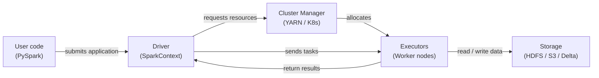

# Apache Spark

## Definição

Apache Spark é um motor de computação distribuída de código aberto projetado para processamento de dados em grande escala. Foi criado no AMPLab da UC Berkeley em 2009 e doado à Apache Software Foundation, onde se tornou o framework dominante para análise de big data. O Spark executa computações em memória em um cluster de máquinas, superando dramaticamente predecessores baseados em disco como Hadoop MapReduce para cargas de trabalho iterativas — uma propriedade que o torna especialmente adequado para aprendizado de máquina.

O Spark fornece uma API unificada para quatro cargas de trabalho principais: processamento batch, análises SQL, streaming (Structured Streaming) e aprendizado de máquina (MLlib).

## Como funciona

### RDDs e DataFrames

Resilient Distributed Datasets (RDDs) são a abstração de baixo nível do Spark. Os **DataFrames** adicionam um esquema nomeado sobre os RDDs e expõem uma API semelhante ao SQL. O otimizador Catalyst pode aplicar predicate pushdown, pruning de colunas e reordenamento de joins.

### Spark SQL

O Spark SQL permite consultar DataFrames com sintaxe SQL padrão, misturando chamadas SQL e DataFrame API no mesmo programa.

### MLlib

MLlib é a biblioteca de aprendizado de máquina distribuído do Spark. A API Pipeline (`pyspark.ml`) espelha o design do scikit-learn.

### Arquitetura driver e executor

Uma aplicação Spark tem um processo **driver** e um ou mais processos **executor**. O driver executa o programa do usuário, constrói o plano lógico e divide o trabalho em **tarefas**.



## Quando usar / Quando NÃO usar

| Usar quando | Evitar quando |
|---|---|
| O conjunto de dados não cabe na RAM de uma única máquina (> ~50 GB) | Os dados cabem confortavelmente em memória — pandas ou Polars serão mais rápidos |
| A engenharia de features requer joins ou agregações sobre bilhões de linhas | Sua equipe carece de experiência com sistemas distribuídos |
| Você precisa de treinamento ML distribuído (MLlib) ou busca de hiperparâmetros | O overhead de inicialização do job é inaceitável para tarefas sensíveis à latência |
| Você já tem um cluster Spark (Databricks, EMR, Dataproc) | Você precisa de processamento em tempo real sub-segundo |

## Comparações

| Critério | Apache Spark | Pandas |
|---|---|---|
| Escala de dados | Petabytes — particionado em um cluster | Gigabytes — limitado pela RAM de uma máquina |
| Modelo de execução | Distribuído, paralelo, avaliação lazy | In-process, eager, single-threaded por padrão |
| Complexidade de configuração | Alta | Baixa |
| Desempenho em dados pequenos | Lento devido ao overhead de serialização | Rápido |

## Prós e contras

| Prós | Contras |
|---|---|
| Escala para petabytes sem mudanças de código | Complexidade de infraestrutura e operacional significativa |
| Motor unificado para batch, SQL e streaming | Inicialização da JVM e agendamento de tarefas adicionam latência |
| Processamento em memória dramaticamente mais rápido que MapReduce baseado em disco | O gerenciamento de memória requer ajuste cuidadoso |
| Rico ecossistema: Delta Lake, Iceberg, Hudi, MLflow | PySpark serializa UDFs Python via Py4J |

## Exemplo de código

```python
from pyspark.sql import SparkSession
from pyspark.sql import functions as F
from pyspark.ml import Pipeline
from pyspark.ml.feature import VectorAssembler, StandardScaler, StringIndexer
from pyspark.ml.classification import LogisticRegression
from pyspark.ml.evaluation import BinaryClassificationEvaluator

spark = (
    SparkSession.builder
    .appName("MLPipelineExample")
    .master("local[*]")
    .config("spark.sql.shuffle.partitions", "8")
    .getOrCreate()
)

raw_df = spark.createDataFrame(
    [(1, 25.0, "engineer", 55000.0, 0), (2, 32.0, "manager", 85000.0, 1),
     (3, 28.0, "engineer", 62000.0, 0), (4, 45.0, "manager", 110000.0, 1),
     (5, 38.0, "analyst", 72000.0, 1), (6, 22.0, "analyst", 48000.0, 0)],
    schema=["id", "age", "role", "salary", "high_earner"],
)

feature_df = raw_df.withColumn("log_salary", F.log1p(F.col("salary"))).drop("salary")

role_indexer = StringIndexer(inputCol="role", outputCol="role_idx")
assembler = VectorAssembler(inputCols=["age", "log_salary", "role_idx"], outputCol="raw_features")
scaler = StandardScaler(inputCol="raw_features", outputCol="features", withMean=True, withStd=True)
lr = LogisticRegression(featuresCol="features", labelCol="high_earner", maxIter=100, regParam=0.01)

pipeline = Pipeline(stages=[role_indexer, assembler, scaler, lr])
train_df, test_df = raw_df.randomSplit([0.8, 0.2], seed=42)
model = pipeline.fit(train_df)

predictions = model.transform(test_df)
evaluator = BinaryClassificationEvaluator(labelCol="high_earner")
auc = evaluator.evaluate(predictions)
print(f"=== AUC on test set: {auc:.4f} ===")

model.write().overwrite().save("/tmp/spark_lr_model")
spark.stop()
```

## Recursos práticos

- [Documentação Apache Spark](https://spark.apache.org/docs/latest/) — Referência oficial para todas as APIs.
- [Referência da API PySpark](https://spark.apache.org/docs/latest/api/python/) — Documentação completa da API Python.
- [Databricks — Tutoriais Spark](https://docs.databricks.com/en/getting-started/index.html) — Notebooks práticos com Spark e Delta Lake.
- [Learning Spark, 2nd edition (O'Reilly)](https://www.oreilly.com/library/view/learning-spark-2nd/9781492050032/) — Livro abrangente sobre Spark 3.x.

## Veja também

- [Pipelines de dados](/docs/mlops/data-engineering)
- [Apache Kafka](/docs/mlops/data-engineering/kafka)
- [Apache Airflow](/docs/mlops/data-engineering/airflow)
