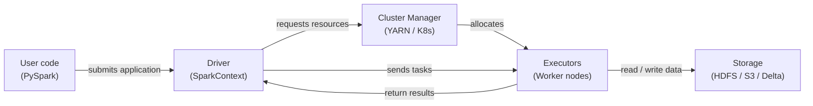

# Apache Spark

## Definição

Apache Spark é um motor de computação distribuída open-source projetado para processamento de dados em larga escala. Foi criado no AMPLab da UC Berkeley em 2009 e doado à Apache Software Foundation, onde se tornou o framework dominante para análise de big data. O Spark executa computações em memória em um cluster de máquinas, superando dramaticamente predecessores baseados em disco como Hadoop MapReduce para cargas de trabalho iterativas — uma propriedade que o torna especialmente adequado para aprendizado de máquina.

O Spark fornece uma API unificada para quatro cargas de trabalho primárias: processamento em batch, análise SQL, streaming (Structured Streaming) e aprendizado de máquina (MLlib). Essa unificação significa que as equipes podem usar um único cluster e um único modelo de programação para todo o pipeline de dados de ML — desde a ingestão bruta de logs e engenharia de features em escala de petabytes até o treinamento distribuído de modelos com MLlib. PySpark, a API Python, é a interface mais amplamente usada na comunidade de ciência de dados.

O modelo de programação é construído em torno de transformações e ações em coleções distribuídas. As transformações (map, filter, join, groupBy) são lazy — elas constroem um plano de execução, mas não executam até que uma ação (count, collect, write) seja chamada. O otimizador do Spark (Catalyst) reescreve e otimiza esse plano antes da execução, frequentemente superando SQL ajustado manualmente. O resultado é uma API expressiva de alto nível que escala de um laptop (modo local) para milhares de núcleos sem alterações no código.

## Como funciona

### RDDs e DataFrames

Resilient Distributed Datasets (RDDs) são a abstração de baixo nível do Spark: coleções imutáveis, tolerantes a falhas e particionadas de registros distribuídos em um cluster. Os RDDs suportam transformações arbitrárias em Python, Scala ou Java, mas não oferecem informações de esquema, portanto o otimizador tem visibilidade limitada dos dados. **DataFrames** (e seu equivalente tipado, Datasets em Scala/Java) adicionam um esquema nomeado sobre os RDDs e expõem uma API similar a SQL. O otimizador Catalyst pode aplicar pushdown de predicados, poda de colunas e reordenação de joins a consultas de DataFrame de maneiras que não são possíveis com RDDs brutos. Na prática, use DataFrames a menos que você precise de funcionalidade que apenas os RDDs expõem.

### Spark SQL

O Spark SQL permite consultar DataFrames com sintaxe SQL padrão, misturando chamadas SQL e API DataFrame no mesmo programa. Ele se conecta ao Hive metastore, Delta Lake, Iceberg e outros formatos de tabela, permitindo que o Spark atue como um motor de consulta sobre um data lakehouse. Em pipelines de ML, o Spark SQL é usado para consultas de agregação de features — janelas deslizantes, agregações em nível de usuário e operações de join em grandes tabelas — que seriam proibitivamente lentas em uma única máquina.

### MLlib

MLlib é a biblioteca de aprendizado de máquina distribuída do Spark. Ela fornece algoritmos para classificação, regressão, clustering, filtragem colaborativa e engenharia de features, todos implementados para rodar em paralelo no cluster. A API Pipeline (`pyspark.ml`) espelha o design do scikit-learn: etapas `Transformer` (scalers, encoders) e etapas `Estimator` (ajuste de modelo) são encadeadas em um objeto `Pipeline` que pode ser ajustado e serializado. O MLlib é melhor usado quando os dados de treinamento são grandes demais para caber na memória em uma única máquina, ou quando você precisa de ajuste distribuído de hiperparâmetros via `CrossValidator`.

### Arquitetura driver e executor

Uma aplicação Spark tem um processo **driver** e um ou mais processos **executor**. O driver executa o programa do usuário, constrói o plano lógico, negocia recursos com o gerenciador de cluster (YARN, Kubernetes ou Spark Standalone) e divide o trabalho em **tarefas**. Os executors são processos JVM rodando em nós worker; cada executor mantém um número configurável de núcleos de CPU e slots de memória (slots de tarefa). As tarefas são serializadas e enviadas aos executors, que processam suas partições de dados atribuídas e gravam resultados de volta na memória, disco ou em um sink de saída. A tolerância a falhas é alcançada recomputando partições perdidas a partir de sua linhagem (a sequência de transformações que as produziu).



## Quando usar / Quando NÃO usar

| Usar quando | Evitar quando |
|-------------|---------------|
| O dataset não cabe na RAM de uma única máquina (> ~50 GB) | Os dados cabem confortavelmente em memória — pandas ou Polars serão mais rápidos |
| A engenharia de features requer joins ou agregações em bilhões de linhas | Sua equipe não tem experiência com sistemas distribuídos e gerenciamento de cluster |
| Você precisa de treinamento distribuído de ML (MLlib) ou busca de hiperparâmetros | A sobrecarga de inicialização de job (JVM, alocação de cluster) é inaceitável para tarefas sensíveis à latência |
| Você já tem um cluster Spark (Databricks, EMR, Dataproc) | Você precisa de processamento em tempo real sub-segundo (use Flink ou Kafka Streams) |
| Você quer um motor unificado para batch, SQL e streaming nos mesmos dados | Suas transformações são lógica personalizada complexa que se beneficia de depuração single-threaded |

## Comparações

| Critério | Apache Spark | Pandas |
|----------|-------------|--------|
| Escala de dados | Petabytes — particionado em um cluster | Gigabytes — limitado pela RAM da máquina única |
| Modelo de execução | Distribuído, paralelo, avaliação lazy | In-process, eager, single-threaded por padrão |
| Complexidade de configuração | Alta — cluster, JVM, gerenciamento de dependências | Baixa — `pip install pandas` e executar |
| Desempenho em dados pequenos | Lento devido à serialização e sobrecarga de agendamento de tarefas | Rápido — mínima sobrecarga, cache-friendly |
| Familiaridade com API | PySpark é similar ao pandas, mas com semântica distribuída | Amplamente conhecido; o padrão para ciência de dados em Python |
| Integração de ML | MLlib para treinamento distribuído; integra-se com XGBoost no Spark | Ecossistema scikit-learn; melhor em classe para ML em máquina única |

## Prós e contras

| Prós | Contras |
|------|---------|
| Escala para petabytes sem alterações no código | Complexidade de infraestrutura e operacional significativa |
| Motor unificado para batch, SQL e streaming | Inicialização da JVM e agendamento de tarefas adicionam latência — não adequado para jobs pequenos |
| Processamento em memória dramaticamente mais rápido do que MapReduce baseado em disco | Gerenciamento de memória (spills, pressão de GC) requer ajuste cuidadoso |
| Ecossistema rico: Delta Lake, Iceberg, Hudi, integração MLflow | PySpark serializa UDFs Python via Py4J — pode ser lento para lógica personalizada |
| Tolerância a falhas via recomputação de linhagem | Depurar jobs distribuídos é mais difícil do que código pandas em máquina única |

## Exemplos de código

```python
"""
PySpark examples:
  1. DataFrame operations for feature engineering at scale
  2. MLlib Pipeline for training a logistic regression model

Requires: pyspark >= 3.4
Run locally with: spark-submit spark_ml_example.py
  or in a notebook with a SparkSession already available.
"""

from pyspark.sql import SparkSession
from pyspark.sql import functions as F
from pyspark.sql.types import DoubleType
from pyspark.ml import Pipeline
from pyspark.ml.feature import VectorAssembler, StandardScaler, StringIndexer
from pyspark.ml.classification import LogisticRegression
from pyspark.ml.evaluation import BinaryClassificationEvaluator


# --- 1. Create a SparkSession (local mode for demo) ---
spark = (
    SparkSession.builder
    .appName("MLPipelineExample")
    .master("local[*]")           # Use all local CPU cores
    .config("spark.sql.shuffle.partitions", "8")  # Reduce for small data
    .getOrCreate()
)

spark.sparkContext.setLogLevel("WARN")


# --- 2. Load raw data ---
# In production: spark.read.parquet("s3://bucket/path/") or .format("delta")
raw_df = spark.createDataFrame(
    [
        (1, 25.0, "engineer", 55000.0, 0),
        (2, 32.0, "manager", 85000.0, 1),
        (3, 28.0, "engineer", 62000.0, 0),
        (4, 45.0, "manager", 110000.0, 1),
        (5, 38.0, "analyst", 72000.0, 1),
        (6, 22.0, "analyst", 48000.0, 0),
        (7, 51.0, "manager", 125000.0, 1),
        (8, 29.0, "engineer", 59000.0, 0),
    ],
    schema=["id", "age", "role", "salary", "high_earner"],
)

print("=== Raw data ===")
raw_df.show()


# --- 3. DataFrame feature engineering ---
feature_df = (
    raw_df
    # Log-transform salary to reduce skew
    .withColumn("log_salary", F.log1p(F.col("salary")))
    # Normalized age within role group (window function)
    .withColumn(
        "age_norm",
        (F.col("age") - F.mean("age").over(
            __import__("pyspark.sql.window", fromlist=["Window"])
            .Window.partitionBy("role")
        )).cast(DoubleType())
    )
    # Drop the original salary column (replaced by log_salary)
    .drop("salary")
)

print("=== Engineered features ===")
feature_df.show()


# --- 4. MLlib Pipeline: encode → assemble → scale → train ---

# 4a. Encode categorical column 'role' to numeric index
role_indexer = StringIndexer(inputCol="role", outputCol="role_idx")

# 4b. Assemble feature columns into a single vector
assembler = VectorAssembler(
    inputCols=["age", "log_salary", "role_idx"],
    outputCol="raw_features",
)

# 4c. Standardize feature vector (zero mean, unit variance)
scaler = StandardScaler(
    inputCol="raw_features",
    outputCol="features",
    withMean=True,
    withStd=True,
)

# 4d. Logistic regression classifier
lr = LogisticRegression(
    featuresCol="features",
    labelCol="high_earner",
    maxIter=100,
    regParam=0.01,
)

# 4e. Build and fit the pipeline
pipeline = Pipeline(stages=[role_indexer, assembler, scaler, lr])

train_df, test_df = raw_df.randomSplit([0.8, 0.2], seed=42)
model = pipeline.fit(train_df)

# --- 5. Evaluate ---
predictions = model.transform(test_df)
evaluator = BinaryClassificationEvaluator(labelCol="high_earner")
auc = evaluator.evaluate(predictions)
print(f"=== AUC on test set: {auc:.4f} ===")

predictions.select("id", "high_earner", "prediction", "probability").show()

# --- 6. Save model for serving ---
model.write().overwrite().save("/tmp/spark_lr_model")
print("Model saved to /tmp/spark_lr_model")

spark.stop()
```

## Recursos práticos

- [Apache Spark documentation](https://spark.apache.org/docs/latest/) — Referência oficial para todas as APIs incluindo PySpark, SQL, Streaming e MLlib
- [PySpark API reference](https://spark.apache.org/docs/latest/api/python/) — Documentação completa da API Python para DataFrames, SQL e MLlib
- [Databricks — Spark tutorials](https://docs.databricks.com/en/getting-started/index.html) — Notebooks práticos cobrindo Spark em escala com Delta Lake
- [Learning Spark, 2nd edition (O'Reilly)](https://www.oreilly.com/library/view/learning-spark-2nd/9781492050032/) — Livro abrangente cobrindo Spark 3.x, Structured Streaming e Delta Lake

## Veja também

- [Pipelines de dados](/docs/mlops/data-engineering)
- [Apache Kafka](/docs/mlops/data-engineering/kafka)
- [Apache Airflow](/docs/mlops/data-engineering/airflow)
