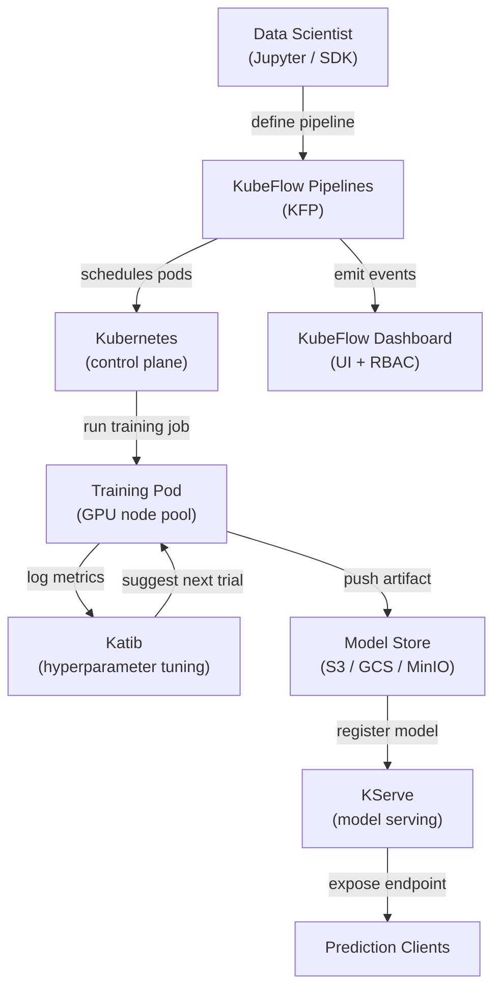

# KubeFlow

## Definição

KubeFlow é um kit de ferramentas de ML de código aberto projetado para tornar a implantação de workflows de ML no Kubernetes simples, portátil e escalável. Foi originalmente criado pelo Google e agora é um projeto da Cloud Native Computing Foundation (CNCF) com ampla adoção industrial. O KubeFlow não tenta ser uma plataforma monolítica única; em vez disso, é uma coleção cuidadosamente selecionada de componentes nativos do Kubernetes que cada um resolve um problema distinto de infraestrutura de ML.

Os componentes principais são: **KubeFlow Pipelines (KFP)** para definir e executar workflows de ML baseados em DAG como trabalhos do Kubernetes; **Katib** para ajuste automatizado de hiperparâmetros e busca de arquitetura neural usando otimização bayesiana, busca aleatória ou aprendizado por reforço; **KFServing (agora KServe)** para serviço de modelos escalável com escalonamento sem servidor, implantações canary e suporte a múltiplos runtimes de serviço; e **Servidores de Jupyter Notebook** gerenciados pelo painel KubeFlow para desenvolvimento interativo em um ambiente multi-tenant. Toda a plataforma é instalada via um único conjunto de manifestos do Kubernetes e gerenciada por meio de uma interface web.

O ponto forte do KubeFlow é que ele roda em qualquer cluster Kubernetes — on-premises, GKE, EKS, AKS ou um cluster kind local — tornando-o adequado para organizações que exigem que os dados permaneçam em sua própria infraestrutura. Seu principal custo é a complexidade operacional: a curva de aprendizado é íngreme, e operar o KubeFlow em produção requer sólida expertise em Kubernetes.

## Como funciona



### KubeFlow Pipelines (KFP)

O KFP permite que cientistas de dados definam pipelines de ML como código Python usando o SDK do KFP. Cada etapa do pipeline é um componente containerizado: uma função Python decorada com `@dsl.component` é compilada em uma especificação de container que o KFP executa como um pod do Kubernetes. O DAG do pipeline é compilado para um arquivo de Representação Intermediária (IR YAML) que o controlador backend do KFP agenda no cluster. Essa abordagem significa que cada etapa é totalmente reprodutível: a imagem do container é fixada, entradas e saídas são artefatos rastreados no armazenamento de metadados do KFP (ML Metadata / MLMD), e todo o grafo de execução é visível na interface com logs, entradas, saídas e status por etapa.

### Katib — Ajuste de Hiperparâmetros

O Katib é o componente AutoML do KubeFlow. Ele define um recurso customizado Kubernetes `Experiment` que especifica o espaço de busca (intervalos e tipos de parâmetros), a métrica objetivo (minimizar perda, maximizar acurácia) e o algoritmo de busca (otimização bayesiana via Processo Gaussiano, CMA-ES, busca aleatória ou busca em grade). O Katib executa trials em paralelo — cada trial é um trabalho de treinamento completo — e usa os resultados para sugerir melhores configurações para os trials subsequentes. A integração com o KFP significa que um pipeline completo (dados → engenharia de features → treino → avaliação) pode ser tratado como um único trial do Katib, permitindo AutoML de ponta a ponta em pipelines complexos.

### KServe (anteriormente KFServing)

O KServe estende o Kubernetes com recursos customizados `InferenceService` que definem declarativamente implantações de serviço de modelos. Especifique o framework (sklearn, xgboost, pytorch, tensorflow, custom) e o URI do modelo (caminho S3, PVC) e o KServe gerencia: baixar o modelo, selecionar o runtime de serviço correto, configurar o proxy sidecar, expor o endpoint via Istio e escalar réplicas para zero quando inativo (modo sem servidor). Implantações canary dividem o tráfego entre duas versões do modelo por porcentagem, permitindo rollouts seguros. Os componentes transformer e explainer permitem conectar lógica de pré-processamento e explicabilidade baseada em SHAP ao lado do preditor.

### Multi-tenancy e RBAC

O painel KubeFlow implementa multi-tenancy via namespaces do Kubernetes: cada usuário ou equipe obtém um namespace isolado com suas próprias cotas de recursos, servidores de notebooks e execuções de pipeline. O Controle de Acesso Baseado em Funções (RBAC) restringe quais usuários podem visualizar, executar ou gerenciar pipelines e modelos. Isso torna o KubeFlow adequado para grandes organizações onde múltiplas equipes compartilham um único cluster de GPU e precisam de isolamento sem clusters separados.

## Quando usar / Quando NÃO usar

| Usar quando | Evitar quando |
|---|---|
| As cargas de trabalho de ML são executadas em um cluster Kubernetes existente | A equipe não tem expertise em Kubernetes e não tem um engenheiro de plataforma dedicado |
| É necessária orquestração completa de pipelines, AutoML e serviço em uma plataforma | Um serviço gerenciado (SageMaker, Vertex AI) se adequa à estratégia do provedor de nuvem |
| Requisitos de residência de dados impedem o uso de serviços de ML em nuvem gerenciados | Apenas o serviço de modelos é necessário, não a orquestração completa do pipeline |
| A organização opera um cluster de GPU compartilhado com necessidades de multi-tenancy | Os workflows de ML são simples o suficiente para um único script de treinamento |
| Recursos avançados de serviço são necessários (escalonamento sem servidor, canary, transformers) | A velocidade de entrada em produção é mais importante do que o controle de infraestrutura |

## Comparações

| Critério | KubeFlow | ML no Kubernetes (vanilla) |
|---|---|---|
| Complexidade | Alta — muitos CRDs, controladores e dependências do Istio | Média — apenas objetos Kubernetes padrão |
| Funcionalidades | Pipelines, AutoML (Katib), serviço (KServe), gerenciamento de notebooks | O que você constrói e configura manualmente |
| Curva de aprendizado | Íngreme — requer conhecimento do domínio Kubernetes + KubeFlow | Média — conhecimento K8s padrão suficiente |
| Flexibilidade | Moderada — extensível, mas vinculada às abstrações do KubeFlow | Alta — controle total sobre cada recurso Kubernetes |
| Opções gerenciadas | KubeFlow no GKE (Vertex AI Pipelines), AWS Managed KubeFlow | Qualquer Kubernetes gerenciado (EKS, GKE, AKS) |
| Tempo de configuração | Dias a semanas para uma instalação de nível produção | Horas a dias dependendo da complexidade da carga de trabalho |

## Vantagens e desvantagens

| Vantagens | Desvantagens |
|---|---|
| Plataforma de ML unificada — pipelines, ajuste, serviço em um sistema | Complexidade operacional muito alta e grande número de componentes móveis |
| Agnóstico a nuvem — funciona em qualquer cluster Kubernetes | Curva de aprendizado íngreme; requer expertise em Kubernetes para operar |
| Serviço de modelos sem servidor com autoescalonamento para zero | Instalação exigente em recursos (Istio, Argo Workflows, MLMD, Knative) |
| Multi-tenancy sólido com isolamento de namespace e RBAC | Upgrades entre versões do KubeFlow podem ser complexos |
| Comunidade CNCF ativa e amplas integrações de ecossistema | Depurar falhas frequentemente requer entender múltiplas camadas (K8s → Argo → Python SDK) |

## Exemplos de código

```python
# kubeflow_pipeline.py
# KubeFlow Pipelines v2 SDK — defines a two-step ML pipeline:
#   1. Data preprocessing component
#   2. Training component
# Requires: pip install kfp==2.*

from kfp import dsl
from kfp.client import Client


# --- Component 1: Preprocess raw CSV data ---

@dsl.component(
    base_image="python:3.11-slim",
    packages_to_install=["pandas==2.2.0", "scikit-learn==1.4.0"],
)
def preprocess(
    raw_data_path: str,
    output_features: dsl.Output[dsl.Dataset],
) -> None:
    """
    Reads raw CSV, applies feature engineering, and writes features as Parquet.
    KFP tracks output_features as a Dataset artifact with URI and metadata.
    """
    import pandas as pd
    from sklearn.preprocessing import StandardScaler

    df = pd.read_csv(raw_data_path)

    # Simple feature engineering: scale numeric columns
    scaler = StandardScaler()
    numeric_cols = df.select_dtypes("number").columns.tolist()
    df[numeric_cols] = scaler.fit_transform(df[numeric_cols])

    # KFP provides output_features.path — write artifact there
    df.to_parquet(output_features.path, index=False)
    print(f"Wrote {len(df)} rows to {output_features.path}")


# --- Component 2: Train a model on the preprocessed features ---

@dsl.component(
    base_image="python:3.11-slim",
    packages_to_install=["pandas==2.2.0", "scikit-learn==1.4.0", "joblib==1.3.0"],
)
def train(
    features: dsl.Input[dsl.Dataset],
    n_estimators: int,
    model_output: dsl.Output[dsl.Model],
    metrics_output: dsl.Output[dsl.Metrics],
) -> None:
    """
    Trains a RandomForestClassifier and writes the model artifact + metrics.
    """
    import json
    import joblib
    import pandas as pd
    from sklearn.ensemble import RandomForestClassifier
    from sklearn.model_selection import train_test_split
    from sklearn.metrics import accuracy_score

    df = pd.read_parquet(features.path)
    X = df.drop(columns=["label"]).values
    y = df["label"].values
    X_train, X_test, y_train, y_test = train_test_split(X, y, test_size=0.2, random_state=42)

    clf = RandomForestClassifier(n_estimators=n_estimators, random_state=42)
    clf.fit(X_train, y_train)

    accuracy = float(accuracy_score(y_test, clf.predict(X_test)))

    # Write model artifact (KFP tracks the URI and lineage)
    joblib.dump(clf, model_output.path)

    # Log metrics — visible in the KubeFlow Pipelines UI
    metrics_output.log_metric("accuracy", accuracy)
    metrics_output.log_metric("n_estimators", n_estimators)
    print(f"Accuracy: {accuracy:.4f}")


# --- Pipeline definition ---

@dsl.pipeline(
    name="fraud-detection-pipeline",
    description="Two-stage pipeline: preprocess CSV data, then train RandomForest.",
)
def fraud_pipeline(
    raw_data_path: str = "gs://my-bucket/data/train.csv",
    n_estimators: int = 100,
) -> None:
    # Step 1: preprocess — runs in its own pod
    preprocess_task = preprocess(raw_data_path=raw_data_path)

    # Step 2: train — depends on the Dataset artifact from step 1
    train_task = train(
        features=preprocess_task.outputs["output_features"],
        n_estimators=n_estimators,
    )
    # Assign this task to a node pool with GPU (optional resource request)
    train_task.set_accelerator_type("NVIDIA_TESLA_T4").set_accelerator_limit(1)


# --- Submit the pipeline to a running KubeFlow Pipelines instance ---

if __name__ == "__main__":
    # Connect to KFP backend (port-forward: kubectl port-forward -n kubeflow svc/ml-pipeline 8888:8888)
    client = Client(host="http://localhost:8888")

    run = client.create_run_from_pipeline_func(
        pipeline_func=fraud_pipeline,
        arguments={
            "raw_data_path": "gs://my-bucket/data/train.csv",
            "n_estimators": 200,
        },
        run_name="fraud-pipeline-run-v1",
        experiment_name="fraud-detection",
    )
    print(f"Pipeline run created: {run.run_id}")
    print(f"View at: http://localhost:8888/#/runs/details/{run.run_id}")
```

## Recursos práticos

- [Documentação oficial do KubeFlow](https://www.kubeflow.org/docs/) — Visão geral da arquitetura, guias de componentes e instruções de instalação.
- [Referência do SDK KubeFlow Pipelines](https://kubeflow-pipelines.readthedocs.io/) — Referência completa da API para o SDK Python KFP v2.
- [Documentação do KServe](https://kserve.github.io/website/) — Runtime de serviço, especificação InferenceService e guia de implantação canary.
- [Guia de ajuste de hiperparâmetros do Katib](https://www.kubeflow.org/docs/components/katib/overview/) — Especificação de experimentos, algoritmos de busca e integração com operadores de treinamento.

## Veja também

- [ML no Kubernetes](/docs/mlops/deployment/ml-kubernetes)
- [Serviço de modelos](/docs/mlops/deployment/model-serving)
- [Monitoramento](/docs/mlops/monitoring)
