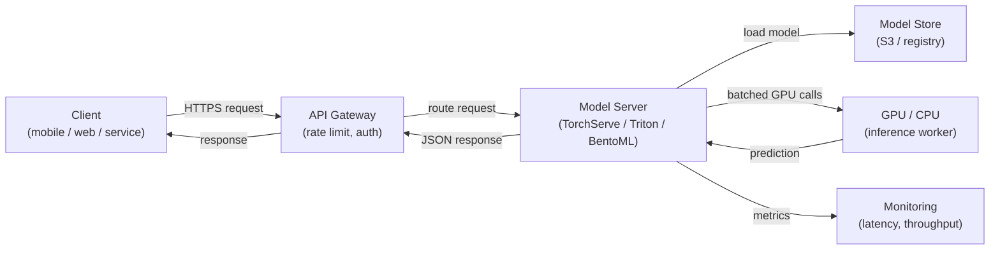

# Servição de modelos

## Definição

A servição de modelos é o processo de disponibilizar um modelo de ML treinado para inferência — aceitando dados de entrada, executando uma predição e retornando resultados para os chamadores. É a ponte entre o mundo offline de treinamento e experimentação e o mundo online de aplicações em produção. Uma camada de servição bem projetada é tão importante quanto a qualidade do modelo: um modelo 98% preciso implantado com latência de 10 segundos é frequentemente inútil em um contexto de produto.

A servição de modelos abrange três paradigmas distintos que diferem fundamentalmente em seus requisitos de latência, throughput e infraestrutura. **Inferência em batch** processa grandes volumes de dados em um cronograma, gravando predições em um banco de dados ou arquivo; é a opção de maior throughput, mas não pode responder a requisições individuais em tempo real. **Inferência em tempo real (online)** expõe um endpoint de API que retorna predições em milissegundos; prioriza baixa latência sobre throughput. **Inferência em streaming** processa eventos de uma fila ou stream à medida que chegam, situando-se entre batch e tempo real tanto em latência quanto em complexidade.

Escalar um sistema de servição de modelos envolve desafios específicos de ML: modelos são tipicamente arquivos grandes carregados na memória (ou VRAM da GPU), o tempo de inicialização importa para autoscaling, a utilização de GPU deve ser maximizada para ser custo-efetiva e a latência de predição tem uma distribuição de cauda que pode ser imprevisível sob carga. Frameworks como NVIDIA Triton Inference Server, TorchServe e BentoML existem especificamente para resolver esses desafios.

## Como funciona



### Inferência em batch

Na inferência em batch, um job agendado (cron, DAG do Airflow ou um agendador em nuvem) lê um dataset do armazenamento, executa predições em todo o conjunto e grava os resultados de volta. O modelo é carregado uma vez por execução do job, portanto o custo amortizado por predição de carregamento é negligenciável. Esse padrão se adequa a casos de uso como gerar recomendações noturnas, pontuar todos os clientes para risco de churn ou anotar um data warehouse com sentimento previsto. O principal alavancamento de escala é o paralelismo entre partições de dados — cada partição pode ser processada por um worker separado. Uma armadilha comum é o training-serving skew: o script de pontuação em batch usa lógica de pré-processamento diferente do pipeline de treinamento.

### Inferência via API em tempo real

A servição em tempo real expõe o modelo por trás de um endpoint HTTP (ou gRPC) que responde de forma síncrona a requisições individuais. O principal desafio de engenharia é a latência: o carregamento do modelo é lento (segundos a minutos para modelos grandes), portanto as instâncias devem ser mantidas quentes ou pré-escalonadas. Frameworks como TorchServe e BentoML lidam com o carregamento do modelo, desserialização de requisições, agrupamento de requisições concorrentes (dynamic batching) e health checks. O escalonamento horizontal via Kubernetes ou serviços gerenciados (AWS SageMaker Endpoints, GCP Vertex AI Endpoints) adiciona réplicas quando o throughput excede um limiar. A memória da GPU determina quantas réplicas do modelo cabem em um único nó, o que impulsiona diretamente o custo.

### Inferência em streaming

A inferência em streaming conecta o servidor de modelos a um fluxo de eventos (Kafka, Kinesis, Pub/Sub). Os eventos chegam continuamente e as predições são emitidas para um tópico de saída. Esse padrão se adequa à detecção de fraudes em fluxos de transações, detecção de anomalias em tempo real em dados de sensores ou qualquer caso de uso onde um novo evento deve ser pontuado em centenas de milissegundos, mas o volume é muito alto para HTTP síncrono. O servidor de modelos atua como um consumer-producer: ele lê do tópico de entrada, executa a inferência e grava no tópico de saída. O gerenciamento de backpressure é crítico — o consumidor não deve ficar para trás do produtor durante picos de tráfego.

### Considerações de escalonamento

O agendamento de GPU é o fator de custo dominante para modelos grandes. Os principais alavancamentos incluem: **dynamic batching** (acumulando múltiplas requisições em uma única chamada de GPU), **quantização de modelos** (reduzindo precisão de FP32 para INT8 para caber mais modelos por GPU), **caching de modelos** (mantendo o modelo na VRAM entre requisições) e **autoscaling** (adicionando ou removendo réplicas com base na profundidade da fila ou SLOs de latência). O Triton Inference Server suporta todos esses recursos com um arquivo de configuração declarativo por modelo, tornando-o a escolha preferida para frotas de modelos heterogêneas em produção.

## Quando usar / Quando NÃO usar

| Usar quando | Evitar quando |
|---|---|
| Uma aplicação downstream precisa de predições no momento da requisição | Todos os consumidores podem tolerar predições computadas horas antes |
| As predições devem refletir a versão mais recente do modelo imediatamente | O dataset é pequeno o suficiente para ser pontuado em um batch noturno com baixo custo |
| Pontuação orientada a eventos é necessária (streaming) | O modelo é usado apenas para análise offline sem sistema downstream |
| O custo de inferência do modelo é alto e a utilização de GPU deve ser maximizada | Estágio de protótipo onde um script simples chamado diretamente é suficiente |

## Comparações

| Critério | TorchServe | TF Serving | NVIDIA Triton | BentoML | FastAPI (custom) |
|---|---|---|---|---|---|
| Suporte a frameworks | Nativo PyTorch | TensorFlow / Keras | Multi-framework (ONNX, TF, PyTorch, TensorRT) | Agnóstico a framework | Agnóstico a framework |
| Dynamic batching | Sim | Sim | Sim (altamente configurável) | Sim | Implementação manual |
| Suporte gRPC | Sim | Sim | Sim | Sim | Via grpcio |
| Otimização de GPU | Boa | Boa | Melhor em classe | Boa | Manual |
| Facilidade de configuração | Média | Média | Alta (configuração complexa) | Baixa (Python-nativo) | Muito baixa |
| Prontidão para produção | Alta | Alta | Muito alta | Alta | Depende da implementação |

## Prós e contras

| Prós | Contras |
|------|---------|
| Desacopla atualizações de modelos dos releases de código da aplicação | Adiciona complexidade de infraestrutura em comparação com executar inferência inline |
| Permite escalonamento independente da capacidade de inferência | A latência de cold-start pode ser significativa para modelos grandes |
| Frameworks específicos lidam com batching, health checks e versionamento | Instâncias de GPU são caras; o gerenciamento de custos requer atenção |
| Suporta testes A/B e implantações canary nativamente | A inferência em streaming requer expertise em Kafka/Kinesis além de ML |
| Hooks de monitoramento para latência, throughput e desvio de predições | O model-serving skew (pré-processamento diferente) é um risco persistente |

## Exemplos de código

```python
# fastapi_serving.py
# Production-ready FastAPI model serving endpoint with dynamic model loading,
# input validation via Pydantic, and health check endpoint.

from __future__ import annotations

import os
from contextlib import asynccontextmanager
from typing import List

import joblib
import numpy as np
import uvicorn
from fastapi import FastAPI, HTTPException
from pydantic import BaseModel, Field

# --- Input/output schemas ---

class PredictionRequest(BaseModel):
    """Input features for a single inference request."""
    features: List[float] = Field(
        ...,
        min_length=20,
        max_length=20,
        description="Exactly 20 numerical features (must match training schema).",
        example=[0.1, -0.5, 1.2] + [0.0] * 17,
    )


class PredictionResponse(BaseModel):
    label: int
    probability: float
    model_version: str


# --- Model lifecycle management ---

MODEL: dict = {}  # holds the loaded model and metadata


@asynccontextmanager
async def lifespan(app: FastAPI):
    """Load model at startup; release resources on shutdown."""
    model_path = os.environ.get("MODEL_PATH", "models/model.joblib")
    model_version = os.environ.get("MODEL_VERSION", "unknown")

    if not os.path.exists(model_path):
        raise RuntimeError(f"Model file not found at {model_path}")

    MODEL["clf"] = joblib.load(model_path)
    MODEL["version"] = model_version
    print(f"Model v{model_version} loaded from {model_path}")
    yield
    MODEL.clear()
    print("Model unloaded.")


# --- API definition ---

app = FastAPI(
    title="ML Model Serving API",
    description="Real-time inference endpoint for the fraud detection model.",
    version="1.0.0",
    lifespan=lifespan,
)


@app.get("/health")
def health() -> dict:
    """Liveness probe — returns 200 when the model is loaded."""
    if "clf" not in MODEL:
        raise HTTPException(status_code=503, detail="Model not loaded")
    return {"status": "ok", "model_version": MODEL["version"]}


@app.post("/predict", response_model=PredictionResponse)
def predict(request: PredictionRequest) -> PredictionResponse:
    """
    Run inference on a single input vector.
    Returns the predicted label and the positive-class probability.
    """
    clf = MODEL.get("clf")
    if clf is None:
        raise HTTPException(status_code=503, detail="Model not ready")

    X = np.array(request.features).reshape(1, -1)
    label = int(clf.predict(X)[0])
    probability = float(clf.predict_proba(X)[0][label])

    return PredictionResponse(
        label=label,
        probability=probability,
        model_version=MODEL["version"],
    )


if __name__ == "__main__":
    # For local testing: MODEL_PATH=models/model.joblib MODEL_VERSION=v1 python fastapi_serving.py
    uvicorn.run(app, host="0.0.0.0", port=8080, log_level="info")
```

```python
# client_example.py
# Simple client that calls the FastAPI serving endpoint

import httpx

BASE_URL = "http://localhost:8080"

# Health check
response = httpx.get(f"{BASE_URL}/health")
print(response.json())  # {"status": "ok", "model_version": "v1"}

# Prediction
payload = {"features": [0.1, -0.5, 1.2] + [0.0] * 17}
response = httpx.post(f"{BASE_URL}/predict", json=payload)
print(response.json())
# {"label": 1, "probability": 0.87, "model_version": "v1"}
```

## Recursos práticos

- [BentoML documentation](https://docs.bentoml.com/) — Servição de modelos agnóstica a framework com batching integrado, containerização e integrações de implantação.
- [NVIDIA Triton Inference Server](https://docs.nvidia.com/deeplearning/triton-inference-server/user-guide/docs/index.html) — Servição de alto desempenho para frotas de modelos multi-framework com otimização de GPU.
- [TorchServe documentation](https://pytorch.org/serve/) — Solução oficial de servição de modelos PyTorch com personalização de handlers.
- [FastAPI documentation](https://fastapi.tiangolo.com/) — Framework web Python moderno e de alto desempenho amplamente usado para APIs de servição de ML personalizadas.

## Veja também

- [KubeFlow](/docs/mlops/deployment/kubeflow)
- [ML no Kubernetes](/docs/mlops/deployment/ml-kubernetes)
- [Monitoramento](/docs/mlops/monitoring)
