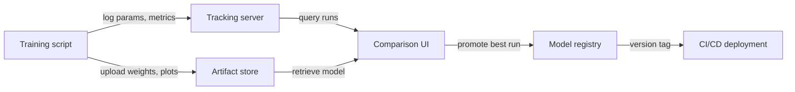

# Rastreamento de experimentos

## Definição

O rastreamento de experimentos é a prática de registrar sistematicamente cada detalhe de uma execução de treinamento de ML para que os resultados possam ser reproduzidos, comparados e auditados. Sem ele, as equipes perdem o controle de quais hiperparâmetros produziram quais resultados, desperdiçam recursos redescubrindo configurações e não conseguem demonstrar conformidade quando modelos influenciam decisões de alto risco.

Um registro completo de experimento captura quatro categorias de informações. **Parâmetros** são as entradas para o treinamento: taxa de aprendizado, tamanho do batch, escolhas de arquitetura do modelo, conjuntos de features. **Métricas** são as saídas: curvas de perda, acurácia, F1, AUC, latência. **Artefatos** são os arquivos produzidos: pesos do modelo treinado, datasets pré-processados, gráficos de avaliação, matrizes de confusão. **Metadados** são o contexto: versão do código (git commit), ambiente (versões de bibliotecas, hardware), versão do dataset, tempo de parede e o nome da pessoa que executou.

O versionamento de modelos é a extensão natural: uma vez que você rastreia experimentos, pode promover o artefato da melhor execução para um registro de modelos, marcá-lo com uma versão semântica e vincular cada implantação de servição de volta a um experimento específico. Isso fecha o loop entre experimentação e produção, tornando os rollbacks simples e as auditorias possíveis.

## Como funciona

### Instrumentação

O script de treinamento é instrumentado com algumas linhas de código SDK que abrem um contexto de "execução" e registram dados em um servidor central durante o treinamento. A maioria dos frameworks (PyTorch Lightning, Hugging Face Trainer, Keras) tem integrações nativas que registram automaticamente métricas comuns sem código adicional.

### Armazenamento centralizado

Os dados registrados são persistidos em um armazenamento backend — um sistema de arquivos local, um banco de dados em nuvem gerenciado ou uma plataforma SaaS. Parâmetros e métricas são armazenados como registros estruturados; artefatos são enviados para armazenamento de objetos (S3, GCS, Azure Blob). O backend é consultado pela interface e pelo SDK.

### Comparação e análise

A interface de rastreamento permite filtrar, ordenar e comparar execuções em todas as quatro dimensões. Você pode plotar curvas de métricas para muitas execuções no mesmo gráfico, agrupar por valores de parâmetros e exportar resultados para um dataframe para análise personalizada. Isso facilita identificar as execuções ótimas de Pareto (melhor acurácia para um determinado orçamento de latência, por exemplo).

### Promoção de modelos

O artefato da melhor execução é registrado em um registro de modelos com um número de versão e estado de transição (Staging → Production → Archived). Sistemas de CI/CD downstream consultam o registro para saber qual versão do modelo implantar, criando uma transição limpa entre experimentação e servição.



## Quando usar / Quando NÃO usar

| Usar quando | Evitar quando |
|-------------|---------------|
| Você executa mais do que um punhado de experimentos e precisa comparar resultados | Você está executando um único treinamento pontual e nunca revisitará |
| A reprodutibilidade é necessária (indústria regulada, publicação de pesquisa) | O experimento é trivial (por exemplo, uma busca em grade de dois parâmetros com resultados óbvios) |
| Vários membros da equipe compartilham resultados de experimentos | A equipe trabalha sozinha e mantém notas em uma planilha pessoal suficiente |
| Você quer promover versões de modelos para produção de forma sistemática | O modelo nunca é implantado e os resultados não precisam ser auditados |

## Comparações

| Critério | MLflow | Weights & Biases (W&B) |
|----------|--------|------------------------|
| Facilidade de configuração | Hospedável localmente com `mlflow ui`; apenas pip install | Conta SaaS necessária; instalação CLI; nível gratuito disponível |
| Qualidade da interface | Funcional mas simples; bom para comparação tabular | Refinada, interativa; excelente para mídia e sobreposição de curvas |
| Colaboração | Servidor compartilhado necessário; sem controle de acesso integrado na versão OSS | Workspaces em equipe, acesso baseado em funções e compartilhamento integrados |
| Preços | Gratuito e open-source; oferta gerenciada via Databricks | Nível gratuito para indivíduos; pago para grandes equipes |
| Integrações | Integração profunda com Databricks, Spark, sklearn, PyTorch | Integrações amplas; forte em pesquisa e academia |

## Exemplos de código

```python
# generic_tracking.py
# Framework-agnostic experiment tracking pattern.
# Works with any ML library; swap out the model training code as needed.
# pip install mlflow scikit-learn pandas

import mlflow
from sklearn.linear_model import LogisticRegression
from sklearn.datasets import make_classification
from sklearn.model_selection import train_test_split
from sklearn.metrics import accuracy_score, roc_auc_score
import numpy as np

# --- Configuration ---
EXPERIMENT_NAME = "binary-classification-demo"
PARAMS = {
    "C": 0.1,           # Regularization strength
    "max_iter": 1000,
    "solver": "lbfgs",
    "random_state": 42,
}

# --- Data preparation ---
X, y = make_classification(
    n_samples=2000, n_features=20, n_informative=10, random_state=42
)
X_train, X_test, y_train, y_test = train_test_split(
    X, y, test_size=0.2, random_state=42
)

# --- Tracking boilerplate (works with MLflow, swap with wandb.init() for W&B) ---
mlflow.set_experiment(EXPERIMENT_NAME)

with mlflow.start_run(run_name=f"logreg-C{PARAMS['C']}") as run:
    # 1. Log all hyperparameters at the start
    mlflow.log_params(PARAMS)

    # 2. Train the model
    model = LogisticRegression(**PARAMS)
    model.fit(X_train, y_train)

    # 3. Evaluate and log metrics
    y_pred = model.predict(X_test)
    y_prob = model.predict_proba(X_test)[:, 1]

    metrics = {
        "accuracy": accuracy_score(y_test, y_pred),
        "roc_auc": roc_auc_score(y_test, y_prob),
        "n_train": len(X_train),
        "n_test": len(X_test),
    }
    mlflow.log_metrics(metrics)

    # 4. Log the model artifact
    mlflow.sklearn.log_model(model, artifact_path="model")

    # 5. Log any extra files (e.g., feature importance, plots)
    import json, tempfile, os
    with tempfile.TemporaryDirectory() as tmp:
        meta_path = os.path.join(tmp, "run_metadata.json")
        with open(meta_path, "w") as f:
            json.dump({"git_commit": "abc1234", "dataset_version": "v1.3"}, f)
        mlflow.log_artifact(meta_path)

    print(f"Run ID : {run.info.run_id}")
    print(f"Accuracy: {metrics['accuracy']:.4f} | ROC-AUC: {metrics['roc_auc']:.4f}")
```

## Recursos práticos

- [MLflow Tracking Documentation](https://mlflow.org/docs/latest/tracking.html) — Guia oficial cobrindo a API de rastreamento, backends, armazenamentos de artefatos e autologging.
- [Weights & Biases – Experiment Tracking Quickstart](https://docs.wandb.ai/quickstart) — Guia passo a passo para registrar sua primeira execução W&B em menos de cinco minutos.
- [Neptune.ai – Experiment Tracking Guide](https://neptune.ai/blog/ml-experiment-tracking) — Visão geral neutra sobre o que rastrear, por que e como comparar ferramentas.
- [Made With ML – Experiment Tracking](https://madewithml.com/courses/mlops/experiment-tracking/) — Guia prático baseado em notebook integrando MLflow em um loop de treinamento real.

## Veja também

- [MLflow](/docs/mlops/mlflow)
- [Weights & Biases](/docs/mlops/wandb)
- [MLOps](/docs/mlops)
