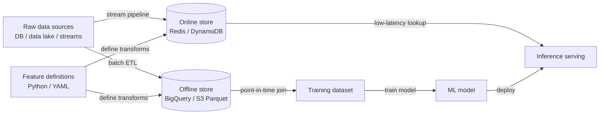

# Feature stores

## Definição

Um feature store é um sistema de dados especificamente projetado para gerenciar o ciclo de vida das features de ML — desde a transformação de dados brutos, passando pelo armazenamento, até a servição com baixa latência — de forma consistente entre o treinamento do modelo e a inferência em produção. Sem um feature store, as equipes frequentemente encontram **training-serving skew**: a lógica de computação de features executada offline durante o treinamento difere sutilmente da lógica usada no momento da servição, fazendo com que os modelos em produção tenham desempenho inferior em relação à avaliação offline.

Os feature stores resolvem isso armazenando definições de features como código e executando a mesma lógica de transformação em ambos os contextos. Eles mantêm duas camadas de armazenamento complementares: um **offline store** (um data warehouse ou data lake, por exemplo BigQuery, Redshift, arquivos Parquet no S3) que contém grandes conjuntos de dados históricos usados para treinamento e pontuação em batch, e um **online store** (um banco de dados chave-valor de baixa latência, por exemplo Redis, DynamoDB, Cassandra) que serve valores de features pré-computados para modelos no momento da inferência com latência de sub-milissegundos.

O problema do training-serving skew e a necessidade de reutilização de features tornam-se agudos em escala. Uma grande organização pode ter dezenas de equipes, cada uma computando features similares (gasto do cliente nos últimos 7 dias, duração da sessão, tipo de dispositivo) de forma independente, com diferenças sutis na lógica de negócios. Um feature store fornece um catálogo governado onde as features são definidas uma vez, validadas e reutilizadas entre equipes e modelos, reduzindo drasticamente o esforço de engenharia duplicado e o risco de lógica de features inconsistente.

## Como funciona

### Definição de features e pipelines de transformação

As features são definidas como código — classes Python ou manifestos YAML — que especificam a fonte de dados, a lógica de transformação e a chave de entidade (o identificador usado para buscar features, por exemplo, `user_id`, `product_id`). Pipelines de transformação em batch são executados em um cronograma para materializar features no offline store. Pipelines de transformação em stream (por exemplo, usando Flink ou Spark Structured Streaming) mantêm o online store atualizado para features sensíveis ao tempo, como sinais de fraude em tempo real.

### Offline store: recuperação de dados de treinamento

Ao treinar um modelo, você gera um dataset fornecendo uma lista de chaves de entidade e um conjunto de timestamps (um "point-in-time join"). O feature store recupera os valores de features que eram corretos no momento de cada timestamp, evitando vazamento de dados futuros. Essa correção point-in-time é uma das coisas mais difíceis de implementar corretamente sem um feature store e uma das garantias mais valiosas que ele fornece.

### Online store: servição com baixa latência

Antes de um modelo servir uma predição, ele precisa de valores de features para a entidade sendo pontuada (por exemplo, o usuário fazendo uma requisição). O cliente do feature store consulta o online store pela chave de entidade e retorna um vetor de features em milissegundos. Como as mesmas definições de features sustentam tanto o offline quanto o online store, os valores têm a garantia de ser computados de forma idêntica.

### Registro de features e governança

Um catálogo de features documenta cada feature: sua definição, proprietário, tipo de dado, garantia de atualização e quais modelos a consomem. Essa camada de governança permite a descoberta — uma nova equipe pode navegar pelas features existentes antes de escrever as próprias — e análise de impacto — entender quais modelos são afetados se a fonte de dados upstream de uma feature mudar.

### Jobs de materialização

A materialização é o processo de executar pipelines de transformação e gravar resultados nos stores. A materialização offline é executada como um job em batch agendado. A materialização online copia um subconjunto de dados offline no online store para recuperação rápida, ou é orientada por pipelines de streaming quando a atualização em tempo real é necessária. Feast, Tecton e Hopsworks fornecem comandos CLI ou integrações de orquestração para acionar e monitorar a materialização.



## Quando usar / Quando NÃO usar

| Usar quando | Evitar quando |
|-------------|---------------|
| Múltiplas equipes ou modelos compartilham a mesma lógica de features e a consistência é crítica | Você tem um único modelo com um conjunto pequeno e estável de features que nunca muda |
| O training-serving skew causou incidentes em produção ou lacunas de acurácia | Seus requisitos de latência de inferência são relaxados e a pontuação em batch é suficiente |
| Você precisa de datasets de treinamento corretos em point-in-time para evitar vazamento de dados | A sobrecarga de engenharia de operar um feature store excede a escala do projeto |
| Features devem ser servidas com latência de sub-milissegundos para predições em tempo real | Você está em exploração inicial e suas features ainda não são estáveis o suficiente para formalizar |
| Requisitos regulatórios exigem um catálogo de features governado e auditável | Sua equipe de ciência de dados é pequena e não tem suporte de engenharia de ML para gerenciar a infraestrutura |

## Comparações

| Critério | Feast | Tecton | Hopsworks |
|----------|-------|--------|-----------|
| Open-source | Sim (Apache 2.0) | Não (SaaS / gerenciado) | Núcleo sim; enterprise pago |
| Oferta gerenciada | Não (apenas self-hosted) | Sim (totalmente gerenciado) | Sim (cloud ou on-prem) |
| Features em streaming | Limitado (via fonte Kafka) | Nativo, qualidade de produção | Nativo com integração Flink |
| Monitoramento de features | Básico | Avançado (drift integrado) | Avançado |
| Melhor para | Equipes que querem controle OSS | Empresas que precisam de features gerenciadas em tempo real | Equipes que querem open-source completo |

## Prós e contras

| Prós | Contras |
|------|---------|
| Elimina o training-serving skew ao compartilhar a lógica de transformação | Investimento de engenharia significativo para configurar e operar |
| Permite reutilização de features entre equipes, reduzindo esforço duplicado | Adiciona uma dependência operacional ao caminho de servição (disponibilidade do online store) |
| Joins point-in-time evitam vazamento de dados nos dados de treinamento | Definições de features podem se tornar um gargalo se a governança for muito rígida |
| Centraliza a governança e a documentação de features | Curva de aprendizado para cientistas de dados não familiarizados com a abstração |
| Suporta servição de features em batch e em tempo real | Excessivo para equipes com poucos modelos e features estáveis |

## Exemplos de código

```python
# feast_feature_store_example.py
# Demonstrates defining, materializing, and retrieving features with Feast.
# Prerequisites:
#   pip install feast pandas scikit-learn
#   feast init my_feature_repo && cd my_feature_repo
#   (Adjust the data source path below to match your environment.)

# ── feature_repo/features.py ──────────────────────────────────────────────────
# This file defines the feature views and entities in your Feast registry.

from datetime import timedelta
import pandas as pd
from feast import (
    Entity,
    FeatureStore,
    FeatureView,
    Field,
    FileSource,
)
from feast.types import Float32, Int64

# 1. Define the entity — the primary key used to look up features
driver = Entity(
    name="driver",
    description="A taxi driver identified by driver_id",
)

# 2. Define the data source (parquet file for local demo; swap for BigQuery etc.)
driver_stats_source = FileSource(
    path="data/driver_stats.parquet",   # generated below
    timestamp_field="event_timestamp",
    created_timestamp_column="created",
)

# 3. Define a FeatureView — the transformation and storage spec
driver_stats_fv = FeatureView(
    name="driver_hourly_stats",
    entities=[driver],
    ttl=timedelta(days=7),              # how long features stay valid
    schema=[
        Field(name="conv_rate", dtype=Float32),
        Field(name="acc_rate", dtype=Float32),
        Field(name="avg_daily_trips", dtype=Int64),
    ],
    online=True,                        # materialize to online store
    source=driver_stats_source,
)


# ── generate_sample_data.py ───────────────────────────────────────────────────
# Run this once to create sample data before materializing.
def generate_driver_stats(path: str = "data/driver_stats.parquet") -> None:
    import os
    os.makedirs("data", exist_ok=True)

    rng = pd.date_range(end=pd.Timestamp.now(tz="UTC"), periods=48, freq="h")
    df = pd.DataFrame({
        "driver_id": [1001, 1002, 1003] * 16,
        "event_timestamp": list(rng[:48]),
        "created": pd.Timestamp.now(tz="UTC"),
        "conv_rate": [0.8, 0.6, 0.9] * 16,
        "acc_rate": [0.95, 0.88, 0.92] * 16,
        "avg_daily_trips": [150, 200, 175] * 16,
    })
    df.to_parquet(path, index=False)
    print(f"Sample data written to {path}")


# ── training_data_retrieval.py ────────────────────────────────────────────────
# Retrieve a point-in-time correct training dataset.
def get_training_data(repo_path: str = ".") -> pd.DataFrame:
    store = FeatureStore(repo_path=repo_path)

    # Entity DataFrame: the entities and timestamps we want features for
    entity_df = pd.DataFrame({
        "driver_id": [1001, 1002, 1003],
        "event_timestamp": [
            pd.Timestamp("2024-01-15 10:00:00", tz="UTC"),
            pd.Timestamp("2024-01-15 11:00:00", tz="UTC"),
            pd.Timestamp("2024-01-15 12:00:00", tz="UTC"),
        ],
        "label": [1, 0, 1],   # target variable for supervised training
    })

    # Point-in-time join: retrieves feature values as-of each row's timestamp
    training_df = store.get_historical_features(
        entity_df=entity_df,
        features=[
            "driver_hourly_stats:conv_rate",
            "driver_hourly_stats:acc_rate",
            "driver_hourly_stats:avg_daily_trips",
        ],
    ).to_df()

    print("Training dataset:")
    print(training_df.to_string())
    return training_df


# ── online_serving.py ─────────────────────────────────────────────────────────
# Retrieve features for real-time inference after materialization.
def get_online_features(driver_ids: list, repo_path: str = ".") -> dict:
    store = FeatureStore(repo_path=repo_path)

    # Materialize features to the online store first:
    # store.materialize_incremental(end_date=pd.Timestamp.now(tz="UTC"))

    feature_vector = store.get_online_features(
        features=[
            "driver_hourly_stats:conv_rate",
            "driver_hourly_stats:acc_rate",
            "driver_hourly_stats:avg_daily_trips",
        ],
        entity_rows=[{"driver_id": did} for did in driver_ids],
    ).to_dict()

    print("Online feature vector:")
    for key, values in feature_vector.items():
        print(f"  {key}: {values}")
    return feature_vector


# ── main ──────────────────────────────────────────────────────────────────────
if __name__ == "__main__":
    generate_driver_stats()
    # After running `feast apply` to register the feature views:
    # training_df = get_training_data()
    # online_fv   = get_online_features([1001, 1002])
    print("Feature definitions ready. Run `feast apply` to register them.")
```

## Recursos práticos

- [Feast Documentation](https://docs.feast.dev/) — Documentação oficial do feature store open-source mais utilizado, incluindo quickstart, API de feature view e guias de implantação.
- [Tecton – Feature Store Concepts](https://docs.tecton.ai/docs/introduction/feature-store-concepts) — Visão geral conceitual neutra de online/offline stores, joins point-in-time e pipelines de features da equipe que construiu o Michelangelo da Uber.
- [Hopsworks Documentation](https://docs.hopsworks.ai/) — Feature store completo com streaming Flink nativo, monitoramento de features e um registro de modelos.
- [Feature Store for ML – O'Reilly](https://www.featurestore.org/) — Recurso da comunidade agregando pesquisas, posts de blog e palestras sobre padrões de design de feature stores.
- [Chip Huyen – Feature Engineering for ML Systems](https://huyenchip.com/2022/01/02/real-time-machine-learning-challenges-and-solutions.html) — Mergulho profundo nos desafios de engenharia da computação de features em tempo real e como os feature stores os resolvem.

## Veja também

- [MLOps](/docs/mlops)
- [MLflow](/docs/mlops/mlflow)
- [Rastreamento de experimentos](/docs/mlops/experiment-tracking)
