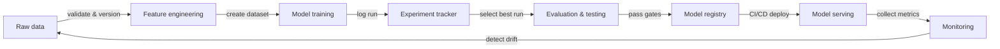

# MLOps

## Definição

MLOps — Machine Learning Operations — é a disciplina de aplicar princípios e práticas de DevOps ao ciclo de vida do aprendizado de máquina. Ela fornece as ferramentas, os processos e as normas culturais necessárias para construir, implantar e manter modelos de ML em produção de forma confiável. Sem MLOps, equipes frequentemente entregam modelos que funcionam em notebooks, mas se degradam silenciosamente em produção, não podem ser reproduzidos seis meses depois ou levam semanas para ser atualizados.

Os princípios fundamentais do MLOps são **reprodutibilidade** (cada experimento e implantação pode ser recriado exatamente), **automação** (pipelines de dados, treinamento, avaliação e implantação são acionados por código, não por etapas manuais), **monitoramento** (o desempenho do modelo é acompanhado continuamente em produção) e **colaboração** (cientistas de dados, engenheiros de ML e equipes de plataforma compartilham ferramentas, padrões e responsabilidades). Esses princípios mapeiam diretamente os pilares do DevOps — integração contínua, entrega e feedback — aplicados a dados e artefatos de modelos, não apenas ao código.

O MLOps surgiu quando equipes descobriram que as práticas de engenharia de software que controlam a complexidade de software não se transferem automaticamente para ML. O código é apenas uma entrada: as distribuições de dados mudam, a acurácia dos modelos decai, experimentos proliferam e um modelo que teve bom desempenho em um conjunto de validação em janeiro pode se comportar de forma imprevisível em julho. O MLOps fornece o suporte para detectar e responder a esses problemas de forma sistemática.

## Como funciona

### Gerenciamento de dados

Os dados brutos são ingeridos, validados, versionados e armazenados em um feature store ou data lake. A validação de dados detecta desvios de esquema e mudanças de distribuição antes que corrompam uma execução de treinamento. O versionamento garante que os modelos possam ser re-treinados exatamente com os dados que produziram uma versão anterior.

### Experimentação e treinamento

Cientistas de dados executam experimentos — variando hiperparâmetros, arquiteturas e conjuntos de features — e todas as execuções são registradas em um rastreador de experimentos. A melhor execução é promovida para avaliação adicional. Pipelines de treinamento automatizados (acionados por novos dados ou um commit de código) eliminam etapas manuais e permitem re-treinamento contínuo.

### Avaliação e validação

Modelos candidatos são avaliados em conjuntos de teste separados, verificações de fairness e orçamentos de latência antes da promoção. Gates de avaliação impedem que regressões cheguem à produção. Testes A/B ou implantações shadow podem comparar modelos candidatos e de produção no tráfego ao vivo.

### Implantação e servição

Modelos aprovados são empacotados, registrados em um registro de modelos e implantados via pipelines de CI/CD na infraestrutura de servição. Implantações canary e mecanismos de rollback reduzem riscos. A infraestrutura como código garante que os ambientes de servição sejam reprodutíveis.

### Monitoramento e feedback

Métricas de produção — distribuições de predições, desvio de dados, latência, taxas de erro — são coletadas e retornadas à equipe. Alertas acionam pipelines de re-treinamento ou rollbacks de modelos. Os loops de feedback fecham o ciclo de vida do ML, transformando sinais de produção em novos dados de treinamento.



## Quando usar / Quando NÃO usar

| Usar quando | Evitar quando |
|-------------|---------------|
| Modelos são implantados em produção e atendem usuários reais | O projeto é uma análise pontual ou protótipo de pesquisa |
| Vários membros da equipe colaboram nos mesmos modelos | A equipe tem menos de duas pessoas e um único modelo |
| Modelos requerem re-treinamento periódico conforme os dados mudam | O modelo é estático e nunca será atualizado |
| Requisitos regulatórios ou de auditoria exigem reprodutibilidade | A velocidade de exploração é a única prioridade e nenhuma implantação em produção está planejada |
| Você tem mais de um modelo em produção para gerenciar | A sobrecarga de ferramentas supera o tempo de vida esperado do projeto |

## Exemplos de código

```python
# mlflow_quickstart.py
# Demonstrates basic MLflow experiment tracking for a simple classifier.
# Run: pip install mlflow scikit-learn

import mlflow
import mlflow.sklearn
from sklearn.datasets import load_iris
from sklearn.ensemble import RandomForestClassifier
from sklearn.model_selection import train_test_split
from sklearn.metrics import accuracy_score, f1_score

# Load data
X, y = load_iris(return_X_y=True)
X_train, X_test, y_train, y_test = train_test_split(
    X, y, test_size=0.2, random_state=42
)

# Define hyperparameters to log
params = {
    "n_estimators": 100,
    "max_depth": 5,
    "random_state": 42,
}

# Start an MLflow experiment run
mlflow.set_experiment("iris-classification")

with mlflow.start_run(run_name="random-forest-baseline"):
    # Log hyperparameters
    mlflow.log_params(params)

    # Train the model
    clf = RandomForestClassifier(**params)
    clf.fit(X_train, y_train)

    # Evaluate
    y_pred = clf.predict(X_test)
    accuracy = accuracy_score(y_test, y_pred)
    f1 = f1_score(y_test, y_pred, average="weighted")

    # Log metrics
    mlflow.log_metric("accuracy", accuracy)
    mlflow.log_metric("f1_score", f1)

    # Log the trained model with a registered name
    mlflow.sklearn.log_model(
        clf,
        artifact_path="model",
        registered_model_name="iris-random-forest",
    )

    print(f"Accuracy: {accuracy:.4f} | F1: {f1:.4f}")
    print(f"Run ID: {mlflow.active_run().info.run_id}")
```

## Recursos práticos

- [Google – Practitioners Guide to MLOps](https://services.google.com/fh/files/misc/practitioners_guide_to_mlops_whitepaper.pdf) — Whitepaper abrangente cobrindo níveis de maturidade de MLOps, escolhas de ferramentas e padrões organizacionais do Google Cloud.
- [MLflow Documentation](https://mlflow.org/docs/latest/index.html) — Documentação oficial da plataforma de MLOps open-source mais amplamente adotada, cobrindo rastreamento, registro, projetos e implantação.
- [Made With ML – MLOps Course](https://madewithml.com/) — Curso gratuito de MLOps baseado em projetos que percorre todo o ciclo de vida com código real.
- [Chip Huyen – Designing Machine Learning Systems](https://www.oreilly.com/library/view/designing-machine-learning/9781098107956/) — Livro da O'Reilly cobrindo design de sistemas de ML em produção, pipelines de dados, feature stores e monitoramento.
- [CD Foundation – MLOps SIG](https://github.com/cdfoundation/sig-mlops) — Definições, panorama e melhores práticas para MLOps orientados pela comunidade.

## Veja também

- [Rastreamento de experimentos](/docs/mlops/experiment-tracking)
- [MLflow](/docs/mlops/mlflow)
- [Weights & Biases](/docs/mlops/wandb)
- [Feature stores](/docs/mlops/feature-stores)
