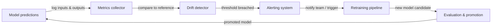

# Monitoramento de ML

## Definição

O monitoramento de ML é a prática de observar continuamente modelos de aprendizado de máquina e os dados que eles operam após a implantação. Ao contrário do software tradicional, que ou funciona ou lança um erro, um modelo pode se degradar silenciosamente: ele ainda produz saídas, mas essas saídas ficam cada vez mais erradas à medida que o mundo muda. O monitoramento de ML fornece os sistemas de alerta precoce que detectam essa degradação antes que cause danos ao negócio.

Três fenômenos impulsionam a maior parte da degradação de modelos em produção. **Concept drift** ocorre quando a relação estatística entre as features de entrada e a variável alvo muda — por exemplo, um modelo de detecção de fraude treinado antes de um novo vetor de ataque aparecer sistematicamente perderá o novo padrão. **Data drift** (também chamado de covariate shift) ocorre quando a distribuição das features de entrada muda sem uma mudança correspondente na relação alvo — padrões sazonais, mudanças demográficas e mudanças no pipeline de dados upstream causam data drift. **Degradação de modelos** é a perda cumulativa de desempenho que resulta de um ou ambos os desvios; se não tratada, manifesta-se como taxas de erro crescentes, receita decrescente e experiências de usuário degradadas.

O monitoramento eficaz de ML abrange três camadas: **monitoramento de qualidade de dados** (esquema, taxas de nulos, intervalos de valores), **monitoramento de distribuição** (testes estatísticos para desvio em features e predições) e **monitoramento de desempenho de modelos** (métricas de negócios e de ML calculadas contra a verdade fundamental quando os rótulos estão disponíveis). A combinação de todas as três camadas fornece defesa em profundidade — detectando problemas cedo, em sua fonte e em seu efeito downstream.

## Como funciona

### Coleta de dados e predições

Cada requisição de predição passa por uma camada de servição instrumentada que registra entradas, saídas, timestamps e metadados em um armazenamento centralizado (armazenamento de objetos, um data warehouse ou uma plataforma de streaming como Kafka). Datasets de referência — tipicamente o dataset de treinamento ou validação — são armazenados junto com os logs de produção para servir como linha de base estatística para cálculos de desvio. Pipelines de rótulos ingerem a verdade fundamental atrasada (os rótulos frequentemente chegam horas ou semanas após a predição) e os unem de volta às predições registradas.

### Detecção de desvio

Os detectores de desvio comparam a distribuição de produção atual com a linha de base de referência usando testes estatísticos. Para features contínuas, o Population Stability Index (PSI), o teste Kolmogorov-Smirnov ou a distância de Wasserstein medem a mudança distribucional. Para features categóricas, testes qui-quadrado ou divergência Jensen-Shannon são comuns. As predições em si são tratadas como uma feature: uma mudança na distribuição de predições (por exemplo, um classificador de repente emitindo "positivo" 80% do tempo quando a linha de base era 30%) é um poderoso sinal precoce antes que os rótulos de verdade fundamental cheguem.

### Computação de métricas de desempenho

Quando os rótulos de verdade fundamental estão disponíveis, as métricas de desempenho são calculadas em janelas deslizantes ou coortes baseadas em tempo. Acurácia, precisão, recall, F1, RMSE e AUC-ROC são métricas comuns de ML. Métricas de negócios — receita atribuída a decisões orientadas por modelos, taxa de deflexão de chamadas, taxa de cliques em recomendações — são frequentemente mais acionáveis. Latência, throughput e taxas de erro são métricas de infraestrutura que indicam a saúde da servição e devem ser monitoradas junto com a qualidade do modelo.

### Alertas e escalonamento

Limiares e regras de detecção de anomalias disparam alertas quando uma métrica cruza um limite. Limiares estáticos são simples, mas frágeis; controle estatístico de processos (por exemplo, gráficos de controle) e detecção de anomalias baseada em ML se adaptam à sazonalidade. Os alertas roteiam para PagerDuty, Slack ou e-mail dependendo da severidade. Hierarquias de alertas bem projetadas distinguem entre eventos informativos (apenas registrar), avisos (notificar a equipe de ML) e eventos críticos (chamar plantão, acionar rollback automatizado ou re-treinamento).

### Loop de feedback de re-treinamento

O monitoramento é a entrada para o loop de re-treinamento. Quando o desvio é detectado ou o desempenho degrada abaixo de um limiar, um pipeline automatizado (ou decisão humana) aciona um job de re-treinamento com dados frescos. Após o re-treinamento, o novo candidato a modelo passa por gates de avaliação antes da promoção, fechando o loop.



## Quando usar / Quando NÃO usar

| Usar quando | Evitar quando |
|-------------|---------------|
| Um modelo está implantado em produção e serve usuários reais | O modelo é uma análise pontual que nunca será usada novamente |
| As decisões do modelo têm impacto mensurável nos negócios | O volume de predições é tão baixo que os testes estatísticos carecem de poder |
| Os rótulos de verdade fundamental estão eventualmente disponíveis | Você não tem mecanismo de feedback para coletar rótulos ou resultados de negócios |
| Os requisitos regulatórios exigem desempenho de modelos auditável | O custo das ferramentas de monitoramento excede o valor esperado do modelo implantado |
| O processo de geração de dados é conhecido por mudar ao longo do tempo | O modelo é re-treinado continuamente de qualquer forma e o desvio é implicitamente tratado |
| Múltiplos modelos estão em produção simultaneamente | Um humano revisa cada predição individualmente, tornando o monitoramento automatizado redundante |

## Comparações

| Ferramenta | Foco principal | Detecção de desvio | Rastreamento de desempenho | Hospedagem |
|------------|---------------|---------------------|---------------------------|------------|
| Evidently AI | Relatórios de qualidade de dados e modelos | Sim (30+ testes) | Sim | Self-hosted / Cloud |
| WhyLabs | Observabilidade de LLM e ML | Sim (estatístico) | Sim | SaaS |
| Arize AI | Plataforma de observabilidade de ML | Sim | Sim | SaaS |
| Dashboards personalizados | Totalmente personalizado | Implementação manual | Implementação manual | Self-hosted |
| MLflow | Rastreamento de experimentos + monitoramento básico | Limitado | Sim (offline) | Self-hosted / Cloud |

## Prós e contras

| Aspecto | Prós | Contras |
|---------|------|---------|
| Detecção de concept drift | Detecta degradação do modelo antes do impacto nos negócios | Requer rótulos de verdade fundamental, que chegam com atraso |
| Detecção de data drift | Funciona sem rótulos — detecta problemas cedo | Pode produzir falsos positivos em mudanças distribucionais benignas |
| Alertas automatizados | Reduz o tempo de detecção de semanas para minutos | Limiares mal ajustados causam fadiga de alertas |
| Ecossistema de ferramentas | Opções ricas de open-source e SaaS | Adiciona complexidade de infraestrutura e carga de manutenção |
| Gatilhos de re-treinamento | Fecha o loop automaticamente | Risco de instabilidade no treinamento se o re-treinamento for acionado com muita frequência |

## Exemplos de código

```python
# drift_detection.py
# Demonstrates concept and data drift detection using Evidently AI.
# Run: pip install evidently scikit-learn pandas numpy

import numpy as np
import pandas as pd
from sklearn.datasets import make_classification
from sklearn.ensemble import RandomForestClassifier
from sklearn.model_selection import train_test_split

from evidently.report import Report
from evidently.metric_preset import DataDriftPreset, ClassificationPreset
from evidently import ColumnMapping

# --- 1. Simulate reference (training) data ---
X, y = make_classification(
    n_samples=1000,
    n_features=10,
    n_informative=5,
    random_state=42,
)
feature_names = [f"feature_{i}" for i in range(10)]
df = pd.DataFrame(X, columns=feature_names)
df["target"] = y

X_train, X_test, y_train, y_test = train_test_split(
    df[feature_names], df["target"], test_size=0.2, random_state=42
)

# --- 2. Train a simple classifier ---
clf = RandomForestClassifier(n_estimators=100, random_state=42)
clf.fit(X_train, y_train)

# Build reference DataFrame with predictions
reference = X_test.copy()
reference["target"] = y_test.values
reference["prediction"] = clf.predict(X_test)

# --- 3. Simulate production data with drift ---
# Introduce feature shift: scale feature_0 to simulate distribution change
X_prod, y_prod = make_classification(
    n_samples=500,
    n_features=10,
    n_informative=5,
    random_state=99,  # Different seed = different distribution
)
df_prod = pd.DataFrame(X_prod, columns=feature_names)
df_prod["feature_0"] = df_prod["feature_0"] * 3.0  # Artificial drift on feature_0
df_prod["target"] = y_prod

production = df_prod[feature_names].copy()
production["target"] = df_prod["target"].values
production["prediction"] = clf.predict(df_prod[feature_names])

# --- 4. Run Evidently drift + performance report ---
column_mapping = ColumnMapping(
    target="target",
    prediction="prediction",
    numerical_features=feature_names,
)

report = Report(metrics=[DataDriftPreset(), ClassificationPreset()])
report.run(
    reference_data=reference,
    current_data=production,
    column_mapping=column_mapping,
)

# Save HTML report for inspection
report.save_html("drift_report.html")
print("Drift report saved to drift_report.html")

# --- 5. Extract drift results programmatically ---
result = report.as_dict()
drift_summary = result["metrics"][0]["result"]
n_drifted = drift_summary.get("number_of_drifted_columns", 0)
total = drift_summary.get("number_of_columns", 0)
share = drift_summary.get("share_of_drifted_columns", 0)

print(f"Drifted columns: {n_drifted}/{total} ({share:.1%})")
if share > 0.3:
    print("WARNING: Significant drift detected — consider retraining.")
else:
    print("Drift within acceptable bounds.")
```

## Recursos práticos

- [Evidently AI documentation](https://docs.evidentlyai.com/) — Documentação oficial da principal biblioteca de monitoramento de ML open-source, cobrindo testes de desvio, relatórios e monitoramento em tempo real.
- [WhyLabs ML observability platform](https://whylabs.ai/docs) — Documentação da plataforma SaaS para monitoramento de modelos LLM e ML com perfilamento estatístico e alertas.
- [Chip Huyen — Monitoring ML models in production](https://huyenchip.com/2022/02/07/data-distribution-shifts-and-monitoring.html) — Post de blog detalhado cobrindo mudanças de distribuição de dados, estratégias de monitoramento e trade-offs práticos.
- [Google — Rules of Machine Learning: monitoring section](https://developers.google.com/machine-learning/guides/rules-of-ml#monitoring) — Orientação de engenharia do Google sobre o que monitorar e como configurar alertas para ML em produção.
- [Arize AI — ML observability guide](https://arize.com/ml-observability/) — Guia para profissionais cobrindo desvio, monitoramento de embeddings e a pilha de observabilidade para ML.

## Veja também

- [Prometheus](/docs/mlops/monitoring/prometheus)
- [Grafana](/docs/mlops/monitoring/grafana)
- [Servição de modelos](/docs/mlops/deployment/model-serving)
