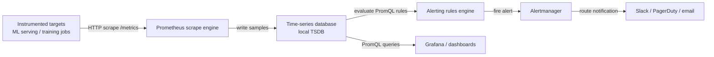

# Prometheus

## Definição

Prometheus é um toolkit de monitoramento e alertas de sistemas open-source originalmente construído no SoundCloud e agora um projeto graduado da CNCF. Ele armazena todos os dados como séries temporais: fluxos de valores de ponto flutuante com timestamp identificados por um nome de métrica e um conjunto de rótulos chave-valor. Esse modelo é uma adequação natural para dados operacionais — uso de CPU, contagens de requisições, taxas de erro — e para sinais específicos de ML como latência de predição, throughput e distribuições de valores de features ao longo do tempo.

A escolha arquitetural definidora no Prometheus é seu **modelo de scraping pull-based**. Em vez de exigir que as aplicações instrumentadas enviem métricas para um coletor central, o Prometheus periodicamente faz scraping de endpoints HTTP (por padrão `/metrics`) expostos pelos alvos. Essa inversão de controle torna a descoberta de serviços, o controle de acesso e a depuração significativamente mais simples: você pode fazer curl em qualquer endpoint de métricas de alvo diretamente para ver o que o Prometheus irá coletar. Os alvos são descobertos via configuração estática ou descoberta dinâmica de serviços (Kubernetes, Consul, EC2, etc.).

O Prometheus não é uma solução de armazenamento de longo prazo por design. Seu banco de dados de séries temporais (TSDB) local é otimizado para ingestão rápida e consulta de dados recentes, tipicamente retendo 15 dias. Para armazenamento de longo prazo, o Prometheus pode escrever remotamente para sistemas como Thanos, Cortex ou VictoriaMetrics. Em contextos de ML, o Prometheus é a camada de coleta e alertas; o [Grafana](/docs/mlops/monitoring/grafana) fornece a camada de visualização e dashboarding sobre ele.

## Como funciona

### Instrumentação de alvos

As aplicações expõem métricas via um endpoint HTTP `/metrics` no formato de exposição Prometheus — um formato de texto simples de linhas `metric_name{label="value"} numeric_value timestamp`. Em Python, a biblioteca `prometheus_client` fornece tipos Counter, Gauge, Histogram e Summary que lidam com o formato de exposição automaticamente. Um processo de servição de ML tipicamente expõe contadores para total de requisições de predição, histogramas para latência de requisições e gauges para versões de modelos atualmente carregados e utilização de recursos.

### Scraping e armazenamento

O Prometheus avalia seu arquivo de configuração para determinar quais alvos fazer scraping e em qual intervalo (padrão: 15 segundos). Em cada scraping, ele busca o endpoint `/metrics`, analisa o formato de exposição e grava as amostras no seu TSDB local em chunks comprimidos. O TSDB usa um write-ahead log (WAL) para durabilidade e compacta dados em blocos ao longo do tempo. A cardinalidade de rótulos é o principal alavancamento de desempenho: cada combinação única de valores de rótulos cria uma série temporal separada, portanto rótulos ilimitados (por exemplo, IDs de usuários) devem ser evitados.

### Consultas PromQL e alertas

PromQL (Prometheus Query Language) é uma linguagem de consulta funcional para selecionar e agregar dados de séries temporais. Vetores instantâneos selecionam o valor atual de um conjunto de séries; vetores de intervalo selecionam uma janela de amostras; as funções calculam taxas, médias, quantis e previsões sobre esses vetores. As regras de alertas são expressões PromQL avaliadas em um intervalo configurável; quando uma expressão retorna um resultado não vazio, o alerta dispara e é enviado ao Alertmanager.

### Alertmanager

O Alertmanager recebe alertas do Prometheus (e de outras fontes), os deduplica, aplica regras de agrupamento e roteamento e despacha notificações para receptores (PagerDuty, Slack, e-mail, webhooks). Silêncios e regras de inibição evitam tempestades de alertas durante janelas de manutenção conhecidas ou falhas em cascata. Em sistemas de ML, o Alertmanager roteia alertas de degradação de modelos para o canal Slack da equipe de ML, enquanto alertas de infraestrutura (CPU alta, kills por OOM) vão para a equipe de plataforma.

### Armazenamento remoto e federação

Para cenários de múltiplos clusters ou retenção longa, o Prometheus escreve remotamente amostras para um backend durável. A federação permite que um Prometheus global faça scraping de métricas agregadas de instâncias regionais do Prometheus. Ambos os padrões são comuns em grandes plataformas de ML onde clusters de treinamento e clusters de servição cada um executa seu próprio Prometheus, e uma instância central agrega métricas em nível de serviço.



## Quando usar / Quando NÃO usar

| Usar quando | Evitar quando |
|-------------|---------------|
| Você precisa de métricas operacionais para infraestrutura de servição de ML (latência, throughput, taxa de erros) | Você precisa armazenar logs de predições brutas ou dados de eventos de alta cardinalidade |
| Você quer uma pilha de monitoramento pull-based e self-hosted sem lock-in de fornecedor | Sua equipe não tem experiência de infraestrutura para operar e ajustar uma pilha Prometheus |
| Você está rodando no Kubernetes e quer descoberta de serviços nativa | Você precisa de retenção de longo prazo (>15 dias) sem configuração adicional de armazenamento remoto |
| Você precisa de alertas poderosos com deduplicação e roteamento via Alertmanager | Você precisa de intervalos de scraping sub-segundo; o Prometheus é projetado para intervalos de 10 a 60 segundos |
| Você quer um backend padrão para dashboards Grafana | Sua aplicação gera cardinalidade de rótulos ilimitada, o que degradará o desempenho do TSDB |

## Comparações

O Prometheus e o Grafana são complementares, não ferramentas concorrentes. A tabela abaixo descreve quando usá-los juntos versus alternativas.

| Critério | Prometheus | Grafana |
|----------|-----------|---------|
| Papel | Coletar, armazenar e alertar sobre métricas | Visualizar e explorar métricas de qualquer fonte de dados |
| Linguagem de consulta | PromQL (linguagem funcional otimizada para métricas) | Por fonte de dados (PromQL para Prometheus, SQL para outros) |
| Alertas | Regras de alertas integradas + Alertmanager | Grafana Alerting (unificado, múltiplas fontes de dados) |
| Fontes de dados | Ele mesmo (TSDB) | Prometheus, InfluxDB, Loki, Elasticsearch, bancos de dados, etc. |
| Armazenamento | TSDB local, remote-write para longo prazo | Sem armazenamento — puramente uma camada de consulta e visualização |
| Quando usar juntos | Sempre — o Prometheus coleta, o Grafana mostra | Sempre — use o Grafana como interface para dados do Prometheus |

## Prós e contras

| Aspecto | Prós | Contras |
|---------|------|---------|
| Arquitetura pull-based | Depuração simples, controle de acesso no nível do alvo | Requer que os alvos exponham endpoints HTTP |
| PromQL | Expressivo, composto, propositalmente construído para métricas | Curva de aprendizado íngreme comparada ao SQL |
| TSDB local | Ingestão e consulta rápidas para dados recentes | Retenção limitada; precisa de armazenamento remoto para longo prazo |
| Modelo de rótulos | Filtragem e agregação flexíveis multi-dimensionais | Rótulos de alta cardinalidade causam problemas de memória e desempenho de consultas |
| Alertmanager | Roteamento, agrupamento e silenciamento ricos | Componente separado para operar; a configuração pode se tornar complexa |
| Ecossistema | Grande biblioteca de exporters e bibliotecas de clientes | Sobrecarga operacional para implantações self-hosted |

## Exemplos de código

```python
# ml_metrics_server.py
# Exposes ML model metrics via prometheus_client for Prometheus scraping.
# Run: pip install prometheus_client flask scikit-learn numpy
# Then configure Prometheus to scrape localhost:8000

import time
import threading
import random
import numpy as np
from prometheus_client import (
    Counter,
    Histogram,
    Gauge,
    start_http_server,
    REGISTRY,
)
from sklearn.datasets import load_iris
from sklearn.ensemble import RandomForestClassifier

# --- Define metrics ---

PREDICTION_COUNTER = Counter(
    "ml_predictions_total",
    "Total number of prediction requests",
    ["model_name", "model_version", "status"],  # labels
)

PREDICTION_LATENCY = Histogram(
    "ml_prediction_latency_seconds",
    "Prediction request latency in seconds",
    ["model_name", "model_version"],
    buckets=[0.005, 0.01, 0.025, 0.05, 0.1, 0.25, 0.5, 1.0, 2.5],
)

MODEL_CONFIDENCE = Histogram(
    "ml_prediction_confidence",
    "Distribution of model prediction confidence scores",
    ["model_name", "model_version"],
    buckets=[0.1, 0.2, 0.3, 0.4, 0.5, 0.6, 0.7, 0.8, 0.9, 1.0],
)

ACTIVE_MODEL_VERSION = Gauge(
    "ml_active_model_version",
    "Currently active model version (encoded as numeric)",
    ["model_name"],
)

DATA_DRIFT_SCORE = Gauge(
    "ml_data_drift_score",
    "Current data drift score (PSI) for the primary feature set",
    ["model_name", "feature_set"],
)

# --- Load and train a simple model ---
X, y = load_iris(return_X_y=True)
clf = RandomForestClassifier(n_estimators=50, random_state=42)
clf.fit(X, y)

MODEL_NAME = "iris-classifier"
MODEL_VERSION = "1.0.0"
ACTIVE_MODEL_VERSION.labels(model_name=MODEL_NAME).set(1)


def simulate_prediction(features: np.ndarray) -> dict:
    """Run a prediction and record Prometheus metrics."""
    start = time.time()
    try:
        proba = clf.predict_proba(features.reshape(1, -1))[0]
        predicted_class = int(np.argmax(proba))
        confidence = float(np.max(proba))

        # Record latency and confidence
        duration = time.time() - start
        PREDICTION_LATENCY.labels(
            model_name=MODEL_NAME, model_version=MODEL_VERSION
        ).observe(duration)
        MODEL_CONFIDENCE.labels(
            model_name=MODEL_NAME, model_version=MODEL_VERSION
        ).observe(confidence)
        PREDICTION_COUNTER.labels(
            model_name=MODEL_NAME,
            model_version=MODEL_VERSION,
            status="success",
        ).inc()

        return {"class": predicted_class, "confidence": confidence}
    except Exception as exc:
        PREDICTION_COUNTER.labels(
            model_name=MODEL_NAME,
            model_version=MODEL_VERSION,
            status="error",
        ).inc()
        raise exc


def simulate_drift_monitoring():
    """Periodically update a synthetic drift score gauge."""
    while True:
        # In production this would run a real PSI/KS test
        drift_score = random.uniform(0.01, 0.35)
        DATA_DRIFT_SCORE.labels(
            model_name=MODEL_NAME, feature_set="sepal"
        ).set(drift_score)
        time.sleep(30)


def simulate_traffic():
    """Generate synthetic prediction traffic for demonstration."""
    samples = X[np.random.choice(len(X), size=10)]
    for sample in samples:
        simulate_prediction(sample)
        time.sleep(random.uniform(0.05, 0.3))


if __name__ == "__main__":
    # Start Prometheus metrics HTTP server on port 8000
    start_http_server(8000)
    print("Prometheus metrics server running on http://localhost:8000/metrics")
    print("Configure Prometheus to scrape this endpoint.")

    # Start background drift monitor
    drift_thread = threading.Thread(target=simulate_drift_monitoring, daemon=True)
    drift_thread.start()

    # Simulate continuous prediction traffic
    print("Simulating prediction traffic...")
    while True:
        simulate_traffic()
        time.sleep(1)
```

## Recursos práticos

- [Prometheus documentation](https://prometheus.io/docs/introduction/overview/) — Documentação oficial cobrindo arquitetura, configuração, PromQL, alertas e melhores práticas.
- [prometheus_client Python library](https://github.com/prometheus/client_python) — Cliente Python oficial para instrumentar aplicações; cobre todos os tipos de métricas e o formato de exposição.
- [PromQL cheat sheet](https://promlabs.com/promql-cheat-sheet/) — Referência concisa para operadores, funções e padrões comuns do PromQL.
- [Robust Perception — Monitoring with Prometheus](https://www.robustperception.io/blog/) — Blog detalhado de Brian Brazil cobrindo internos do Prometheus, padrões PromQL e conselhos operacionais.
- [Awesome Prometheus](https://github.com/roaldnefs/awesome-prometheus) — Lista curada de exporters, dashboards e recursos da comunidade do Prometheus.

## Veja também

- [Grafana](/docs/mlops/monitoring/grafana)
- [Monitoramento de ML](/docs/mlops/monitoring)
- [Servição de modelos](/docs/mlops/deployment/model-serving)
