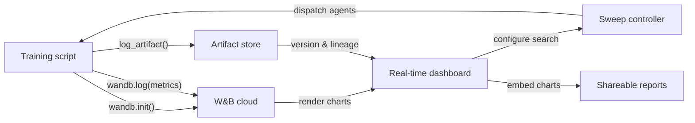

# Weights & Biases (W&B)

## Definição

Weights & Biases (comumente abreviado W&B ou wandb) é uma plataforma de MLOps nativa em nuvem que fornece rastreamento de experimentos, versionamento de datasets e modelos, otimização de hiperparâmetros e relatórios interativos em um único produto integrado. Fundada em 2017 e amplamente adotada tanto em pesquisa acadêmica quanto na indústria, o W&B é particularmente popular entre equipes que treinam modelos de deep learning que produzem saídas de mídia ricas — imagens, áudio, vídeo, nuvens de pontos — que se beneficiam da inspeção visual durante o treinamento.

A proposta de valor principal do W&B é que requer quase nenhuma infraestrutura para começar: você se cadastra para uma conta gratuita, instala o pacote Python `wandb`, adiciona `wandb.init()` ao seu script e tudo é registrado automaticamente na nuvem do W&B. A plataforma é organizada em **projetos** (coleções de execuções relacionadas), **execuções** (execuções de treinamento individuais), **artefatos** (datasets e arquivos de modelos versionados), **sweeps** (busca automatizada de hiperparâmetros) e **relatórios** (documentos narrativos compartilháveis incorporando gráficos ao vivo).

Ao contrário de soluções self-hosted como MLflow, o W&B gerencia toda a infraestrutura backend. Isso elimina a carga operacional, mas significa que os dados saem das suas instalações — uma consideração relevante para indústrias reguladas. O W&B oferece opções de implantação em nuvem privada e on-premise para clientes empresariais que precisam de garantias de residência de dados, embora essas exijam um plano pago.

## Como funciona

### Inicialização e auto-logging

Chamar `wandb.init(project="...", config={...})` inicia uma execução, envia a configuração para o W&B e retorna um objeto de execução. Muitos frameworks populares (PyTorch Lightning, Hugging Face Trainer, Keras, XGBoost, scikit-learn) oferecem callbacks ou integrações W&B que registram automaticamente gradientes, agendamentos de taxa de aprendizado e métricas de avaliação sem código adicional. Por baixo dos panos, uma thread em background agrupa e comprime os dados de log antes de enviá-los via HTTPS, minimizando a sobrecarga de treinamento.

### Dashboards em tempo real

A interface W&B renderiza curvas de métricas, utilização do sistema (GPU/CPU/memória) e mídia à medida que a execução avança. Várias execuções podem ser sobrepostas no mesmo gráfico com codificação de cores automática. As execuções podem ser filtradas e agrupadas por qualquer dimensão de configuração (por exemplo, agrupar por taxa de aprendizado para ver seu efeito em todos os experimentos de uma vez), permitindo diagnóstico visual rápido.

### Sweeps

Um sweep é definido por um YAML ou dict Python especificando o espaço de busca, a estratégia de busca (grid, aleatório ou Bayesiano) e critérios de parada (por exemplo, encerramento antecipado de execuções com baixo desempenho). O controlador de sweep do W&B coordena múltiplos agentes rodando em paralelo, cada um escolhendo combinações de hiperparâmetros do controlador e registrando resultados de volta. A busca Bayesiana se adapta com base nos resultados observados, convergindo mais rapidamente do que a busca em grid.

### Artefatos

Os Artefatos do W&B versionam datasets, checkpoints de modelos e saídas de avaliação como objetos endereçados por conteúdo. Um artefato está vinculado à execução que o produziu e às execuções que o consumiram, criando um gráfico de linhagem de dados. Você pode baixar uma versão específica de artefato com duas linhas de Python, tornando a reprodutibilidade de datasets e modelos tão simples quanto especificar uma string de versão.

### Relatórios

Os relatórios são documentos interativos que incorporam gráficos ao vivo do W&B, comparações de execuções e narrativa em markdown. Eles são a principal superfície de colaboração: um pesquisador pode linkar um relatório em uma mensagem do Slack ou PR do GitHub para compartilhar evidências experimentais reprodutíveis sem exportar imagens estáticas.



## Quando usar / Quando NÃO usar

| Usar quando | Evitar quando |
|-------------|---------------|
| Você treina modelos de deep learning e precisa de registro de mídia rica (imagens, áudio, embeddings) | Os dados não podem sair das suas instalações e você não pode pagar pelo plano enterprise on-premise |
| Colaboração em equipe, compartilhamento de resultados e relatórios narrativos são importantes | Você precisa de uma solução totalmente open-source e self-hosted sem dependência SaaS |
| Você quer otimização de hiperparâmetros integrada sem ferramentas adicionais | Seus experimentos são simples e a sobrecarga de uma conta SaaS não é justificada |
| Sua equipe trabalha em pesquisa ou academia e se beneficia do acesso gratuito | Você tem orçamento limitado e os recursos do nível pago são necessários para o tamanho da sua equipe |

## Comparações

| Critério | W&B | MLflow |
|----------|-----|--------|
| Facilidade de configuração | Conta SaaS gratuita; sem infra; `wandb login` + duas linhas de código | Hospedável localmente; sem conta necessária; `mlflow ui` para iniciar |
| Qualidade da interface | Refinada, interativa; projetada para cargas de trabalho visuais e com muita mídia | Limpa e funcional; melhor para comparação tabular de métricas |
| Colaboração | Workspaces nativos em equipe, relatórios, links de compartilhamento, integração com Slack | Requer servidor compartilhado; sem recursos de colaboração integrados na versão OSS |
| Preços | Gratuito para indivíduos; pago para equipes maiores; enterprise para on-prem | Gratuito e open-source; Databricks Managed MLflow custa a mais |
| Otimização de hiperparâmetros | Sweeps integrados com Bayesiano/grid/aleatório + early stopping | Requer ferramentas externas (Optuna, Ray Tune) |

## Exemplos de código

```python
# wandb_tracking_example.py
# W&B experiment tracking: logs config, metrics, images, and registers a model artifact.
# pip install wandb scikit-learn matplotlib Pillow

import wandb
import numpy as np
import matplotlib.pyplot as plt
from sklearn.ensemble import RandomForestClassifier
from sklearn.datasets import load_digits
from sklearn.model_selection import train_test_split
from sklearn.metrics import (
    accuracy_score, f1_score, confusion_matrix, ConfusionMatrixDisplay
)
import os, tempfile

# ── 1. Initialize the W&B run ─────────────────────────────────────────────────
run = wandb.init(
    project="digits-classification",
    name="random-forest-v1",
    config={                         # All hyperparameters go here
        "n_estimators": 150,
        "max_depth": 12,
        "min_samples_split": 4,
        "random_state": 7,
        "dataset": "sklearn-digits",
    },
)
cfg = wandb.config  # Access config values through this proxy

# ── 2. Data ───────────────────────────────────────────────────────────────────
X, y = load_digits(return_X_y=True)
X_train, X_test, y_train, y_test = train_test_split(
    X, y, test_size=0.2, stratify=y, random_state=cfg.random_state
)

# ── 3. Train ──────────────────────────────────────────────────────────────────
clf = RandomForestClassifier(
    n_estimators=cfg.n_estimators,
    max_depth=cfg.max_depth,
    min_samples_split=cfg.min_samples_split,
    random_state=cfg.random_state,
)
clf.fit(X_train, y_train)

# ── 4. Evaluate and log metrics ───────────────────────────────────────────────
y_pred = clf.predict(X_test)
metrics = {
    "accuracy": accuracy_score(y_test, y_pred),
    "f1_macro": f1_score(y_test, y_pred, average="macro"),
    "n_train": len(X_train),
    "n_test": len(X_test),
}
wandb.log(metrics)

# ── 5. Log a confusion matrix image ──────────────────────────────────────────
cm = confusion_matrix(y_test, y_pred)
fig, ax = plt.subplots(figsize=(8, 8))
ConfusionMatrixDisplay(cm).plot(ax=ax)
ax.set_title("Confusion Matrix – digits RF")
wandb.log({"confusion_matrix": wandb.Image(fig)})
plt.close(fig)

# ── 6. Save model as a versioned W&B Artifact ─────────────────────────────────
import joblib

with tempfile.TemporaryDirectory() as tmp:
    model_path = os.path.join(tmp, "model.joblib")
    joblib.dump(clf, model_path)

    artifact = wandb.Artifact(
        name="digits-rf-model",
        type="model",
        description="Random Forest trained on sklearn digits dataset",
        metadata=dict(metrics),
    )
    artifact.add_file(model_path)
    run.log_artifact(artifact)

# ── 7. Finish the run ─────────────────────────────────────────────────────────
run.finish()
print(f"Accuracy: {metrics['accuracy']:.4f} | F1 macro: {metrics['f1_macro']:.4f}")
print(f"View run at: {run.url}")
```

## Recursos práticos

- [W&B Official Documentation](https://docs.wandb.ai/) — Referência completa cobrindo o Python SDK, integrações, sweeps, artefatos e relatórios.
- [W&B Quickstart](https://docs.wandb.ai/quickstart) — Registre sua primeira execução W&B em menos de cinco minutos com um exemplo mínimo.
- [W&B Sweeps Documentation](https://docs.wandb.ai/guides/sweeps) — Guia abrangente para configurar e executar buscas distribuídas de hiperparâmetros.
- [W&B Fully Connected Blog](https://wandb.ai/fully-connected) — Blog de praticantes com tutoriais detalhados, relatórios de benchmark e artigos de engenharia de ML.
- [Hugging Face + W&B Integration](https://docs.wandb.ai/guides/integrations/huggingface) — Guia para registrar automaticamente todas as métricas do Hugging Face Trainer com um único argumento `report_to="wandb"`.

## Veja também

- [Rastreamento de experimentos](/docs/mlops/experiment-tracking)
- [MLflow](/docs/mlops/mlflow)
- [MLOps](/docs/mlops)
