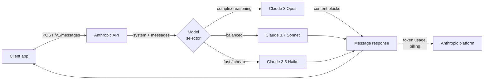
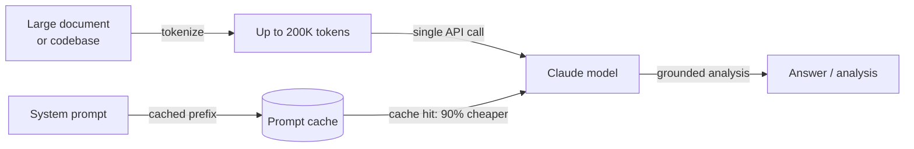

# Anthropic

## Definição

**Anthropic** é uma empresa de segurança em IA e provedora de modelos fundada em 2021 por ex-pesquisadores da OpenAI. Sua tese central é que construir modelos de IA capazes e resolver o problema de alinhamento são objetivos inseparáveis — a empresa persegue capacidade de ponta junto com pesquisas de segurança como IA Constitucional, interpretabilidade e compreensão mecanicista dos internos dos modelos. O produto comercial dessa pesquisa é a família de modelos **Claude**, disponível por meio da API da Anthropic e produtos empresariais.

A linha de modelos Claude segue uma convenção de nomenclatura em três níveis refletindo trade-offs entre capacidade e custo: **Opus** (maior qualidade, raciocínio complexo), **Sonnet** (qualidade e velocidade equilibradas) e **Haiku** (mais rápido e com melhor custo-benefício). Em 2025, a geração atual é o **Claude 3.7 Sonnet** — o modelo principal com capacidades de extended thinking — junto com **Claude 3 Opus**, **Claude 3.5 Sonnet** e **Claude 3.5 Haiku**. Todos os modelos Claude 3+ suportam entrada visual (imagens), e toda a família é projetada em torno de uma janela de contexto de 200K tokens, capaz de processar livros, grandes bases de código e longos históricos de conversas sem truncamento.

Da perspectiva de plataforma, a API da Anthropic é centrada na **Messages API** — uma interface limpa e específica para conversas multiturno. A plataforma inclui uso de ferramentas (termo da Anthropic para chamadas de função), extended thinking (raciocínio em cadeia visível), prompt caching (reduz custo e latência para grandes contextos repetidos) e processamento em lote. O SDK Python (`anthropic`) e o SDK TypeScript são as principais bibliotecas clientes. Os modelos Claude também estão disponíveis pelo Amazon Bedrock, Google Cloud Vertex AI e contratos empresariais com opções de residência de dados.

## Como funciona

### Messages API

A Messages API (`POST /v1/messages`) é a interface principal da Anthropic. Diferentemente de algumas APIs que usam uma string `prompt` simples, a Messages API é conversation-first: você envia um array `messages` de turnos alternados de `user` e `assistant`, com um parâmetro opcional `system` para contexto e persona. O modelo retorna um objeto `Message` contendo uma lista `content` — blocos de texto por padrão, blocos de uso de ferramentas quando o modelo decide chamar uma ferramenta. O streaming é suportado e recomendado para uso interativo; o SDK oferece tanto helpers de streaming quanto acesso SSE bruto.



### Uso de ferramentas

O uso de ferramentas permite que o Claude chame funções externas emitindo blocos de conteúdo `tool_use` estruturados. Você declara ferramentas como schemas JSON no parâmetro `tools`. Quando o Claude decide que uma ferramenta é necessária, a resposta contém um bloco `tool_use` com o nome da ferramenta e a entrada; seu código executa a função e retorna um `tool_result` no próximo turno do usuário. O Claude então usa o resultado para completar sua resposta. Esse padrão habilita agentes, ambientes de execução de código, consultas a bancos de dados e integrações de API sem que o modelo precise ter acesso direto a nenhum sistema.


### Extended thinking

Extended thinking é um modo disponível no Claude 3.7 Sonnet que permite ao modelo raciocinar extensivamente antes de produzir sua resposta final. Quando você define `thinking: {type: "enabled", budget_tokens: N}`, o modelo emite blocos de conteúdo `thinking` contendo seu rascunho interno — semelhante a chain-of-thought, mas nativo e estruturado. O extended thinking melhora significativamente o desempenho em competições de matemática, código complexo, raciocínio em múltiplas etapas e tarefas que exigem análise cuidadosa passo a passo. Os tokens de pensamento contam para o orçamento de tokens, mas ficam visíveis na resposta, dando transparência sobre como o modelo chegou à sua resposta.

### Prompt caching

O prompt caching reduz dramaticamente o custo e a latência para cargas de trabalho que usam repetidamente grandes prompts de sistema ou contextos de documentos. Você marca seções de prefixo da sua requisição com `cache_control: {type: "ephemeral"}`. Na primeira chamada, a Anthropic armazena em cache o prefixo do prompt em sua infraestrutura; chamadas subsequentes que correspondam ao prefixo são servidas do cache com 90% de desconto no custo de tokens de entrada e tempo significativamente reduzido até o primeiro token. Isso é especialmente valioso para pipelines de RAG (grande contexto passado com cada consulta), loops de agentes (grandes prompts de sistema repetidos a cada turno) e processamento em lote de documentos.

### Contexto longo (200K tokens)

Todos os modelos Claude 3 e posteriores suportam uma janela de contexto de 200K tokens — equivalente a aproximadamente 150.000 palavras ou ~500 páginas de texto. O contexto longo permite que bases de código inteiras, documentos legais, artigos de pesquisa ou históricos completos de conversas sejam processados em uma única chamada sem chunking. As pesquisas da Anthropic sobre desempenho em contexto longo (avaliações "needle in a haystack") mostram que o Claude mantém forte precisão de recuperação em todo o intervalo de 200K, tornando-o confiável para Q&A de documentos, análise de contratos e revisão de código em grandes repositórios. Este é um dos diferenciais mais claros da Anthropic em relação à janela de 128K do GPT-4o.



## Quando usar / Quando NÃO usar

| Use a Anthropic quando | Evite ou considere alternativas quando |
|--------------------|--------------------------------------|
| Você precisa de uma janela de contexto de 200K para processar documentos longos, bases de código ou conversas extensas sem chunking | Sua carga de trabalho exige geração de imagens, transcrição de áudio ou texto-para-fala — o Claude é apenas texto/visão; a OpenAI cobre áudio |
| Restrições de segurança e comportamento de recusa previsível são críticos (conformidade, saúde, finanças) | Você precisa de modelos de pesos abertos para auto-hospedagem, fine-tuning ou residência de dados — a Anthropic não oferece opção de pesos abertos |
| Você quer extended thinking para tarefas de raciocínio profundo (matemática, código complexo, análise em múltiplas etapas) | Seu caso de uso principal é geração de embeddings em alto volume — a Anthropic não oferece API de embeddings |
| O prompt caching vai reduzir significativamente os custos (grandes contextos repetidos, prompts de sistema de agentes) | Você depende muito de ferramentas específicas da OpenAI (Assistants API, DALL-E, Whisper) que não têm equivalente na Anthropic |
| Você está construindo fluxos de trabalho de uso de ferramentas ou uso de computador e quer um modelo bem calibrado para saídas estruturadas | Você precisa do custo-por-token absolutamente mais baixo em escala — Claude Haiku compete em preço, mas GPT-4o-mini e modelos abertos são mais baratos |

## Comparações

| Critério | Anthropic | OpenAI | Google Gemini |
|----------|-----------|--------|---------------|
| Modelo principal | Claude 3.7 Sonnet | GPT-4o | Gemini 2.5 Pro |
| Janela de contexto | 200K (todos Claude 3+) | 128K (GPT-4o) | Até 1M (Gemini 1.5 Pro) |
| Raciocínio / thinking | Extended thinking (CoT nativo) | Série o1, o3 | Gemini 2.5 Pro thinking |
| Entrada multimodal | Texto, imagem | Texto, imagem, áudio, vídeo | Texto, imagem, áudio, vídeo |
| Áudio / fala | Não | Sim (Whisper, TTS) | Sim (Gemini) |
| Geração de imagem | Não | Sim (DALL-E 3) | Sim (Imagen) |
| API de embeddings | Não | Sim | Sim |
| Pesos abertos | Não | Não | Gemma (parcial) |
| Prompt caching | Sim (nativo, 90% de desconto) | Cache de contexto (limitado) | Sim (Gemini) |
| Uso de ferramentas / function calling | Maduro, suporte a computer use | Maduro, amplamente adotado | Maduro |
| Filosofia de segurança | IA Constitucional, calibração de recusas | API de moderação, política de uso | Diretrizes de IA responsável |
| Opções de residência de dados | Contrato empresarial | Contrato empresarial | Regiões do Google Cloud |

## Prós e contras

| Prós | Contras |
|------|------|
| Janela de contexto de 200K em todos os modelos — melhor da categoria para documentos longos | Sem APIs de áudio, fala ou geração de imagens |
| Extended thinking dá raciocínio em cadeia transparente para tarefas difíceis | Sem API de embeddings — você precisa de um segundo provedor para RAG |
| Prompt caching reduz significativamente os custos para grandes contextos repetidos | Modelo fechado sem opção de pesos abertos |
| Design com segurança em primeiro lugar, calibração cuidadosa de recusas e IA Constitucional | Ecossistema menor que o da OpenAI — menos tutoriais e integrações de terceiros |
| Computer use (beta) habilita controle agêntico de GUIs desktop | Os preços podem ser mais altos que GPT-4o-mini ou alternativas de pesos abertos para tarefas simples |

## Exemplos de código

### Messages API — conclusão básica e prompt de sistema

```python
import anthropic

client = anthropic.Anthropic(api_key="sk-ant-...")  # or set ANTHROPIC_API_KEY env var

# Basic message
message = client.messages.create(
    model="claude-3-7-sonnet-20250219",
    max_tokens=1024,
    system="You are a concise technical assistant. Answer in plain English.",
    messages=[
        {"role": "user", "content": "What is the Anthropic Messages API?"}
    ],
)
print(message.content[0].text)

# Multi-turn conversation
messages = [
    {"role": "user", "content": "What is prompt caching?"},
    {"role": "assistant", "content": "Prompt caching stores repeated large context..."},
    {"role": "user", "content": "How much does it save?"},
]
response = client.messages.create(
    model="claude-3-5-haiku-20241022",
    max_tokens=512,
    messages=messages,
)
print(response.content[0].text)
```

### Uso de ferramentas

```python
import json
import anthropic

client = anthropic.Anthropic()

# Define tools as JSON schemas
tools = [
    {
        "name": "search_docs",
        "description": "Search the documentation for a given query and return relevant passages.",
        "input_schema": {
            "type": "object",
            "properties": {
                "query": {"type": "string", "description": "Search query"},
                "max_results": {"type": "integer", "default": 3},
            },
            "required": ["query"],
        },
    }
]

messages = [{"role": "user", "content": "How do I enable prompt caching?"}]

# First call — Claude may request a tool
response = client.messages.create(
    model="claude-3-7-sonnet-20250219",
    max_tokens=1024,
    tools=tools,
    messages=messages,
)

# Process tool calls
if response.stop_reason == "tool_use":
    messages.append({"role": "assistant", "content": response.content})

    tool_results = []
    for block in response.content:
        if block.type == "tool_use":
            # Simulated tool execution
            result = f"Prompt caching docs for '{block.input['query']}': use cache_control param..."
            tool_results.append({
                "type": "tool_result",
                "tool_use_id": block.id,
                "content": result,
            })

    messages.append({"role": "user", "content": tool_results})

    # Final call with tool result
    final = client.messages.create(
        model="claude-3-7-sonnet-20250219",
        max_tokens=1024,
        tools=tools,
        messages=messages,
    )
    print(final.content[0].text)
```

### Extended thinking

```python
import anthropic

client = anthropic.Anthropic()

response = client.messages.create(
    model="claude-3-7-sonnet-20250219",
    max_tokens=16000,
    thinking={
        "type": "enabled",
        "budget_tokens": 10000,  # tokens allocated for internal reasoning
    },
    messages=[{
        "role": "user",
        "content": (
            "A train leaves city A at 9am traveling at 80 km/h. "
            "Another train leaves city B (320 km away) at 10am traveling at 100 km/h. "
            "At what time do they meet, and how far from city A?"
        ),
    }],
)

for block in response.content:
    if block.type == "thinking":
        print("=== Model's internal reasoning ===")
        print(block.thinking[:500], "...")  # first 500 chars for brevity
    elif block.type == "text":
        print("=== Final answer ===")
        print(block.text)
```

### Prompt caching para contexto grande repetido

```python
import anthropic

client = anthropic.Anthropic()

# Large document loaded once — cached after first call
large_document = open("contract.txt").read()  # e.g., 50K tokens

response = client.messages.create(
    model="claude-3-5-sonnet-20241022",
    max_tokens=1024,
    system=[
        {
            "type": "text",
            "text": "You are a legal document analyst. Answer questions based solely on the document provided.",
        },
        {
            "type": "text",
            "text": large_document,
            "cache_control": {"type": "ephemeral"},  # mark for caching
        },
    ],
    messages=[{"role": "user", "content": "What are the termination clauses?"}],
)

print(response.content[0].text)
# usage.cache_creation_input_tokens — tokens cached this call (full price)
# usage.cache_read_input_tokens — tokens served from cache (10% price)
print(response.usage)
```

## Recursos práticos

- [Referência da API Anthropic](https://docs.anthropic.com/en/api/getting-started) — Documentação completa dos endpoints com schemas de requisição/resposta e referência de parâmetros
- [Guia de engenharia de prompts da Anthropic](https://docs.anthropic.com/en/docs/build-with-claude/prompt-engineering/overview) — Melhores práticas oficiais para prompts de sistema, chain-of-thought e técnicas específicas por tarefa
- [Anthropic Cookbook](https://github.com/anthropics/anthropic-cookbook) — Notebooks executáveis cobrindo uso de ferramentas, RAG, multimodal, prompt caching e agentes
- [Visão geral dos modelos Claude](https://docs.anthropic.com/en/docs/about-claude/models) — IDs de modelos atuais, janelas de contexto, comparação de capacidades e cronograma de descontinuação
- [Anthropic Python SDK no GitHub](https://github.com/anthropics/anthropic-sdk-python) — Código-fonte, changelog, type stubs e guias de migração

## Veja também

- [Provedores de modelos](/docs/model-providers) — Visão geral e comparação de todos os provedores incluindo uma tabela de comparação de 7 provedores
- [Estudo de caso: Claude](/docs/case-studies/claude) — Para uma análise mais profunda da arquitetura e metodologia de treinamento do modelo, veja o estudo de caso do Claude
- [OpenAI](/docs/model-providers/openai) — GPT-4o, raciocínio da série o, function calling, DALL-E, Whisper
- [Engenharia de prompts](/docs/prompt-engineering) — Técnicas aplicáveis a todos os modelos Claude
- [Ferramentas](/docs/tools/claude-code) — Claude Code, o agente de codificação de IA da Anthropic construído sobre a API Claude
- [Agentes](/docs/agents) — Construindo fluxos de trabalho agênticos com uso de ferramentas do Claude
