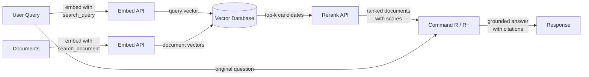

# Cohere

## Definição

**Cohere** é uma empresa de IA empresarial que constrói modelos de linguagem e APIs desenvolvidos especificamente para aplicações de negócios, com foco distinto em busca, recuperação de informações e geração aumentada por recuperação (RAG). Diferentemente de provedores de propósito geral que oferecem uma ampla gama de recursos para consumidores e desenvolvedores, a Cohere atende clientes empresariais que precisam de infraestrutura de NLP confiável e pronta para produção — especialmente para casos de uso onde *encontrar e apresentar a informação certa* é o problema central.

A linha de modelos da Cohere reflete esse foco. **Command R** e **Command R+** são modelos conversacionais e de seguimento de instruções otimizados especificamente para fluxos de trabalho de RAG — suportam janelas de contexto longas e são treinados para seguir prompts fundamentados em recuperação de forma confiável. **Embed** fornece embeddings de vetores densos multilíngues de última geração em mais de 100 idiomas, sendo a escolha preferida para aplicações de busca empresarial global. **Rerank** é um modelo de cross-encoder que pega um conjunto inicial de documentos recuperados e os reavalia em relação à consulta original, alcançando precisão que a recuperação esparsa e densa sozinhas não conseguem atingir.

O que diferencia a Cohere dos provedores de propósito geral como a OpenAI é que todo o conjunto de produtos é projetado em torno do pipeline de recuperação como um fluxo de trabalho de primeira classe. Os modelos Embed, Rerank e Command R são construídos para trabalhar juntos como uma pilha coesa, e a Cohere oferece opções de implantação em nuvem privada e on-premises que atendem aos rigorosos requisitos de governança e conformidade de dados de empresas — uma distinção crítica para indústrias regulamentadas como finanças, saúde e governo.

## Como funciona

### API de Chat e Generate

Os modelos Command R e Command R+ são acessados por meio da API de Chat da Cohere e suportam tanto interações conversacionais multiturno quanto tarefas de geração de turno único. O Command R+ é a variante maior e mais capaz, adequada para raciocínio complexo e RAG com muitos documentos, enquanto o Command R é otimizado para menor latência e custo em pipelines de produção de alto throughput. Ambos os modelos aceitam um parâmetro `documents` que permite passar contexto recuperado diretamente para o prompt, habilitando um modo de RAG nativo onde o modelo é instruído a fundamentar sua resposta no conteúdo fornecido e citar fontes.

### API Embed (embeddings multilíngues)

A API Embed converte texto em representações vetoriais densas adequadas para busca de similaridade semântica. Os modelos de embedding da Cohere suportam mais de 100 idiomas em um único modelo, tornando possível a busca entre idiomas e a recuperação de documentos multilíngues sem modelos separados para cada idioma. Os embeddings podem ser gerados com diferentes valores de `input_type` — `search_document` para indexar conteúdo em repouso, e `search_query` para codificar consultas em tempo de execução — uma distinção que aplica sinais de treinamento assimétricos e tipicamente melhora a precisão da recuperação em comparação com esquemas de embedding simétricos.

### API Rerank

A API Rerank aceita uma consulta e uma lista de documentos candidatos (geralmente os resultados top-k de uma busca vetorial ou por palavras-chave) e retorna cada documento com uma pontuação de relevância calculada por um cross-encoder. Os cross-encoders avaliam a consulta e o documento conjuntamente em um único forward pass, oferecendo precisão muito maior do que bi-encoders que codificam consulta e documento separadamente. O reranking é uma etapa leve, mas altamente eficaz, que melhora dramaticamente a precision@k — é mais valioso quando a recuperação inicial é relativamente barata (busca BM25 ou ANN), mas a precisão precisa ser maximizada antes de passar o contexto para um LLM.

### Integração de RAG

A integração de RAG da Cohere combina Embed, Rerank e Command R em um pipeline unificado. O fluxo típico é: embedar a consulta, executar busca de vizinho mais próximo aproximado em um banco de dados vetorial, reranquear os candidatos principais para obter os documentos mais relevantes, depois passar esses documentos para o Command R com a consulta original para geração fundamentada. O modelo retorna uma resposta junto com objetos de citação que referenciam passagens específicas nos documentos recuperados, facilitando a construção de aplicações de IA auditáveis com citação de fontes.



## Quando usar / Quando NÃO usar

| Use quando | Evite quando |
|----------|------------|
| Construindo busca empresarial ou Q&A de base de conhecimento onde a precisão da recuperação é crítica | Você precisa de assistência de chat de propósito geral sem componente de recuperação |
| Seu conteúdo abrange vários idiomas e você precisa de um único modelo de embedding para todos eles | Seu caso de uso é principalmente imagem, áudio ou multimodal — a Cohere é apenas texto |
| Você quer adicionar uma etapa de reranking para melhorar a precisão após uma busca vetorial ou BM25 inicial | Você precisa de raciocínio altamente capaz, matemática ou codificação para tarefas independentes (GPT-4o ou Claude podem ter melhor desempenho) |
| Requisitos de governança de dados exigem implantação on-premises ou em nuvem privada | Seu projeto é um protótipo rápido e você quer o ecossistema mais amplo de integrações |
| Você precisa de citações de fontes e fundamentação em documentos nativamente na saída do modelo | O orçamento é extremamente limitado — os preços empresariais da Cohere são mais altos que algumas alternativas |

## Comparações

| Critério | Cohere | OpenAI | Mistral |
|----------|--------|--------|---------|
| Qualidade de embedding (MTEB) | Topo em multilíngue, 100+ idiomas | Forte com foco em inglês (text-embedding-3-large) | Competitivo; mistral-embed disponível |
| Reranking | API Rerank nativa (cross-encoder) | Sem endpoint nativo de reranking | Sem endpoint nativo de reranking |
| Modelos nativos para RAG | Command R/R+ projetados para RAG com citações | GPT-4o funciona bem com prompts de RAG mas não é nativo para RAG | Mixtral/Mistral funcionam com prompts de RAG |
| Pesos abertos | Não (apenas API proprietária) | Não (apenas API proprietária) | Sim (modelos Mistral no Hugging Face) |
| On-premises / nuvem privada | Sim (contratos empresariais) | Azure OpenAI (limitado) | Sim (auto-hospedar pesos abertos) |
| Embedding multilíngue | Modelo único, 100+ idiomas | Suporte multilíngue separado ou limitado | Suporte limitado a embedding multilíngue |
| Modelo de preços | Empresarial / pagamento por token | Pagamento por token, bem documentado | Pagamento por token; opção de auto-hospedagem gratuita |

## Prós e contras

| Prós | Contras |
|------|------|
| Embeddings multilíngues de primeira classe em um único modelo | Ecossistema geral menor comparado à OpenAI |
| API Rerank nativa melhora significativamente a precisão da recuperação | Sem opção de pesos abertos para auto-hospedagem |
| Command R/R+ são construídos especificamente para RAG com fundamentação e citações | Menos capaz que GPT-4o / Claude para raciocínio independente complexo |
| Opções de implantação de nível empresarial incluindo nuvem privada | Documentação e recursos da comunidade mais escassos que os da OpenAI |
| Componentes do pipeline de RAG (Embed + Rerank + Command R) funcionam como uma pilha coesa | Os preços podem ser mais altos para experimentos em pequena escala |

## Exemplos de código

### Chat com Command R

```python
import cohere

co = cohere.Client("YOUR_COHERE_API_KEY")

response = co.chat(
    model="command-r-plus",
    message="Explain retrieval-augmented generation in plain English.",
)
print(response.text)
```

### Embeddings para busca semântica

```python
import cohere

co = cohere.Client("YOUR_COHERE_API_KEY")

# Embed documents at indexing time
documents = [
    "Cohere specializes in enterprise NLP and semantic search.",
    "RAG combines retrieval with language model generation.",
    "Multilingual embeddings support over 100 languages.",
]
doc_embeddings = co.embed(
    texts=documents,
    model="embed-multilingual-v3.0",
    input_type="search_document",
).embeddings

# Embed a query at search time
query_embedding = co.embed(
    texts=["What does Cohere specialize in?"],
    model="embed-multilingual-v3.0",
    input_type="search_query",
).embeddings[0]

# Compute cosine similarity (or use a vector DB)
import numpy as np

doc_array = np.array(doc_embeddings)
query_array = np.array(query_embedding)
scores = doc_array @ query_array / (
    np.linalg.norm(doc_array, axis=1) * np.linalg.norm(query_array)
)
top_idx = int(np.argmax(scores))
print(f"Most relevant: '{documents[top_idx]}' (score: {scores[top_idx]:.4f})")
```

### Reranking de candidatos recuperados

```python
import cohere

co = cohere.Client("YOUR_COHERE_API_KEY")

query = "How does multilingual embedding work?"
candidates = [
    "Cohere Embed supports over 100 languages in a single model.",
    "Command R+ is optimized for RAG workflows with long context.",
    "Rerank re-scores retrieved documents with a cross-encoder.",
    "BM25 is a classic keyword-based retrieval algorithm.",
]

results = co.rerank(
    model="rerank-multilingual-v3.0",
    query=query,
    documents=candidates,
    top_n=3,
)

for hit in results.results:
    print(f"[{hit.relevance_score:.4f}] {candidates[hit.index]}")
```

### Pipeline de RAG completo com citações do Command R+

```python
import cohere

co = cohere.Client("YOUR_COHERE_API_KEY")

# Documents retrieved from your vector store (simplified)
retrieved_docs = [
    {"id": "doc1", "text": "Cohere Embed supports 100+ languages for multilingual search."},
    {"id": "doc2", "text": "Command R+ is designed for grounded generation with source citations."},
    {"id": "doc3", "text": "Rerank improves precision by re-scoring candidates with a cross-encoder."},
]

response = co.chat(
    model="command-r-plus",
    message="How does Cohere's pipeline improve search quality?",
    documents=retrieved_docs,
)

print(response.text)
print("\n--- Citations ---")
for citation in response.citations:
    print(f"  [{citation.start}:{citation.end}] → {[doc['id'] for doc in citation.documents]}")
```

## Recursos práticos

- [Documentação da API Cohere](https://docs.cohere.com/) — Referência completa para todas as APIs da Cohere incluindo Chat, Embed e Rerank
- [Documentação do Cohere Embed](https://docs.cohere.com/docs/embeddings) — Guia detalhado sobre modelos de embedding, tipos de entrada e suporte multilíngue
- [Documentação do Cohere Rerank](https://docs.cohere.com/docs/reranking) — Guia para a API Rerank com exemplos e orientação sobre seleção de modelos
- [Guia de RAG da Cohere](https://docs.cohere.com/docs/retrieval-augmented-generation-rag) — Passo a passo completo para construir um pipeline de RAG com Command R
- [MTEB Leaderboard](https://huggingface.co/spaces/mteb/leaderboard) — Benchmark independente comparando modelos de embedding incluindo o Cohere Embed

## Veja também

- [Provedores de modelos](/docs/model-providers)
- [RAG](/docs/rag)
- [Embeddings](/docs/rag/embeddings)
- [Busca semântica](/docs/semantic-search)
