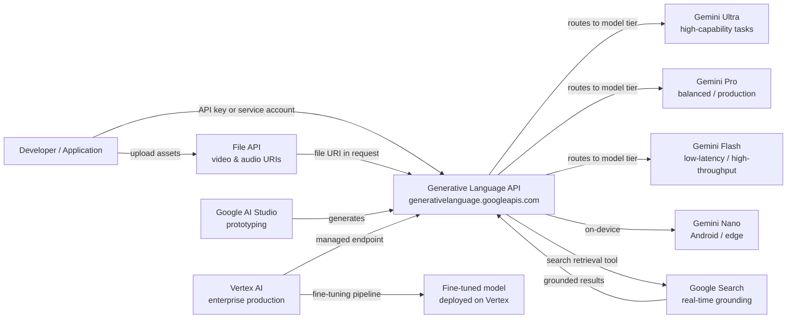

# Google Gemini

## Definição

O Google Gemini é a família principal de grandes modelos de linguagem multimodais do Google e a plataforma ao seu redor. Anunciado no final de 2023 e sucedendo a família PaLM 2, o Gemini foi projetado desde o início para raciocinar sobre texto, imagens, vídeo, áudio e código dentro de uma única arquitetura de modelo unificada. Diferentemente de sistemas que adicionam visão por meio de pipelines separados, a multimodalidade nativa do Gemini significa que o modelo processa todas as modalidades conjuntamente durante o treinamento e a inferência, permitindo raciocínio cruzado entre modalidades mais rico.

A família Gemini abrange quatro níveis ajustados para diferentes casos de uso: **Gemini Ultra** (o mais capaz, voltado para tarefas complexas empresariais e de pesquisa), **Gemini Pro** (o cavalo de batalha equilibrado para uso comercial amplo), **Gemini Flash** (otimizado para aplicações de baixa latência e alto throughput com custo reduzido) e **Gemini Nano** (inferência no dispositivo para Android e hardware de borda). Cada nível é versionado (por exemplo, Gemini 1.5 Pro, Gemini 2.0 Flash), e o Google lança novas versões em base contínua.

Os desenvolvedores acessam o Gemini por meio de duas superfícies complementares. O **Google AI Studio** é um ambiente de prototipagem gratuito baseado no navegador que fornece chaves de API e permite experimentar com prompts, instruções de sistema e entradas multimodais sem nenhuma configuração de infraestrutura. O **Vertex AI** é a plataforma de ML gerenciada do Google Cloud e o caminho recomendado para cargas de trabalho em produção — ele adiciona controles empresariais como VPC Service Controls, IAM, registro de auditoria, pipelines de fine-tuning e endpoints com suporte a SLA. Ambas as superfícies consomem os mesmos modelos Gemini subjacentes por meio da Generative Language API.

## Como funciona

### Generative Language API

A Generative Language API (`generativelanguage.googleapis.com`) é a interface REST unificada para todos os modelos Gemini. As requisições são estruturadas como um array `contents` — cada item tem um `role` (`user` ou `model`) e uma ou mais `parts` (texto, dados inline ou URIs de arquivo). A API retorna um array `candidates` com `content`, `finishReason` e `safetyRatings`. Contagens de tokens, metadados de grounding e respostas de chamadas de função são retornados no mesmo envelope. Chaves de API do AI Studio funcionam para desenvolvimento; cargas de trabalho em produção usam credenciais de conta de serviço pelo Vertex AI.

### Entradas multimodais — imagem, vídeo e áudio

O Gemini aceita imagens (JPEG, PNG, WebP, HEIC), vídeo (MP4, MOV, AVI de até várias horas) e áudio (MP3, WAV, FLAC) diretamente ao lado do texto em uma única requisição. Imagens podem ser enviadas como dados base64 inline ou por URIs do Cloud Storage. Para vídeos longos, a File API faz upload do arquivo de forma assíncrona e retorna um URI de arquivo que pode ser referenciado em chamadas subsequentes de `generateContent`. O modelo tokeniza internamente as modalidades não textuais de forma que o mesmo mecanismo de janela de contexto e atenção se aplica uniformemente, habilitando tarefas como "resuma a trilha de áudio deste vídeo e identifique quando o apresentador muda de assunto".

### Grounding com a Pesquisa Google

O Gemini suporta geração fundamentada em recuperação por meio de um parâmetro opcional `tools` que habilita `google_search_retrieval`. Quando essa ferramenta está ativa, o modelo pode emitir consultas de pesquisa durante a geração, recuperar resultados web em tempo real e sintetizá-los em sua resposta — retornando citações junto com o texto gerado. Isso é especialmente valioso para consultas densas em fatos ou sensíveis ao tempo onde um modelo paramétrico estático alucinaria ou retornaria informações desatualizadas. O grounding está disponível tanto no AI Studio quanto no Vertex AI e pode ser combinado com outras ferramentas.

### Integração com Vertex AI

No Vertex AI, o Gemini é acessado por meio do SDK Python `vertexai` (`aiplatform`). O Vertex adiciona fine-tuning (pipelines de fine-tuning supervisionado e RLHF), conjuntos de dados de avaliação de modelos, jardins de modelos para comparar modelos, implantação em endpoints dedicados com autoescalonamento e Vertex AI Pipelines para orquestrar fluxos de trabalho de ML de ponta a ponta. Clientes empresariais se beneficiam de garantias de residência de dados, redes privadas via VPC Service Controls e Cloud Audit Logs para cada chamada de API — recursos não disponíveis no AI Studio.



## Quando usar / Quando NÃO usar

| Use quando | Evite quando |
|----------|------------|
| Você precisa de raciocínio multimodal nativo sobre imagens, vídeo ou áudio junto com texto | Sua carga de trabalho é apenas texto e você prefere um provedor com um histórico mais longo de API pública |
| Você já está no Google Cloud e quer integração profunda com Vertex AI / GCP (IAM, VPC, Audit Logs) | Você tem requisitos estritos de residência de dados em regiões onde o Vertex AI ainda não está disponível |
| Você precisa de grounding em tempo real por meio da Pesquisa Google | Sua aplicação precisa de saídas determinísticas e reproduzíveis (o grounding introduz variabilidade da busca ao vivo) |
| A eficiência de custo em escala importa — o Gemini Flash é altamente competitivo em preço por token | Você precisa de um modelo de pesos abertos extensamente documentado que pode ser executado on-premises |
| Você quer um ambiente de prototipagem gratuito e sem fricção sem cartão de crédito (nível gratuito do AI Studio) | Sua equipe já está profundamente investida na superfície da API OpenAI e o custo de migração é alto |

## Comparações

| Critério | Google Gemini | OpenAI GPT-4o | Anthropic Claude 3.5 |
|-----------|--------------|--------------|----------------------|
| Capacidade multimodal | Nativa — texto, imagem, vídeo, áudio em um modelo | Texto + imagem (GPT-4V); áudio via APIs separadas Whisper/TTS | Texto + imagem (Claude 3); sem vídeo/áudio nativos |
| Integração empresarial / nuvem | Integração profunda com GCP via Vertex AI — IAM, VPC, Audit Logs, fine-tuning | Azure OpenAI Service para empresas; portabilidade limitada fora do Azure | AWS Bedrock e API direta; sem integração nativa com GCP |
| Grounding / recuperação em tempo real | Ferramenta de grounding Google Search integrada | Plugin de navegação web (ChatGPT); sem grounding nativo via API | Sem busca integrada; depende de RAG fornecido pelo usuário |
| Janela de contexto | Até 1M tokens (Gemini 1.5 Pro) | 128K tokens (GPT-4o) | 200K tokens (Claude 3.5 Sonnet) |
| Disponibilidade de pesos abertos | Apenas API fechada | Apenas API fechada | Apenas API fechada |
| Modelo de preços | Por token; nível Flash muito competitivo | Por token; GPT-4o intermediário | Por token; comparável ao GPT-4o |
| Fine-tuning | Fine-tuning supervisionado no Vertex AI | API de fine-tuning para GPT-3.5/4o-mini | Sem API de fine-tuning pública |

## Exemplos de código

```python
# google_gemini_examples.py
# Demonstrates text generation, multimodal image input, and embeddings
# using the google-generativeai SDK.
# pip install google-generativeai pillow

import google.generativeai as genai
import pathlib

# ── Configuration ─────────────────────────────────────────────────────────────
# Set your API key from https://aistudio.google.com/app/apikey
genai.configure(api_key="YOUR_API_KEY")


# ── 1. Text generation ────────────────────────────────────────────────────────
def text_generation_example():
    """Simple single-turn text completion with Gemini Flash."""
    model = genai.GenerativeModel(
        model_name="gemini-1.5-flash",
        system_instruction="You are a concise technical writer.",
    )

    response = model.generate_content(
        "Explain the difference between supervised and unsupervised learning "
        "in three sentences.",
        generation_config=genai.GenerationConfig(
            temperature=0.4,
            max_output_tokens=256,
        ),
    )

    print("=== Text Generation ===")
    print(response.text)
    print(f"Finish reason : {response.candidates[0].finish_reason}")
    print(f"Total tokens  : {response.usage_metadata.total_token_count}")


# ── 2. Multimodal — image input ───────────────────────────────────────────────
def multimodal_image_example(image_path: str):
    """
    Send a local image alongside a text prompt to Gemini Pro.
    The model reasons over both modalities jointly.
    """
    model = genai.GenerativeModel("gemini-1.5-pro")

    image_data = pathlib.Path(image_path).read_bytes()
    # Inline image part
    image_part = {
        "mime_type": "image/jpeg",  # adjust to image/png, image/webp as needed
        "data": image_data,
    }

    response = model.generate_content(
        [image_part, "Describe this image and identify any text present in it."]
    )

    print("\n=== Multimodal Image Input ===")
    print(response.text)


# ── 3. Embeddings ─────────────────────────────────────────────────────────────
def embeddings_example(texts: list[str]):
    """
    Generate text embeddings using the text-embedding-004 model.
    Embeddings can be used for semantic search, clustering, and classification.
    """
    result = genai.embed_content(
        model="models/text-embedding-004",
        content=texts,
        task_type="retrieval_document",  # or retrieval_query, semantic_similarity
    )

    print("\n=== Embeddings ===")
    for text, embedding in zip(texts, result["embedding"]):
        print(f"Text    : {text[:60]}...")
        print(f"Dims    : {len(embedding)}")
        print(f"First 5 : {embedding[:5]}\n")


# ── 4. Multi-turn chat ────────────────────────────────────────────────────────
def multi_turn_chat_example():
    """Maintain conversational context using the chat interface."""
    model = genai.GenerativeModel("gemini-1.5-flash")
    chat = model.start_chat(history=[])

    turns = [
        "What is gradient descent?",
        "How does the learning rate affect it?",
        "What is Adam optimizer and how does it improve on basic gradient descent?",
    ]

    print("\n=== Multi-turn Chat ===")
    for user_message in turns:
        response = chat.send_message(user_message)
        print(f"User  : {user_message}")
        print(f"Model : {response.text}\n")


# ── Entry point ───────────────────────────────────────────────────────────────
if __name__ == "__main__":
    text_generation_example()

    # Provide a path to a local JPEG/PNG for multimodal demo
    # multimodal_image_example("path/to/your/image.jpg")

    embeddings_example([
        "Machine learning is a subset of artificial intelligence.",
        "Deep learning uses neural networks with many layers.",
        "Reinforcement learning trains agents through reward signals.",
    ])

    multi_turn_chat_example()
```

## Recursos práticos

- [Google AI Studio](https://aistudio.google.com/) — Ambiente gratuito baseado no navegador para prototipagem com Gemini; gera chaves de API e permite ajustar prompts interativamente sem infraestrutura necessária.
- [Documentação da Gemini API](https://ai.google.dev/gemini-api/docs) — Referência oficial cobrindo todos os modelos, endpoints, formatos de entrada multimodal, grounding, function calling e a File API.
- [Vertex AI — Documentação de IA generativa](https://cloud.google.com/vertex-ai/generative-ai/docs/overview) — Caminho empresarial: fine-tuning, avaliação de modelos, implantação e controles de segurança do GCP.
- [SDK Python google-generativeai no PyPI](https://pypi.org/project/google-generativeai/) — Código-fonte do SDK, changelog e exemplos de uso.

## Veja também

- [Provedores de modelos](/docs/model-providers)
- [IA multimodal](/docs/multimodal-ai)
- [Estudos de caso — Gemini](/docs/case-studies/gemini)
